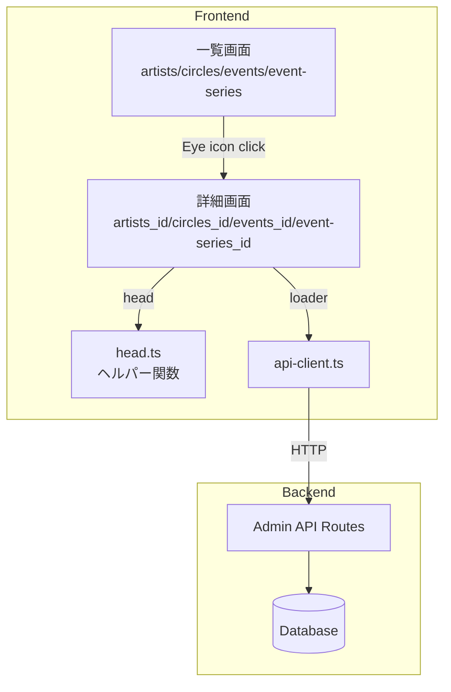

# Technical Design Document

## Overview

**Purpose**: 管理画面において、アーティスト・サークル・イベント・イベントシリーズの詳細画面を提供し、管理者がエンティティの情報と関連データを一画面で確認できるようにする。

**Users**: 管理者は各エンティティの詳細情報を確認し、関連データへのナビゲーションを行う。

**Impact**: 既存の一覧画面に詳細画面への遷移リンク（Eye アイコン）を追加し、4つの新規詳細画面ルートを作成する。

### Goals
- 既存の詳細画面（releases, tracks）と一貫したUI/UXを提供
- 各エンティティの基本情報と関連データを表示
- 一覧画面から詳細画面への直感的なナビゲーション

### Non-Goals
- 詳細画面からのエンティティ編集機能（既存の編集ダイアログを使用）
- 関連データの追加・編集・削除機能

### フェーズ2（後続対応）
以下は追加APIが必要なため、本スコープ外とし後続で対応する：
- アーティストのクレジット済みトラック一覧（要件1.4）
- サークルのリリース作品一覧（要件2.4）
- イベントの頒布作品一覧（要件3.4）

## Architecture

### Existing Architecture Analysis

既存の詳細画面（releases_.$id.tsx, tracks_.$id.tsx）は以下のパターンを使用：

```typescript
export const Route = createFileRoute("/admin/_admin/[entity]_/$id")({
  loader: ({ params }) => api.get(params.id),
  head: ({ loaderData }) => createDetailHead(loaderData?.name),
  component: DetailPage,
});
```

- **loader**: ルート遷移時にエンティティ詳細を取得
- **head**: ブラウザタブタイトルを動的設定
- **component**: 詳細画面コンポーネント

### Architecture Pattern & Boundary Map



**Architecture Integration**:
- Selected pattern: 既存のTanStack Routerファイルベースルーティング
- Domain boundaries: フロントエンドはUI表示のみ、データ取得はAPIクライアント経由
- Existing patterns preserved: loader/head/component構成、AdminPageHeader使用
- New components rationale: 各エンティティ専用のhead関数と詳細画面コンポーネント
- Steering compliance: 管理画面デザインガイドライン（admin.md）準拠

### Technology Stack

| Layer | Choice / Version | Role in Feature | Notes |
|-------|------------------|-----------------|-------|
| Frontend | TanStack Router | ファイルベースルーティング、loader/head | 既存 |
| Frontend | TanStack Query | 追加データのキャッシュ管理 | 既存 |
| Frontend | React + daisyUI | UIコンポーネント | 既存 |
| Backend | Hono | Admin API エンドポイント | 既存 |
| Data | Drizzle ORM + SQLite | データ取得 | 既存 |

## Requirements Traceability

| Requirement | Summary | Components | Interfaces | Flows | Status |
|-------------|---------|------------|------------|-------|--------|
| 1.1 | アーティスト一覧→詳細遷移 | artists.tsx, artists_.$id.tsx | Link | 画面遷移 | ✅ |
| 1.2-1.3 | アーティスト基本情報・別名表示 | artists_.$id.tsx | artistsApi.get | データ取得 | ✅ |
| 1.4 | クレジット済みトラック表示 | - | - | - | フェーズ2 |
| 1.5-1.6 | タイトル・パンくず | artists_.$id.tsx | createArtistDetailHead | - | ✅ |
| 1.7 | エラー表示 | artists_.$id.tsx | - | エラーハンドリング | ✅ |
| 2.1 | サークル一覧→詳細遷移 | circles.tsx, circles_.$id.tsx | Link | 画面遷移 | ✅ |
| 2.2-2.3 | サークル基本情報・リンク表示 | circles_.$id.tsx | circlesApi.get | データ取得 | ✅ |
| 2.4 | リリース作品表示 | - | - | - | フェーズ2 |
| 2.5-2.6 | タイトル・パンくず | circles_.$id.tsx | createCircleDetailHead | - | ✅ |
| 2.7 | エラー表示 | circles_.$id.tsx | - | エラーハンドリング | ✅ |
| 3.1 | イベント一覧→詳細遷移 | events.tsx, events_.$id.tsx | Link | 画面遷移 | ✅ |
| 3.2-3.3 | イベント基本情報・開催日表示 | events_.$id.tsx | eventsApi.get | データ取得 | ✅ |
| 3.4 | 頒布作品表示 | - | - | - | フェーズ2 |
| 3.5-3.6 | タイトル・パンくず | events_.$id.tsx | createEventDetailHead | - | ✅ |
| 3.7 | エラー表示 | events_.$id.tsx | - | エラーハンドリング | ✅ |
| 4.1 | イベントシリーズ一覧→詳細遷移 | event-series.tsx, event-series_.$id.tsx | Link | 画面遷移 | ✅ |
| 4.2-4.3 | イベントシリーズ基本情報・イベント表示 | event-series_.$id.tsx, event-series.ts (Backend) | eventSeriesApi.get | データ取得 | ✅ |
| 4.4-4.5 | タイトル・パンくず | event-series_.$id.tsx | createEventSeriesDetailHead | - | ✅ |
| 4.6 | エラー表示 | event-series_.$id.tsx | - | エラーハンドリング | ✅ |
| 5.1-5.5 | 一覧にEyeアイコン追加 | artists/circles/events/event-series.tsx | Link | 画面遷移 | ✅ |
| 6.1-6.6 | 共通UI/UXパターン | 全詳細画面 | AdminPageHeader, Table | - | ✅ |

## Components and Interfaces

### Summary

| Component | Domain/Layer | Intent | Req Coverage | Key Dependencies | Contracts |
|-----------|--------------|--------|--------------|------------------|-----------|
| artists_.$id.tsx | UI/Route | アーティスト詳細表示 | 1.1-1.3, 1.5-1.7 | artistsApi (P0) | - |
| circles_.$id.tsx | UI/Route | サークル詳細表示 | 2.1-2.3, 2.5-2.7 | circlesApi (P0) | - |
| events_.$id.tsx | UI/Route | イベント詳細表示 | 3.1-3.3, 3.5-3.7 | eventsApi (P0) | - |
| event-series_.$id.tsx | UI/Route | イベントシリーズ詳細表示 | 4.1-4.6 | eventSeriesApi (P0) | API |
| head.ts | Utility | タイトルヘルパー関数 | 1.5, 2.5, 3.5, 4.4 | - | Service |
| artists.tsx（修正） | UI/Route | Eyeアイコン追加 | 5.1 | - | - |
| circles.tsx（修正） | UI/Route | Eyeアイコン追加 | 5.2 | - | - |
| events.tsx（修正） | UI/Route | Eyeアイコン追加 | 5.3 | - | - |
| event-series.tsx（修正） | UI/Route | Eyeアイコン追加 | 5.4 | - | - |
| api-client.ts（修正） | Frontend/API | eventSeriesApi.get追加 | 4.2 | - | API |
| event-series.ts（Backend） | Backend/API | GET /event-series/:id 追加 | 4.2-4.3 | Drizzle ORM (P0) | API |

### Utility Layer

#### head.ts（拡張）

| Field | Detail |
|-------|--------|
| Intent | 詳細画面用タイトルヘルパー関数を追加 |
| Requirements | 1.5, 2.5, 3.5, 4.4 |

**Contracts**: Service [x]

##### Service Interface

```typescript
// 追加する関数
export function createArtistDetailHead(artistName?: string): HeadConfig;
export function createCircleDetailHead(circleName?: string): HeadConfig;
export function createEventDetailHead(eventName?: string): HeadConfig;
export function createEventSeriesDetailHead(seriesName?: string): HeadConfig;

// HeadConfig型（既存）
interface HeadConfig {
  meta: Array<{ title: string }>;
}
```

- Preconditions: なし
- Postconditions: 指定された名前を含むタイトル設定オブジェクトを返す
- Invariants: 名前がundefinedの場合は「読み込み中」を表示

**Implementation Notes**
- 既存の`createReleaseDetailHead`パターンに従う
- フォーマット: `{画面種類}：{名前} | 東方編曲録`

### API Layer

#### api-client.ts（拡張）

| Field | Detail |
|-------|--------|
| Intent | eventSeriesApi.get メソッドを追加 |
| Requirements | 4.2 |

**Contracts**: API [x]

##### API Contract

| Method | Endpoint | Request | Response | Errors |
|--------|----------|---------|----------|--------|
| GET | /api/admin/event-series/:id | - | EventSeriesWithEvents | 404 |

```typescript
// 追加する型
interface EventSeriesWithEvents extends EventSeries {
  events: Event[];
}

// 追加するメソッド
eventSeriesApi.get = (id: string) =>
  fetchWithAuth<EventSeriesWithEvents>(`/api/admin/event-series/${id}`);
```

**Implementation Notes**
- バックエンド側にも対応するエンドポイントを追加する必要がある

### Backend Layer

#### event-series.ts（バックエンド拡張）

| Field | Detail |
|-------|--------|
| Intent | イベントシリーズ詳細取得APIエンドポイントを追加 |
| Requirements | 4.2, 4.3 |

**Contracts**: API [x]

##### API Contract

| Method | Endpoint | Request | Response | Errors |
|--------|----------|---------|----------|--------|
| GET | /api/admin/event-series/:id | - | EventSeriesWithEvents | 404 |

**Responsibilities & Constraints**
- イベントシリーズの基本情報を取得
- 所属イベント一覧をJOINして返す
- 存在しないIDの場合は404を返す

**Dependencies**
- Outbound: Drizzle ORM — データ取得 (P0)
- Outbound: eventSeries, events テーブル — データソース (P0)

**Implementation Notes**
- 既存の `apps/server/src/routes/admin/events/event-series.ts` に追加
- イベントは回次（edition）順でソート

### Route Layer

#### artists_.$id.tsx

| Field | Detail |
|-------|--------|
| Intent | アーティスト詳細画面 |
| Requirements | 1.1-1.7 |

**Responsibilities & Constraints**
- アーティストの基本情報を表示
- 別名義一覧を表示（APIレスポンスに含まれる場合）
- パンくずナビゲーションを提供

**Dependencies**
- Inbound: TanStack Router — ルーティング (P0)
- Outbound: artistsApi.get — データ取得 (P0)
- External: AdminPageHeader, Table — UI表示 (P1)

**Implementation Notes**
- loader で `artistsApi.get(params.id)` を呼び出し
- head で `createArtistDetailHead(loaderData?.name)` を設定
- エラー時は notFound() でリダイレクト

#### circles_.$id.tsx

| Field | Detail |
|-------|--------|
| Intent | サークル詳細画面 |
| Requirements | 2.1-2.7 |

**Responsibilities & Constraints**
- サークルの基本情報を表示
- 外部リンク一覧を表示
- パンくずナビゲーションを提供

**Dependencies**
- Inbound: TanStack Router — ルーティング (P0)
- Outbound: circlesApi.get — データ取得 (P0)
- External: AdminPageHeader, Table — UI表示 (P1)

**Implementation Notes**
- CircleWithLinks 型でリンク情報を含む
- リンクはプラットフォームアイコンと共に表示

#### events_.$id.tsx

| Field | Detail |
|-------|--------|
| Intent | イベント詳細画面 |
| Requirements | 3.1-3.7 |

**Responsibilities & Constraints**
- イベントの基本情報を表示
- 開催日一覧を表示
- パンくずナビゲーションを提供

**Dependencies**
- Inbound: TanStack Router — ルーティング (P0)
- Outbound: eventsApi.get — データ取得 (P0)
- External: AdminPageHeader, Table — UI表示 (P1)

**Implementation Notes**
- EventWithDays 型で開催日情報を含む
- 開催日は日付順にソートして表示

#### event-series_.$id.tsx

| Field | Detail |
|-------|--------|
| Intent | イベントシリーズ詳細画面 |
| Requirements | 4.1-4.6 |

**Responsibilities & Constraints**
- イベントシリーズの基本情報を表示
- 所属イベント一覧を表示
- パンくずナビゲーションを提供

**Dependencies**
- Inbound: TanStack Router — ルーティング (P0)
- Outbound: eventSeriesApi.get — データ取得 (P0)
- External: AdminPageHeader, Table — UI表示 (P1)

**Implementation Notes**
- EventSeriesWithEvents 型でイベント情報を含む
- イベントは回次順にソートして表示

### List Page Modifications

#### 一覧画面（artists/circles/events/event-series.tsx）

| Field | Detail |
|-------|--------|
| Intent | アクション列にEyeアイコンを追加 |
| Requirements | 5.1-5.5 |

**Implementation Notes**
- 既存の Pencil, Trash2 アイコンの前に Eye アイコンを追加
- `<Link to="/admin/{entity}/$id" params={{ id: item.id }}>` でラップ
- アイコンサイズ: `h-4 w-4`
- variant: `ghost`, size: `icon`

## Data Models

### Domain Model

本機能は既存のドメインモデルを変更しない。表示のみを行う。

### API Response Types

```typescript
// 既存
interface Artist {
  id: string;
  name: string;
  nameJa: string | null;
  nameEn: string | null;
  sortName: string | null;
  notes: string | null;
  createdAt: string;
  updatedAt: string;
}

interface ArtistAlias {
  id: string;
  artistId: string;
  name: string;
  aliasTypeCode: string | null;
  // ...
}

interface CircleWithLinks extends Circle {
  links: CircleLink[];
}

interface EventWithDays extends Event {
  days: EventDay[];
}

// 新規追加
interface EventSeriesWithEvents extends EventSeries {
  events: Event[];
}
```

## Error Handling

### Error Strategy

既存の詳細画面パターンに従う：

1. **404 Not Found**: loader内で `notFound()` を呼び出し、一覧画面へリダイレクト
2. **API Error**: エラーメッセージを表示し、一覧へ戻るリンクを提供
3. **Loading State**: DataTableSkeleton でスケルトン表示

### Error Categories and Responses

**User Errors (4xx)**: 存在しないID → 一覧へリダイレクト
**System Errors (5xx)**: API障害 → エラーメッセージ + 一覧へのリンク

## Testing Strategy

### Unit Tests
- `createArtistDetailHead` のタイトル生成
- `createCircleDetailHead` のタイトル生成
- `createEventDetailHead` のタイトル生成
- `createEventSeriesDetailHead` のタイトル生成

### Integration Tests
- 各詳細画面のloader動作確認
- APIエラー時のエラーハンドリング

### E2E/UI Tests
- 一覧画面からEyeアイコンクリックで詳細画面へ遷移
- 詳細画面のパンくずナビゲーション動作
- 存在しないIDアクセス時のエラー表示

