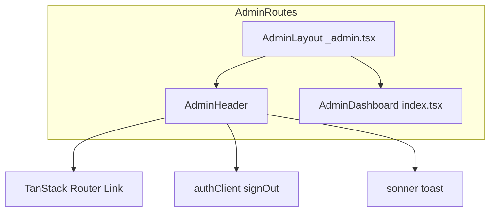
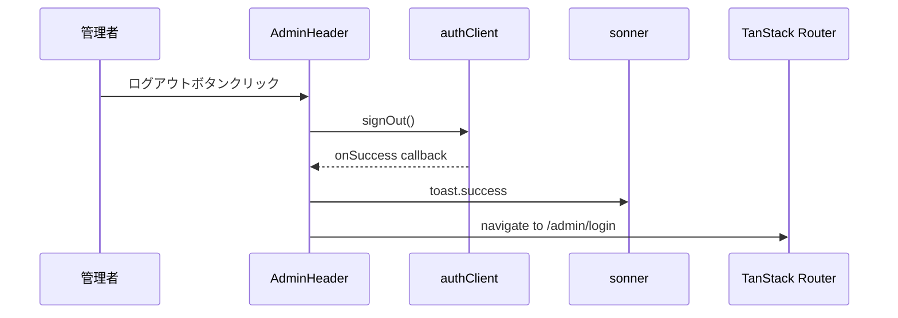

# Design Document: admin-header

## Overview
**Purpose**: 管理者ページ専用のヘッダーコンポーネントを提供し、管理者が一貫したナビゲーションとログアウト機能を利用できるようにする。

**Users**: 管理者ロールを持つユーザーが、管理者ダッシュボードおよび将来の管理者ページで使用する。

**Impact**: 現在の`_admin.tsx`レイアウトにヘッダーを追加し、`_admin/index.tsx`から重複するログアウトUIを削除する。

### Goals
- 管理者専用UIとして視覚的に区別されるヘッダーを提供
- ログイン中のユーザー情報を表示
- ヘッダーからのログアウト機能を提供
- 管理者セクション内のナビゲーションを実現

### Non-Goals
- 一般ユーザー向けHeaderの変更
- 管理者ページのルーティング構造の変更
- 認証ロジックの変更

## Architecture

### Existing Architecture Analysis
- `_admin.tsx`: 管理者レイアウトコンポーネント。RouteContextでユーザー情報を伝播
- `header.tsx`: 一般ユーザー向けヘッダー（参考パターン）
- `user-menu.tsx`: ログアウト機能を持つドロップダウンメニュー（参考パターン）

### Architecture Pattern & Boundary Map



**Architecture Integration**:
- Selected pattern: Presentational Component（ロジックは親から注入）
- Domain boundary: `apps/web/src/components/`に配置
- Existing patterns preserved: Header/UserMenuと同様のレイアウトパターン
- New components rationale: 管理者専用のビジュアルとナビゲーション要件のため新規作成
- Steering compliance: TailwindCSS + shadcn/uiパターンを踏襲

### Technology Stack

| Layer | Choice / Version | Role in Feature | Notes |
|-------|------------------|-----------------|-------|
| Frontend | React 19 + TanStack Router | コンポーネント + ナビゲーション | 既存パターン踏襲 |
| Styling | TailwindCSS v4 | スタイリング | 管理者専用の背景色 |
| UI | shadcn/ui Button | ログアウトボタン | 既存コンポーネント使用 |
| Auth | Better-Auth (authClient) | ログアウト処理 | 既存クライアント使用 |
| Notification | sonner (toast) | 通知表示 | 既存パターン使用 |

## Requirements Traceability

| Requirement | Summary | Components | Interfaces | Flows |
|-------------|---------|------------|------------|-------|
| 1.1 | レイアウト最上部に固定表示 | AdminLayout, AdminHeader | - | - |
| 1.2 | タイトル表示 | AdminHeader | - | - |
| 1.3 | 管理者専用スタイリング | AdminHeader | - | - |
| 1.4 | TailwindCSS使用 | AdminHeader | - | - |
| 2.1 | ユーザー情報表示 | AdminHeader | AdminHeaderProps | - |
| 2.2 | ユーザー名優先表示 | AdminHeader | - | - |
| 2.3 | メールフォールバック | AdminHeader | - | - |
| 3.1 | ログアウトボタン表示 | AdminHeader | - | - |
| 3.2 | signOut呼び出し | AdminHeader | - | Logout Flow |
| 3.3 | トースト通知 | AdminHeader | - | Logout Flow |
| 3.4 | リダイレクト | AdminHeader | - | Logout Flow |
| 4.1 | ダッシュボードリンク | AdminHeader | - | - |
| 4.2 | Linkコンポーネント使用 | AdminHeader | - | - |
| 4.3 | アクティブ状態表示 | AdminHeader | - | - |
| 5.1 | Outlet前に配置 | AdminLayout | - | - |
| 5.2 | RouteContext使用 | AdminLayout, AdminHeader | AdminHeaderProps | - |
| 5.3 | Forbidden時非表示 | AdminLayout | - | - |

## System Flows

### Logout Flow



## Components and Interfaces

| Component | Domain/Layer | Intent | Req Coverage | Key Dependencies | Contracts |
|-----------|--------------|--------|--------------|------------------|-----------|
| AdminHeader | UI | 管理者ヘッダー表示 | 1.1-4.3 | Link (P0), authClient (P0), toast (P1) | State |
| AdminLayout | UI | レイアウト統合 | 5.1-5.3 | AdminHeader (P0) | - |

### UI Layer

#### AdminHeader

| Field | Detail |
|-------|--------|
| Intent | 管理者ページ専用ヘッダーの表示とログアウト機能の提供 |
| Requirements | 1.1, 1.2, 1.3, 1.4, 2.1, 2.2, 2.3, 3.1, 3.2, 3.3, 3.4, 4.1, 4.2, 4.3 |

**Responsibilities & Constraints**
- 管理者専用のビジュアルデザインでヘッダーを表示
- ユーザー情報（名前またはメール）を表示
- ナビゲーションリンクを提供
- ログアウト処理を実行

**Dependencies**
- Inbound: AdminLayout — ユーザー情報の注入 (P0)
- External: @tanstack/react-router Link — ナビゲーション (P0)
- External: authClient — ログアウト処理 (P0)
- External: sonner toast — 通知表示 (P1)

**Contracts**: State [x]

##### State Management

```typescript
interface AdminHeaderProps {
  user: {
    id: string;
    name: string | null;
    email: string;
    role: string;
  } | null;
}

// ナビゲーションリンク定義
interface NavLink {
  to: string;
  label: string;
}

const navLinks: NavLink[] = [
  { to: "/admin", label: "ダッシュボード" },
];
```

- State model: propsでユーザー情報を受け取り、内部状態は持たない
- Persistence: なし（セッションは`authClient`が管理）

**Implementation Notes**
- Integration: `AdminLayout`から`Route.useRouteContext()`で取得したユーザー情報をpropsで渡す
- Validation: `user`がnullの場合は表示しない（`isForbidden`チェックで事前にガード済み）
- Risks: なし（既存パターンの踏襲）

#### AdminLayout (修正)

| Field | Detail |
|-------|--------|
| Intent | AdminHeaderをOutletの前に配置するレイアウト統合 |
| Requirements | 5.1, 5.2, 5.3 |

**Responsibilities & Constraints**
- `isForbidden`がfalseの場合のみAdminHeaderを表示
- RouteContextのユーザー情報をAdminHeaderに渡す

**Implementation Notes**
- Integration: 既存の`_admin.tsx`を修正してAdminHeaderを追加
- Validation: `isForbidden`チェックは既存ロジックを維持

## Testing Strategy

### Unit Tests
- AdminHeader: propsで渡されたユーザー名が表示されること
- AdminHeader: ユーザー名がnullの場合メールが表示されること
- AdminHeader: ナビゲーションリンクが正しいパスを持つこと

### Integration Tests
- ログアウトボタンクリックでauthClient.signOutが呼ばれること
- ログアウト成功後に/admin/loginにリダイレクトされること
- isForbiddenがtrueの場合AdminHeaderが表示されないこと
