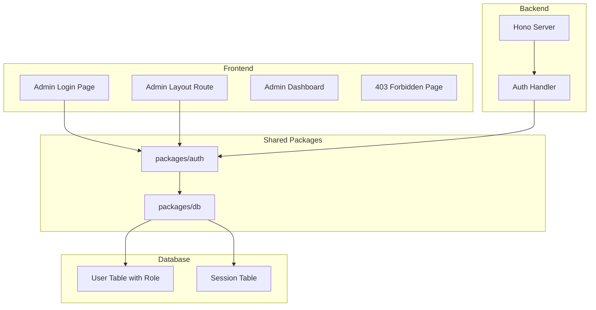
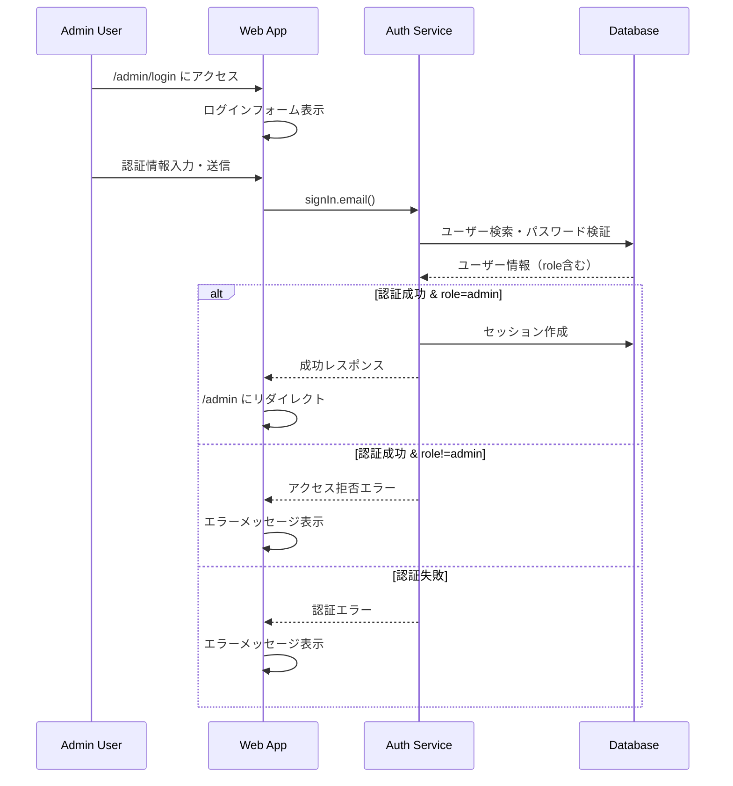
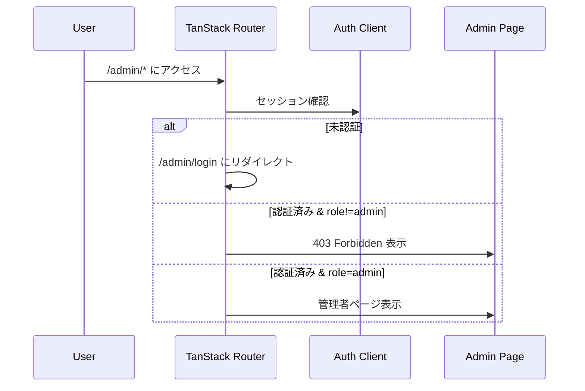

# Design Document: Admin Login

## Overview

**Purpose**: 管理者向けの専用ログイン機能を提供し、システムの管理機能へのセキュアなアクセスを実現する。

**Users**: システム管理者が管理ダッシュボードへアクセスするために使用する。

**Impact**: 既存のBetter-Auth認証システムにadminプラグインを追加し、ユーザーテーブルにロールフィールドを拡張する。

### Goals
- 管理者専用のログインエンドポイント（/admin/login）を提供
- Better-Auth adminプラグインによるロールベースのアクセス制御
- 未認証・非管理者ユーザーの適切なリダイレクト処理

### Non-Goals
- 一般ユーザー向けログイン機能の変更
- 管理者ダッシュボードの詳細機能実装（本設計はログイン機能のみ）
- 2要素認証（将来的な拡張として検討）

## Architecture

### Existing Architecture Analysis

現在のシステムは以下の構成:
- **apps/web**: TanStack Start（SSR）フロントエンド、TanStack Router
- **apps/server**: Hono APIサーバー
- **packages/auth**: Better-Auth設定（emailAndPassword認証）
- **packages/db**: Drizzle ORM、SQLite（user, session, account, verification テーブル）

**既存パターン**:
- 認証はBetter-Authのhandlerでapp/serverにマウント
- フロントエンドは`authClient`を使用してAPI呼び出し
- ルーティングはTanStack Routerのファイルベースルーティング

### Architecture Pattern & Boundary Map



**Architecture Integration**:
- **Selected pattern**: レイヤードアーキテクチャ（既存パターン踏襲）
- **Domain boundaries**: 認証ロジックは`@thac/auth`に集約、UIは`apps/web`に配置
- **Existing patterns preserved**: Better-Auth handler、Drizzle ORMスキーマ定義
- **New components rationale**: adminプラグイン追加、Admin専用ルート追加
- **Steering compliance**: モノレポ構成、TypeScript strict mode、Biomeフォーマット

### Technology Stack

| Layer | Choice / Version | Role in Feature | Notes |
|-------|------------------|-----------------|-------|
| Frontend | TanStack Start, TanStack Router | Admin用ログインUI、保護ルート | 既存スタック |
| Backend | Hono + Better-Auth admin plugin | 認証API、ロール検証 | adminプラグイン追加 |
| Data | Drizzle ORM + SQLite | ユーザーロール永続化 | スキーマ拡張 |
| Validation | Zod | フォーム入力検証 | 既存スタック |

## System Flows

### 管理者ログインフロー



### 保護ルートアクセスフロー



## Requirements Traceability

| Requirement | Summary | Components | Interfaces | Flows |
|-------------|---------|------------|------------|-------|
| 1.1, 1.2 | ログインフォーム表示 | AdminLoginPage | - | ログインフロー |
| 1.3, 1.4 | ボタン状態制御 | AdminLoginForm | - | - |
| 2.1, 2.2 | 認証成功処理 | AuthService | signIn.email | ログインフロー |
| 2.3, 2.4, 2.5 | 認証エラー処理 | AuthService, AdminLoginForm | - | ログインフロー |
| 3.1 | ロールフィールド | UserSchema | - | - |
| 3.2, 3.3 | ロール検証 | AuthService, AdminLoginForm | - | ログインフロー |
| 4.1, 4.2 | セッション有効期限 | AuthService | - | - |
| 4.3, 4.4 | ログアウト | AuthService | signOut | - |
| 5.1, 5.2, 5.3 | 保護ルート | AdminLayout | beforeLoad | 保護ルートフロー |
| 6.1, 6.2, 6.3 | フォームバリデーション | AdminLoginForm | - | - |

## Components and Interfaces

| Component | Domain/Layer | Intent | Req Coverage | Key Dependencies | Contracts |
|-----------|--------------|--------|--------------|------------------|-----------|
| AdminLoginPage | UI | 管理者ログイン画面 | 1.1-1.4 | AdminLoginForm (P0) | - |
| AdminLoginForm | UI | ログインフォーム | 2.1-2.5, 6.1-6.3 | authClient (P0), Zod (P1) | State |
| AdminLayout | UI | 保護ルートレイアウト | 5.1-5.3 | authClient (P0) | - |
| ForbiddenPage | UI | 403エラーページ | 5.2 | - | - |
| AuthService | Shared/Auth | 認証・ロール検証 | 2.1-2.5, 3.2, 4.1-4.4 | Better-Auth (P0), DB (P0) | Service, API |
| UserSchema | Shared/DB | ロールフィールド定義 | 3.1 | Drizzle (P0) | - |

### UI Layer

#### AdminLoginPage

| Field | Detail |
|-------|--------|
| Intent | 管理者専用ログイン画面を提供 |
| Requirements | 1.1, 1.2 |

**Responsibilities & Constraints**
- /admin/login ルートのページコンポーネント
- AdminLoginFormをレンダリング

**Dependencies**
- Inbound: TanStack Router — ルーティング (P0)
- Outbound: AdminLoginForm — ログインフォーム (P0)

**Contracts**: State [ ]

**Implementation Notes**
- 既存の`/login`ページ構造を参考に実装
- 管理者向けのUIスタイリング適用

#### AdminLoginForm

| Field | Detail |
|-------|--------|
| Intent | メール/パスワード入力とバリデーション、認証実行 |
| Requirements | 1.3, 1.4, 2.1-2.5, 6.1-6.3 |

**Responsibilities & Constraints**
- フォーム入力のバリデーション（Zod）
- 認証API呼び出し
- エラーメッセージ表示
- ローディング状態管理

**Dependencies**
- Inbound: AdminLoginPage — 親コンポーネント (P0)
- Outbound: authClient — 認証API (P0)
- External: TanStack Form — フォーム管理 (P1)
- External: Zod — バリデーション (P1)
- External: sonner — トースト通知 (P2)

**Contracts**: State [x]

##### State Management
```typescript
interface AdminLoginFormState {
  email: string;
  password: string;
  isSubmitting: boolean;
  error: string | null;
}
```

- State model: TanStack Formで管理
- Persistence: なし（フォーム状態のみ）
- Concurrency: 送信中は重複送信を防止

**Implementation Notes**
- 既存のSignInFormを参考に実装
- ロール検証エラー時は専用メッセージを表示
- タイミング攻撃対策: 存在しないユーザーと認証失敗で同じメッセージ

#### AdminLayout

| Field | Detail |
|-------|--------|
| Intent | /admin配下のルートを保護するレイアウト |
| Requirements | 5.1, 5.2, 5.3 |

**Responsibilities & Constraints**
- beforeLoadで認証・ロールチェック
- 未認証ユーザーを/admin/loginにリダイレクト
- 非管理者ユーザーに403ページ表示

**Dependencies**
- Inbound: TanStack Router — ルーティング (P0)
- Outbound: authClient — セッション確認 (P0)
- Outbound: ForbiddenPage — 403表示 (P1)

**Contracts**: State [ ]

##### Service Interface
```typescript
// beforeLoad hook
interface AdminLayoutContext {
  user: {
    id: string;
    email: string;
    role: string;
  } | null;
}

// beforeLoad implementation
async function beforeLoad({ location }): Promise<AdminLayoutContext> {
  // 1. セッション確認
  // 2. 未認証なら redirect to /admin/login
  // 3. role !== 'admin' なら 403
  // 4. contextにuser情報を返す
}
```

**Implementation Notes**
- TanStack Routerの`_admin`レイアウトルートとして実装
- 子ルートにユーザー情報をcontext経由で伝播

#### ForbiddenPage

| Field | Detail |
|-------|--------|
| Intent | 403 Forbiddenエラーを表示 |
| Requirements | 5.2 |

**Responsibilities & Constraints**
- アクセス権限がないことを通知
- ログインページへのリンク提供

**Dependencies**
- Inbound: AdminLayout — 非管理者アクセス時 (P0)

**Contracts**: なし

**Implementation Notes**
- シンプルなエラーページ
- 一般ユーザー向けログインへの誘導は行わない（セキュリティ）

### Shared Layer

#### AuthService (packages/auth拡張)

| Field | Detail |
|-------|--------|
| Intent | 認証処理とロール検証 |
| Requirements | 2.1-2.5, 3.2, 4.1-4.4 |

**Responsibilities & Constraints**
- Better-Auth adminプラグインの設定
- ロールベースのアクセス制御
- セッション管理

**Dependencies**
- Inbound: apps/server — APIハンドラー (P0)
- Outbound: @thac/db — データベース (P0)
- External: better-auth — 認証ライブラリ (P0)

**Contracts**: Service [x] / API [x]

##### Service Interface
```typescript
// packages/auth/src/index.ts 拡張
import { betterAuth } from "better-auth";
import { admin } from "better-auth/plugins";

export const auth = betterAuth({
  // 既存設定...
  plugins: [
    admin({
      defaultRole: "user",
      adminRoles: ["admin"],
    }),
  ],
});
```

##### API Contract
| Method | Endpoint | Request | Response | Errors |
|--------|----------|---------|----------|--------|
| POST | /api/auth/sign-in/email | { email, password } | { user, session } | 401, 403 |
| POST | /api/auth/sign-out | - | - | 401 |
| GET | /api/auth/session | - | { user, session } | 401 |

**Implementation Notes**
- 既存のauth設定にadminプラグインを追加
- 管理者ログイン専用エンドポイントは不要（既存のsignIn.emailを使用）
- ロール検証はセッション取得後にフロントエンドで実施

#### UserSchema (packages/db拡張)

| Field | Detail |
|-------|--------|
| Intent | ユーザーロールのDBスキーマ定義 |
| Requirements | 3.1 |

**Responsibilities & Constraints**
- userテーブルにroleフィールドを追加
- デフォルト値は"user"

**Dependencies**
- Inbound: AuthService — ロール取得 (P0)
- External: Drizzle ORM — スキーマ定義 (P0)

**Contracts**: なし

##### Schema Extension
```typescript
// packages/db/src/schema/auth.ts に追加
export const user = sqliteTable("user", {
  // 既存フィールド...
  role: text("role").default("user"),
  banned: integer("banned", { mode: "boolean" }).default(false),
  banReason: text("ban_reason"),
  banExpires: integer("ban_expires", { mode: "timestamp_ms" }),
});

// sessionテーブルに追加
export const session = sqliteTable("session", {
  // 既存フィールド...
  impersonatedBy: text("impersonated_by"),
});
```

**Implementation Notes**
- Better-Auth adminプラグインが期待するスキーマに準拠
- マイグレーション実行: `bun run db:generate && bun run db:migrate`

## Data Models

### Domain Model

**Aggregates**:
- User（ロールを含む）
- Session

**Business Rules**:
- roleが"admin"のユーザーのみが/admin配下にアクセス可能
- デフォルトロールは"user"
- bannedがtrueのユーザーはログイン不可

### Logical Data Model

**User Table Extensions**:
| Column | Type | Nullable | Default | Description |
|--------|------|----------|---------|-------------|
| role | TEXT | Yes | "user" | ユーザーロール |
| banned | INTEGER | Yes | 0 | BAN状態 |
| ban_reason | TEXT | Yes | NULL | BAN理由 |
| ban_expires | INTEGER | Yes | NULL | BAN解除日時 |

**Session Table Extensions**:
| Column | Type | Nullable | Default | Description |
|--------|------|----------|---------|-------------|
| impersonated_by | TEXT | Yes | NULL | なりすまし元の管理者ID |

## Error Handling

### Error Categories and Responses

**User Errors (4xx)**:
- 401 Unauthorized: 未認証 → /admin/loginへリダイレクト
- 403 Forbidden: 認証済みだが管理者権限なし → 403ページ表示
- 400 Bad Request: 無効な入力 → フィールドレベルのエラーメッセージ

**Business Logic Errors (422)**:
- 認証失敗: "メールアドレスまたはパスワードが正しくありません"
- 権限不足: "管理者権限がありません"

### Monitoring
- 認証失敗ログ: ユーザーID（存在する場合）、IPアドレス、タイムスタンプ
- 不正アクセス試行: 非管理者の/admin配下へのアクセス試行をログ

## Testing Strategy

### Unit Tests
- AdminLoginForm: バリデーションロジック（無効なメール形式、空パスワード）
- AdminLayout beforeLoad: 認証状態に応じたリダイレクト判定
- AuthService: ロール検証ロジック

### Integration Tests
- ログインフロー: 正常系（admin）、異常系（user、無効認証）
- 保護ルート: 未認証リダイレクト、権限不足403

### E2E Tests
- 管理者ログイン〜ダッシュボード表示
- 一般ユーザーでの/adminアクセス拒否
- ログアウト〜リダイレクト

## Security Considerations

- **タイミング攻撃対策**: ユーザー存在確認と認証失敗で同一のエラーメッセージを返却
- **セッション管理**: HTTPOnly、Secure、SameSite=None cookieを使用（既存設定）
- **レート制限**: 将来的にログイン試行回数制限を検討
- **管理者エンドポイント分離**: /admin/loginを一般ログインと分離し、露出を低減
