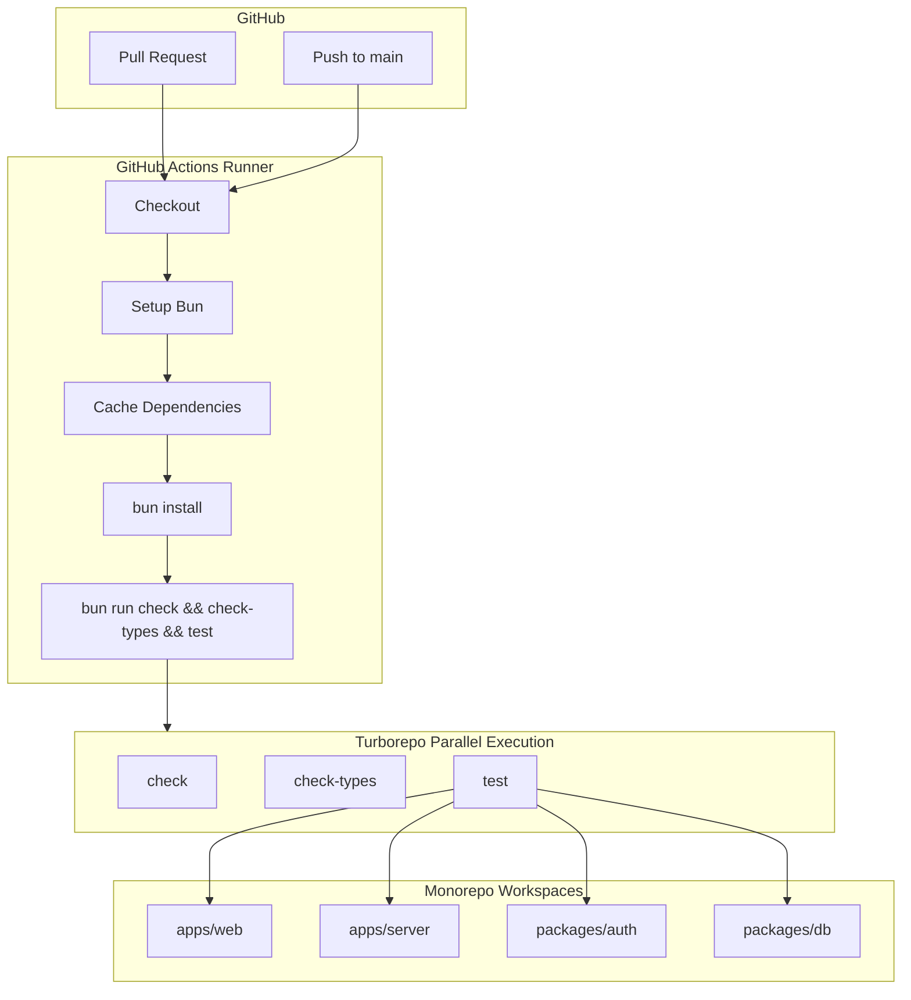
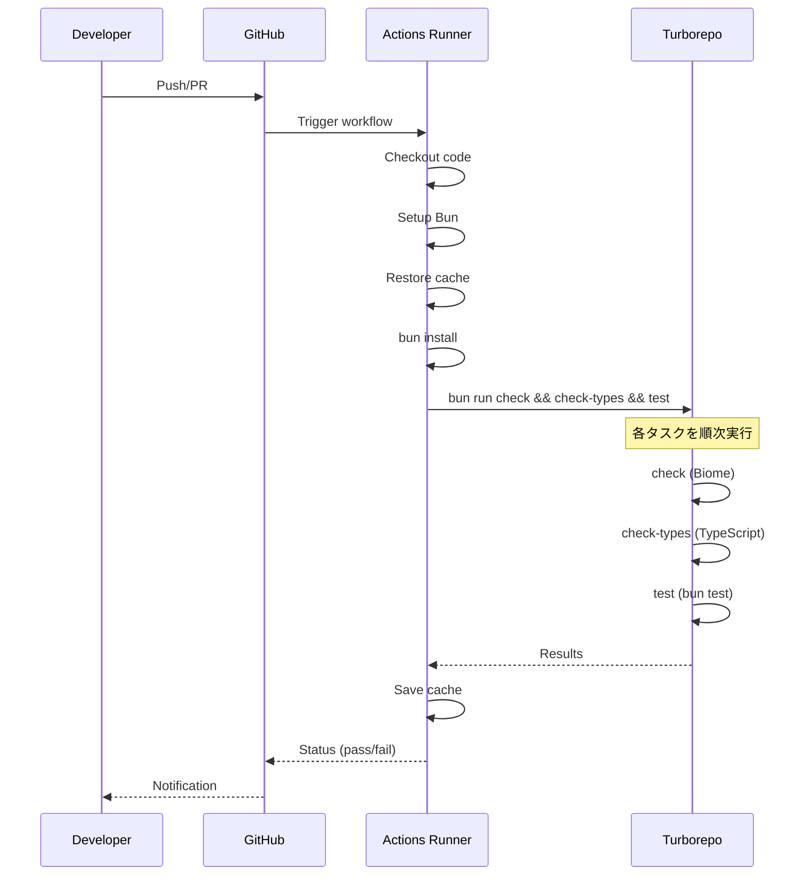

# Design Document

## Overview

**Purpose**: モダンなテスト環境とGitHub Actions CIパイプラインを構築し、プルリクエストとmainブランチへのプッシュ時にテスト、Lint、型チェックを自動実行する。

**Users**: 開発者がコード品質を継続的に検証し、問題を早期に検出できるようにする。

**Impact**: 既存のモノレポ構成にbun test設定とGitHub Actionsワークフローを追加。既存のBiome設定とTypeScript設定はそのまま活用。

### Goals
- bun test（Bunネイティブテストランナー）を使用した全ワークスペースでのテスト実行環境を構築
- GitHub Actionsでテスト・Lint・型チェックを自動化
- Turborepoキャッシュを活用したCI高速化

### Non-Goals
- E2Eテスト（Playwright等）の設定
- Vercel Remote Cacheの設定（ローカルキャッシュのみ）
- テストコードの実装（環境構築のみ）

## Architecture

### Architecture Pattern & Boundary Map



**Architecture Integration**:
- **Selected Pattern**: 単一ワークフロー + Turborepo並列実行
- **Domain Boundaries**: CIワークフロー（インフラ層）とテスト設定（各ワークスペース）を分離
- **Existing Patterns Preserved**: Turborepoタスク定義、Biome設定、TypeScript設定
- **New Components Rationale**: GitHub Actionsワークフロー、bun test設定を新規追加
- **Steering Compliance**: Bun + Turborepo + Biomeの既存スタック活用

### Technology Stack

| Layer | Choice / Version | Role in Feature | Notes |
|-------|------------------|-----------------|-------|
| CI/CD | GitHub Actions | ワークフロー実行 | ubuntu-latest |
| Runtime | Bun 1.2.15 | パッケージ管理・実行 | oven-sh/setup-bun@v2 |
| Build Orchestration | Turborepo 2.5+ | タスク並列実行・キャッシュ | 既存 |
| Testing | bun test | ユニットテスト | Bunネイティブ |
| Linting | Biome 2.2+ | コード品質チェック | 既存 |
| Type Check | TypeScript 5.x | 型検証 | 既存 |

## System Flows

### CI Workflow Execution Flow



## Requirements Traceability

| Requirement | Summary | Components | Interfaces | Flows |
|-------------|---------|------------|------------|-------|
| 1.1 | bun run testで全ワークスペースのテスト実行 | TurboConfig, WorkspacePackages | turbo test task | CI Workflow |
| 1.2 | テスト失敗時の詳細情報出力 | bun test | built-in reporter | - |
| 1.3 | Turborepoキャッシュ活用 | TurboConfig | cache outputs | - |
| 1.4 | テスト進捗表示 | TurboConfig | ui設定 | - |
| 2.1 | mainプッシュ時の自動実行 | CIWorkflow | on.push trigger | CI Workflow |
| 2.2 | PR時の自動実行 | CIWorkflow | on.pull_request trigger | CI Workflow |
| 2.3 | Bunランタイム使用 | CIWorkflow | setup-bun action | CI Workflow |
| 2.4 | 失敗時のワークフロー終了 | CIWorkflow | exit code handling | - |
| 2.5 | 結果のPR表示 | CIWorkflow | status checks | - |
| 3.1 | bun run checkでLint実行 | BiomeConfig | 既存設定 | CI Workflow |
| 3.2 | Lintエラー詳細出力 | BiomeConfig | 既存設定 | - |
| 3.3 | 既存Biome設定使用 | BiomeConfig | 既存設定 | - |
| 4.1 | bun run check-typesで型チェック | TSConfig | 既存設定 | CI Workflow |
| 4.2 | 型エラー詳細出力 | TSConfig | tsc output | - |
| 4.3 | strict mode維持 | TSConfig | 既存設定 | - |
| 5.1 | 依存関係キャッシュ | CIWorkflow | actions/cache | CI Workflow |
| 5.2 | Turborepoキャッシュ活用 | CIWorkflow | .turbo cache | CI Workflow |
| 5.3 | 並列実行 | CIWorkflow, TurboConfig | turbo run multiple tasks | CI Workflow |
| 5.4 | 不要ステップスキップ | TurboConfig | cache hit | - |

## Components and Interfaces

| Component | Domain/Layer | Intent | Req Coverage | Key Dependencies | Contracts |
|-----------|--------------|--------|--------------|------------------|-----------|
| CIWorkflow | Infrastructure | GitHub Actions CI定義 | 2.1-2.5, 5.1-5.3 | setup-bun, actions/cache | Workflow |
| TurboConfig | Build | Turborepoタスク設定 | 1.1, 1.3, 1.4, 5.3, 5.4 | turbo.json | Config |
| WorkspacePackages | Build | 各ワークスペースのpackage.json | 1.1 | bun test | Config |

### Infrastructure

#### CIWorkflow

| Field | Detail |
|-------|--------|
| Intent | GitHub Actions CIワークフロー定義 |
| Requirements | 2.1, 2.2, 2.3, 2.4, 2.5, 5.1, 5.2, 5.3 |

**Responsibilities & Constraints**
- mainブランチプッシュとPR時にワークフローをトリガー
- Bun環境のセットアップとキャッシュ管理
- Turborepo経由でテスト・Lint・型チェックを実行

**Dependencies**
- External: oven-sh/setup-bun@v2 — Bunセットアップ (P0)
- External: actions/checkout@v6 — コードチェックアウト (P0)
- External: actions/cache@v5 — 依存関係キャッシュ (P1)

**Contracts**: Workflow [x]

##### Workflow Contract

```yaml
# .github/workflows/ci.yml
name: CI

on:
  push:
    branches: [main]
  pull_request:
    branches: [main]

jobs:
  ci:
    runs-on: ubuntu-latest
    steps:
      - uses: actions/checkout@v6
      - uses: oven-sh/setup-bun@v2
      - uses: actions/cache@v5
        with:
          path: |
            ~/.bun/install/cache
            .turbo
          key: ${{ runner.os }}-bun-${{ hashFiles('**/bun.lock') }}
          restore-keys: |
            ${{ runner.os }}-bun-
      - run: bun install --frozen-lockfile
      - name: Run CI checks
        run: bun run check && bun run check-types && bun run test
```

**Implementation Notes**
- Integration: setup-bunはpackage.jsonのpackageManagerから自動バージョン検出
- Validation: frozen-lockfileでlock不整合を検出
- Risks: 大規模リポジトリではキャッシュサイズに注意

### Build

#### TurboConfig

| Field | Detail |
|-------|--------|
| Intent | Turborepoタスク設定 |
| Requirements | 1.1, 1.3, 1.4, 5.3, 5.4 |

**Responsibilities & Constraints**
- testタスクの定義
- キャッシュ設定
- 並列実行の制御

**Dependencies**
- Inbound: CIWorkflow — ワークフローからの呼び出し (P0)

**Contracts**: Config [x]

##### Config Contract

```json
{
  "tasks": {
    "test": {
      "outputs": []
    }
  }
}
```

**Implementation Notes**
- Integration: 既存turbo.jsonにtestタスクを追加
- bun testはキャッシュ出力が不要（高速実行）

#### WorkspacePackages

| Field | Detail |
|-------|--------|
| Intent | 各ワークスペースにtestスクリプトを追加 |
| Requirements | 1.1 |

**Responsibilities & Constraints**
- 各ワークスペースのpackage.jsonにtestスクリプトを定義
- Turborepoからのtest実行を可能にする

**Dependencies**
- Built-in: bun test — Bunネイティブテストランナー (P0)

**Contracts**: Config [x]

##### Config Contract

各ワークスペースのpackage.jsonに以下を追加:

```json
// apps/web/package.json, apps/server/package.json, packages/auth/package.json, packages/db/package.json
{
  "scripts": {
    "test": "bun test"
  }
}
```

**Implementation Notes**
- Integration: bun testはBunに組み込まれているため、追加依存関係不要
- テストファイルは`.test.ts`、`.spec.ts`などの命名規則に従う
- `bun:test`モジュールからdescribe, test, expectをインポート

## Testing Strategy

### Unit Tests
- 各ワークスペースのビジネスロジック
- ユーティリティ関数
- 型検証

### Integration Tests
- API エンドポイント（apps/server）
- 認証フロー（packages/auth）
- データベースクエリ（packages/db）

### CI Tests
- ワークフロー実行の成功確認
- キャッシュヒット率の監視
- 実行時間の計測

## Error Handling

### Error Strategy
CIワークフローでは、いずれかのタスクが失敗した場合にワークフロー全体を失敗とする。

### Error Categories and Responses
- **Test Failures**: テスト失敗時はbun testのエラーレポートを出力し、ワークフローを失敗ステータスで終了
- **Lint Errors**: Biomeエラー時は違反箇所を出力し、ワークフローを失敗ステータスで終了
- **Type Errors**: TypeScriptエラー時はエラー箇所を出力し、ワークフローを失敗ステータスで終了
- **Installation Failures**: bun install失敗時は依存関係の問題を報告

### Monitoring
- GitHub Actionsのワークフロー履歴で実行結果を確認
- PR上のステータスチェックで成功/失敗を表示

