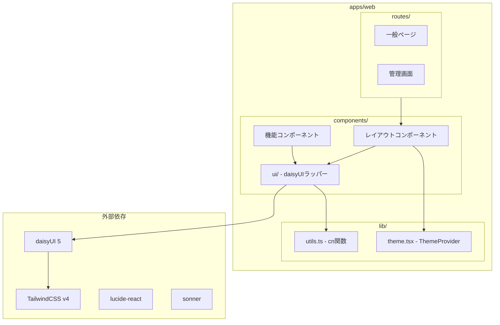
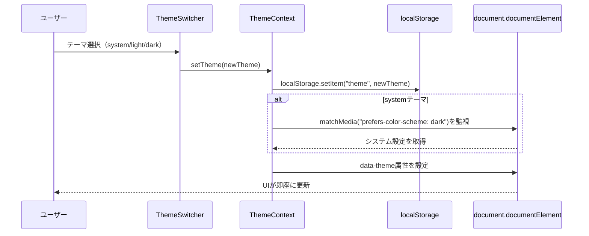
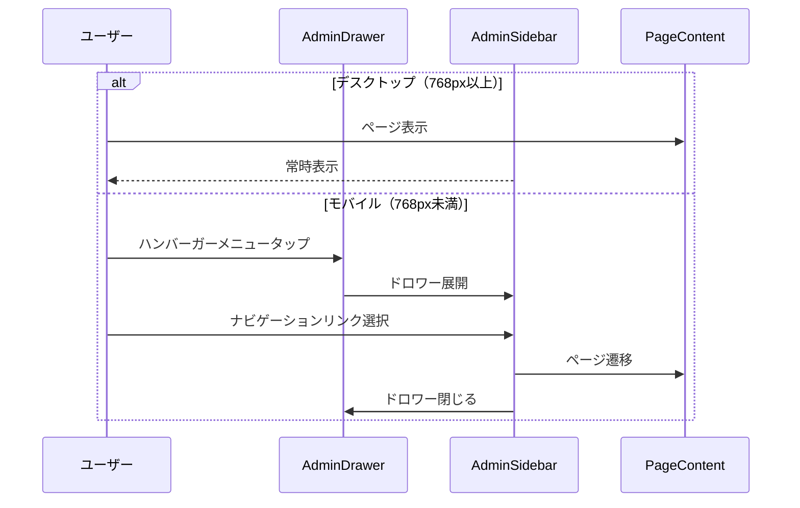

# Design Document: daisyUI Migration

## Overview

**Purpose**: 本機能は、apps/webフロントエンドのUIコンポーネントライブラリをshadcn/uiからdaisyUIへ移行し、テーマ切り替え機能と管理画面のサイドバーナビゲーションを実装する。

**Users**: 一般ユーザーと管理者がモダンなUI、テーマ切り替え、レスポンシブナビゲーションを利用する。

**Impact**: 既存のshadcn/ui（Radix UI, class-variance-authority, tailwind-merge）依存を削除し、daisyUIベースのコンポーネントアーキテクチャに置換する。

### Goals
- daisyUI 5をTailwindCSS v4プラグインとして導入
- 11個のUIコンポーネントをdaisyUIベースに移行（既存API互換）
- システム/ライト/ダークテーマ切り替え機能の実装
- 管理画面のサイドバーナビゲーション化とモバイル対応

### Non-Goals
- 新規UIコンポーネントの追加（既存機能の維持のみ）
- バックエンド(apps/server)への変更
- テスト自動化の追加（手動確認で検証）

## Architecture

### Existing Architecture Analysis

現在のUIアーキテクチャ:
- **shadcn/uiパターン**: Radix UIプリミティブ + class-variance-authority + tailwind-merge
- **テーマ管理**: next-themes（.darkクラス + prefers-color-scheme）
- **CSS変数**: oklch色空間のカスタムプロパティ（--background, --foreground等）
- **管理画面**: ヘッダーベースナビゲーション（AdminHeader）

### Architecture Pattern & Boundary Map



**Architecture Integration**:
- **Selected pattern**: Wrapperコンポーネントパターン — 既存propsインターフェースを維持しつつdaisyUIクラスを適用
- **Domain boundaries**: UIコンポーネント層とビジネスロジック層を分離維持
- **Existing patterns preserved**: TanStack Router、TanStack Query、認証フロー
- **New components rationale**: ThemeProvider（テーマ状態管理）、AdminLayout（サイドバー構成）
- **Steering compliance**: TypeScript strict mode、Biomeフォーマット維持

### Technology Stack

| Layer | Choice / Version | Role in Feature | Notes |
|-------|------------------|-----------------|-------|
| UI Framework | daisyUI 5.x | コンポーネントスタイリング | TailwindCSS v4プラグイン |
| CSS Framework | TailwindCSS 4.x | ユーティリティCSS | 既存維持 |
| Icons | lucide-react 0.525+ | アイコン表示 | 既存維持 |
| Toast | sonner 2.x | 通知表示 | daisyUIテーマ連動 |
| Class Utility | clsx 2.x | クラス名結合 | tailwind-merge削除 |

## System Flows

### テーマ切り替えフロー



### 管理画面レイアウトフロー



## Requirements Traceability

| Requirement | Summary | Components | Interfaces | Flows |
|-------------|---------|------------|------------|-------|
| 1.1-1.4 | daisyUI導入 | index.css, package.json | — | — |
| 2.1-2.6 | shadcn/ui削除 | package.json, components.json削除 | — | — |
| 3.1-3.7 | テーマ切り替え | ThemeProvider, ThemeSwitcher | useTheme | テーマ切り替えフロー |
| 4.1-4.5 | ヘッダー改善 | Header | — | — |
| 5.1-5.6 | 管理画面レイアウト | AdminLayout, AdminSidebar | — | 管理画面レイアウトフロー |
| 6.1-6.5 | モバイル対応 | AdminLayout | — | 管理画面レイアウトフロー |
| 7.1-7.5 | Button移行 | Button | ButtonProps | — |
| 8.1-8.3 | Card移行 | Card, CardHeader, CardTitle, CardContent | CardProps | — |
| 9.1-9.5 | Dialog移行 | Dialog, DialogContent, DialogTrigger | DialogProps | — |
| 10.1-10.5 | Dropdown移行 | DropdownMenu, DropdownMenuContent | DropdownProps | — |
| 11.1-11.4 | Input移行 | Input | InputProps | — |
| 12.1-12.3 | Label移行 | Label | LabelProps | — |
| 13.1-13.4 | Table移行 | Table, TableHeader, TableRow | TableProps | — |
| 14.1-14.3 | Badge移行 | Badge | BadgeProps | — |
| 15.1-15.3 | Checkbox移行 | Checkbox | CheckboxProps | — |
| 16.1-16.3 | Skeleton移行 | Skeleton | SkeletonProps | — |
| 17.1-17.4 | Sonner維持 | Sonner | — | — |
| 18.1-18.3 | cn関数更新 | utils.ts | cn | — |
| 19.1-19.6 | 動作確認 | — | — | — |
| 20.1-20.4 | next-themes廃止 | ThemeProvider | useTheme | テーマ切り替えフロー |

## Components and Interfaces

### Summary

| Component | Domain/Layer | Intent | Req Coverage | Key Dependencies | Contracts |
|-----------|--------------|--------|--------------|------------------|-----------|
| ThemeProvider | lib/theme | テーマ状態管理 | 3, 20 | — | State |
| ThemeSwitcher | components/ui | テーマ切り替えUI | 3.1-3.7 | ThemeProvider (P0) | — |
| Button | components/ui | ボタンUI | 7.1-7.5 | clsx (P1) | Service |
| Card | components/ui | カードUI | 8.1-8.3 | clsx (P1) | Service |
| Dialog | components/ui | モーダルUI | 9.1-9.5 | clsx (P1) | State |
| DropdownMenu | components/ui | ドロップダウンUI | 10.1-10.5 | clsx (P1) | — |
| Input | components/ui | 入力フィールドUI | 11.1-11.4 | clsx (P1) | Service |
| Label | components/ui | ラベルUI | 12.1-12.3 | clsx (P1) | Service |
| Table | components/ui | テーブルUI | 13.1-13.4 | clsx (P1) | Service |
| Badge | components/ui | バッジUI | 14.1-14.3 | clsx (P1) | Service |
| Checkbox | components/ui | チェックボックスUI | 15.1-15.3 | clsx (P1) | Service |
| Skeleton | components/ui | スケルトンUI | 16.1-16.3 | clsx (P1) | Service |
| Sonner | components/ui | トースト通知 | 17.1-17.4 | sonner (P0), ThemeProvider (P1) | — |
| Header | components | 一般画面ヘッダー | 4.1-4.5 | ThemeSwitcher (P1) | — |
| AdminLayout | components | 管理画面レイアウト | 5, 6 | AdminSidebar (P0) | — |
| AdminSidebar | components | 管理画面サイドバー | 5.2-5.4 | — | — |
| AdminNavbar | components | 管理画面トップバー | 5.5 | ThemeSwitcher (P1) | — |

### Infrastructure Layer

#### ThemeProvider

| Field | Detail |
|-------|--------|
| Intent | アプリケーション全体のテーマ状態を管理し、data-theme属性を制御 |
| Requirements | 3.3, 3.4, 3.5, 3.7, 20.2, 20.3, 20.4 |

**Responsibilities & Constraints**
- テーマ状態（system/light/dark）の保持と更新
- localStorageへの永続化と復元
- システムテーマ（prefers-color-scheme）の監視
- document.documentElement.dataset.themeの更新

**Dependencies**
- Outbound: localStorage — テーマ永続化 (P1)
- Outbound: window.matchMedia — システムテーマ検出 (P1)

**Contracts**: State [x]

##### State Management
```typescript
type Theme = "system" | "light" | "dark";

interface ThemeContextValue {
  theme: Theme;
  resolvedTheme: "light" | "dark";
  setTheme: (theme: Theme) => void;
}
```
- **State model**: theme（ユーザー選択）、resolvedTheme（実際に適用されるテーマ）
- **Persistence**: localStorage "theme" キー
- **Concurrency**: シングルトンContext、React state管理

**Implementation Notes**
- Integration: `<ThemeProvider>`でアプリケーションルートをラップ
- Validation: Theme型の3値のみ許可

##### SSR Hydration Mismatch対策

SSR環境でのハイドレーションミスマッチを防ぐため、`__root.tsx`の`<head>`内に以下のインラインスクリプトを追加する。このスクリプトはReactのハイドレーション前に実行され、FOUCを防止する。

```typescript
// __root.tsx の <head> 内に追加
<script
  dangerouslySetInnerHTML={{
    __html: `
      (function() {
        const theme = localStorage.getItem('theme') || 'system';
        let resolvedTheme = theme;
        if (theme === 'system') {
          resolvedTheme = window.matchMedia('(prefers-color-scheme: dark)').matches ? 'dark' : 'light';
        }
        document.documentElement.setAttribute('data-theme', resolvedTheme);
      })();
    `,
  }}
/>
```

**スクリプトの動作**:
1. localStorageからテーマ設定を取得（未設定時は'system'）
2. systemテーマの場合は`prefers-color-scheme`メディアクエリで解決
3. Reactのハイドレーション前に`data-theme`属性を設定

**Risks**: スクリプトブロッキングによる初期表示遅延 → 最小限のコードで影響を軽減

---

#### cn (utils.ts)

| Field | Detail |
|-------|--------|
| Intent | 複数のクラス名を条件付きで結合 |
| Requirements | 18.1, 18.2, 18.3 |

**Responsibilities & Constraints**
- clsxを使用したクラス名結合
- tailwind-merge依存の削除

**Dependencies**
- External: clsx — クラス名結合 (P0)

**Contracts**: Service [x]

##### Service Interface
```typescript
import { type ClassValue, clsx } from "clsx";

function cn(...inputs: ClassValue[]): string;
```
- Preconditions: 任意の数のClassValue引数
- Postconditions: 結合されたクラス名文字列を返却
- Invariants: 空文字列やfalsy値は除外

---

### UI Components Layer

#### Button

| Field | Detail |
|-------|--------|
| Intent | daisyUIスタイルのボタンコンポーネント |
| Requirements | 7.1, 7.2, 7.3, 7.4, 7.5 |

**Responsibilities & Constraints**
- variant/sizeプロパティからdaisyUIクラスへのマッピング
- 既存ButtonPropsインターフェースの維持

**Dependencies**
- Inbound: Various pages — ボタン表示 (P0)
- External: clsx — クラス名結合 (P1)

**Contracts**: Service [x]

##### Service Interface
```typescript
type ButtonVariant = "default" | "primary" | "secondary" | "accent" | "ghost" | "link" | "outline" | "destructive";
type ButtonSize = "xs" | "sm" | "md" | "lg";

interface ButtonProps extends React.ComponentProps<"button"> {
  variant?: ButtonVariant;
  size?: ButtonSize;
  asChild?: boolean;
}

function Button(props: ButtonProps): JSX.Element;
```

**Variant → daisyUI Class Mapping**:
| variant | daisyUI Class |
|---------|---------------|
| default | btn |
| primary | btn btn-primary |
| secondary | btn btn-secondary |
| accent | btn btn-accent |
| ghost | btn btn-ghost |
| link | btn btn-link |
| outline | btn btn-outline |
| destructive | btn btn-error |

**Size → daisyUI Class Mapping**:
| size | daisyUI Class |
|------|---------------|
| xs | btn-xs |
| sm | btn-sm |
| md | (default) |
| lg | btn-lg |

---

#### Dialog

| Field | Detail |
|-------|--------|
| Intent | daisyUIスタイルのモーダルダイアログ |
| Requirements | 9.1, 9.2, 9.3, 9.4, 9.5 |

**Responsibilities & Constraints**
- dialog要素またはcheckboxベースのモーダル制御
- 既存Dialog APIとの互換性維持

**Dependencies**
- Inbound: import-dialog, create-dialog — モーダル表示 (P0)
- External: clsx — クラス名結合 (P1)

**Contracts**: State [x]

##### State Management
```typescript
interface DialogProps {
  open?: boolean;
  onOpenChange?: (open: boolean) => void;
  children: React.ReactNode;
}

interface DialogContentProps extends React.ComponentProps<"div"> {
  showCloseButton?: boolean;
}

// サブコンポーネント
function Dialog(props: DialogProps): JSX.Element;
function DialogTrigger(props: React.ComponentProps<"button">): JSX.Element;
function DialogContent(props: DialogContentProps): JSX.Element;
function DialogHeader(props: React.ComponentProps<"div">): JSX.Element;
function DialogTitle(props: React.ComponentProps<"h3">): JSX.Element;
function DialogDescription(props: React.ComponentProps<"p">): JSX.Element;
function DialogFooter(props: React.ComponentProps<"div">): JSX.Element;
```
- **State model**: open状態を親コンポーネントまたは内部refで管理
- **Persistence**: なし（セッション内のみ）

**Implementation Notes**
- Integration: ネイティブ`<dialog>`要素のshowModal()/close()メソッド使用
- Validation: open propの変更時にモーダル状態を同期

##### ネイティブ`<dialog>`要素の実装

ブラウザネイティブの`<dialog>`要素を使用することで、以下のアクセシビリティ機能が自動的に提供される:
- フォーカストラップ（モーダル内にフォーカスを閉じ込める）
- Escキーでの閉じる動作
- 背景クリックでの閉じる動作（要実装）
- `aria-modal`属性の自動設定
- スクリーンリーダー対応

```typescript
function DialogContent({
  open,
  onOpenChange,
  children,
  className,
  ...props
}: DialogContentProps) {
  const dialogRef = useRef<HTMLDialogElement>(null);

  // open状態の変更を監視してshowModal/closeを呼び出し
  useEffect(() => {
    const dialog = dialogRef.current;
    if (!dialog) return;

    if (open) {
      dialog.showModal();
    } else {
      dialog.close();
    }
  }, [open]);

  // closeイベント（Escキー、close()呼び出し）を監視
  useEffect(() => {
    const dialog = dialogRef.current;
    if (!dialog) return;

    const handleClose = () => onOpenChange?.(false);
    dialog.addEventListener('close', handleClose);
    return () => dialog.removeEventListener('close', handleClose);
  }, [onOpenChange]);

  return (
    <dialog
      ref={dialogRef}
      className={cn("modal", className)}
      // 背景クリックで閉じる
      onClick={(e) => {
        if (e.target === dialogRef.current) {
          onOpenChange?.(false);
        }
      }}
      {...props}
    >
      <div className="modal-box">{children}</div>
    </dialog>
  );
}
```

##### アクセシビリティテストチェックリスト

| テスト項目 | 期待動作 | 実装方法 |
|-----------|----------|----------|
| フォーカストラップ | Tab/Shift+Tabでモーダル内のみフォーカス移動 | `showModal()`が自動提供 |
| Escキーでクローズ | Escキー押下でモーダルが閉じる | `close`イベントリスナー |
| 背景クリックでクローズ | モーダル外クリックで閉じる | `onClick`イベントハンドラ |
| スクリーンリーダー対応 | 適切なARIA属性が設定される | `<dialog>`が自動設定 |
| 閉じた後のフォーカス復帰 | トリガー要素にフォーカスが戻る | `showModal()`が自動提供 |
| キーボードナビゲーション | すべての要素にキーボードでアクセス可能 | セマンティックHTML使用 |

**Risks**: 古いブラウザでの`<dialog>`サポート不足 → モダンブラウザのみを対象（Can I Use: 96%+）

---

#### DropdownMenu

| Field | Detail |
|-------|--------|
| Intent | daisyUIスタイルのドロップダウンメニュー |
| Requirements | 10.1, 10.2, 10.3, 10.4, 10.5 |

**Responsibilities & Constraints**
- detailsタグまたはCSSベースの開閉制御
- 既存DropdownMenu APIとの互換性維持

**Dependencies**
- Inbound: user-menu, admin pages — メニュー表示 (P0)
- External: clsx — クラス名結合 (P1)

**Contracts**: Service [x]

##### Service Interface
```typescript
interface DropdownMenuProps {
  children: React.ReactNode;
}

function DropdownMenu(props: DropdownMenuProps): JSX.Element;
function DropdownMenuTrigger(props: React.ComponentProps<"div">): JSX.Element;
function DropdownMenuContent(props: React.ComponentProps<"ul">): JSX.Element;
function DropdownMenuItem(props: React.ComponentProps<"li"> & { inset?: boolean }): JSX.Element;
function DropdownMenuLabel(props: React.ComponentProps<"li">): JSX.Element;
```

---

#### Card, Input, Label, Table, Badge, Checkbox, Skeleton

これらのコンポーネントは同様のWrapperパターンに従う。詳細は`research.md`のコンポーネント移行戦略を参照。

**共通パターン**:
```typescript
// 各コンポーネントの基本構造
interface [Component]Props extends React.ComponentProps<"[element]"> {
  variant?: string;
  // コンポーネント固有のprops
}

function [Component]({ className, variant, ...props }: [Component]Props) {
  return (
    <[element]
      className={cn("[daisyui-class]", variantClasses[variant], className)}
      {...props}
    />
  );
}
```

---

### Layout Layer

#### ThemeSwitcher

| Field | Detail |
|-------|--------|
| Intent | テーマ切り替えUIコンポーネント |
| Requirements | 3.1, 3.2, 3.6 |

**Responsibilities & Constraints**
- 3つのテーマオプション（system/light/dark）の表示
- 各オプションにアイコン表示（Monitor/Sun/Moon）

**Dependencies**
- Inbound: Header, AdminNavbar — テーマ切り替えUI (P0)
- Outbound: ThemeProvider — テーマ状態取得/設定 (P0)
- External: lucide-react — アイコン (P1)

**Contracts**: Service [x]

##### Service Interface
```typescript
function ThemeSwitcher(): JSX.Element;
```

**Implementation Notes**
- Integration: daisyUIのdropdownコンポーネントを使用
- アイコン: Monitor（system）、Sun（light）、Moon（dark）

---

#### Header

| Field | Detail |
|-------|--------|
| Intent | 一般画面のナビゲーションヘッダー |
| Requirements | 4.1, 4.2, 4.3, 4.4, 4.5 |

**Responsibilities & Constraints**
- daisyUI navbarコンポーネントの使用
- モバイル対応（ハンバーガーメニュー + drawer）

**Dependencies**
- Outbound: ThemeSwitcher — テーマ切り替え (P1)
- Outbound: UserMenu — ユーザーメニュー (P1)

**Implementation Notes**
- Desktop: navbar-start（ロゴ）、navbar-center（ナビリンク）、navbar-end（テーマ切り替え + ユーザーメニュー）
- Mobile: ハンバーガーメニューでdrawerを展開

---

#### AdminLayout

| Field | Detail |
|-------|--------|
| Intent | 管理画面のdrawerベースレイアウト |
| Requirements | 5.1, 5.6, 6.1, 6.2, 6.3, 6.4, 6.5 |

**Responsibilities & Constraints**
- daisyUI drawerコンポーネントによるサイドバー/コンテンツ分離
- レスポンシブ対応（lg:drawer-openでデスクトップ常時表示）

**Dependencies**
- Outbound: AdminSidebar — サイドナビゲーション (P0)
- Outbound: AdminNavbar — トップバー (P0)

**Implementation Notes**
- drawer-toggle checkboxでモバイル時の開閉制御
- drawer-sideにAdminSidebar配置
- drawer-contentにAdminNavbar + Outlet配置

---

#### AdminSidebar

| Field | Detail |
|-------|--------|
| Intent | 管理画面のサイドバーナビゲーション |
| Requirements | 5.2, 5.3, 5.4 |

**Responsibilities & Constraints**
- menuコンポーネントによるナビゲーションリンク
- アイコン付きリンク表示
- アクティブ状態のハイライト

**Dependencies**
- External: lucide-react — アイコン (P1)
- External: TanStack Router — ルーティング (P0)

**Navigation Items**:
| Label | Path | Icon |
|-------|------|------|
| ダッシュボード | /admin | LayoutDashboard |
| プラットフォーム | /admin/master/platforms | MonitorSmartphone |
| 別名義種別 | /admin/master/alias-types | Users |
| クレジット役割 | /admin/master/credit-roles | UserCog |
| 公式作品カテゴリ | /admin/master/official-work-categories | FolderOpen |

---

#### AdminNavbar

| Field | Detail |
|-------|--------|
| Intent | 管理画面のトップナビゲーションバー |
| Requirements | 5.5 |

**Responsibilities & Constraints**
- ロゴ/タイトル表示
- テーマ切り替えボタン
- ユーザー情報とログアウトボタン

**Dependencies**
- Outbound: ThemeSwitcher — テーマ切り替え (P1)

---

### Sonner Integration

| Field | Detail |
|-------|--------|
| Intent | トースト通知のテーマ連動 |
| Requirements | 17.1, 17.2, 17.3, 17.4 |

**Implementation Notes**
- sonnerパッケージは継続使用
- useThemeフックからresolvedThemeを取得
- Toaster componentのtheme propに設定

```typescript
function Toaster() {
  const { resolvedTheme } = useTheme();
  return <SonnerToaster theme={resolvedTheme} />;
}
```

## Data Models

### Domain Model

本機能はUIレイヤーの変更であり、永続化データモデルへの変更はない。

**テーマ設定**:
- localStorage key: `"theme"`
- 許可値: `"system"` | `"light"` | `"dark"`
- デフォルト: `"system"`

## Error Handling

### Error Strategy
- **コンポーネントレンダリングエラー**: React Error Boundaryで捕捉
- **テーマ切り替えエラー**: try-catchでlocalStorageエラーを処理、フォールバックはsystemテーマ
- **アイコン読み込みエラー**: lucide-reactの信頼性に依存

### Monitoring
- 開発時: React DevToolsでコンポーネント状態確認
- 本番時: 既存のエラー監視を継続

## Testing Strategy

### Unit Tests
- ThemeProvider: テーマ状態管理、localStorage連携
- cn関数: クラス名結合の正確性
- Button: variant/sizeマッピング

### Integration Tests
- テーマ切り替え: UI操作 → data-theme属性変更
- Dialog: 開閉動作、フォーカス管理
- AdminLayout: レスポンシブ動作

### E2E/UI Tests
- 管理画面ナビゲーション: サイドバーリンク → ページ遷移
- テーマ切り替え: ボタンクリック → 全画面のスタイル変更
- モバイルドロワー: ハンバーガーメニュー → サイドバー展開/閉じる

## Migration Strategy

### Phase 1: Infrastructure Setup
1. daisyUIパッケージインストール
2. index.cssをdaisyUI設定に更新
3. ThemeProvider/useTheme実装

### Phase 2: Component Migration
1. cn関数をclsxのみに変更
2. 各UIコンポーネントをdaisyUIベースに移行
3. 既存使用箇所との互換性確認

### Phase 3: Layout Updates
1. Header改善（navbar + drawer）
2. AdminLayout新規作成（drawer + sidebar）
3. AdminHeader → AdminNavbar変更

### Phase 4: Cleanup
1. shadcn/ui依存パッケージ削除
2. components.json削除
3. 不要なCSS変数削除
4. 型チェック・Lint実行

### Rollback Triggers
- ビルドエラー発生時
- 重大なUIバグ発見時
- アクセシビリティ問題発見時

