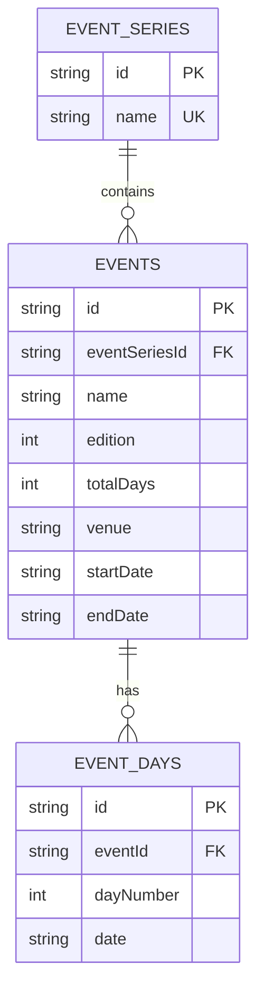

# Technical Design: イベント管理

## Overview

**Purpose**: イベント管理機能は、管理者がイベントシリーズ、個別イベント、開催日を効率的に管理するための機能を提供する。

**Users**: 管理者がイベント情報の登録・編集・削除を行う。

**Impact**: 新規機能として、3つのデータテーブル（event_series, events, event_days）、API エンドポイント群、管理画面を追加する。

### Goals
- イベントシリーズ → イベント → 開催日の階層構造でデータを管理
- イベント管理画面からシリーズのインライン作成を可能にする
- 開催日はイベント編集画面内で管理する（circleLinks パターン踏襲）
- 既存の管理画面パターンとの一貫性を維持

### Non-Goals
- 一般ユーザー向けのイベント公開ページ（将来対応）
- イベント参加申し込み機能
- カレンダー表示機能

## Architecture

### Architecture Pattern & Boundary Map

```mermaid
graph TB
    subgraph Frontend
        EventsPage[イベント管理ページ]
        EventDialog[イベント編集ダイアログ]
        EventDaysSection[開催日管理セクション]
    end

    subgraph API
        EventsRouter[/api/admin/events]
        EventSeriesRouter[/api/admin/event-series]
        EventDaysRouter[/api/admin/events/:id/days]
    end

    subgraph Database
        EventSeriesTable[(event_series)]
        EventsTable[(events)]
        EventDaysTable[(event_days)]
    end

    EventsPage --> EventsRouter
    EventDialog --> EventsRouter
    EventDialog --> EventSeriesRouter
    EventDaysSection --> EventDaysRouter

    EventsRouter --> EventsTable
    EventSeriesRouter --> EventSeriesTable
    EventDaysRouter --> EventDaysTable

    EventsTable --> EventSeriesTable
    EventDaysTable --> EventsTable
```

**Architecture Integration**:
- **Selected pattern**: Layered Architecture（既存パターン踏襲）
- **Domain boundaries**: イベント管理は独立したドメインとして分離
- **Existing patterns preserved**: circles + circleLinks パターンを events + eventDays に適用
- **New components rationale**: 新ドメインのため全コンポーネント新規作成
- **Steering compliance**: モノレポ構成、TypeScript strict mode、Drizzle ORM 使用

### Technology Stack

| Layer | Choice / Version | Role in Feature | Notes |
|-------|------------------|-----------------|-------|
| Frontend | React 19 + TanStack Start | イベント管理UI | 既存スタック |
| Backend | Hono | REST API | 既存スタック |
| Data | Drizzle ORM + SQLite | データ永続化 | 既存スタック |
| Validation | Zod | スキーマバリデーション | 既存スタック |
| ID Generation | nanoid | 一意ID生成 | 既存スタック |

## Requirements Traceability

| Requirement | Summary | Components | Interfaces | Flows |
|-------------|---------|------------|------------|-------|
| 1.1 | シリーズ一覧取得 | EventSeriesRouter | GET /api/admin/event-series | - |
| 1.2 | シリーズ作成 | EventSeriesRouter | POST /api/admin/event-series | - |
| 1.3-1.4 | シリーズ名重複チェック | EventSeriesRouter, insertEventSeriesSchema | API バリデーション | - |
| 1.5 | シリーズ削除制約 | event_series テーブル | onDelete: restrict | - |
| 2.1-2.5 | イベント一覧・検索・フィルタ | EventsPage, EventsRouter | GET /api/admin/events | - |
| 3.1-3.6 | イベント作成 | EventDialog, EventsRouter | POST /api/admin/events | イベント作成フロー |
| 4.1-4.5 | イベント編集 | EventDialog, EventsRouter | PUT /api/admin/events/:id | - |
| 5.1-5.5 | イベント削除 | EventsPage, EventsRouter | DELETE /api/admin/events/:id | - |
| 6.1-6.7 | 開催日管理 | EventDaysSection, EventDaysRouter | CRUD /api/admin/events/:id/days | - |
| 7.1-7.5 | バリデーション | Zod スキーマ群 | API バリデーション | - |

## Components and Interfaces

| Component | Domain/Layer | Intent | Req Coverage | Key Dependencies | Contracts |
|-----------|--------------|--------|--------------|------------------|-----------|
| event_series | Data | イベントシリーズテーブル | 1.1-1.5 | - | Schema |
| events | Data | イベントテーブル | 2-5 | event_series (P0) | Schema |
| event_days | Data | 開催日テーブル | 6.1-6.7 | events (P0) | Schema |
| EventSeriesRouter | API | シリーズAPI | 1.1-1.5 | db (P0) | API |
| EventsRouter | API | イベントAPI | 2-5 | db (P0), EventSeriesRouter (P1) | API |
| EventDaysRouter | API | 開催日API | 6.1-6.7 | db (P0), EventsRouter (P0) | API |
| EventsPage | UI | イベント一覧ページ | 2.1-2.5, 5.1-5.4 | eventsApi (P0) | State |
| EventDialog | UI | イベント編集ダイアログ | 3.1-3.6, 4.1-4.5, 6.1-6.7 | eventsApi, eventSeriesApi, eventDaysApi (P0) | State |

### Data Layer

#### event_series テーブル

| Field | Detail |
|-------|--------|
| Intent | イベントシリーズ（コミックマーケット等）を管理 |
| Requirements | 1.1, 1.2, 1.3, 1.4, 1.5 |

**Contracts**: Schema [x]

```typescript
// packages/db/src/schema/event.ts
interface EventSeriesSchema {
  id: string;              // text, PK, nanoid
  name: string;            // text, NOT NULL, UNIQUE (case-insensitive)
  createdAt: Date;         // integer (timestamp_ms)
  updatedAt: Date;         // integer (timestamp_ms)
}
```

#### events テーブル

| Field | Detail |
|-------|--------|
| Intent | 個別イベント（コミックマーケット108等）を管理 |
| Requirements | 2.1-2.5, 3.1-3.6, 4.1-4.5, 5.1-5.5 |

**Contracts**: Schema [x]

```typescript
interface EventSchema {
  id: string;              // text, PK, nanoid
  eventSeriesId: string;   // text, FK → event_series.id, ON DELETE RESTRICT
  name: string;            // text, NOT NULL
  edition: number | null;  // integer, 回次
  totalDays: number | null; // integer, 開催日数
  venue: string | null;    // text, 会場
  startDate: string | null; // text, YYYY-MM-DD
  endDate: string | null;   // text, YYYY-MM-DD
  createdAt: Date;
  updatedAt: Date;
}
// UNIQUE (eventSeriesId, edition)
```

#### event_days テーブル

| Field | Detail |
|-------|--------|
| Intent | イベント開催日（1日目、2日目等）を管理 |
| Requirements | 6.1, 6.2, 6.3, 6.4, 6.5, 6.6, 6.7 |

**Contracts**: Schema [x]

```typescript
interface EventDaySchema {
  id: string;           // text, PK, nanoid
  eventId: string;      // text, FK → events.id, ON DELETE CASCADE
  dayNumber: number;    // integer, NOT NULL
  date: string;         // text, NOT NULL, YYYY-MM-DD
  createdAt: Date;
  updatedAt: Date;
}
// UNIQUE (eventId, dayNumber)
// UNIQUE (eventId, date)
```

### API Layer

#### EventSeriesRouter

| Field | Detail |
|-------|--------|
| Intent | イベントシリーズの CRUD API を提供 |
| Requirements | 1.1, 1.2, 1.3, 1.4, 1.5 |

**Dependencies**:
- Inbound: EventsPage, EventDialog — シリーズ一覧・作成 (P0)
- External: @thac/db — データベースアクセス (P0)

**Contracts**: API [x]

| Method | Endpoint | Request | Response | Errors |
|--------|----------|---------|----------|--------|
| GET | /api/admin/event-series | `?search` | `{ data: EventSeries[], total }` | - |
| POST | /api/admin/event-series | `{ id, name }` | `EventSeries` | 400, 409 |
| DELETE | /api/admin/event-series/:id | - | `{ success: true }` | 404, 409 |

#### EventsRouter

| Field | Detail |
|-------|--------|
| Intent | イベントの CRUD API を提供 |
| Requirements | 2.1-2.5, 3.1-3.6, 4.1-4.5, 5.1-5.5 |

**Dependencies**:
- Inbound: EventsPage, EventDialog — イベント操作 (P0)
- External: @thac/db — データベースアクセス (P0)

**Contracts**: API [x]

| Method | Endpoint | Request | Response | Errors |
|--------|----------|---------|----------|--------|
| GET | /api/admin/events | `?page, limit, seriesId, search` | `{ data: EventWithSeries[], total, page, limit }` | - |
| GET | /api/admin/events/:id | - | `EventWithDays` | 404 |
| POST | /api/admin/events | `InsertEvent` | `Event` | 400, 409 |
| PUT | /api/admin/events/:id | `UpdateEvent` | `Event` | 400, 404, 409 |
| DELETE | /api/admin/events/:id | - | `{ success: true }` | 404 |

#### EventDaysRouter

| Field | Detail |
|-------|--------|
| Intent | イベント開催日の CRUD API を提供 |
| Requirements | 6.1, 6.2, 6.3, 6.4, 6.5, 6.6 |

**Dependencies**:
- Inbound: EventDialog — 開催日操作 (P0)
- External: @thac/db — データベースアクセス (P0)

**Contracts**: API [x]

| Method | Endpoint | Request | Response | Errors |
|--------|----------|---------|----------|--------|
| GET | /api/admin/events/:eventId/days | - | `EventDay[]` | 404 |
| POST | /api/admin/events/:eventId/days | `{ id, dayNumber, date }` | `EventDay` | 400, 404, 409 |
| PUT | /api/admin/events/:eventId/days/:dayId | `{ dayNumber?, date? }` | `EventDay` | 400, 404, 409 |
| DELETE | /api/admin/events/:eventId/days/:dayId | - | `{ success: true }` | 404 |

### UI Layer

#### EventsPage

| Field | Detail |
|-------|--------|
| Intent | イベント一覧表示・検索・フィルタ・削除 |
| Requirements | 2.1, 2.2, 2.3, 2.4, 2.5, 5.1, 5.2, 5.3, 5.4 |

**Dependencies**:
- Outbound: eventsApi — イベント操作 (P0)
- Outbound: eventSeriesApi — シリーズフィルタ (P1)
- External: AdminPageHeader, DataTableActionBar, DataTablePagination — 共通コンポーネント (P0)

**Contracts**: State [x]

```typescript
interface EventsPageState {
  page: number;
  pageSize: number;
  search: string;
  seriesFilter: string;
  editingEvent: EventWithDays | null;
  isCreateDialogOpen: boolean;
}
```

**Implementation Notes**:
- circles.tsx をベースにシリーズフィルタを追加
- 一覧には seriesName を JOIN で表示

#### EventDialog

| Field | Detail |
|-------|--------|
| Intent | イベント作成・編集・開催日管理を1ダイアログで実現 |
| Requirements | 3.1-3.6, 4.1-4.5, 6.1-6.7 |

**Dependencies**:
- Outbound: eventsApi, eventSeriesApi, eventDaysApi — API 操作 (P0)
- External: Dialog, Input, Select, Button — UI コンポーネント (P0)

**Contracts**: State [x]

```typescript
interface EventDialogState {
  form: Partial<Event>;
  days: EventDay[];
  isSubmitting: boolean;
  error: string | null;
}
```

**Implementation Notes**:
- シリーズ選択は SearchableSelect + 新規作成ボタン
- 開催日セクションは circleLinks パターンを踏襲
- 日付入力は `<input type="date">` を使用

## Data Models

### Domain Model



**Aggregates**:
- `EventSeries`: 独立したエンティティ、イベントが紐づいている場合は削除不可
- `Event`: event_days を含む集約ルート、削除時に開催日も CASCADE 削除
- `EventDay`: Event に従属するエンティティ

**Business Rules**:
- シリーズ名は大文字小文字無視で一意
- 同一シリーズ内で回次 (edition) は一意
- 同一イベント内で日番号 (dayNumber) は一意
- 同一イベント内で日付 (date) は一意

### Physical Data Model

**Indexes**:
- `idx_event_series_name`: 名前検索用
- `idx_events_event_series_id`: シリーズによるフィルタ用
- `idx_events_edition`: 回次検索用
- `idx_events_start_date`: 日付ソート用
- `idx_event_days_event_id`: イベントによる絞り込み用
- `idx_event_days_date`: 日付検索用

**Unique Constraints**:
- `uq_event_series_name_lower`: `lower(name)`
- `uq_events_series_edition`: `(eventSeriesId, edition)`
- `uq_event_days_event_day_number`: `(eventId, dayNumber)`
- `uq_event_days_event_date`: `(eventId, date)`

## Error Handling

### Error Categories and Responses

| Error | HTTP | Message | Handling |
|-------|------|---------|----------|
| バリデーションエラー | 400 | フィールド別エラー | フォームに表示 |
| 未認証 | 401 | Unauthorized | ログインにリダイレクト |
| 権限なし | 403 | Forbidden | エラーメッセージ表示 |
| 存在しない | 404 | Not found | エラーメッセージ表示 |
| 重複 | 409 | Already exists | フォームに表示 |
| サーバーエラー | 500 | Internal error | エラーメッセージ表示 |

## Testing Strategy

### Unit Tests
- `insertEventSeriesSchema` バリデーション
- `insertEventSchema` バリデーション
- `insertEventDaySchema` バリデーション（日付形式）
- 日付形式チェックロジック

### Integration Tests
- イベントシリーズ CRUD API
- イベント CRUD API（シリーズ JOIN 含む）
- 開催日 CRUD API（親イベント検証含む）
- シリーズ削除時の RESTRICT 制約
- イベント削除時の開催日 CASCADE 削除

### E2E Tests
- イベント一覧表示・ページネーション
- イベント作成（シリーズ新規作成含む）
- イベント編集・開催日追加
- イベント削除・確認ダイアログ
