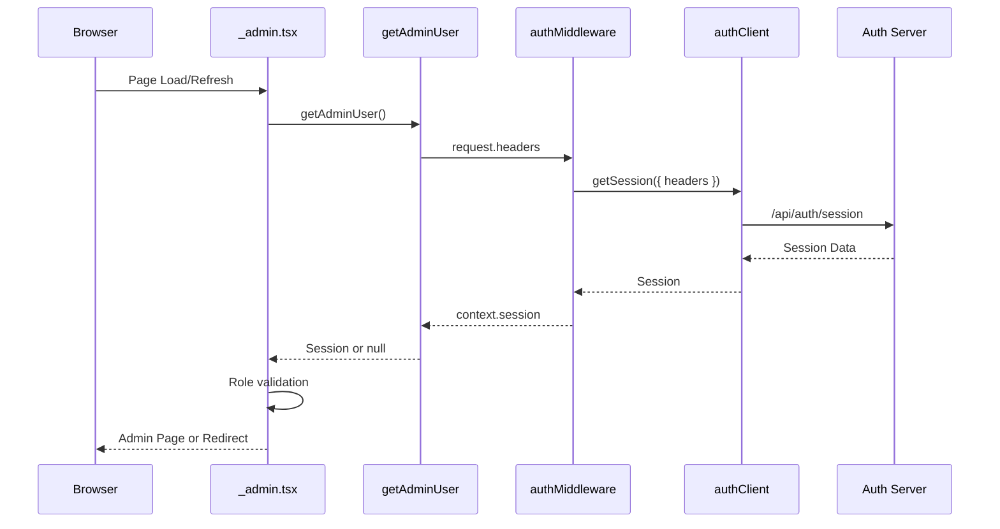

# Design Document: fix-admin-session-persistence

## Overview

**Purpose**: 管理画面でログイン後にページを更新するとログインページにリダイレクトされる問題を修正し、セッションの永続性を確保する。

**Users**: 管理者は、ページ更新後もログイン状態が維持され、管理タスクを中断なく継続できる。

**Impact**: 管理画面の認証ガード処理を変更し、SSR環境でCookieが正しく転送されるようにする。

### Goals
- 管理画面でのセッション永続化を実現する
- 既存の`dashboard.tsx`パターンとの一貫性を維持する
- 最小限の変更で問題を解決する

### Non-Goals
- 認証システム全体のリファクタリング
- `tanstackStartCookies`プラグインの導入（将来検討）
- 新しい認証フローの追加

## Architecture

### Existing Architecture Analysis

**現在のパターン（問題）**:
- `_admin.tsx`の`beforeLoad`で`authClient.getSession()`を直接呼び出し
- SSR環境でリクエストヘッダー（Cookie）が転送されない
- セッション取得に失敗し、ログインページへリダイレクト

**正常動作パターン（参照）**:
- `dashboard.tsx`はサーバー関数`getUser()`経由でセッション取得
- `authMiddleware`が`request.headers`を転送
- Cookieが正しく送信され、セッションが維持される

### Architecture Pattern & Boundary Map



**Architecture Integration**:
- Selected pattern: サーバー関数パターン（既存`getUser`と同一）
- Domain/feature boundaries: 認証処理は`middleware/auth.ts`に集約
- Existing patterns preserved: `authMiddleware`の再利用、`beforeLoad`での認可チェック
- New components rationale: `getAdminUser`はセッション取得専用、ロール検証は呼び出し側で実施
- Steering compliance: モジュラー設計、関心の分離を維持

### Technology Stack

| Layer | Choice / Version | Role in Feature | Notes |
|-------|------------------|-----------------|-------|
| Frontend | TanStack Start / TanStack Router | ルート`beforeLoad`でのセッション確認 | 既存 |
| Backend | Better-Auth | セッション管理 | 既存 |
| Middleware | `@tanstack/react-start` createMiddleware | ヘッダー転送 | 既存 |

## System Flows

### 管理画面アクセスフロー（修正後）

```mermaid
flowchart TD
    A[Browser: ページアクセス/更新] --> B[_admin.tsx: beforeLoad]
    B --> C[getAdminUser: サーバー関数呼び出し]
    C --> D[authMiddleware: headers転送]
    D --> E[authClient.getSession: Cookie付きリクエスト]
    E --> F{Session存在?}
    F -->|Yes| G[Session返却]
    F -->|No| H[null返却]
    G --> I{Role = admin?}
    H --> J[/admin/login へリダイレクト]
    I -->|Yes| K[管理画面表示]
    I -->|No| L[403 Forbidden表示]
```

**Key Decisions**:
- サーバー関数内では認証（セッション有無）のみ確認
- 認可（ロール検証）は`beforeLoad`で実施し、UIコンテキストと連携

## Requirements Traceability

| Requirement | Summary | Components | Interfaces | Flows |
|-------------|---------|------------|------------|-------|
| 1.1 | ページ更新時のセッション維持 | getAdminUser, _admin.tsx | getAdminUser関数 | 管理画面アクセスフロー |
| 1.2 | ナビゲーション時のセッション維持 | getAdminUser, _admin.tsx | getAdminUser関数 | 管理画面アクセスフロー |
| 1.3 | 有効セッション時のリダイレクト抑止 | _admin.tsx | beforeLoad | 管理画面アクセスフロー |
| 1.4 | 期限切れセッション時のリダイレクト | _admin.tsx | beforeLoad | 管理画面アクセスフロー |
| 2.1 | Cookie設定 | packages/auth | - | - |
| 2.2 | credentials: include | authMiddleware | fetchOptions | - |
| 2.3 | 開発環境Cookie設定 | packages/auth | - | - |
| 3.1 | サーバーサイドセッション確認 | getAdminUser, authMiddleware | getAdminUser関数 | 管理画面アクセスフロー |
| 3.2 | セッション確認エラーハンドリング | _admin.tsx | beforeLoad | - |
| 3.3 | 有効セッション時のコンテンツ表示 | _admin.tsx | beforeLoad | - |
| 4.1 | CORS credentials設定 | apps/server | - | - |
| 4.2 | オリジン別Cookie受入 | apps/server | - | - |
| 4.3 | プリフライト応答 | apps/server | - | - |

**Note**: 要件2.x、4.xは既に実装済み。本修正では要件1.x、3.xに対応。

## Components and Interfaces

| Component | Domain/Layer | Intent | Req Coverage | Key Dependencies | Contracts |
|-----------|--------------|--------|--------------|------------------|-----------|
| getAdminUser | Functions | 管理者セッション取得 | 1.1, 1.2, 3.1 | authMiddleware (P0) | Service |
| _admin.tsx | Routes | 認可・ルートガード | 1.3, 1.4, 3.2, 3.3 | getAdminUser (P0) | - |
| authMiddleware | Middleware | ヘッダー転送・セッション取得 | 3.1 | authClient (P0) | Service |

### Functions Layer

#### getAdminUser

| Field | Detail |
|-------|--------|
| Intent | サーバーサイドで管理者セッションを取得する |
| Requirements | 1.1, 1.2, 3.1 |

**Responsibilities & Constraints**
- リクエストヘッダーを転送してセッションを取得
- セッションが存在しない場合はnullを返却
- ロール検証は実施しない（呼び出し側の責務）

**Dependencies**
- Outbound: authMiddleware — セッション取得 (P0)

**Contracts**: Service [x]

##### Service Interface
```typescript
import { createServerFn } from "@tanstack/react-start";
import { authMiddleware } from "@/middleware/auth";

type AdminSession = {
  user: {
    id: string;
    email: string;
    name: string;
    role: string;
  };
  session: {
    id: string;
    expiresAt: Date;
  };
} | null;

export const getAdminUser: ServerFn<void, AdminSession> = createServerFn({ method: "GET" })
  .middleware([authMiddleware])
  .handler(async ({ context }) => {
    return context.session;
  });
```
- Preconditions: HTTPリクエストコンテキストが存在する
- Postconditions: セッションまたはnullを返却
- Invariants: 副作用なし（読み取り専用）

**Implementation Notes**
- Integration: 既存`getUser`と同一パターン
- Validation: `authMiddleware`内で`throw: true`により例外スロー
- Risks: 特になし（既存パターンの再利用）

### Routes Layer

#### _admin.tsx

| Field | Detail |
|-------|--------|
| Intent | 管理画面のレイアウトルートとして認可チェックを実施 |
| Requirements | 1.3, 1.4, 3.2, 3.3 |

**Responsibilities & Constraints**
- `beforeLoad`でサーバー関数を呼び出しセッション取得
- セッション不在時はログインページへリダイレクト
- ロールが`admin`でない場合は403ページを表示
- 子ルートにユーザー情報をコンテキストで伝播

**Dependencies**
- Outbound: getAdminUser — セッション取得 (P0)

**Contracts**: State [x]

##### State Management
```typescript
// beforeLoad戻り値の型
type AdminRouteContext = {
  user: {
    id: string;
    email: string;
    name: string;
    role: string;
  };
  isForbidden: boolean;
};
```
- State model: `beforeLoad`からコンテキストとして子ルートに伝播
- Persistence & consistency: リクエストごとに取得（永続化なし）
- Concurrency strategy: 該当なし（同期的処理）

**Implementation Notes**
- Integration: 既存の`isForbidden`フラグとUI連携を維持
- Validation: セッション存在チェック、ロール検証
- Risks: `getAdminUser`失敗時の例外ハンドリングが必要

## Error Handling

### Error Strategy
エラー発生時は適切なユーザー体験を提供しつつ、セキュリティを維持する。

### Error Categories and Responses

**User Errors (4xx)**:
- 未認証（セッションなし） → `/admin/login`へリダイレクト
- 権限不足（非管理者） → 403 Forbiddenページ表示

**System Errors (5xx)**:
- セッション取得失敗 → 例外をキャッチし、ログインページへリダイレクト
- ネットワークエラー → try-catchでハンドリング

### Monitoring
- 認証失敗ログの記録（既存のBetter-Authログ機能）
- リダイレクト回数の異常検知（将来検討）

## Testing Strategy

### Unit Tests
- `getAdminUser`: モックされた`authMiddleware`でセッション返却を検証
- `_admin.tsx` `beforeLoad`: 各条件分岐（認証済み/未認証/非管理者）の動作検証

### Integration Tests
- 認証済み管理者: ページ更新後もセッション維持
- 未認証ユーザー: ログインページへリダイレクト
- 非管理者ユーザー: 403ページ表示

### E2E Tests
- 管理者ログイン → ページ更新 → 管理画面維持
- 管理者ログイン → 別タブでログアウト → ページ更新 → ログインページ遷移

