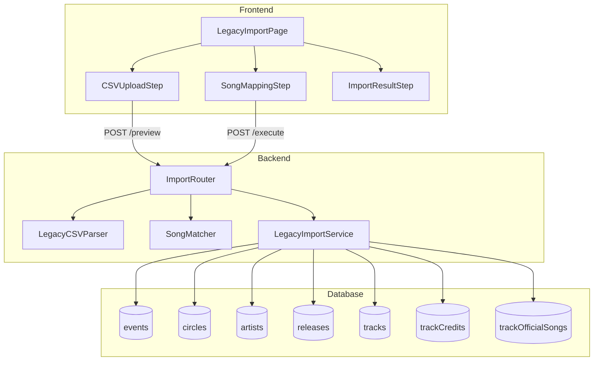

# Technical Design: レガシーCSVインポート機能

## Overview

**Purpose**: 旧東方編曲録システムで使用していたCSVファイルを現行管理システムにインポートし、既存のデータベーススキーマに変換・登録する機能を提供する。

**Users**: 管理者がレガシーデータの移行およびバルクデータ登録に使用する。

**Impact**: 7つのテーブル（events, circles, artists, releases, tracks, trackCredits, trackOfficialSongs）へのバルク登録機能を追加。eventSeriesIdのnullable化によるスキーマ変更を伴う。

### Goals

- レガシーCSVファイルをパースし、既存DBスキーマに変換して登録
- 3ステップウィザード形式で原曲マッピングの手動確認を可能に
- 複合サークル（「×」区切り）の自動分割と複数紐付け
- 依存関係順のトランザクション処理によるデータ整合性確保

### Non-Goals

- CSVフォーマットのカスタマイズ機能
- リアルタイム進捗表示（バッチ処理完了後に結果表示）
- 類似度スコアリングによる高度な原曲マッチング（将来拡張）
- 他フォーマット（Excel等）のサポート

---

## Architecture

### Existing Architecture Analysis

#### 現在のインポート機能

- **パーサー**: `apps/server/src/utils/import-parser.ts` — CSV/TSV/JSONパース、Zodバリデーション
- **インポートAPI**: `apps/server/src/routes/admin/master/import.ts` — マスタデータのトランザクション内upsert
- **インポートUI**: `apps/web/src/components/import-dialog.tsx` — シンプルなファイルアップロードダイアログ

#### 制約事項

- 既存パーサーは重複ヘッダー、コロン区切り複数値、「×」区切りサークル分割に未対応
- 既存UIは単一ステップのみ、マルチステップウィザード未対応
- `events.eventSeriesId`が`notNull`制約あり

### Architecture Pattern & Boundary Map



**Architecture Integration**:

- **Selected pattern**: レイヤードアーキテクチャ（既存パターン踏襲）
- **Domain boundaries**: インポート機能を独立モジュールとして分離
- **Existing patterns preserved**: Hono APIルート、TanStack Query、Zodバリデーション
- **New components rationale**: 特殊CSVフォーマットへの対応、3ステップワークフロー
- **Steering compliance**: ファイルベースルーティング、型安全性、Biomeフォーマット

### Technology Stack

| Layer | Choice / Version | Role in Feature | Notes |
|-------|------------------|-----------------|-------|
| Frontend | TanStack Start + TanStack Router | インポートウィザードページ | 既存パターン踏襲 |
| State Management | React useState + TanStack Query | ウィザード状態 + API連携 | ローカル状態とサーバー状態の分離 |
| UI Components | daisyUI + Tailwind CSS v4 | ウィザードUI、テーブル表示 | 既存コンポーネント活用 |
| Backend | Hono | インポートAPIエンドポイント | 既存ルーターパターン |
| Database | Drizzle ORM + SQLite | データ登録・クエリ | トランザクション処理 |
| Validation | Zod | リクエスト/レスポンスバリデーション | 既存パターン |
| Utilities | @thac/utils | detectInitial（頭文字判定） | 既存ユーティリティ |

---

## System Flows

### インポートワークフロー全体


### 原曲マッチングフロー


---

## Requirements Traceability

| Requirement | Summary | Components | Interfaces | Flows |
|-------------|---------|------------|------------|-------|
| 1.1 | CSVアップロードとプレビュー | CSVUploadStep, LegacyCSVParser | POST /preview | インポートワークフロー |
| 1.2 | 重複ヘッダースキップ | LegacyCSVParser | - | - |
| 1.3 | コロン区切り複数値パース | LegacyCSVParser | - | - |
| 1.4 | 「×」区切りサークル分割 | LegacyCSVParser | - | - |
| 1.5, 1.6 | CSVエラー処理 | LegacyCSVParser | ParseError | - |
| 2.1 | 完全一致自動マッピング | SongMatcher | - | 原曲マッチングフロー |
| 2.2 | 部分一致候補表示 | SongMatcher, SongMappingStep | SongMatchResult | 原曲マッチングフロー |
| 2.3 | オリジナル特殊処理 | SongMatcher | - | 原曲マッチングフロー |
| 2.4 | 手動選択/スキップ | SongMappingStep | - | - |
| 2.5 | マッピング進捗表示 | SongMappingStep | - | - |
| 2.6 | マッピング結果保持 | SongMappingStep | SongMappingState | - |
| 3.1-3.7 | エンティティ登録 | LegacyImportService | - | インポートワークフロー |
| 4.1-4.5 | リリース/トラック登録 | LegacyImportService | - | インポートワークフロー |
| 5.1-5.5 | クレジット/原曲紐付け | LegacyImportService | - | インポートワークフロー |
| 6.1-6.5 | 結果表示 | ImportResultStep | ImportResult | - |
| 7.1-7.4 | トランザクション管理 | LegacyImportService | - | インポートワークフロー |
| 8.1-8.5 | UI/ナビゲーション | LegacyImportPage, AdminSidebar | - | - |
| 9.1-9.3 | スキーマ変更 | events schema | - | - |

---

## Components and Interfaces

### Component Summary

| Component | Domain/Layer | Intent | Req Coverage | Key Dependencies | Contracts |
|-----------|--------------|--------|--------------|------------------|-----------|
| LegacyImportPage | UI/Route | インポートウィザードのコンテナ | 8.1-8.5 | CSVUploadStep, SongMappingStep, ImportResultStep (P0) | State |
| CSVUploadStep | UI/Component | CSVアップロードとプレビュー | 1.1-1.6 | ImportAPI (P0) | - |
| SongMappingStep | UI/Component | 原曲マッピングUI | 2.1-2.6 | - | State |
| ImportResultStep | UI/Component | 結果表示 | 6.1-6.5 | - | - |
| LegacyCSVParser | Server/Utils | レガシーCSV専用パーサー | 1.1-1.6 | - | Service |
| SongMatcher | Server/Utils | 原曲マッチングロジック | 2.1-2.4 | officialSongs table (P0) | Service |
| LegacyImportService | Server/Service | インポート実行サービス | 3-5, 7 | db (P0), detectInitial (P1) | Service |
| ImportRouter | Server/Route | インポートAPIエンドポイント | All | LegacyCSVParser, SongMatcher, LegacyImportService (P0) | API |

---

### Server Layer

#### LegacyCSVParser

| Field | Detail |
|-------|--------|
| Intent | レガシーCSVフォーマットのパースと正規化 |
| Requirements | 1.1, 1.2, 1.3, 1.4, 1.5, 1.6 |

**Responsibilities & Constraints**

- レガシーCSVの特殊フォーマット（重複ヘッダー、コロン区切り、×区切り）に対応
- パース結果を正規化された中間オブジェクトに変換
- エラー時は行番号と具体的なエラー内容を返却

**Dependencies**

- Inbound: ImportRouter — CSVコンテンツのパース依頼 (P0)
- Outbound: なし
- External: なし

**Contracts**: Service [x]

##### Service Interface

```typescript
interface LegacyCSVRecord {
  circle: string;
  album: string;
  title: string;
  vocalists: string[];
  arrangers: string[];
  lyricists: string[];
  originalSongs: string[];
  trackNumber: number;
  event: string;
}

interface ParseResult {
  success: boolean;
  records: LegacyCSVRecord[];
  errors: Array<{ row: number; message: string }>;
}

interface LegacyCSVParserService {
  parse(csvContent: string): ParseResult;
}
```

- Preconditions: csvContentがUTF-8エンコードされた文字列
- Postconditions: 正常時はrecordsが空でない配列、エラー時はerrorsに詳細
- Invariants: 重複ヘッダー行は自動スキップ

**Implementation Notes**

- Integration: 既存`import-parser.ts`の`parseCSVLine`関数を内部利用可能
- Validation: ヘッダー行の必須カラム検証を実施
- Risks: CSVエンコーディング（UTF-8以外）への未対応

---

#### SongMatcher

| Field | Detail |
|-------|--------|
| Intent | 原曲名と公式楽曲DBのマッチング |
| Requirements | 2.1, 2.2, 2.3, 2.4 |

**Responsibilities & Constraints**

- 段階的マッチング: 完全一致 → 部分一致
- 「オリジナル」の特殊処理
- 候補リストの生成とスコアリング

**Dependencies**

- Inbound: ImportRouter — 原曲名のマッチング依頼 (P0)
- Outbound: officialSongs table — 公式楽曲検索 (P0)
- External: なし

**Contracts**: Service [x]

##### Service Interface

```typescript
interface SongCandidate {
  id: string;
  name: string;
  nameJa: string;
  officialWorkName: string;
  matchType: "exact" | "partial" | "none";
}

interface SongMatchResult {
  originalName: string;
  isOriginal: boolean;
  candidates: SongCandidate[];
  autoMatched: boolean;
  selectedId: string | null;
}

interface SongMatcherService {
  matchSongs(originalNames: string[]): Promise<SongMatchResult[]>;
}
```

- Preconditions: originalNamesが空でない配列
- Postconditions: 各原曲名に対応するSongMatchResultを返却
- Invariants: 「オリジナル」は常にautoMatched=true

**Implementation Notes**

- Integration: Drizzle ORMのLIKE演算子を使用
- Validation: 空文字列の原曲名はスキップ
- Risks: 大量の部分一致候補時のパフォーマンス（LIMITで制御）

---

#### LegacyImportService

| Field | Detail |
|-------|--------|
| Intent | インポートデータのDB登録 |
| Requirements | 3.1-3.7, 4.1-4.5, 5.1-5.5, 7.1-7.4 |

**Responsibilities & Constraints**

- 依存関係順でのupsert処理
- トランザクション管理
- 頭文字自動判定（detectInitial使用）
- 複合サークルのreleaseCircles複数紐付け

**Dependencies**

- Inbound: ImportRouter — インポート実行依頼 (P0)
- Outbound: db — 全対象テーブルへのupsert (P0)
- External: @thac/utils — detectInitial (P1)

**Contracts**: Service [x]

##### Service Interface

```typescript
interface ImportInput {
  records: LegacyCSVRecord[];
  songMappings: Map<string, string>; // originalName -> officialSongId
}

interface EntityCount {
  created: number;
  updated: number;
  skipped: number;
}

interface ImportResult {
  success: boolean;
  events: EntityCount;
  circles: EntityCount;
  artists: EntityCount;
  releases: EntityCount;
  tracks: EntityCount;
  credits: EntityCount;
  officialSongLinks: EntityCount;
  errors: Array<{ row: number; entity: string; message: string }>;
}

interface LegacyImportServiceInterface {
  execute(input: ImportInput): Promise<ImportResult>;
}
```

- Preconditions: recordsとsongMappingsが有効
- Postconditions: 成功時はsuccess=true、各エンティティのカウントを返却
- Invariants: トランザクション内で処理、致命的エラー時はロールバック

**Implementation Notes**

- Integration: Drizzle ORMのonConflictDoUpdateパターン使用
- Validation: 外部キー制約は依存順序で自然に満たされる
- Risks: 大量データ時のトランザクションタイムアウト（バッチ分割を検討）

---

#### ImportRouter

| Field | Detail |
|-------|--------|
| Intent | インポートAPIエンドポイント |
| Requirements | All |

**Responsibilities & Constraints**

- ファイルアップロードの受付
- プレビュー/実行の2エンドポイント
- 管理者認証の適用

**Dependencies**

- Inbound: Frontend — APIリクエスト (P0)
- Outbound: LegacyCSVParser, SongMatcher, LegacyImportService (P0)
- External: adminAuthMiddleware (P0)

**Contracts**: API [x]

##### API Contract

| Method | Endpoint | Request | Response | Errors |
|--------|----------|---------|----------|--------|
| POST | /api/admin/import/legacy/preview | multipart/form-data (file) | PreviewResponse | 400, 401, 500 |
| POST | /api/admin/import/legacy/execute | ExecuteRequest (JSON) | ImportResult | 400, 401, 500 |

**PreviewResponse**

```typescript
interface PreviewResponse {
  success: boolean;
  recordCount: number;
  records: LegacyCSVRecord[];
  songMatches: SongMatchResult[];
  parseErrors: Array<{ row: number; message: string }>;
}
```

**ExecuteRequest**

```typescript
interface ExecuteRequest {
  records: LegacyCSVRecord[];
  songMappings: Record<string, string>; // originalName -> officialSongId
}
```

**Implementation Notes**

- Integration: 既存`routes/admin/index.ts`にimportRouterを追加
- Validation: Zodスキーマで入力バリデーション
- Risks: ファイルサイズ制限の設定が必要

---

### UI Layer

#### LegacyImportPage

| Field | Detail |
|-------|--------|
| Intent | インポートウィザードのコンテナ |
| Requirements | 8.1-8.5 |

**Responsibilities & Constraints**

- 3ステップウィザードの状態管理
- 各ステップコンポーネントのレンダリング
- ステップ間のデータ受け渡し

**Dependencies**

- Inbound: TanStack Router — ルーティング (P0)
- Outbound: CSVUploadStep, SongMappingStep, ImportResultStep (P0)
- External: なし

**Contracts**: State [x]

##### State Management

```typescript
type ImportStep = "upload" | "mapping" | "result";

interface ImportWizardState {
  currentStep: ImportStep;
  previewData: PreviewResponse | null;
  songMappings: Map<string, string>;
  importResult: ImportResult | null;
}
```

- State model: Reactのローカルstate（useState）
- Persistence: セッション内のみ保持
- Concurrency: 単一ユーザー操作、競合なし

**Implementation Notes**

- Integration: `apps/web/src/routes/admin/_admin/import/legacy.tsx`に配置
- Validation: ステップ遷移時の状態チェック
- Risks: ブラウザリロードで状態消失（意図的な仕様）

---

#### CSVUploadStep

| Field | Detail |
|-------|--------|
| Intent | CSVファイルアップロードとプレビュー表示 |
| Requirements | 1.1-1.6 |

**Implementation Notes**

- 既存`import-dialog.tsx`のファイル選択パターンを参考
- プレビューテーブルは既存Tableコンポーネント使用
- エラー表示は行番号と具体的メッセージ

---

#### SongMappingStep

| Field | Detail |
|-------|--------|
| Intent | 原曲マッピングの確認・修正UI |
| Requirements | 2.1-2.6 |

**Implementation Notes**

- マッピング状況のサマリー表示（未完了数/完了数）
- 候補リストはドロップダウンまたは検索可能なセレクト
- 「スキップ」オプションでマッピングなしを許容

---

#### ImportResultStep

| Field | Detail |
|-------|--------|
| Intent | インポート結果の表示 |
| Requirements | 6.1-6.5 |

**Implementation Notes**

- エンティティ別のカウント表示（作成/更新/スキップ）
- エラー詳細のアコーディオン表示
- 関連管理画面へのリンク提供

---

## Data Models

### Domain Model


**Aggregates**:

- **Release Aggregate**: Release, ReleaseCircles, Tracks, TrackCredits, TrackCreditRoles, TrackOfficialSongs
- **Event Aggregate**: Event, EventDays

**Business Rules**:

- 複合サークルは「×」で分割し、各サークルをreleaseCirclesで紐付け
- 同一リリース内のtrackNumberは一意
- eventSeriesIdはnullable（シリーズ不明時）

### Physical Data Model

#### Schema Changes

**events table** (変更)

```sql
-- Before
event_series_id TEXT NOT NULL REFERENCES event_series(id)

-- After
event_series_id TEXT REFERENCES event_series(id)
```

**Validation Schema Changes**

```typescript
// Before
eventSeriesId: nonEmptyString,

// After
eventSeriesId: z.string().trim().optional().nullable(),
```

---

## Error Handling

### Error Categories and Responses

**User Errors (4xx)**:

- `400 Bad Request`: CSVフォーマット不正、必須カラム欠落
- `401 Unauthorized`: 管理者認証失敗

**System Errors (5xx)**:

- `500 Internal Server Error`: DB接続エラー、トランザクション失敗

**Business Logic Errors (422)**:

- パースエラー: 行番号と具体的メッセージを返却
- マッチングエラー: 候補なしの原曲は手動選択/スキップで対応
- 登録エラー: 該当行をスキップし、他の行は処理続行

### Monitoring

- エラー発生時のログ出力（行番号、エンティティ種別、エラー内容）
- インポート完了時のサマリーログ

---

## Testing Strategy

### Unit Tests

- `LegacyCSVParser.parse`: 正常CSV、重複ヘッダー、コロン区切り、×区切り
- `SongMatcher.matchSongs`: 完全一致、部分一致、オリジナル、マッチなし
- `splitCircles`: 「×」区切りの分割ロジック
- `parseEventName`: イベント名のパース（シリーズ名+回数）

### Integration Tests

- `/api/admin/import/legacy/preview`: ファイルアップロード→パース→マッチング
- `/api/admin/import/legacy/execute`: 全テーブルへのupsert
- トランザクションロールバック: 途中エラー時の整合性

### E2E Tests

- 3ステップウィザードの完走
- 原曲マッピングの手動選択
- エラー表示と再試行

---

## Migration Strategy

### Phase 1: スキーマ変更

1. `packages/db/src/schema/event.ts`の`.notNull()`削除
2. `packages/db/src/schema/event.validation.ts`の修正
3. `make db-generate && make db-migrate`

### Phase 2: 機能リリース

1. サーバー側コンポーネントのデプロイ
2. フロントエンドのデプロイ
3. サイドバーへのナビゲーション追加

### Rollback

- スキーマ変更は後方互換（nullableへの変更）のためロールバック不要
- 機能削除時はナビゲーションとルートを削除
