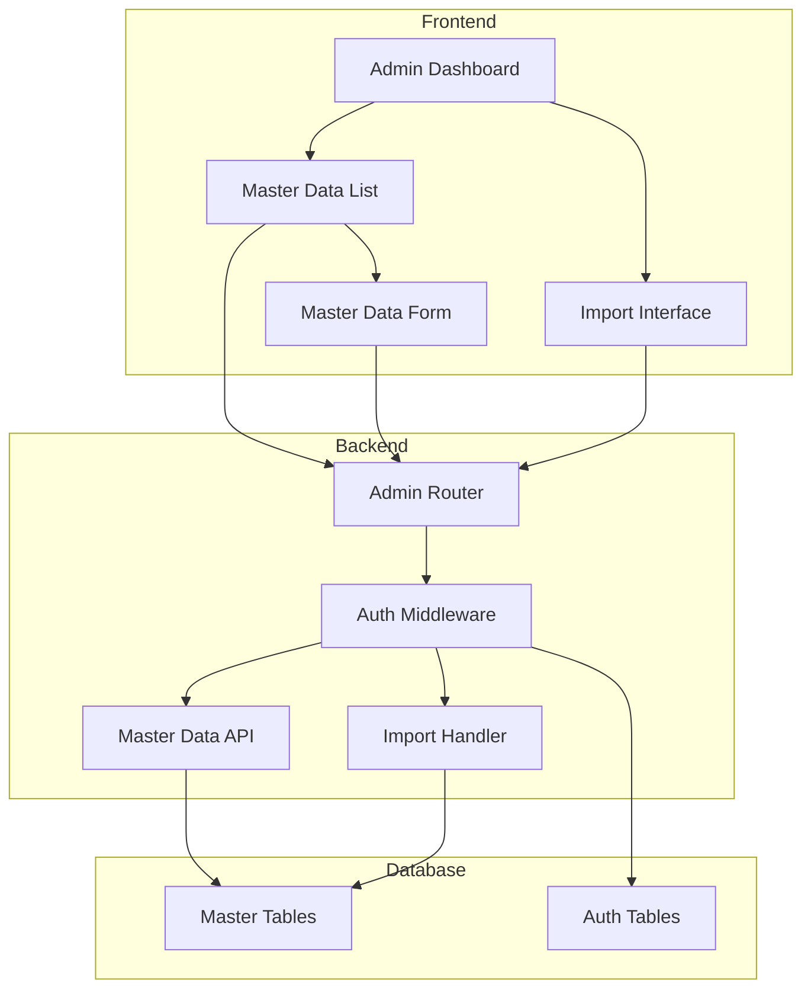
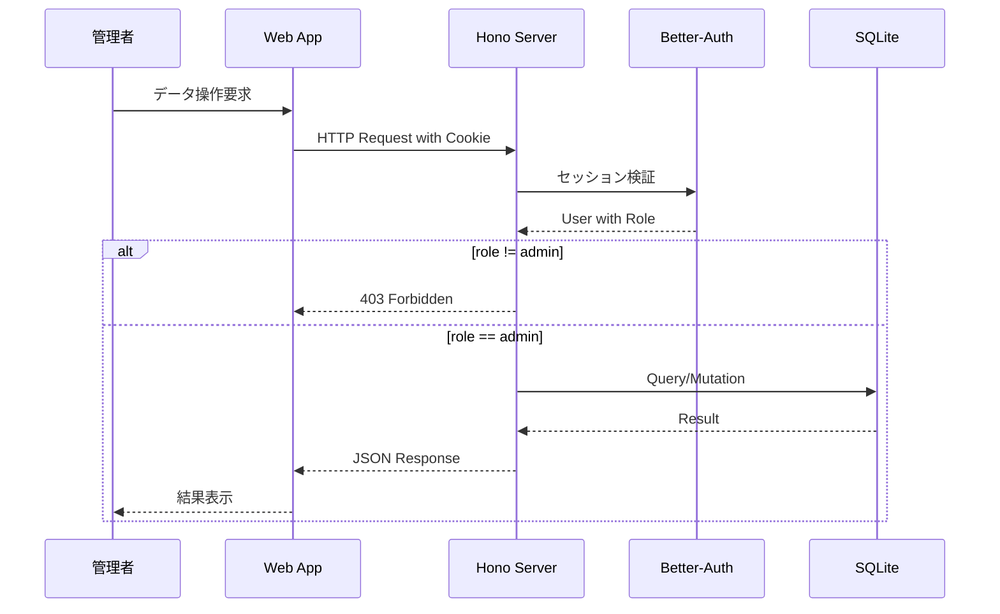
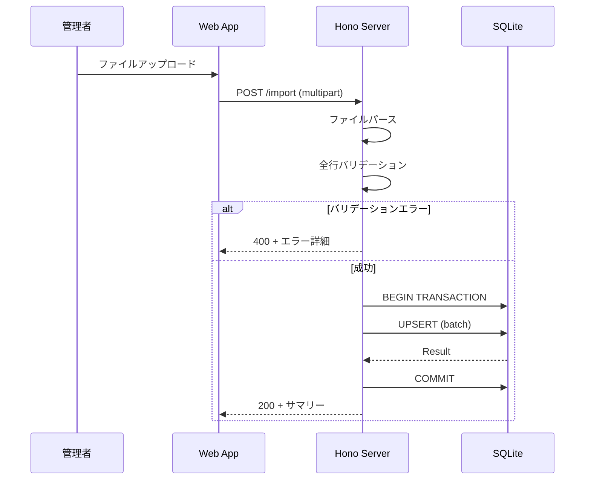

# Technical Design Document

## Overview

**Purpose**: 東方Project関連コンテンツ管理システムにおいて、プラットフォーム、アーティスト別名義種別、クレジット役割、公式作品カテゴリの4種類のマスタデータを管理する機能を提供する。

**Users**: システム管理者が管理画面からマスタデータのCRUD操作および一括インポートを行う。

**Impact**: 既存の認証システムとフロントエンド管理画面を拡張し、新規データベーステーブルとAPIエンドポイントを追加する。

### Goals
- 4種類のマスタテーブル（platforms, alias_types, credit_roles, official_work_categories）のスキーマ定義
- 管理者専用RESTful APIによるCRUD操作の提供
- CSV/JSONファイルからの一括インポート機能
- 直感的な管理画面UIの提供

### Non-Goals
- 一般ユーザー向けのマスタデータ参照API（本機能は管理者専用）
- マスタデータのバージョン管理・履歴追跡
- リアルタイム同期・通知機能
- マスタデータ間の複雑なリレーション管理

## Architecture

### Existing Architecture Analysis

**Current Patterns**:
- Drizzle ORMスキーマ: `packages/db/src/schema/`配下でテーブル定義
- Honoサーバー: `apps/server/src/index.ts`でルート定義
- Better-Auth: admin pluginでロールベースアクセス制御
- TanStack Router: `apps/web/src/routes/admin/_admin/`配下で管理画面

**Integration Points**:
- `@thac/db`パッケージ: 新規スキーマ追加とエクスポート
- `apps/server`: 管理者APIルート追加
- `apps/web`: 管理画面ルート追加

### Architecture Pattern & Boundary Map



**Architecture Integration**:
- Selected pattern: Layered Architecture（既存パターン踏襲）
- Domain boundaries: Database Package（スキーマ）、Server（API）、Web（UI）の3層分離
- Existing patterns preserved: Drizzleスキーマパターン、Honoルーティング、TanStack Router
- New components rationale: マスタデータ固有のスキーマ・API・UIを追加
- Steering compliance: モノレポ構成、TypeScript strict mode、Biomeフォーマット

### Technology Stack

| Layer | Choice / Version | Role in Feature | Notes |
|-------|------------------|-----------------|-------|
| Frontend | TanStack Router + TanStack Query | 管理画面ルーティング・データフェッチ | 既存パターン踏襲 |
| UI Components | shadcn/ui + TailwindCSS v4 | テーブル・フォーム・ダイアログ | 既存コンポーネント活用 |
| Backend | Hono | RESTful API | ルートグルーピングで構造化 |
| Validation | Zod | リクエスト・レスポンス検証 | Drizzle-zodで型生成 |
| ORM | Drizzle ORM | スキーマ定義・クエリビルド | SQLite/libsql |
| Database | SQLite (Turso) | データ永続化 | 既存インフラ |

## System Flows

### CRUD操作フロー



### 一括インポートフロー



## Requirements Traceability

| Requirement | Summary | Components | Interfaces | Flows |
|-------------|---------|------------|------------|-------|
| 1.1-1.4 | スキーマ定義 | MasterSchema | - | - |
| 1.5 | Zodスキーマ | MasterSchema, MasterValidation | ValidationSchemas | - |
| 1.6-1.7 | 初期データ | MasterMigration | - | - |
| 2.1-2.9 | CRUD API | MasterAPI | REST Endpoints | CRUD Flow |
| 3.1-3.5 | 認証・認可 | AuthMiddleware | SessionCheck | Auth Flow |
| 4.1-4.6 | インポート | ImportHandler | Import Endpoint | Import Flow |
| 5.1-5.9 | 管理画面UI | AdminUI, MasterList, MasterForm | React Components | - |
| 6.1-6.6 | バリデーション | MasterValidation | Zod Schemas | - |

## Components and Interfaces

| Component | Domain/Layer | Intent | Req Coverage | Key Dependencies | Contracts |
|-----------|--------------|--------|--------------|------------------|-----------|
| MasterSchema | Database | マスタテーブル定義 | 1.1-1.7 | drizzle-orm (P0) | Schema |
| MasterValidation | Database | Zodバリデーション | 1.5, 6.1-6.6 | zod (P0), drizzle-zod (P1) | Validation |
| AuthMiddleware | Backend | 認証・認可検証 | 3.1-3.5 | better-auth (P0) | Middleware |
| MasterAPI | Backend | CRUD エンドポイント | 2.1-2.9 | hono (P0), @thac/db (P0) | API |
| ImportHandler | Backend | インポート処理 | 4.1-4.6 | hono (P0), @thac/db (P0) | API |
| AdminUI | Frontend | 管理ダッシュボード | 5.1-5.2 | react (P0) | State |
| MasterList | Frontend | 一覧表示 | 5.3 | @tanstack/react-query (P0) | State |
| MasterForm | Frontend | 作成・編集フォーム | 5.4-5.6 | react-hook-form (P1) | State |
| ImportUI | Frontend | インポートUI | 5.7 | - | State |

### Database Layer

#### MasterSchema

| Field | Detail |
|-------|--------|
| Intent | 4種類のマスタテーブルのDrizzle ORMスキーマ定義 |
| Requirements | 1.1, 1.2, 1.3, 1.4, 6.1, 6.2 |

**Responsibilities & Constraints**
- platforms, alias_types, credit_roles, official_work_categoriesテーブル定義
- 既存auth.tsパターンに準拠したスキーマ構造
- 全テーブルでcodeを主キーとして使用

**Dependencies**
- External: drizzle-orm/sqlite-core — テーブル定義DSL (P0)

**Contracts**: Schema [x]

##### Schema Definition

```typescript
// packages/db/src/schema/master.ts

import { sql } from "drizzle-orm";
import { index, integer, sqliteTable, text } from "drizzle-orm/sqlite-core";

export const platforms = sqliteTable(
  "platforms",
  {
    code: text("code").primaryKey(),
    name: text("name").notNull(),
    category: text("category"),
    urlPattern: text("url_pattern"),
    createdAt: integer("created_at", { mode: "timestamp_ms" })
      .default(sql`(cast(unixepoch('subsecond') * 1000 as integer))`)
      .notNull(),
    updatedAt: integer("updated_at", { mode: "timestamp_ms" })
      .default(sql`(cast(unixepoch('subsecond') * 1000 as integer))`)
      .$onUpdate(() => new Date())
      .notNull(),
  },
  (table) => [index("idx_platforms_category").on(table.category)]
);

export const aliasTypes = sqliteTable("alias_types", {
  code: text("code").primaryKey(),
  label: text("label").notNull(),
  description: text("description"),
});

export const creditRoles = sqliteTable("credit_roles", {
  code: text("code").primaryKey(),
  label: text("label").notNull(),
  description: text("description"),
});

export const officialWorkCategories = sqliteTable("official_work_categories", {
  code: text("code").primaryKey(),
  name: text("name").notNull(),
  description: text("description"),
});
```

#### MasterValidation

| Field | Detail |
|-------|--------|
| Intent | 各マスタテーブルのZodバリデーションスキーマ |
| Requirements | 1.5, 6.3, 6.4, 6.5, 6.6 |

**Responsibilities & Constraints**
- 作成・更新リクエストのバリデーション
- 空文字列の拒否、空白トリミング
- url_patternの正規表現検証

**Dependencies**
- External: zod — バリデーションライブラリ (P0)
- External: drizzle-zod — Drizzleスキーマからの型生成 (P1)

**Contracts**: Validation [x]

##### Validation Schemas

```typescript
// packages/db/src/schema/master.validation.ts

import { createInsertSchema, createSelectSchema } from "drizzle-zod";
import { z } from "zod";
import { platforms, aliasTypes, creditRoles, officialWorkCategories } from "./master";

// Helper: 空文字列を拒否するスキーマ
const nonEmptyString = z.string().trim().min(1, "必須項目です");

// Helper: 正規表現として有効か検証
const validRegex = z.string().refine(
  (val) => {
    if (!val) return true;
    try {
      new RegExp(val);
      return true;
    } catch {
      return false;
    }
  },
  { message: "有効な正規表現ではありません" }
);

// Platforms
export const insertPlatformSchema = createInsertSchema(platforms, {
  code: nonEmptyString,
  name: nonEmptyString,
  urlPattern: validRegex.optional(),
}).omit({ createdAt: true, updatedAt: true });

export const updatePlatformSchema = insertPlatformSchema.partial().omit({ code: true });

export const selectPlatformSchema = createSelectSchema(platforms);

// AliasTypes
export const insertAliasTypeSchema = createInsertSchema(aliasTypes, {
  code: nonEmptyString,
  label: nonEmptyString,
});

export const updateAliasTypeSchema = insertAliasTypeSchema.partial().omit({ code: true });

export const selectAliasTypeSchema = createSelectSchema(aliasTypes);

// CreditRoles
export const insertCreditRoleSchema = createInsertSchema(creditRoles, {
  code: nonEmptyString,
  label: nonEmptyString,
});

export const updateCreditRoleSchema = insertCreditRoleSchema.partial().omit({ code: true });

export const selectCreditRoleSchema = createSelectSchema(creditRoles);

// OfficialWorkCategories
export const insertOfficialWorkCategorySchema = createInsertSchema(officialWorkCategories, {
  code: nonEmptyString,
  name: nonEmptyString,
});

export const updateOfficialWorkCategorySchema = insertOfficialWorkCategorySchema.partial().omit({ code: true });

export const selectOfficialWorkCategorySchema = createSelectSchema(officialWorkCategories);
```

### Backend Layer

#### AuthMiddleware

| Field | Detail |
|-------|--------|
| Intent | 管理者APIへのアクセス制御ミドルウェア |
| Requirements | 3.1, 3.2, 3.3, 3.4, 3.5 |

**Responsibilities & Constraints**
- Better-Authセッション検証
- adminロール検証
- 401/403レスポンス返却

**Dependencies**
- Inbound: MasterAPI — 認証検証 (P0)
- External: @thac/auth — セッション管理 (P0)

**Contracts**: Middleware [x]

##### Middleware Interface

```typescript
// apps/server/src/middleware/admin-auth.ts

import type { Context, Next } from "hono";
import { auth } from "@thac/auth";

export async function adminAuthMiddleware(c: Context, next: Next) {
  const session = await auth.api.getSession({
    headers: c.req.raw.headers,
  });

  if (!session?.user) {
    return c.json({ error: "Unauthorized" }, 401);
  }

  if (session.user.role !== "admin") {
    return c.json({ error: "Forbidden" }, 403);
  }

  c.set("user", session.user);
  return next();
}
```

#### MasterAPI

| Field | Detail |
|-------|--------|
| Intent | マスタデータCRUDエンドポイント |
| Requirements | 2.1, 2.2, 2.3, 2.4, 2.5, 2.6, 2.7, 2.8, 2.9 |

**Responsibilities & Constraints**
- 各マスタテーブルのCRUD操作
- ページネーション（platforms）
- バリデーションエラーハンドリング

**Dependencies**
- Inbound: AdminUI — HTTP リクエスト (P0)
- Outbound: MasterSchema — データベース操作 (P0)
- External: hono — ルーティング (P0)

**Contracts**: API [x]

##### API Contract

| Method | Endpoint | Request | Response | Errors |
|--------|----------|---------|----------|--------|
| GET | /api/admin/master/platforms | ?page, ?limit, ?category | PlatformList | 401, 403 |
| GET | /api/admin/master/platforms/:code | - | Platform | 401, 403, 404 |
| POST | /api/admin/master/platforms | CreatePlatformRequest | Platform | 400, 401, 403, 409 |
| PUT | /api/admin/master/platforms/:code | UpdatePlatformRequest | Platform | 400, 401, 403, 404 |
| DELETE | /api/admin/master/platforms/:code | - | { success: true } | 401, 403, 404 |
| GET | /api/admin/master/alias-types | - | AliasTypeList | 401, 403 |
| GET | /api/admin/master/alias-types/:code | - | AliasType | 401, 403, 404 |
| POST | /api/admin/master/alias-types | CreateAliasTypeRequest | AliasType | 400, 401, 403, 409 |
| PUT | /api/admin/master/alias-types/:code | UpdateAliasTypeRequest | AliasType | 400, 401, 403, 404 |
| DELETE | /api/admin/master/alias-types/:code | - | { success: true } | 401, 403, 404 |
| GET | /api/admin/master/credit-roles | - | CreditRoleList | 401, 403 |
| GET | /api/admin/master/credit-roles/:code | - | CreditRole | 401, 403, 404 |
| POST | /api/admin/master/credit-roles | CreateCreditRoleRequest | CreditRole | 400, 401, 403, 409 |
| PUT | /api/admin/master/credit-roles/:code | UpdateCreditRoleRequest | CreditRole | 400, 401, 403, 404 |
| DELETE | /api/admin/master/credit-roles/:code | - | { success: true } | 401, 403, 404 |
| GET | /api/admin/master/official-work-categories | - | OfficialWorkCategoryList | 401, 403 |
| GET | /api/admin/master/official-work-categories/:code | - | OfficialWorkCategory | 401, 403, 404 |
| POST | /api/admin/master/official-work-categories | CreateOfficialWorkCategoryRequest | OfficialWorkCategory | 400, 401, 403, 409 |
| PUT | /api/admin/master/official-work-categories/:code | UpdateOfficialWorkCategoryRequest | OfficialWorkCategory | 400, 401, 403, 404 |
| DELETE | /api/admin/master/official-work-categories/:code | - | { success: true } | 401, 403, 404 |

##### Response Types

```typescript
// 共通レスポンス型
interface ListResponse<T> {
  data: T[];
  total: number;
  page?: number;
  limit?: number;
}

interface ErrorResponse {
  error: string;
  details?: Record<string, string[]>;
}
```

#### ImportHandler

| Field | Detail |
|-------|--------|
| Intent | CSV/JSONファイルからの一括インポート処理 |
| Requirements | 4.1, 4.2, 4.3, 4.4, 4.5, 4.6 |

**Responsibilities & Constraints**
- CSV/JSONパース
- 全行バリデーション（失敗時は全体拒否）
- トランザクションによるatomic操作
- Upsertモードサポート

**Dependencies**
- Inbound: ImportUI — ファイルアップロード (P0)
- Outbound: MasterSchema — データベース操作 (P0)
- External: hono — multipart処理 (P0)

**Contracts**: API [x]

##### API Contract

| Method | Endpoint | Request | Response | Errors |
|--------|----------|---------|----------|--------|
| POST | /api/admin/master/platforms/import | multipart (file) | ImportResult | 400, 401, 403 |
| POST | /api/admin/master/alias-types/import | multipart (file) | ImportResult | 400, 401, 403 |
| POST | /api/admin/master/credit-roles/import | multipart (file) | ImportResult | 400, 401, 403 |
| POST | /api/admin/master/official-work-categories/import | multipart (file) | ImportResult | 400, 401, 403 |

##### Import Response Types

```typescript
interface ImportResult {
  success: true;
  created: number;
  updated: number;
  total: number;
}

interface ImportError {
  error: string;
  rows: {
    row: number;
    errors: string[];
  }[];
}
```

### Frontend Layer

#### AdminUI

| Field | Detail |
|-------|--------|
| Intent | マスタデータ管理ダッシュボードのレイアウト |
| Requirements | 5.1, 5.2 |

**Implementation Notes**
- 既存`_admin.tsx`レイアウトを拡張
- サイドナビゲーションに4種類のマスタテーブルリンク追加
- `/admin/_admin/master/`配下にルート構成

#### MasterList

| Field | Detail |
|-------|--------|
| Intent | マスタデータ一覧表示コンポーネント |
| Requirements | 5.3, 5.8, 5.9 |

**Responsibilities & Constraints**
- TanStack Queryによるデータフェッチ
- ソート・フィルタリング機能
- ローディング・エラー表示

**Dependencies**
- Outbound: MasterAPI — データ取得 (P0)
- External: @tanstack/react-query (P0)
- External: @tanstack/react-table (P1)

**Contracts**: State [x]

##### State Management

```typescript
// TanStack Query hooks
function usePlatforms(options?: { page?: number; limit?: number; category?: string }) {
  return useQuery({
    queryKey: ["platforms", options],
    queryFn: () => fetchPlatforms(options),
  });
}

function useAliasTypes() {
  return useQuery({
    queryKey: ["aliasTypes"],
    queryFn: fetchAliasTypes,
  });
}

// 同様にcreditRoles, officialWorkCategories
```

#### MasterForm

| Field | Detail |
|-------|--------|
| Intent | マスタデータ作成・編集フォーム |
| Requirements | 5.4, 5.5, 5.6, 5.8 |

**Responsibilities & Constraints**
- 新規作成・編集の両モード対応
- Zodスキーマによるクライアントサイドバリデーション
- 削除確認ダイアログ

**Dependencies**
- Outbound: MasterAPI — データ操作 (P0)
- External: react-hook-form (P1)
- External: @hookform/resolvers/zod (P1)

**Contracts**: State [x]

#### ImportUI

| Field | Detail |
|-------|--------|
| Intent | ファイルインポートインターフェース |
| Requirements | 5.7, 5.8, 5.9 |

**Responsibilities & Constraints**
- CSV/JSONファイル選択
- インポート結果・エラー表示
- プログレス表示

**Dependencies**
- Outbound: ImportHandler — ファイルアップロード (P0)

**Contracts**: State [x]

## Data Models

### Domain Model

**Aggregates**:
- Platform: 公開/配信/販売プラットフォーム（code主キー）
- AliasType: アーティスト別名義種別（code主キー）
- CreditRole: クレジット役割（code主キー）
- OfficialWorkCategory: 公式作品カテゴリ（code主キー）

**Business Rules**:
- 全マスタテーブルのcodeは主キーかつ不変
- url_patternは有効な正規表現であること

### Physical Data Model

#### platforms

| Column | Type | Constraints | Notes |
|--------|------|-------------|-------|
| code | TEXT | PRIMARY KEY | 例: youtube, spotify |
| name | TEXT | NOT NULL | 表示名 |
| category | TEXT | - | video, audio, store等 |
| url_pattern | TEXT | - | URL検証用正規表現 |
| created_at | INTEGER | NOT NULL, DEFAULT | timestamp_ms |
| updated_at | INTEGER | NOT NULL, DEFAULT | timestamp_ms |

**Index**: `idx_platforms_category` ON (category)

#### alias_types

| Column | Type | Constraints | Notes |
|--------|------|-------------|-------|
| code | TEXT | PRIMARY KEY | romanization, pseudonym等 |
| label | TEXT | NOT NULL | 表示ラベル |
| description | TEXT | - | 説明 |

**Initial Data**:
- romanization: ローマ字表記
- pseudonym: 別名義

#### credit_roles

| Column | Type | Constraints | Notes |
|--------|------|-------------|-------|
| code | TEXT | PRIMARY KEY | vocalist, arranger等 |
| label | TEXT | NOT NULL | 表示ラベル |
| description | TEXT | - | 説明 |

#### official_work_categories

| Column | Type | Constraints | Notes |
|--------|------|-------------|-------|
| code | TEXT | PRIMARY KEY | pc98, windows等 |
| name | TEXT | NOT NULL | カテゴリ名 |
| description | TEXT | - | 説明 |

**Initial Data**:
- pc98: PC-98作品
- windows: Windows作品
- zun_collection: ZUN's Music Collection
- akyus_untouched_score: 幺樂団の歴史
- commercial_book: 商業書籍
- tasofro: 黄昏フロンティア作品
- other: その他

## Error Handling

### Error Strategy
- バリデーションエラー: 400 + フィールド別エラー詳細
- 認証エラー: 401 Unauthorized
- 認可エラー: 403 Forbidden
- Not Found: 404
- 重複エラー: 409 Conflict
- サーバーエラー: 500 + ログ出力

### Error Categories and Responses

**User Errors (4xx)**:
- 400: バリデーション失敗 → フィールド別エラーメッセージ
- 401: 未認証 → ログインページへ誘導
- 403: 権限不足 → 403ページ表示
- 404: リソース不存在 → 一覧へ戻る
- 409: 重複 → 既存レコードの情報表示

**System Errors (5xx)**:
- 500: 予期しないエラー → ユーザーにはgenericメッセージ、詳細はログ

## Testing Strategy

### Unit Tests
- Zodバリデーションスキーマのテスト
- 正規表現検証ロジックのテスト
- CSV/JSONパースロジックのテスト

### Integration Tests
- CRUD APIエンドポイントのテスト（認証込み）
- 認証ミドルウェアの401/403レスポンステスト
- インポートAPIのトランザクションテスト
- 重複エラー（409）のテスト

### E2E/UI Tests
- 管理者ログイン→マスタデータ一覧表示フロー
- 新規作成→編集→削除フロー
- ファイルインポート成功/失敗フロー

## Security Considerations

- 管理者ロール検証: Better-Auth admin pluginによるロールベースアクセス制御
- セッション管理: HTTPOnlyクッキー、SameSite=None（CORS対応）
- 入力検証: Zodによるサーバーサイドバリデーション
- SQLインジェクション対策: Drizzle ORMのパラメータ化クエリ
