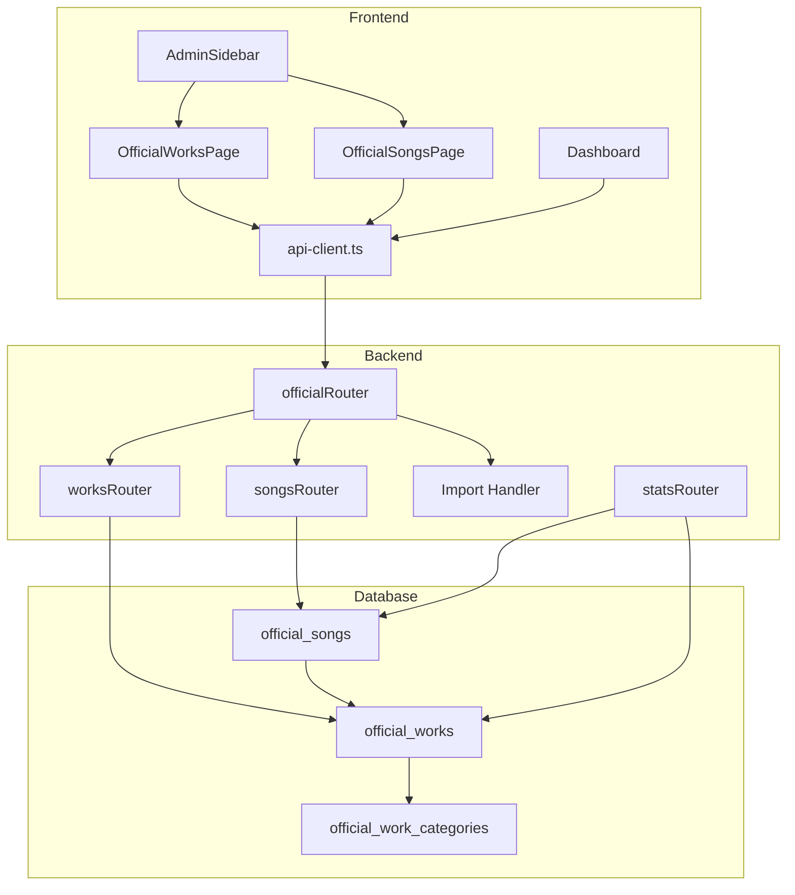
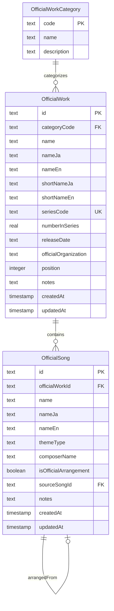

# Design Document

## Overview

**Purpose**: 東方Projectの公式作品と楽曲を一元管理し、管理者がCRUD操作およびTSV一括インポートを行えるようにする。

**Users**: 管理者が管理画面から公式作品・楽曲データの登録・編集・削除・インポートを行う。

**Impact**: 既存のマスタ管理機能と並列して「公式管理」という新しいナビゲーショングループを追加し、データベースに2つの新テーブル（official_works, official_songs）を導入する。

### Goals
- 公式作品と楽曲のCRUD機能を提供
- 既存マスタ管理UIパターンとの一貫性を維持
- TSVファイルによる初期データ一括登録をサポート
- 「公式管理」として独立したナビゲーショングループを提供

### Non-Goals
- 公開API（管理者以外向け）の提供
- 楽曲の音声ファイル管理
- 複雑な検索・フィルタリング（全文検索など）

## Architecture

### Existing Architecture Analysis

既存のマスタ管理機能は以下の構造で実装されている：

- **Database Layer**: `packages/db/src/schema/master.ts` でDrizzle ORMスキーマを定義
- **Validation**: `master.validation.ts` でZodスキーマを生成
- **API Layer**: `apps/server/src/routes/admin/master/` 配下にHonoルーターを配置
- **Frontend**: `apps/web/src/routes/admin/_admin/master/` 配下にページコンポーネント
- **API Client**: `apps/web/src/lib/api-client.ts` で型安全なAPIラッパーを提供

### Architecture Pattern & Boundary Map



**Architecture Integration**:
- Selected pattern: 既存マスタ管理パターンの拡張（レイヤードアーキテクチャ）
- Domain/feature boundaries: `/admin/official/` パス配下に分離、マスタ管理とは独立
- Existing patterns preserved: Hono Router、TanStack Query、Drizzle ORM、Zod validation
- New components rationale: 公式作品・楽曲は独自のドメインロジックを持つため分離
- Steering compliance: モノレポ構成、TypeScript strict mode、Biomeフォーマット維持

### Technology Stack

| Layer | Choice / Version | Role in Feature | Notes |
|-------|------------------|-----------------|-------|
| Frontend | React 19 + TanStack Start | SSR対応管理画面UI | 既存スタック継続 |
| State | TanStack Query | サーバー状態管理、キャッシュ | 既存パターン踏襲 |
| Backend | Hono | REST API提供 | 既存スタック継続 |
| Data | Drizzle ORM + SQLite | スキーマ定義、クエリ | 既存スタック継続 |
| Validation | Zod + drizzle-zod | 型安全バリデーション | 既存パターン踏襲 |

## Requirements Traceability

| Requirement | Summary | Components | Interfaces | Flows |
|-------------|---------|------------|------------|-------|
| 1.1-1.4 | official_worksスキーマ定義 | OfficialWorksSchema | - | - |
| 2.1-2.4 | official_songsスキーマ定義 | OfficialSongsSchema | - | - |
| 3.1-3.7 | 公式作品CRUD API | WorksRouter | API Contract | CRUD Flow |
| 4.1-4.7 | 公式楽曲CRUD API | SongsRouter | API Contract | CRUD Flow |
| 5.1-5.8 | 公式作品管理画面 | OfficialWorksPage | - | - |
| 6.1-6.8 | 公式楽曲管理画面 | OfficialSongsPage | - | - |
| 7.1-7.4 | ナビゲーション統合 | AdminSidebar | - | - |
| 8.1-8.8 | TSVインポート機能 | ImportHandler, ImportParser | API Contract | Import Flow |
| 9.1-9.4 | ダッシュボード統合 | StatsRouter, Dashboard | API Contract | - |

## Components and Interfaces

| Component | Domain/Layer | Intent | Req Coverage | Key Dependencies | Contracts |
|-----------|--------------|--------|--------------|------------------|-----------|
| OfficialWorksSchema | Data | 公式作品テーブル定義 | 1.1-1.4 | Drizzle ORM (P0) | - |
| OfficialSongsSchema | Data | 公式楽曲テーブル定義 | 2.1-2.4 | Drizzle ORM (P0), OfficialWorksSchema (P0) | - |
| OfficialValidation | Data | Zodバリデーションスキーマ | 1.4, 2.4 | Zod (P0), drizzle-zod (P0) | - |
| WorksRouter | Backend | 公式作品CRUD API | 3.1-3.7 | db (P0), AdminContext (P0) | API |
| SongsRouter | Backend | 公式楽曲CRUD API | 4.1-4.7 | db (P0), AdminContext (P0) | API |
| ImportHandler | Backend | TSVインポート処理 | 8.1-8.7 | ImportParser (P0) | API |
| OfficialWorksPage | Frontend | 公式作品管理UI | 5.1-5.8 | TanStack Query (P0), api-client (P0) | - |
| OfficialSongsPage | Frontend | 公式楽曲管理UI | 6.1-6.8 | TanStack Query (P0), api-client (P0) | - |
| AdminSidebar | Frontend | ナビゲーション拡張 | 7.1-7.4 | TanStack Router (P0) | - |

### Data Layer

#### OfficialWorksSchema

| Field | Detail |
|-------|--------|
| Intent | 公式作品のDrizzle ORMテーブル定義 |
| Requirements | 1.1, 1.2, 1.3 |

**Responsibilities & Constraints**
- 公式作品データの永続化スキーマを定義
- official_work_categoriesへの外部キー参照を維持
- seriesCodeのユニーク制約（NULL許容）を実装

**Contracts**: State [x]

##### State Management
```typescript
// packages/db/src/schema/official.ts
export const officialWorks = sqliteTable(
  "official_works",
  {
    id: text("id").primaryKey(),
    categoryCode: text("category_code")
      .notNull()
      .references(() => officialWorkCategories.code),
    name: text("name").notNull(),
    nameJa: text("name_ja").notNull(),
    nameEn: text("name_en"),
    shortNameJa: text("short_name_ja"),
    shortNameEn: text("short_name_en"),
    seriesCode: text("series_code"),
    numberInSeries: real("number_in_series"),
    releaseDate: text("release_date"),
    officialOrganization: text("official_organization"),
    position: integer("position"),
    notes: text("notes"),
    createdAt: integer("created_at", { mode: "timestamp_ms" })
      .default(sql`(cast(unixepoch('subsecond') * 1000 as integer))`)
      .notNull(),
    updatedAt: integer("updated_at", { mode: "timestamp_ms" })
      .default(sql`(cast(unixepoch('subsecond') * 1000 as integer))`)
      .$onUpdate(() => new Date())
      .notNull(),
  },
  (table) => [
    index("idx_official_works_category").on(table.categoryCode),
    index("idx_official_works_release_date").on(table.releaseDate),
    index("idx_official_works_position").on(table.position),
    uniqueIndex("uq_official_works_series_code").on(table.seriesCode),
  ]
);
```

#### OfficialSongsSchema

| Field | Detail |
|-------|--------|
| Intent | 公式楽曲のDrizzle ORMテーブル定義 |
| Requirements | 2.1, 2.2, 2.3 |

**Responsibilities & Constraints**
- 公式楽曲データの永続化スキーマを定義
- official_worksへの外部キー参照（CASCADE削除）
- 自己参照FK（sourceSongId）でアレンジ元を管理

**Contracts**: State [x]

##### State Management
```typescript
// packages/db/src/schema/official.ts
export const officialSongs = sqliteTable(
  "official_songs",
  {
    id: text("id").primaryKey(),
    officialWorkId: text("official_work_id").references(
      () => officialWorks.id,
      { onDelete: "cascade" }
    ),
    name: text("name").notNull(),
    nameJa: text("name_ja").notNull(),
    nameEn: text("name_en"),
    themeType: text("theme_type"),
    composerName: text("composer_name"),
    isOfficialArrangement: integer("is_official_arrangement", {
      mode: "boolean",
    })
      .default(false)
      .notNull(),
    sourceSongId: text("source_song_id").references(
      () => officialSongs.id,
      { onDelete: "set null" }
    ),
    notes: text("notes"),
    createdAt: integer("created_at", { mode: "timestamp_ms" })
      .default(sql`(cast(unixepoch('subsecond') * 1000 as integer))`)
      .notNull(),
    updatedAt: integer("updated_at", { mode: "timestamp_ms" })
      .default(sql`(cast(unixepoch('subsecond') * 1000 as integer))`)
      .$onUpdate(() => new Date())
      .notNull(),
  },
  (table) => [
    index("idx_official_songs_work").on(table.officialWorkId),
    index("idx_official_songs_theme").on(table.themeType),
    index("idx_official_songs_source").on(table.sourceSongId),
  ]
);
```

#### OfficialValidation

| Field | Detail |
|-------|--------|
| Intent | 公式作品・楽曲のZodバリデーションスキーマ |
| Requirements | 1.4, 2.4 |

**Contracts**: State [x]

##### State Management
```typescript
// packages/db/src/schema/official.validation.ts
import { createInsertSchema, createSelectSchema } from "drizzle-zod";
import { z } from "zod";
import { officialWorks, officialSongs } from "./official";

const nonEmptyString = z.string().trim().min(1, "必須項目です");
const optionalString = z.string().trim().optional().nullable();

// OfficialWorks
export const insertOfficialWorkSchema = createInsertSchema(officialWorks, {
  id: nonEmptyString,
  categoryCode: nonEmptyString,
  name: nonEmptyString,
  nameJa: nonEmptyString,
  nameEn: optionalString,
  shortNameJa: optionalString,
  shortNameEn: optionalString,
  seriesCode: optionalString,
  numberInSeries: z.number().optional().nullable(),
  releaseDate: optionalString,
  officialOrganization: optionalString,
  position: z.number().int().optional().nullable(),
  notes: optionalString,
}).omit({ createdAt: true, updatedAt: true });

export const updateOfficialWorkSchema = insertOfficialWorkSchema
  .omit({ id: true })
  .partial();

export const selectOfficialWorkSchema = createSelectSchema(officialWorks);

// OfficialSongs
export const insertOfficialSongSchema = createInsertSchema(officialSongs, {
  id: nonEmptyString,
  officialWorkId: optionalString,
  name: nonEmptyString,
  nameJa: nonEmptyString,
  nameEn: optionalString,
  themeType: optionalString,
  composerName: optionalString,
  isOfficialArrangement: z.boolean().default(false),
  sourceSongId: optionalString,
  notes: optionalString,
}).omit({ createdAt: true, updatedAt: true });

export const updateOfficialSongSchema = insertOfficialSongSchema
  .omit({ id: true })
  .partial();

export const selectOfficialSongSchema = createSelectSchema(officialSongs);

// Type exports
export type InsertOfficialWork = z.infer<typeof insertOfficialWorkSchema>;
export type UpdateOfficialWork = z.infer<typeof updateOfficialWorkSchema>;
export type SelectOfficialWork = z.infer<typeof selectOfficialWorkSchema>;
export type InsertOfficialSong = z.infer<typeof insertOfficialSongSchema>;
export type UpdateOfficialSong = z.infer<typeof updateOfficialSongSchema>;
export type SelectOfficialSong = z.infer<typeof selectOfficialSongSchema>;
```

### Backend Layer

#### WorksRouter

| Field | Detail |
|-------|--------|
| Intent | 公式作品のCRUD APIエンドポイント提供 |
| Requirements | 3.1, 3.2, 3.3, 3.4, 3.5, 3.6, 3.7 |

**Responsibilities & Constraints**
- 認証済み管理者のみアクセス可能
- ページネーション、検索、カテゴリフィルタをサポート
- idは作成後変更不可

**Dependencies**
- Inbound: officialRouter — ルーティング (P0)
- Outbound: db — データアクセス (P0)
- External: AdminContext — 認証ミドルウェア (P0)

**Contracts**: API [x]

##### API Contract

| Method | Endpoint | Request | Response | Errors |
|--------|----------|---------|----------|--------|
| GET | /api/admin/official/works | ?page, limit, search, category | PaginatedResponse<OfficialWork> | 401 |
| GET | /api/admin/official/works/:id | - | OfficialWork | 401, 404 |
| POST | /api/admin/official/works | InsertOfficialWork | OfficialWork | 400, 401, 409 |
| PUT | /api/admin/official/works/:id | UpdateOfficialWork | OfficialWork | 400, 401, 404 |
| DELETE | /api/admin/official/works/:id | - | { success: true } | 401, 404 |

#### SongsRouter

| Field | Detail |
|-------|--------|
| Intent | 公式楽曲のCRUD APIエンドポイント提供 |
| Requirements | 4.1, 4.2, 4.3, 4.4, 4.5, 4.6, 4.7 |

**Responsibilities & Constraints**
- 認証済み管理者のみアクセス可能
- sourceSongIdの自己参照バリデーション
- 作品情報の結合取得をサポート

**Dependencies**
- Inbound: officialRouter — ルーティング (P0)
- Outbound: db — データアクセス (P0)
- External: AdminContext — 認証ミドルウェア (P0)

**Contracts**: API [x]

##### API Contract

| Method | Endpoint | Request | Response | Errors |
|--------|----------|---------|----------|--------|
| GET | /api/admin/official/songs | ?page, limit, search, workId, themeType | PaginatedResponse<OfficialSong> | 401 |
| GET | /api/admin/official/songs/:id | - | OfficialSongWithWork | 401, 404 |
| POST | /api/admin/official/songs | InsertOfficialSong | OfficialSong | 400, 401 |
| PUT | /api/admin/official/songs/:id | UpdateOfficialSong | OfficialSong | 400, 401, 404 |
| DELETE | /api/admin/official/songs/:id | - | { success: true } | 401, 404 |

#### ImportHandler

| Field | Detail |
|-------|--------|
| Intent | TSVファイルのパースとUPSERT処理 |
| Requirements | 8.1, 8.2, 8.3, 8.4, 8.5, 8.6, 8.7 |

**Responsibilities & Constraints**
- TSV形式（タブ区切り）のパースをサポート
- トランザクション内でバッチUPSERT
- エラー行の詳細を返却

**Dependencies**
- Inbound: officialRouter — ルーティング (P0)
- Outbound: ImportParser — ファイルパース (P0)
- Outbound: db — データアクセス (P0)

**Contracts**: API [x]

##### API Contract

| Method | Endpoint | Request | Response | Errors |
|--------|----------|---------|----------|--------|
| POST | /api/admin/official/works/import | multipart/form-data (file) | ImportResult | 400, 401 |
| POST | /api/admin/official/songs/import | multipart/form-data (file) | ImportResult | 400, 401 |

**Implementation Notes**
- Integration: 既存の`import-parser.ts`を拡張してTSV対応
- Validation: 各行をZodスキーマで検証、エラー行を収集
- Risks: 大量データ時のメモリ使用量に注意

### Frontend Layer

#### OfficialWorksPage

| Field | Detail |
|-------|--------|
| Intent | 公式作品の一覧・CRUD管理画面 |
| Requirements | 5.1, 5.2, 5.3, 5.4, 5.5, 5.6, 5.7, 5.8 |

**Implementation Notes**
- Integration: 既存の`platforms.tsx`パターンを踏襲
- Validation: CreateDialogでフォーム入力を検証
- Risks: フィールド数が多いため、フォームのUX設計に注意

#### OfficialSongsPage

| Field | Detail |
|-------|--------|
| Intent | 公式楽曲の一覧・CRUD管理画面 |
| Requirements | 6.1, 6.2, 6.3, 6.4, 6.5, 6.6, 6.7, 6.8 |

**Implementation Notes**
- Integration: 作品選択・原曲選択用のセレクトボックスを追加
- Validation: sourceSongIdの自己参照を防ぐUIロジック
- Risks: 関連データの取得タイミング（作品一覧、楽曲一覧）

#### AdminSidebar

| Field | Detail |
|-------|--------|
| Intent | 「公式管理」ナビゲーショングループの追加 |
| Requirements | 7.1, 7.2, 7.3, 7.4 |

**Implementation Notes**
- Integration: `navItems`配列に新グループを追加
- Validation: なし
- Risks: なし（最小限の変更）

## Data Models

### Domain Model



**Aggregates and Boundaries**:
- OfficialWork: 作品単位でのトランザクション境界
- OfficialSong: 楽曲単位、ただし作品削除時はCASCADE

**Business Rules & Invariants**:
- seriesCodeはNULL許容だが、値がある場合はユニーク
- sourceSongIdは自身のidと等しくてはならない
- categoryCodeは既存のofficial_work_categoriesに存在する必要あり

### Physical Data Model

**Indexes**:
- `idx_official_works_category`: カテゴリフィルタ用
- `idx_official_works_release_date`: リリース日ソート用
- `idx_official_works_position`: 表示順ソート用
- `uq_official_works_series_code`: シリーズコードユニーク制約
- `idx_official_songs_work`: 作品フィルタ用
- `idx_official_songs_theme`: themeTypeフィルタ用
- `idx_official_songs_source`: 原曲参照用

## Error Handling

### Error Categories and Responses

**User Errors (4xx)**:
- 400 Bad Request: バリデーションエラー（必須フィールド未入力、無効な形式）
- 401 Unauthorized: 未認証アクセス
- 404 Not Found: 存在しないリソースへのアクセス
- 409 Conflict: 重複するseriesCode

**System Errors (5xx)**:
- 500 Internal Server Error: データベースエラー、予期しない例外

### Monitoring
- エラーレスポンスにはfieldErrorsを含め、フロントエンドで詳細表示
- インポートエラーは行番号とエラー内容を返却

## Testing Strategy

### Unit Tests
- Zodバリデーションスキーマのテスト（有効/無効なデータ）
- TSVパーサーのテスト（正常系、エラー系）
- sourceSongIdの自己参照バリデーション

### Integration Tests
- WorksRouter CRUD操作（作成→取得→更新→削除）
- SongsRouter CRUD操作
- インポートAPI（TSVファイルアップロード→UPSERT→結果確認）
- CASCADE削除の動作確認

### E2E Tests
- 公式作品の新規作成フロー
- 公式楽曲の新規作成（作品選択含む）
- TSVインポートフロー
- ナビゲーションからのページ遷移
