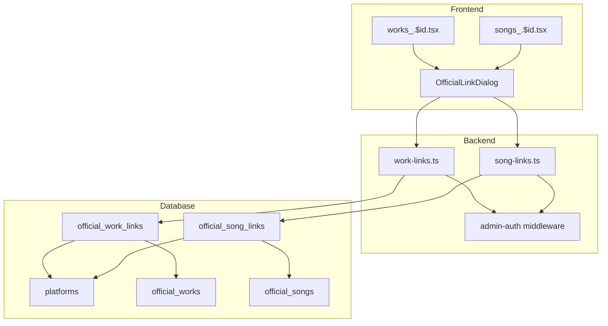
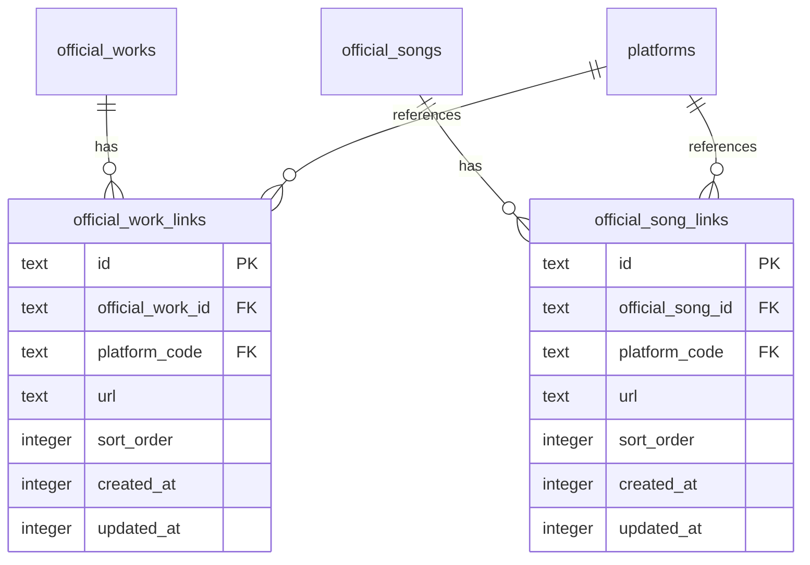

# Technical Design: public-links

## Overview

**Purpose**: 公式作品（OfficialWork）および公式楽曲（OfficialSong）に、YouTube、Spotify、Apple Music等の外部配信プラットフォームへのリンクを紐づけて管理する機能を提供する。

**Users**: 管理者が管理画面から公式コンテンツに関連する公開リンクを登録・編集・削除し、ユーザーが各配信プラットフォームへアクセスできるようにする。

**Impact**: 既存の公式作品・楽曲詳細画面にリンク管理機能を追加し、データベースに2つの新規テーブルを追加する。

### Goals
- 公式作品に複数の公開リンクを紐づけて管理できる
- 公式楽曲に複数の公開リンクを紐づけて管理できる
- リンクの表示順序を管理者が自由に変更できる
- 既存の platforms マスタを活用し、一貫性のあるプラットフォーム選択肢を提供する

### Non-Goals
- 公開ユーザー向けのリンク表示画面（今回は管理画面のみ）
- リンクの自動収集・スクレイピング機能
- リンクの死活監視・有効性チェック

## Architecture

### Existing Architecture Analysis

既存システムには circleLinks テーブル・APIが存在し、サークルへの外部リンク紐づけパターンが確立されている。本機能はこのパターンを公式作品・楽曲に適用する拡張として実装する。

- **既存パターン**: circleLinks（親エンティティへのリンク紐づけ）
- **維持すべき境界**: official ドメイン内での凝集、admin API の認証保護
- **技術的負債**: なし（新規追加のみ）

### Architecture Pattern & Boundary Map



**Architecture Integration**:
- **Selected pattern**: ハイブリッドアプローチ（スキーマは既存ファイル、APIは新規ファイル）
- **Domain boundaries**: official ドメイン内に閉じた実装
- **Existing patterns preserved**: circleLinks のAPI構造、Zod バリデーション、admin-auth 認証
- **New components rationale**: APIファイル分離による保守性向上
- **Steering compliance**: TypeScript strict mode、Drizzle ORM、Hono API パターン

### Technology Stack

| Layer | Choice / Version | Role in Feature | Notes |
|-------|------------------|-----------------|-------|
| Frontend | React 19 + TanStack Query | リンク管理UI、状態管理 | 既存スタック |
| Backend | Hono | リンクCRUD API | 既存スタック |
| Data | Drizzle ORM + SQLite | スキーマ定義、クエリ | 既存スタック |
| Validation | Zod + drizzle-zod | 入力バリデーション | 既存スタック |

## Requirements Traceability

| Requirement | Summary | Components | Interfaces | Flows |
|-------------|---------|------------|------------|-------|
| 1.1-1.5 | 作品リンク管理 | OfficialWorkLinks, WorkLinksAPI, WorkDetail | API Contract (work-links) | CRUD操作 |
| 2.1-2.5 | 楽曲リンク管理 | OfficialSongLinks, SongLinksAPI, SongDetail | API Contract (song-links) | CRUD操作 |
| 3.1-3.5 | データモデル | officialWorkLinks, officialSongLinks テーブル | Schema | - |
| 4.1-4.3 | プラットフォーム | platforms テーブル参照 | FK制約 | - |
| 5.1-5.3 | 表示順序 | sortOrder カラム, ReorderButtons | Reorder API | 順序変更 |
| 6.1-6.4 | API認証 | admin-auth middleware | 401エラー | - |

## Components and Interfaces

| Component | Domain/Layer | Intent | Req Coverage | Key Dependencies | Contracts |
|-----------|--------------|--------|--------------|------------------|-----------|
| officialWorkLinks | Data | 作品リンクテーブル | 3.1, 3.3, 3.4 | officialWorks, platforms (P0) | Schema |
| officialSongLinks | Data | 楽曲リンクテーブル | 3.2, 3.3, 3.4 | officialSongs, platforms (P0) | Schema |
| createId拡張 | Utility | ID生成関数追加 | 3.5 | nanoid (P0) | Function |
| WorkLinksAPI | Backend | 作品リンクCRUD | 1.1-1.5, 6.1-6.4 | admin-auth (P0), db (P0) | API |
| SongLinksAPI | Backend | 楽曲リンクCRUD | 2.1-2.5, 6.1-6.4 | admin-auth (P0), db (P0) | API |
| OfficialLinkDialog | Frontend | リンク追加/編集UI | 1.1, 1.3, 2.1, 2.3 | platformsApi (P1) | State |
| WorkDetail拡張 | Frontend | リンクカード表示 | 1.5 | WorkLinksAPI (P0) | - |
| SongDetail拡張 | Frontend | リンクカード表示 | 2.5 | SongLinksAPI (P0) | - |

### Data Layer

#### officialWorkLinks テーブル

| Field | Detail |
|-------|--------|
| Intent | 公式作品に紐づく公開リンクを格納 |
| Requirements | 3.1, 3.3, 3.4, 4.3 |

**Responsibilities & Constraints**
- 公式作品と公開リンクの1対多関係を管理
- platforms マスタへの外部キー制約でプラットフォームの一貫性を担保
- 親作品削除時に CASCADE で自動削除

**Dependencies**
- Outbound: officialWorks — 親エンティティ (P0)
- Outbound: platforms — プラットフォームマスタ (P0)

**Contracts**: Schema [x]

##### Schema Definition
```typescript
export const officialWorkLinks = sqliteTable(
  "official_work_links",
  {
    id: text("id").primaryKey(),
    officialWorkId: text("official_work_id")
      .notNull()
      .references(() => officialWorks.id, { onDelete: "cascade" }),
    platformCode: text("platform_code")
      .notNull()
      .references(() => platforms.code, { onDelete: "restrict" }),
    url: text("url").notNull(),
    sortOrder: integer("sort_order").default(0).notNull(),
    createdAt: integer("created_at", { mode: "timestamp_ms" })
      .default(sql`(cast(unixepoch('subsecond') * 1000 as integer))`)
      .notNull(),
    updatedAt: integer("updated_at", { mode: "timestamp_ms" })
      .default(sql`(cast(unixepoch('subsecond') * 1000 as integer))`)
      .$onUpdate(() => new Date())
      .notNull(),
  },
  (table) => [
    index("idx_official_work_links_work_id").on(table.officialWorkId),
    uniqueIndex("uq_official_work_links_work_url").on(table.officialWorkId, table.url),
  ],
);
```

#### officialSongLinks テーブル

| Field | Detail |
|-------|--------|
| Intent | 公式楽曲に紐づく公開リンクを格納 |
| Requirements | 3.2, 3.3, 3.4, 4.3 |

**Responsibilities & Constraints**
- 公式楽曲と公開リンクの1対多関係を管理
- platforms マスタへの外部キー制約でプラットフォームの一貫性を担保
- 親楽曲削除時に CASCADE で自動削除

**Dependencies**
- Outbound: officialSongs — 親エンティティ (P0)
- Outbound: platforms — プラットフォームマスタ (P0)

**Contracts**: Schema [x]

##### Schema Definition
```typescript
export const officialSongLinks = sqliteTable(
  "official_song_links",
  {
    id: text("id").primaryKey(),
    officialSongId: text("official_song_id")
      .notNull()
      .references(() => officialSongs.id, { onDelete: "cascade" }),
    platformCode: text("platform_code")
      .notNull()
      .references(() => platforms.code, { onDelete: "restrict" }),
    url: text("url").notNull(),
    sortOrder: integer("sort_order").default(0).notNull(),
    createdAt: integer("created_at", { mode: "timestamp_ms" })
      .default(sql`(cast(unixepoch('subsecond') * 1000 as integer))`)
      .notNull(),
    updatedAt: integer("updated_at", { mode: "timestamp_ms" })
      .default(sql`(cast(unixepoch('subsecond') * 1000 as integer))`)
      .$onUpdate(() => new Date())
      .notNull(),
  },
  (table) => [
    index("idx_official_song_links_song_id").on(table.officialSongId),
    uniqueIndex("uq_official_song_links_song_url").on(table.officialSongId, table.url),
  ],
);
```

#### createId 拡張（ID生成関数）

| Field | Detail |
|-------|--------|
| Intent | 公式作品リンク・楽曲リンク用のユニークID生成関数を提供 |
| Requirements | 3.5 |

**Responsibilities & Constraints**
- プロジェクトのID命名規則に従ったプレフィックス付きIDを生成
- 既存の createId オブジェクトに新しいエントリを追加

**Dependencies**
- Outbound: nanoid — ID生成 (P0)

**Contracts**: Function [x]

##### Implementation

```typescript
// packages/db/src/utils/id.ts への追加

export const createId = {
  // ... 既存エントリ ...
  officialWorkLink: () => `wl_${nanoid()}`,  // wl = work link
  officialSongLink: () => `sl_${nanoid()}`,  // sl = song link
} as const;
```

**命名規則**:
- `wl_`: 公式作品リンク（work link）
- `sl_`: 公式楽曲リンク（song link）
- 形式: `{prefix}_{nanoid()}` で21文字の英数字ID

### Backend Layer

#### WorkLinksAPI

| Field | Detail |
|-------|--------|
| Intent | 公式作品リンクのCRUD操作を提供するAPIエンドポイント |
| Requirements | 1.2, 1.4, 5.2, 6.1, 6.3, 6.4 |

**Responsibilities & Constraints**
- 作品リンクの一覧取得、作成、更新、削除
- URL重複チェック（同一作品内）
- プラットフォームURLパターンバリデーション
- 表示順序の更新

**Dependencies**
- Inbound: Frontend — API呼び出し (P0)
- External: admin-auth middleware — 認証 (P0)
- Outbound: db — データベース操作 (P0)

**Contracts**: API [x]

##### API Contract

| Method | Endpoint | Request | Response | Errors |
|--------|----------|---------|----------|--------|
| GET | /admin/official/works/:workId/links | - | OfficialWorkLink[] | 404 |
| POST | /admin/official/works/:workId/links | CreateLinkRequest | OfficialWorkLink | 400, 404, 409 |
| PUT | /admin/official/works/:workId/links/:linkId | UpdateLinkRequest | OfficialWorkLink | 400, 404, 409 |
| DELETE | /admin/official/works/:workId/links/:linkId | - | { success: true } | 404 |
| PUT | /admin/official/works/:workId/links/:linkId/reorder | { sortOrder: number } | OfficialWorkLink | 400, 404 |

**Implementation Notes**
- Integration: 既存の official ルートグループに追加、admin-auth ミドルウェア適用
- Validation: insertOfficialWorkLinkSchema, updateOfficialWorkLinkSchema 使用
- Risks: URL重複チェックのレースコンディション（UNIQUE制約でカバー）

#### SongLinksAPI

| Field | Detail |
|-------|--------|
| Intent | 公式楽曲リンクのCRUD操作を提供するAPIエンドポイント |
| Requirements | 2.2, 2.4, 5.2, 6.2, 6.3, 6.4 |

**Responsibilities & Constraints**
- 楽曲リンクの一覧取得、作成、更新、削除
- URL重複チェック（同一楽曲内）
- プラットフォームURLパターンバリデーション
- 表示順序の更新

**Dependencies**
- Inbound: Frontend — API呼び出し (P0)
- External: admin-auth middleware — 認証 (P0)
- Outbound: db — データベース操作 (P0)

**Contracts**: API [x]

##### API Contract

| Method | Endpoint | Request | Response | Errors |
|--------|----------|---------|----------|--------|
| GET | /admin/official/songs/:songId/links | - | OfficialSongLink[] | 404 |
| POST | /admin/official/songs/:songId/links | CreateLinkRequest | OfficialSongLink | 400, 404, 409 |
| PUT | /admin/official/songs/:songId/links/:linkId | UpdateLinkRequest | OfficialSongLink | 400, 404, 409 |
| DELETE | /admin/official/songs/:songId/links/:linkId | - | { success: true } | 404 |
| PUT | /admin/official/songs/:songId/links/:linkId/reorder | { sortOrder: number } | OfficialSongLink | 400, 404 |

**Implementation Notes**
- Integration: 既存の official ルートグループに追加、admin-auth ミドルウェア適用
- Validation: insertOfficialSongLinkSchema, updateOfficialSongLinkSchema 使用
- Risks: URL重複チェックのレースコンディション（UNIQUE制約でカバー）

### Frontend Layer

#### OfficialLinkDialog

| Field | Detail |
|-------|--------|
| Intent | リンクの追加・編集を行う共有ダイアログコンポーネント |
| Requirements | 1.1, 1.3, 2.1, 2.3, 4.2 |

**Responsibilities & Constraints**
- プラットフォーム選択とURL入力フォーム
- 作品リンク・楽曲リンク両方で再利用可能
- バリデーションエラー表示

**Dependencies**
- Inbound: WorkDetail, SongDetail — ダイアログ表示 (P0)
- External: platformsApi — プラットフォーム一覧取得 (P1)

**Contracts**: State [x]

##### State Management
```typescript
interface OfficialLinkDialogProps {
  mode: "create" | "edit";
  entityType: "work" | "song";
  entityId: string;
  link?: OfficialWorkLink | OfficialSongLink;
  onClose: () => void;
  onSuccess: () => void;
}

interface LinkFormState {
  platformCode: string;
  url: string;
}
```

**Implementation Notes**
- Integration: Dialog コンポーネント使用、既存フォームパターン踏襲
- Validation: URL形式のクライアントサイドバリデーション
- Risks: なし

#### WorkDetail / SongDetail 拡張

| Field | Detail |
|-------|--------|
| Intent | 詳細ページにリンク管理カードを追加 |
| Requirements | 1.5, 2.5, 5.1, 5.3 |

**Implementation Notes**
- 既存の詳細ページに「公開リンク」カードを追加
- リンク一覧を sortOrder 昇順で表示
- ReorderButtons で順序変更、編集・削除ボタン配置
- 「リンク追加」ボタンで OfficialLinkDialog を表示

## Data Models

### Logical Data Model



**Consistency & Integrity**:
- UNIQUE制約: (official_work_id, url), (official_song_id, url) で同一親内のURL重複を防止
- CASCADE削除: 親エンティティ削除時にリンクも自動削除
- RESTRICT削除: platforms 削除時はリンクが存在する場合エラー

### Data Contracts & Integration

**Request/Response Schemas**:

```typescript
// 作成リクエスト
interface CreateLinkRequest {
  platformCode: string;
  url: string;
}

// 更新リクエスト
interface UpdateLinkRequest {
  platformCode?: string;
  url?: string;
}

// 順序更新リクエスト
interface ReorderLinkRequest {
  sortOrder: number;
}

// レスポンス（作品リンク）
interface OfficialWorkLinkResponse {
  id: string;
  officialWorkId: string;
  platformCode: string;
  url: string;
  sortOrder: number;
  createdAt: number;
  updatedAt: number;
  platformName?: string; // JOIN結果
}

// レスポンス（楽曲リンク）
interface OfficialSongLinkResponse {
  id: string;
  officialSongId: string;
  platformCode: string;
  url: string;
  sortOrder: number;
  createdAt: number;
  updatedAt: number;
  platformName?: string; // JOIN結果
}
```

**Validation Schemas**:

```typescript
// Zod スキーマ
export const insertOfficialWorkLinkSchema = createInsertSchema(officialWorkLinks, {
  id: nonEmptyString,
  officialWorkId: nonEmptyString,
  platformCode: nonEmptyString,
  url: z.string().url("有効なURLを入力してください"),
}).omit({ createdAt: true, updatedAt: true });

export const updateOfficialWorkLinkSchema = z.object({
  platformCode: nonEmptyString.optional(),
  url: z.string().url("有効なURLを入力してください").optional(),
  sortOrder: z.number().int().min(0).optional(),
});
```

## Error Handling

### Error Categories and Responses

**User Errors (4xx)**:
- 400: バリデーションエラー（URL形式不正、必須フィールド不足）
- 404: 対象の作品/楽曲/リンクが存在しない
- 409: URL重複（同一親エンティティ内）

**System Errors (5xx)**:
- 500: データベース操作失敗

**Error Response Format**:
```typescript
interface ErrorResponse {
  error: string;
  details?: Record<string, string[]>; // バリデーションエラー詳細
}
```

## Testing Strategy

### Unit Tests
- バリデーションスキーマのテスト（URL形式、必須フィールド）
- ID生成関数のテスト（プレフィックス形式）
- sortOrder 計算ロジックのテスト

### Integration Tests
- 作品リンクCRUD操作（作成→取得→更新→削除）
- 楽曲リンクCRUD操作（作成→取得→更新→削除）
- URL重複エラーの発生確認
- 認証なしアクセスの401エラー確認

### E2E Tests
- 作品詳細画面でのリンク追加・編集・削除フロー
- 楽曲詳細画面でのリンク追加・編集・削除フロー
- リンク順序変更の動作確認
