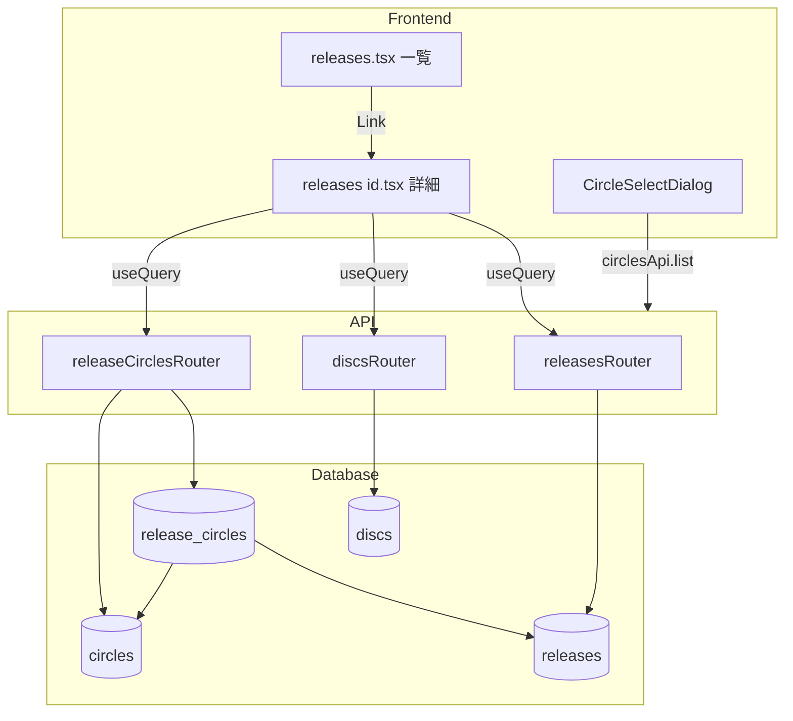
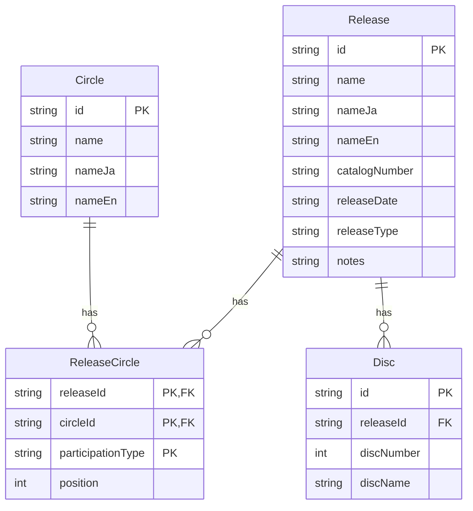

# Technical Design: release-detail-circle-association

## Overview

**Purpose**: 作品管理機能に専用の詳細画面を追加し、作品とサークルの関連付けを管理可能にする。

**Users**: 管理者が作品情報の詳細確認・編集、およびサークル関連付けの管理に使用する。

**Impact**: 現在のダイアログベース編集を補完し、より広い画面での詳細管理を実現。既存のrelease_circlesテーブルを活用してサークル関連付け機能を追加。

### Goals
- 作品の詳細情報を専用画面で表示・編集可能にする
- 作品とサークルの関連付け（追加・削除・順序変更）を管理可能にする
- 既存のディスク管理機能を詳細画面に統合する
- 既存パターン（discsRouter）との一貫性を維持する

### Non-Goals
- ドラッグ&ドロップによる順序変更（将来フェーズ）
- サークル側からの作品一覧表示（逆方向参照）
- 一括インポート/エクスポート機能

## Architecture

### Existing Architecture Analysis

現在の作品管理機能:
- `releases.tsx`: 一覧画面（887行）、ダイアログベースのCRUD
- `discsRouter`: ネストリソースパターン（`/:releaseId/discs`）
- `releaseCircles`テーブル: スキーマ定義済み、API未実装

既存パターン:
- TanStack Query によるサーバー状態管理
- AdminContext ミドルウェアによる認証
- Zod スキーマによるバリデーション

### Architecture Pattern & Boundary Map



**Architecture Integration**:
- **Selected pattern**: 既存のネストリソースパターン拡張
- **Domain boundaries**: 作品詳細画面が新たな境界として追加、サークル関連APIはreleasesRouterのサブルート
- **Existing patterns preserved**: discsRouter、TanStack Query、AdminContext
- **New components rationale**: 詳細画面は責務分離のため独立ルート、サークル選択は再利用可能なダイアログ
- **Steering compliance**: TypeScript strict mode、Zodバリデーション、daisyUI

### Technology Stack

| Layer | Choice / Version | Role in Feature | Notes |
|-------|------------------|-----------------|-------|
| Frontend | TanStack Router | 動的ルート（$id.tsx） | 既存パターン |
| Frontend | TanStack Query | サーバー状態管理 | 既存パターン |
| Frontend | daisyUI + Lucide | UIコンポーネント | 既存パターン |
| Backend | Hono | REST API | 既存パターン |
| Data | Drizzle ORM + SQLite | release_circles操作 | 既存スキーマ活用 |
| Validation | Zod | リクエストバリデーション | 既存パターン |

## Requirements Traceability

| Requirement | Summary | Components | Interfaces | Flows |
|-------------|---------|------------|------------|-------|
| 1.1-1.7 | 作品詳細画面 | ReleaseDetailPage | releasesApi.get | 画面遷移、表示・編集 |
| 2.1-2.5 | ディスク管理 | DiscSection | discsApi | CRUD操作 |
| 3.1-3.7 | サークル関連付け | CircleSection | releaseCirclesApi | 追加・削除・順序変更 |
| 4.1-4.5 | サークル選択UI | CircleSelectDialog | circlesApi.list | 検索・選択 |
| 5.1-5.3 | 一覧→詳細導線 | ReleasesPage（修正） | Link | ナビゲーション |
| 6.1-6.6 | API エンドポイント | releaseCirclesRouter | REST API | CRUD |

## Components and Interfaces

| Component | Domain/Layer | Intent | Req Coverage | Key Dependencies | Contracts |
|-----------|--------------|--------|--------------|------------------|-----------|
| ReleaseDetailPage | Frontend/Route | 作品詳細表示・編集 | 1.1-1.7 | releasesApi (P0), discsApi (P0), releaseCirclesApi (P0) | State |
| DiscSection | Frontend/UI | ディスク一覧・CRUD | 2.1-2.5 | discsApi (P0) | - |
| CircleSection | Frontend/UI | サークル一覧・管理 | 3.1-3.7 | releaseCirclesApi (P0) | - |
| CircleSelectDialog | Frontend/UI | サークル検索・選択 | 4.1-4.5 | circlesApi (P0) | - |
| releaseCirclesRouter | Backend/API | サークル関連付けAPI | 6.1-6.6 | db, releaseCircles (P0) | API |
| releaseCirclesApi | Frontend/Client | APIクライアント | 6.1-6.6 | fetchWithAuth (P0) | Service |

### Frontend / Routes

#### ReleaseDetailPage

| Field | Detail |
|-------|--------|
| Intent | 作品の詳細情報を表示・編集し、関連リソース（ディスク、サークル）を管理 |
| Requirements | 1.1, 1.2, 1.3, 1.4, 1.5, 1.6, 1.7 |

**Responsibilities & Constraints**
- 作品の基本情報表示（表示モード）
- 編集フォーム表示（編集モード）
- ディスク・サークルセクションの統合
- パンくずナビゲーション表示
- 作品未存在時のエラーハンドリング

**Dependencies**
- Inbound: ReleasesPage — 一覧からのナビゲーション (P0)
- Outbound: releasesApi — 作品データ取得・更新 (P0)
- Outbound: discsApi — ディスクデータ取得 (P0)
- Outbound: releaseCirclesApi — サークル関連データ取得 (P0)

**Contracts**: State [x]

##### State Management
```typescript
interface ReleaseDetailState {
  isEditing: boolean;
  editForm: Partial<Release>;
  mutationError: string | null;
  isSubmitting: boolean;
}
```

**Implementation Notes**
- Integration: TanStack Queryの`useQuery`でデータ取得、`useMutation`で更新
- Validation: 編集フォームはZodスキーマでクライアントサイドバリデーション
- Risks: 作品削除時の画面遷移（一覧へリダイレクト）

---

#### CircleSection

| Field | Detail |
|-------|--------|
| Intent | 作品に関連付けられたサークルの一覧表示と管理操作 |
| Requirements | 3.1, 3.2, 3.3, 3.4, 3.5, 3.6, 3.7 |

**Responsibilities & Constraints**
- サークル一覧のposition順表示
- 追加ダイアログの起動
- 削除確認と実行
- 順序変更（上下ボタン）

**Dependencies**
- Inbound: ReleaseDetailPage — 親コンポーネント (P0)
- Outbound: releaseCirclesApi — CRUD操作 (P0)
- Outbound: CircleSelectDialog — サークル選択 (P0)

**Implementation Notes**
- 順序変更は上下ボタンで実装（ChevronUp/ChevronDown）
- 空状態メッセージ: 「サークルが関連付けられていません」

---

#### CircleSelectDialog

| Field | Detail |
|-------|--------|
| Intent | サークルを検索・選択して作品に関連付け |
| Requirements | 4.1, 4.2, 4.3, 4.4, 4.5 |

**Responsibilities & Constraints**
- サークル一覧の検索フィルタリング
- 関連付け済みサークルの除外表示
- participationType選択フィールド（デフォルト: "production"）
- 選択確定時のコールバック

**Dependencies**
- Inbound: CircleSection — ダイアログ起動 (P0)
- Outbound: circlesApi.list — サークル一覧取得 (P0)

##### Service Interface
```typescript
interface CircleSelectDialogProps {
  open: boolean;
  onOpenChange: (open: boolean) => void;
  excludeCircleIds: string[];
  onSelect: (circleId: string, participationType: ParticipationType) => void;
}
```

**Implementation Notes**
- 検索はデバウンス付きインクリメンタル検索（300ms）
- 既存の`useDebounce`フックを再利用

---

### Backend / API

#### releaseCirclesRouter

| Field | Detail |
|-------|--------|
| Intent | 作品とサークルの関連付けを管理するREST API |
| Requirements | 6.1, 6.2, 6.3, 6.4, 6.5, 6.6 |

**Responsibilities & Constraints**
- 関連付け一覧取得（position順）
- 新規関連付け追加（重複チェック）
- 関連付け更新（participationType, position）
- 関連付け解除
- 親リソース（release）存在チェック

**Dependencies**
- Inbound: releaseCirclesApi — フロントエンドクライアント (P0)
- Outbound: db — Drizzle ORM (P0)
- External: releaseCircles, circles — DBスキーマ (P0)

**Contracts**: API [x]

##### API Contract

| Method | Endpoint | Request | Response | Errors |
|--------|----------|---------|----------|--------|
| GET | `/:releaseId/circles` | - | `ReleaseCircleWithCircle[]` | 404 |
| POST | `/:releaseId/circles` | `{ circleId, participationType?, position? }` | `ReleaseCircle` | 400, 404, 409 |
| PATCH | `/:releaseId/circles/:circleId` | `{ participationType?, position? }` | `ReleaseCircle` | 400, 404 |
| DELETE | `/:releaseId/circles/:circleId` | `{ participationType }` (query) | `{ success: true }` | 404 |

**Implementation Notes**
- Integration: `releasesAdminRouter.route("/", releaseCirclesRouter)` でマウント
- Validation: insertReleaseCircleSchema, updateReleaseCircleSchema使用
- Risks: 複合主キーのため、DELETE時にparticipationTypeをクエリパラメータで指定
- **スキーマ変更**: `role` → `participation_type` カラム名変更（DBマイグレーション必要）

---

### Frontend / API Client

#### releaseCirclesApi

| Field | Detail |
|-------|--------|
| Intent | releaseCirclesRouterへのHTTPクライアント |
| Requirements | 6.1, 6.2, 6.3, 6.4, 6.5, 6.6 |

**Contracts**: Service [x]

##### Service Interface
```typescript
interface ReleaseCircle {
  releaseId: string;
  circleId: string;
  participationType: ParticipationType;
  position: number;
}

interface ReleaseCircleWithCircle extends ReleaseCircle {
  circle: Circle;
}

// ParticipationType定数
const PARTICIPATION_TYPES = [
  "host",
  "co-host",
  "participant",
  "guest",
  "split_partner",
] as const;

type ParticipationType = (typeof PARTICIPATION_TYPES)[number];

const PARTICIPATION_TYPE_LABELS: Record<ParticipationType, string> = {
  host: "主催",
  "co-host": "共同主催",
  participant: "参加",
  guest: "ゲスト",
  split_partner: "スプリット",
};

interface CreateReleaseCircleInput {
  circleId: string;
  participationType?: ParticipationType; // デフォルト: "host"
  position?: number;
}

interface UpdateReleaseCircleInput {
  participationType?: ParticipationType;
  position?: number;
}

const releaseCirclesApi = {
  list: (releaseId: string) =>
    fetchWithAuth<ReleaseCircleWithCircle[]>(
      `/api/admin/releases/${releaseId}/circles`
    );

  add: (releaseId: string, data: CreateReleaseCircleInput) =>
    fetchWithAuth<ReleaseCircle>(
      `/api/admin/releases/${releaseId}/circles`,
      { method: "POST", body: JSON.stringify(data) }
    );

  update: (releaseId: string, circleId: string, data: UpdateReleaseCircleInput) =>
    fetchWithAuth<ReleaseCircle>(
      `/api/admin/releases/${releaseId}/circles/${circleId}`,
      { method: "PATCH", body: JSON.stringify(data) }
    );

  remove: (releaseId: string, circleId: string, participationType: ParticipationType) =>
    fetchWithAuth<{ success: boolean }>(
      `/api/admin/releases/${releaseId}/circles/${circleId}?participationType=${encodeURIComponent(participationType)}`,
      { method: "DELETE" }
    );
};
```

---

### Database / Validation

#### updateReleaseCircleSchema

| Field | Detail |
|-------|--------|
| Intent | 関連付け更新時のバリデーションスキーマ |
| Requirements | 6.4 |

```typescript
export const updateReleaseCircleSchema = z.object({
  participationType: z.enum(PARTICIPATION_TYPES).optional(),
  position: z.number().int().min(1, "1以上の整数を入力してください").optional(),
});

export type UpdateReleaseCircle = z.infer<typeof updateReleaseCircleSchema>;
```

## Data Models

### Domain Model



**Business Rules & Invariants**:
- 同一作品に同一サークルを同一参加形態で複数登録不可（複合主キー制約）
- 同一サークルでも異なる参加形態であれば複数登録可能
- position は 1 以上の整数
- participationType は必須（デフォルト: "host"）

**ParticipationType Constants（参加形態定数）**:
| DB値 (English) | 表示ラベル (Japanese) | 用途 |
|----------------|----------------------|------|
| `host` | 主催 | 単独作品、コンピ主催 |
| `co-host` | 共同主催 | A × B 名義のコラボ |
| `participant` | 参加 | コンピ参加 |
| `guest` | ゲスト | ゲストボーカル招待など |
| `split_partner` | スプリット | 2サークルのスプリット作品 |

※ 初期実装では上記を固定選択肢として提供。デフォルト値は `host`。将来的に拡張可能。

### Logical Data Model

**release_circles テーブル**（変更あり）:
- 主キー: `(release_id, circle_id, participation_type)`
- 外部キー: `release_id` → releases.id (CASCADE削除)
- 外部キー: `circle_id` → circles.id (RESTRICT削除)
- インデックス: `idx_release_circles_circle` on `circle_id`

**変更内容**: `role` カラムを `participation_type` にリネーム（マイグレーション必要）

### Data Contracts & Integration

**API Request/Response**:

GET `/releases/:id/circles` Response:
```typescript
type Response = Array<{
  releaseId: string;
  circleId: string;
  participationType: ParticipationType;
  position: number;
  circle: {
    id: string;
    name: string;
    nameJa: string | null;
    nameEn: string | null;
  };
}>;
```

POST `/releases/:id/circles` Request:
```typescript
type Request = {
  circleId: string;
  participationType?: ParticipationType; // デフォルト: "host"
  position?: number;
};
```

## Error Handling

### Error Categories and Responses

| Category | HTTP Code | Condition | Response |
|----------|-----------|-----------|----------|
| Not Found | 404 | 作品が存在しない | `{ error: "Release not found" }` |
| Not Found | 404 | 関連付けが存在しない | `{ error: "Not found" }` |
| Conflict | 409 | 関連付けが既に存在 | `{ error: "Association already exists" }` |
| Validation | 400 | 入力バリデーション失敗 | `{ error: "Validation failed", details: {...} }` |

### Frontend Error Handling
- API エラーは `mutationError` ステートで表示
- 作品未存在時は専用エラー画面（一覧へのリンク付き）
- ネットワークエラーはトースト通知（既存パターン）

## Testing Strategy

### Unit Tests
- `updateReleaseCircleSchema`: バリデーションルール
- `releaseCirclesApi`: 各メソッドのリクエスト形式

### Integration Tests
- `releaseCirclesRouter`: 各エンドポイントの動作
  - 関連付け追加（成功、重複エラー、親不存在エラー）
  - 関連付け削除（成功、不存在エラー）
  - 順序更新
- 作品削除時のCASCADE削除確認

### E2E Tests
- 詳細画面表示 → サークル追加 → 順序変更 → 削除フロー
- 一覧画面から詳細画面への遷移
- 作品未存在時のエラー画面表示
