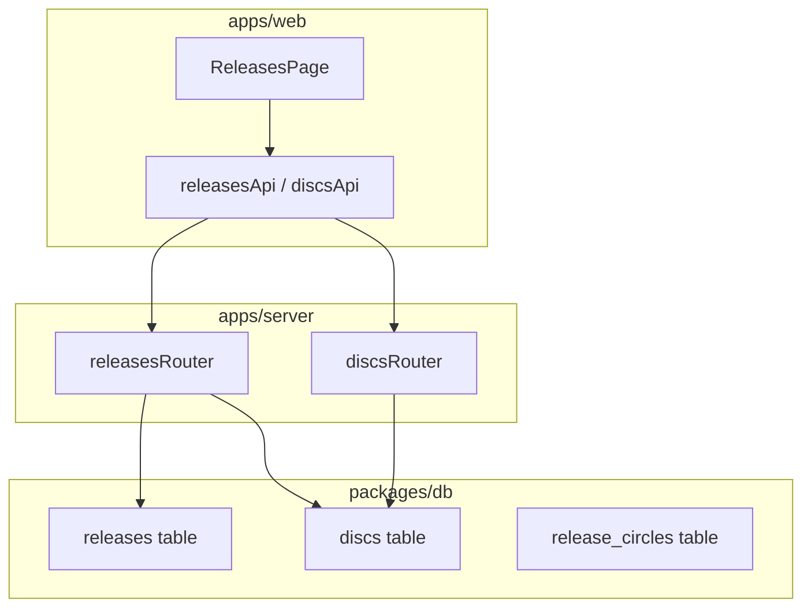
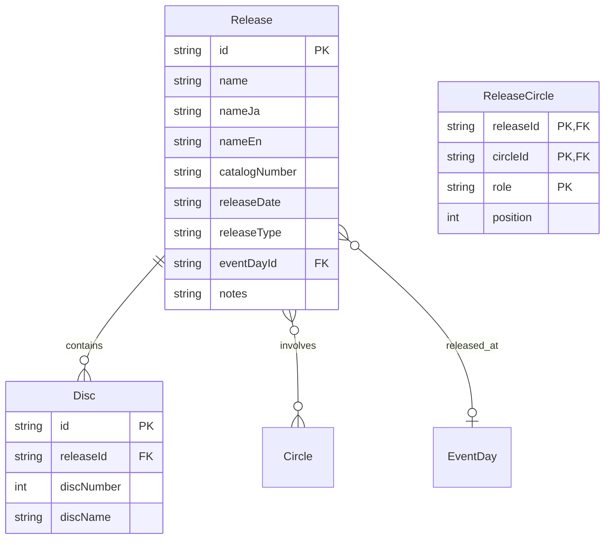

# Design Document: リリース・ディスク管理

## Overview

**Purpose**: 音楽リリース（アルバム、シングル、EP、配信、動画公開など）とそれに含まれるディスクを管理する機能を提供する。

**Users**: 管理者がリリース情報の登録・編集・削除、およびディスク構成の管理を行う。

**Impact**: 既存の管理画面に新規ルート（`/admin/releases`）を追加し、`@thac/db`パッケージにリリース関連スキーマを追加する。

### Goals
- リリースとディスクのCRUD操作を管理画面から実行可能にする
- 既存の管理画面UI/UXパターン（イベント管理）との一貫性を維持
- Drizzle ORM + SQLiteのベストプラクティスに従ったスキーマ設計

### Non-Goals
- リリースサークル関連（releaseCircles）のUI実装（スキーマ定義のみ）
- 公開向けAPIエンドポイント（管理者向けのみ）
- 楽曲（トラック）管理（後続フェーズ）

## Architecture

### Existing Architecture Analysis

本機能は既存のイベント管理（events/eventDays）と同様のパターンを採用する。

- **既存パターン**: 親エンティティ（events）と子エンティティ（eventDays）のネスト管理
- **ドメイン境界**: `@thac/db`パッケージにスキーマ、`apps/server`にAPI、`apps/web`にUI
- **技術的負債**: なし（新規機能）

### Architecture Pattern & Boundary Map



**Architecture Integration**:
- **Selected pattern**: Layered Architecture（既存パターン踏襲）
- **Domain boundaries**: DB層（スキーマ）→ API層（Hono Router）→ UI層（React）
- **Existing patterns preserved**: イベント管理のCRUDパターン、ネストリソース管理
- **New components rationale**: リリース専用のスキーマ・API・UIを分離して保守性確保
- **Steering compliance**: モノレポ構成、TypeScript strict mode、Drizzle ORM使用

### Technology Stack

| Layer | Choice / Version | Role in Feature | Notes |
|-------|------------------|-----------------|-------|
| Frontend | TanStack Start + TanStack Query | SSR + データフェッチ | 既存パターン |
| UI | React 19 + daisyUI | 管理画面コンポーネント | 既存コンポーネント再利用 |
| Backend | Hono | REST API | 既存ルーター構成に追加 |
| Data | Drizzle ORM + SQLite | スキーマ定義 + クエリ | 新規テーブル追加 |
| Validation | Zod + drizzle-zod | リクエストバリデーション | 既存パターン |

## Requirements Traceability

| Requirement | Summary | Components | Interfaces | Flows |
|-------------|---------|------------|------------|-------|
| 1.1-1.4 | リリーススキーマ定義 | ReleaseSchema | - | - |
| 2.1-2.4 | ディスクスキーマ定義 | DiscSchema | - | - |
| 3.1-3.3 | リリースサークル関連 | ReleaseCircleSchema | - | - |
| 4.1-4.6 | リリース一覧表示 | ReleasesPage | releasesApi.list | List Flow |
| 5.1-5.5 | リリース作成 | ReleasesPage | releasesApi.create | Create Flow |
| 6.1-6.4 | リリース編集 | ReleasesPage | releasesApi.update | Update Flow |
| 7.1-7.4 | リリース削除 | ReleasesPage | releasesApi.delete | Delete Flow |
| 8.1-8.3 | ディスク一覧表示 | ReleasesPage | releasesApi.get | Detail Flow |
| 9.1-9.5 | ディスク作成 | ReleasesPage | discsApi.create | Disc Create Flow |
| 10.1-10.4 | ディスク編集 | ReleasesPage | discsApi.update | Disc Update Flow |
| 11.1-11.3 | ディスク削除 | ReleasesPage | discsApi.delete | Disc Delete Flow |
| 12.1-12.4 | リリースAPI | ReleasesRouter | REST endpoints | - |
| 13.1-13.3 | ディスクAPI | DiscsRouter | REST endpoints | - |
| 14.1-14.3 | APIクライアント | APIClient | Type definitions | - |
| 15.1-15.3 | 管理画面ルーティング | AdminSidebar, Route | Navigation | - |

## Components and Interfaces

| Component | Domain/Layer | Intent | Req Coverage | Key Dependencies | Contracts |
|-----------|--------------|--------|--------------|------------------|-----------|
| ReleaseSchema | Data | リリーステーブル定義 | 1.1-1.4 | eventDays (P1) | - |
| DiscSchema | Data | ディスクテーブル定義 | 2.1-2.4 | releases (P0) | - |
| ReleaseCircleSchema | Data | リリースサークル関連定義 | 3.1-3.3 | releases, circles (P0) | - |
| ReleasesRouter | API | リリースCRUD API | 12.1-12.4 | @thac/db (P0) | API |
| DiscsRouter | API | ディスクCRUD API | 13.1-13.3 | releases (P0) | API |
| releasesApi | Client | リリースAPIクライアント | 14.1-14.3 | fetchWithAuth (P0) | Service |
| discsApi | Client | ディスクAPIクライアント | 14.1-14.3 | fetchWithAuth (P0) | Service |
| ReleasesPage | UI | リリース管理画面 | 4-11 | releasesApi, discsApi (P0) | State |

### Data Layer

#### ReleaseSchema

| Field | Detail |
|-------|--------|
| Intent | リリース情報を永続化するテーブル定義 |
| Requirements | 1.1, 1.2, 1.3, 1.4 |

**Responsibilities & Constraints**
- リリースの基本情報（名前、カタログ番号、リリース日等）を保持
- eventDaysテーブルへの任意参照（SET NULL on delete）
- 自動タイムスタンプ（created_at, updated_at）

**Dependencies**
- Outbound: eventDays — イベント開催日参照 (P1)

#### DiscSchema

| Field | Detail |
|-------|--------|
| Intent | リリース内ディスク情報を永続化するテーブル定義 |
| Requirements | 2.1, 2.2, 2.3, 2.4 |

**Responsibilities & Constraints**
- リリースに属するディスク情報を保持
- releaseId + discNumberでユニーク制約
- 親リリース削除時にカスケード削除

**Dependencies**
- Inbound: releases — 親リリース参照 (P0)

#### ReleaseCircleSchema

| Field | Detail |
|-------|--------|
| Intent | リリースとサークルの関連（役割付き）を保持 |
| Requirements | 3.1, 3.2, 3.3 |

**Responsibilities & Constraints**
- 複合主キー（releaseId, circleId, role）
- サークル削除時はRESTRICT（参照保護）
- リリース削除時はCASCADE

**Dependencies**
- Inbound: releases — リリース参照 (P0)
- Inbound: circles — サークル参照 (P0)

### API Layer

#### ReleasesRouter

| Field | Detail |
|-------|--------|
| Intent | リリースのCRUD操作を提供するHonoルーター |
| Requirements | 12.1, 12.2, 12.3, 12.4 |

**Responsibilities & Constraints**
- 管理者認証済みリクエストのみ処理
- Zodスキーマによるリクエストバリデーション
- 関連ディスク情報を詳細取得時に含める

**Dependencies**
- Inbound: adminAuthMiddleware — 認証ミドルウェア (P0)
- Outbound: @thac/db — データベースアクセス (P0)

**Contracts**: API [x]

##### API Contract

| Method | Endpoint | Request | Response | Errors |
|--------|----------|---------|----------|--------|
| GET | /admin/releases | page, limit, search, releaseType | PaginatedResponse<Release> | 401 |
| GET | /admin/releases/:id | - | ReleaseWithDiscs | 401, 404 |
| POST | /admin/releases | InsertRelease | Release | 400, 401, 409 |
| PUT | /admin/releases/:id | UpdateRelease | Release | 400, 401, 404 |
| DELETE | /admin/releases/:id | - | { success: boolean } | 401, 404 |

#### DiscsRouter

| Field | Detail |
|-------|--------|
| Intent | ディスクのCRUD操作を提供するHonoルーター |
| Requirements | 13.1, 13.2, 13.3 |

**Responsibilities & Constraints**
- 親リリースの存在確認
- ディスク番号の重複チェック

**Dependencies**
- Inbound: releases — 親リリース存在確認 (P0)
- Outbound: @thac/db — データベースアクセス (P0)

**Contracts**: API [x]

##### API Contract

| Method | Endpoint | Request | Response | Errors |
|--------|----------|---------|----------|--------|
| GET | /admin/releases/:releaseId/discs | - | Disc[] | 401, 404 |
| POST | /admin/releases/:releaseId/discs | InsertDisc | Disc | 400, 401, 404, 409 |
| PUT | /admin/releases/:releaseId/discs/:id | UpdateDisc | Disc | 400, 401, 404 |
| DELETE | /admin/releases/:releaseId/discs/:id | - | { success: boolean } | 401, 404 |

### Client Layer

#### releasesApi / discsApi

| Field | Detail |
|-------|--------|
| Intent | フロントエンドからリリース・ディスクAPIを呼び出すクライアント |
| Requirements | 14.1, 14.2, 14.3 |

**Responsibilities & Constraints**
- 型安全なAPI呼び出し
- 認証情報のCookie転送

**Dependencies**
- Outbound: fetchWithAuth — 認証付きfetch (P0)

**Contracts**: Service [x]

##### Service Interface

```typescript
interface Release {
  id: string;
  name: string;
  nameJa: string | null;
  nameEn: string | null;
  catalogNumber: string | null;
  releaseDate: string | null;
  releaseType: string | null;
  eventDayId: string | null;
  notes: string | null;
  createdAt: number;
  updatedAt: number;
}

interface Disc {
  id: string;
  releaseId: string;
  discNumber: number;
  discName: string | null;
  createdAt: number;
  updatedAt: number;
}

interface ReleaseWithDiscs extends Release {
  discs: Disc[];
  discCount?: number;
}

const releasesApi = {
  list: (params?: { page?: number; limit?: number; search?: string; releaseType?: string })
    => Promise<PaginatedResponse<Release & { discCount: number }>>;
  get: (id: string) => Promise<ReleaseWithDiscs>;
  create: (data: InsertRelease) => Promise<Release>;
  update: (id: string, data: UpdateRelease) => Promise<Release>;
  delete: (id: string) => Promise<{ success: boolean }>;
};

const discsApi = {
  list: (releaseId: string) => Promise<Disc[]>;
  create: (releaseId: string, data: InsertDisc) => Promise<Disc>;
  update: (releaseId: string, id: string, data: UpdateDisc) => Promise<Disc>;
  delete: (releaseId: string, id: string) => Promise<{ success: boolean }>;
};
```

### UI Layer

#### ReleasesPage

| Field | Detail |
|-------|--------|
| Intent | リリース管理画面（一覧、作成、編集、削除、ディスク管理） |
| Requirements | 4.1-4.6, 5.1-5.5, 6.1-6.4, 7.1-7.4, 8.1-8.3, 9.1-9.5, 10.1-10.4, 11.1-11.3, 15.1-15.3 |

**Responsibilities & Constraints**
- イベント管理画面（events.tsx）と同等のUI/UX
- 編集ダイアログ内でディスク管理を提供
- カラム表示切り替え、検索、フィルタ、ページネーション

**Dependencies**
- Outbound: releasesApi — リリースAPI (P0)
- Outbound: discsApi — ディスクAPI (P0)
- Outbound: useColumnVisibility — カラム表示制御 (P1)
- Outbound: DataTableActionBar — アクションバー (P1)
- Outbound: DataTablePagination — ページネーション (P1)

**Contracts**: State [x]

##### State Management

```typescript
// ページ状態
const [page, setPage] = useState(1);
const [pageSize, setPageSize] = useState(20);
const [search, setSearch] = useState("");
const [releaseTypeFilter, setReleaseTypeFilter] = useState("");

// ダイアログ状態
const [isCreateDialogOpen, setIsCreateDialogOpen] = useState(false);
const [editingRelease, setEditingRelease] = useState<ReleaseWithDiscs | null>(null);

// ディスク編集状態
const [isDiscDialogOpen, setIsDiscDialogOpen] = useState(false);
const [editingDisc, setEditingDisc] = useState<Disc | null>(null);

// TanStack Query
const { data, isLoading } = useQuery({
  queryKey: ["releases", page, pageSize, search, releaseTypeFilter],
  queryFn: () => releasesApi.list({ page, limit: pageSize, search, releaseType: releaseTypeFilter }),
});
```

**Implementation Notes**
- Integration: TanStack Queryのキャッシュ無効化で一覧を更新
- Validation: フォーム送信前にクライアント側でも基本バリデーション
- Risks: 大量のリリースデータ時のパフォーマンス → ページネーション必須

## Data Models

### Domain Model



**Aggregates**:
- Release（ルート）: Discを子エンティティとして管理
- ReleaseCircle: 関連テーブル（Releaseから参照）

**Business Rules**:
- リリース名は必須
- ディスク番号は同一リリース内でユニーク
- ディスク番号は1以上の正の整数

### Physical Data Model

**releases table**

```typescript
export const releases = sqliteTable(
  "releases",
  {
    id: text("id").primaryKey(),
    name: text("name").notNull(),
    nameJa: text("name_ja"),
    nameEn: text("name_en"),
    catalogNumber: text("catalog_number"),
    releaseDate: text("release_date"),
    releaseType: text("release_type"),
    eventDayId: text("event_day_id").references(() => eventDays.id, { onDelete: "set null" }),
    notes: text("notes"),
    createdAt: integer("created_at", { mode: "timestamp_ms" })
      .default(sql`(cast(unixepoch('subsecond') * 1000 as integer))`)
      .notNull(),
    updatedAt: integer("updated_at", { mode: "timestamp_ms" })
      .default(sql`(cast(unixepoch('subsecond') * 1000 as integer))`)
      .$onUpdate(() => new Date())
      .notNull(),
  },
  (table) => [
    index("idx_releases_date").on(table.releaseDate),
    index("idx_releases_type").on(table.releaseType),
    index("idx_releases_event_day").on(table.eventDayId),
    index("idx_releases_catalog").on(table.catalogNumber),
  ],
);
```

**discs table**

```typescript
export const discs = sqliteTable(
  "discs",
  {
    id: text("id").primaryKey(),
    releaseId: text("release_id")
      .notNull()
      .references(() => releases.id, { onDelete: "cascade" }),
    discNumber: integer("disc_number").notNull(),
    discName: text("disc_name"),
    createdAt: integer("created_at", { mode: "timestamp_ms" })
      .default(sql`(cast(unixepoch('subsecond') * 1000 as integer))`)
      .notNull(),
    updatedAt: integer("updated_at", { mode: "timestamp_ms" })
      .default(sql`(cast(unixepoch('subsecond') * 1000 as integer))`)
      .$onUpdate(() => new Date())
      .notNull(),
  },
  (table) => [
    index("idx_discs_release").on(table.releaseId),
    uniqueIndex("uq_discs_release_number").on(table.releaseId, table.discNumber),
  ],
);
```

**release_circles table**

```typescript
export const releaseCircles = sqliteTable(
  "release_circles",
  {
    releaseId: text("release_id")
      .notNull()
      .references(() => releases.id, { onDelete: "cascade" }),
    circleId: text("circle_id")
      .notNull()
      .references(() => circles.id, { onDelete: "restrict" }),
    role: text("role").notNull(),
    position: integer("position").default(1),
  },
  (table) => [
    primaryKey({ columns: [table.releaseId, table.circleId, table.role] }),
    index("idx_release_circles_circle").on(table.circleId),
  ],
);
```

### Data Contracts & Integration

**Release Types Definition**

```typescript
export const RELEASE_TYPES = [
  "album",
  "single",
  "ep",
  "digital_single",
  "video_single",
] as const;

export type ReleaseType = (typeof RELEASE_TYPES)[number];
```

**Validation Schemas (Zod)**

```typescript
// Insert
export const insertReleaseSchema = createInsertSchema(releases, {
  id: nonEmptyString,
  name: nonEmptyString.max(200),
  nameJa: optionalString,
  nameEn: optionalString,
  catalogNumber: optionalString,
  releaseDate: dateSchema,
  releaseType: z.enum(RELEASE_TYPES).optional().nullable(),
  eventDayId: optionalString,
  notes: optionalString,
}).omit({ createdAt: true, updatedAt: true });

// Update
export const updateReleaseSchema = z.object({
  name: nonEmptyString.max(200).optional(),
  nameJa: optionalString,
  nameEn: optionalString,
  catalogNumber: optionalString,
  releaseDate: dateSchema,
  releaseType: z.enum(RELEASE_TYPES).optional().nullable(),
  eventDayId: optionalString,
  notes: optionalString,
});

// Disc Insert
export const insertDiscSchema = createInsertSchema(discs, {
  id: nonEmptyString,
  releaseId: nonEmptyString,
  discNumber: z.number().int().positive(),
  discName: optionalString,
}).omit({ createdAt: true, updatedAt: true });

// Disc Update
export const updateDiscSchema = z.object({
  discNumber: z.number().int().positive().optional(),
  discName: optionalString,
});
```

## Error Handling

### Error Categories and Responses

**User Errors (4xx)**:
- 400: バリデーションエラー（名前が空、ディスク番号が不正）→ フィールドレベルエラー表示
- 401: 未認証 → ログインページへリダイレクト
- 404: リリース/ディスクが見つからない → エラーメッセージ表示
- 409: 重複エラー（ID重複、ディスク番号重複）→ エラーメッセージ表示

**System Errors (5xx)**:
- 500: データベースエラー → 汎用エラーメッセージ表示

### Monitoring
- エラーログ: Honoのエラーハンドリングでログ出力
- クライアントエラー: `mutationError`状態で表示

## Testing Strategy

### Unit Tests
- `insertReleaseSchema`バリデーション（必須フィールド、型チェック）
- `insertDiscSchema`バリデーション（discNumber正の整数）
- ディスク番号重複チェックロジック

### Integration Tests
- リリースCRUD API（/admin/releases）
- ディスクCRUD API（/admin/releases/:id/discs）
- 親リリース削除時のカスケード削除確認
- eventDayId参照時のSET NULL確認

### E2E/UI Tests
- リリース一覧表示・検索・フィルタ・ページネーション
- リリース作成・編集・削除フロー
- ディスク追加・編集・削除フロー（編集ダイアログ内）

