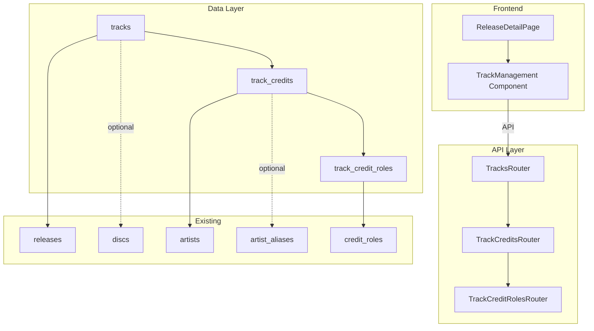
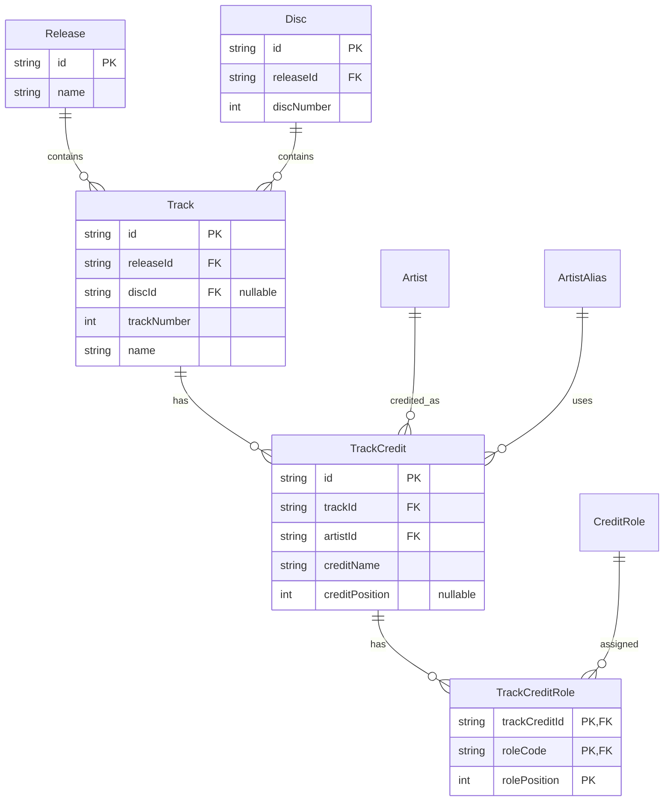

# Technical Design: Track Management

## Overview

**Purpose**: 本機能は、音楽カタログシステムにおけるトラック（楽曲）管理機能を提供する。リリース内の個々の楽曲情報、アーティストクレジット、役割情報を体系的に管理可能にする。

**Users**: 管理者がリリース詳細画面からトラック情報の登録・編集・削除、クレジット管理、役割付与を行う。

**Impact**: 既存のリリース管理システムを拡張し、tracks、track_credits、track_credit_rolesの3テーブルを追加。作品詳細画面にトラック管理セクションを新設。

### Goals
- トラック情報（曲名、トラック番号）のCRUD操作
- ディスク有無に対応した柔軟なトラック管理（CDアルバム形式・配信シングル形式）
- アーティストクレジット（盤面表記と本人の対応付け）の管理
- クレジットへの複数役割付与
- 既存discs、releaseCirclesパターンとの整合性維持

### Non-Goals
- トラックの再生・プレビュー機能
- 外部音楽サービスとの連携
- トラック単体での検索・一覧ページ
- 公式楽曲（原曲）との関連付け（将来機能として検討）

## Architecture

### Existing Architecture Analysis

現行システムは以下の構成を持つ：
- **データ層**: Drizzle ORM + SQLite（Turso）、packages/db/src/schema/配下にドメイン別スキーマ
- **API層**: Hono router、apps/server/src/routes/admin/配下にリソース別ルート
- **フロントエンド**: TanStack Start + TanStack Router + TanStack Query

トラック管理は既存のrelease.ts（releases, discs, releaseCircles）パターンを踏襲し、新規track.tsとして分離して実装。

### Architecture Pattern & Boundary Map



**Architecture Integration**:
- **Selected pattern**: Hybrid Approach（スキーマ分離 + API統合）
- **Domain boundaries**: track.ts/track.validation.tsとして独立、APIはreleases/配下に統合
- **Existing patterns preserved**: nanoid ID生成、timestamp_ms、Zodバリデーション、position swap
- **New components rationale**: 3テーブル追加によるrelease.ts肥大化回避
- **Steering compliance**: モノレポ構成、packages/db → apps/serverの依存方向維持

### Technology Stack

| Layer | Choice / Version | Role in Feature | Notes |
|-------|------------------|-----------------|-------|
| Frontend | React 19 + TanStack Start | トラック管理UI | 既存releases_.$id.tsxに追加 |
| State | TanStack Query | サーバー状態管理 | ネストクエリ（tracks, credits） |
| API | Hono | REST API | /releases/:id/tracks/* |
| ORM | Drizzle ORM | スキーマ定義・クエリ | 部分インデックスにsqlテンプレート使用 |
| Database | SQLite (Turso) | データ永続化 | 条件付きUNIQUE INDEX |
| Validation | Zod + drizzle-zod | 入力検証 | 既存パターン踏襲 |

## Requirements Traceability

| Requirement | Summary | Components | Interfaces | Flows |
|-------------|---------|------------|------------|-------|
| 1.1-1.7 | トラック基本情報CRUD | tracks, TrackDialog | tracksApi | CreateTrack, UpdateTrack, DeleteTrack |
| 2.1-2.5 | ディスク関連管理 | tracks | tracksApi | CreateTrack with discId |
| 3.1-3.5 | 並び順管理 | tracks, TrackList | tracksApi.reorder | ReorderTrack |
| 4.1-4.7 | クレジット管理 | trackCredits, CreditDialog | trackCreditsApi | CreateCredit, UpdateCredit |
| 5.1-5.5 | 役割管理 | trackCreditRoles | trackCreditRolesApi | AddRole, RemoveRole |
| 6.1-6.5 | 一覧表示 | TrackSection, TrackList | tracksApi.list | ListTracks |
| 7.1-7.6 | データ整合性 | FK制約、バリデーション | - | - |

## Components and Interfaces

| Component | Domain/Layer | Intent | Req Coverage | Key Dependencies | Contracts |
|-----------|--------------|--------|--------------|------------------|-----------|
| tracks | Data | トラック本体テーブル | 1, 2, 3 | releases, discs (P0) | Schema |
| trackCredits | Data | クレジット情報テーブル | 4 | tracks, artists (P0) | Schema |
| trackCreditRoles | Data | 役割情報テーブル | 5 | trackCredits, creditRoles (P0) | Schema |
| TracksRouter | API | トラックCRUD API | 1, 2, 3, 6 | @thac/db (P0) | API |
| TrackCreditsRouter | API | クレジットCRUD API | 4 | @thac/db (P0) | API |
| TrackCreditRolesRouter | API | 役割CRUD API | 5 | @thac/db (P0) | API |
| TrackSection | UI | トラック一覧セクション | 6 | tracksApi (P0) | State |
| TrackDialog | UI | トラック編集ダイアログ | 1 | tracksApi (P0) | State |
| CreditDialog | UI | クレジット編集ダイアログ | 4, 5 | trackCreditsApi (P0) | State |

### Data Layer

#### tracks

| Field | Detail |
|-------|--------|
| Intent | リリース内の個々の楽曲情報を保持 |
| Requirements | 1.1-1.7, 2.1-2.5, 3.1-3.5 |

**Responsibilities & Constraints**
- リリースに紐づくトラック情報の永続化
- disc_idはNULL許容（単曲公開対応）
- track_numberはディスク有無で異なる一意制約

**Dependencies**
- Outbound: releases.id — 親リリース (P0)
- Outbound: discs.id — 親ディスク（任意） (P1)

**Contracts**: Schema [x]

##### Schema Definition
```typescript
export const tracks = sqliteTable(
  "tracks",
  {
    id: text("id").primaryKey(),
    releaseId: text("release_id")
      .notNull()
      .references(() => releases.id, { onDelete: "cascade" }),
    discId: text("disc_id")
      .references(() => discs.id, { onDelete: "cascade" }),
    trackNumber: integer("track_number").notNull(),
    name: text("name").notNull(),
    nameJa: text("name_ja"),
    nameEn: text("name_en"),
    createdAt: integer("created_at", { mode: "timestamp_ms" })
      .default(sql`(cast(unixepoch('subsecond') * 1000 as integer))`)
      .notNull(),
    updatedAt: integer("updated_at", { mode: "timestamp_ms" })
      .default(sql`(cast(unixepoch('subsecond') * 1000 as integer))`)
      .$onUpdate(() => new Date())
      .notNull(),
  },
  (table) => [
    index("idx_tracks_release").on(table.releaseId),
    index("idx_tracks_disc").on(table.discId),
    // 条件付き一意インデックス（disc_id有無で分岐）
    uniqueIndex("uq_tracks_release_tracknumber")
      .on(table.releaseId, table.trackNumber)
      .where(sql`${table.discId} IS NULL`),
    uniqueIndex("uq_tracks_disc_tracknumber")
      .on(table.discId, table.trackNumber)
      .where(sql`${table.discId} IS NOT NULL`),
  ],
);
```

**Implementation Notes**
- 部分インデックスはsqlテンプレート使用（Drizzle既知問題の回避策）
- マイグレーション生成後に手動確認必要

#### trackCredits

| Field | Detail |
|-------|--------|
| Intent | 盤面表記とアーティスト/別名義の対応を管理 |
| Requirements | 4.1-4.7 |

**Responsibilities & Constraints**
- トラックごとのクレジット情報永続化
- credit_nameは盤面に記載される表記（必須）
- 同一トラック・同一アーティスト・同一別名義の重複防止

**Dependencies**
- Outbound: tracks.id — 親トラック (P0)
- Outbound: artists.id — アーティスト (P0)
- Outbound: artistAliases.id — 別名義（任意） (P1)
- Outbound: aliasTypes.code — 別名義種別（任意） (P1)

**Contracts**: Schema [x]

##### Schema Definition
```typescript
export const trackCredits = sqliteTable(
  "track_credits",
  {
    id: text("id").primaryKey(),
    trackId: text("track_id")
      .notNull()
      .references(() => tracks.id, { onDelete: "cascade" }),
    artistId: text("artist_id")
      .notNull()
      .references(() => artists.id, { onDelete: "restrict" }),
    creditName: text("credit_name").notNull(),
    aliasTypeCode: text("alias_type_code")
      .references(() => aliasTypes.code),
    creditPosition: integer("credit_position"),
    artistAliasId: text("artist_alias_id")
      .references(() => artistAliases.id, { onDelete: "set null" }),
    createdAt: integer("created_at", { mode: "timestamp_ms" })
      .default(sql`(cast(unixepoch('subsecond') * 1000 as integer))`)
      .notNull(),
    updatedAt: integer("updated_at", { mode: "timestamp_ms" })
      .default(sql`(cast(unixepoch('subsecond') * 1000 as integer))`)
      .$onUpdate(() => new Date())
      .notNull(),
  },
  (table) => [
    index("idx_track_credits_track").on(table.trackId),
    index("idx_track_credits_artist").on(table.artistId),
    index("idx_track_credits_alias").on(table.artistAliasId),
    // 同一アーティスト・同一別名義の重複防止
    uniqueIndex("uq_track_credits_unique").on(
      table.trackId,
      table.artistId,
      sql`COALESCE(${table.artistAliasId}, ${table.artistId})`,
    ),
  ],
);
```

#### trackCreditRoles

| Field | Detail |
|-------|--------|
| Intent | クレジットに対する役割（多対多）を管理 |
| Requirements | 5.1-5.5 |

**Responsibilities & Constraints**
- 1クレジットに複数役割を付与可能
- 複合主キー（track_credit_id, role_code, role_position）

**Dependencies**
- Outbound: trackCredits.id — 親クレジット (P0)
- Outbound: creditRoles.code — 役割マスター (P0)

**Contracts**: Schema [x]

##### Schema Definition
```typescript
export const trackCreditRoles = sqliteTable(
  "track_credit_roles",
  {
    trackCreditId: text("track_credit_id")
      .notNull()
      .references(() => trackCredits.id, { onDelete: "cascade" }),
    roleCode: text("role_code")
      .notNull()
      .references(() => creditRoles.code),
    rolePosition: integer("role_position").notNull().default(1),
  },
  (table) => [
    primaryKey({ columns: [table.trackCreditId, table.roleCode, table.rolePosition] }),
    index("idx_track_credit_roles_credit").on(table.trackCreditId),
  ],
);
```

### API Layer

#### TracksRouter

| Field | Detail |
|-------|--------|
| Intent | トラックのCRUD操作を提供 |
| Requirements | 1.1-1.7, 2.1-2.5, 3.1-3.5, 6.1-6.5 |

**Responsibilities & Constraints**
- リリースIDをパスパラメータとして受け取る
- トラック番号の一意性検証（disc_id有無で分岐）
- 並び順変更時の自動再採番

**Dependencies**
- Inbound: AdminContext — 認証ミドルウェア (P0)
- Outbound: @thac/db — スキーマ・バリデーション (P0)

**Contracts**: API [x]

##### API Contract

| Method | Endpoint | Request | Response | Errors |
|--------|----------|---------|----------|--------|
| GET | /api/admin/releases/:releaseId/tracks | - | Track[] with credits summary | 404 |
| POST | /api/admin/releases/:releaseId/tracks | InsertTrack | Track | 400, 404, 409 |
| PUT | /api/admin/releases/:releaseId/tracks/:trackId | UpdateTrack | Track | 400, 404, 409 |
| DELETE | /api/admin/releases/:releaseId/tracks/:trackId | - | { success: true } | 404 |
| PATCH | /api/admin/releases/:releaseId/tracks/:trackId/reorder | { direction: "up" \| "down" } | Track[] | 400, 404 |

#### TrackCreditsRouter

| Field | Detail |
|-------|--------|
| Intent | トラッククレジットのCRUD操作を提供 |
| Requirements | 4.1-4.7 |

**Contracts**: API [x]

##### API Contract

| Method | Endpoint | Request | Response | Errors |
|--------|----------|---------|----------|--------|
| GET | /api/admin/releases/:releaseId/tracks/:trackId/credits | - | TrackCredit[] with roles | 404 |
| POST | /api/admin/releases/:releaseId/tracks/:trackId/credits | InsertTrackCredit | TrackCredit | 400, 404, 409 |
| PUT | /api/admin/releases/:releaseId/tracks/:trackId/credits/:creditId | UpdateTrackCredit | TrackCredit | 400, 404, 409 |
| DELETE | /api/admin/releases/:releaseId/tracks/:trackId/credits/:creditId | - | { success: true } | 404 |

**Implementation Notes**
- GET /credits はJOINクエリで役割情報を含めて取得し、アプリケーション層でグルーピング
- N+1クエリを回避するため、単一クエリで全データ取得
```typescript
// クレジット一覧取得時のJOINクエリ例
const results = await db
  .select({
    credit: trackCredits,
    role: trackCreditRoles,
  })
  .from(trackCredits)
  .leftJoin(trackCreditRoles, eq(trackCredits.id, trackCreditRoles.trackCreditId))
  .where(eq(trackCredits.trackId, trackId))
  .orderBy(trackCredits.creditPosition, trackCreditRoles.rolePosition);

// グルーピング処理
const grouped = Object.values(
  results.reduce<Record<string, TrackCreditWithRoles>>((acc, row) => {
    if (!acc[row.credit.id]) {
      acc[row.credit.id] = { ...row.credit, roles: [] };
    }
    if (row.role) {
      acc[row.credit.id].roles.push(row.role);
    }
    return acc;
  }, {})
);
```

#### TrackCreditRolesRouter

| Field | Detail |
|-------|--------|
| Intent | クレジット役割の追加・削除を提供 |
| Requirements | 5.1-5.5 |

**Contracts**: API [x]

##### API Contract

| Method | Endpoint | Request | Response | Errors |
|--------|----------|---------|----------|--------|
| POST | /api/admin/.../credits/:creditId/roles | { roleCode, rolePosition } | TrackCreditRole | 400, 404, 409 |
| DELETE | /api/admin/.../credits/:creditId/roles/:roleCode/:rolePosition | - | { success: true } | 404 |

### UI Layer

#### TrackSection

| Field | Detail |
|-------|--------|
| Intent | 作品詳細画面にトラック一覧セクションを表示 |
| Requirements | 6.1-6.5 |

**Responsibilities & Constraints**
- ディスクごとにグループ化したトラック一覧表示
- ディスクなしトラック（単曲）は別セクション
- クレジット情報の要約表示

**Dependencies**
- Inbound: ReleaseDetailPage — 親コンポーネント (P0)
- Outbound: tracksApi — データ取得 (P0)

**Contracts**: State [x]

##### State Management
```typescript
// TanStack Query
const { data: tracks } = useQuery({
  queryKey: ["releases", releaseId, "tracks"],
  queryFn: () => tracksApi.list(releaseId),
});

// グループ化
const groupedTracks = useMemo(() => {
  const withDisc = tracks?.filter(t => t.discId) ?? [];
  const withoutDisc = tracks?.filter(t => !t.discId) ?? [];
  return { withDisc, withoutDisc };
}, [tracks]);
```

**Implementation Notes**
- 既存ディスク一覧カード、サークルカードと同パターンのUIカード
- 各トラック行に上下ボタン（並び順変更）、編集・削除ボタン

#### TrackDialog

| Field | Detail |
|-------|--------|
| Intent | トラック新規作成・編集用モーダル |
| Requirements | 1.1-1.7, 2.1-2.5 |

**Implementation Notes**
- 既存DiscDialogパターン踏襲
- ディスク選択ドロップダウン（「なし」選択可）
- トラック番号は自動採番 or 手動入力

#### CreditDialog

| Field | Detail |
|-------|--------|
| Intent | クレジット新規作成・編集用モーダル（役割選択含む） |
| Requirements | 4.1-4.7, 5.1-5.5 |

**Implementation Notes**
- アーティスト検索選択（SearchableSelect使用）
- 別名義選択（選択アーティストの別名義をフィルタ表示）
- 役割は複数選択チェックボックス形式
- 盤面表記（credit_name）は自動入力（アーティスト名 or 別名義名）+ 手動編集可

## Data Models

### Domain Model



**Aggregates and Boundaries**:
- Track: releaseId必須、discId任意
- TrackCredit: Track削除時CASCADE
- TrackCreditRole: TrackCredit削除時CASCADE

**Business Rules & Invariants**:
- trackNumber >= 1
- disc_id有無で異なる一意制約
- アーティスト削除時はRESTRICT（クレジット存在時は削除拒否）

### Physical Data Model

#### テーブル定義

| Table | Primary Key | Foreign Keys | Indexes |
|-------|-------------|--------------|---------|
| tracks | id | release_id→releases, disc_id→discs | idx_tracks_release, idx_tracks_disc, uq_tracks_release_tracknumber (WHERE disc_id IS NULL), uq_tracks_disc_tracknumber (WHERE disc_id IS NOT NULL) |
| track_credits | id | track_id→tracks, artist_id→artists, artist_alias_id→artist_aliases | idx_track_credits_track, idx_track_credits_artist, uq_track_credits_unique |
| track_credit_roles | (track_credit_id, role_code, role_position) | track_credit_id→track_credits, role_code→credit_roles | idx_track_credit_roles_credit |

### Data Contracts & Integration

#### Validation Schemas

```typescript
// Track
export const insertTrackSchema = createInsertSchema(tracks, {
  id: nonEmptyString,
  releaseId: nonEmptyString,
  discId: optionalString,
  trackNumber: z.number().int().positive("1以上の整数を入力してください"),
  name: nonEmptyString.max(200, "200文字以内で入力してください"),
  nameJa: optionalString,
  nameEn: optionalString,
}).omit({ createdAt: true, updatedAt: true });

export const updateTrackSchema = z.object({
  discId: optionalString,
  trackNumber: z.number().int().positive().optional(),
  name: nonEmptyString.max(200).optional(),
  nameJa: optionalString,
  nameEn: optionalString,
});

// TrackCredit
export const insertTrackCreditSchema = createInsertSchema(trackCredits, {
  id: nonEmptyString,
  trackId: nonEmptyString,
  artistId: nonEmptyString,
  creditName: nonEmptyString.max(200),
  aliasTypeCode: optionalString,
  creditPosition: z.number().int().min(1).optional().nullable(),
  artistAliasId: optionalString,
}).omit({ createdAt: true, updatedAt: true });

// TrackCreditRole
export const insertTrackCreditRoleSchema = z.object({
  trackCreditId: nonEmptyString,
  roleCode: nonEmptyString,
  rolePosition: z.number().int().min(1).default(1),
});
```

## Error Handling

### Error Categories and Responses

**User Errors (4xx)**:
- 400 Validation Failed: フィールドレベルエラー詳細を返却
- 404 Not Found: リリース/トラック/クレジット未存在
- 409 Conflict: トラック番号重複、クレジット重複

**System Errors (5xx)**:
- 500 Internal Server Error: DB接続エラー等

**特殊ケース**:
- アーティスト削除時RESTRICT: 「このアーティストはクレジットで使用されているため削除できません」

### Monitoring
- 既存パターン踏襲（console.error + Hono標準エラーハンドリング）

## Testing Strategy

### Unit Tests
- insertTrackSchema バリデーション（必須項目、型、範囲）
- insertTrackCreditSchema バリデーション
- trackNumber一意性チェックロジック（disc_id有無分岐）

### Integration Tests
- TracksRouter: CRUD操作、並び順変更
- TrackCreditsRouter: CRUD操作、重複防止
- カスケード削除（Release削除→Track削除→Credit削除→Role削除）
- RESTRICT制約（Artist削除拒否）

### E2E/UI Tests
- トラック追加→編集→削除フロー
- クレジット追加（役割選択含む）→編集→削除フロー
- 並び順変更（上下ボタン）

## Supporting References

### API Client Types

```typescript
// apps/web/src/lib/api-client.ts に追加

export interface Track {
  id: string;
  releaseId: string;
  discId: string | null;
  trackNumber: number;
  name: string;
  nameJa: string | null;
  nameEn: string | null;
  createdAt: number;
  updatedAt: number;
}

export interface TrackWithCredits extends Track {
  credits: TrackCreditWithRoles[];
}

export interface TrackCredit {
  id: string;
  trackId: string;
  artistId: string;
  creditName: string;
  aliasTypeCode: string | null;
  creditPosition: number | null;
  artistAliasId: string | null;
  createdAt: number;
  updatedAt: number;
  artist?: { id: string; name: string };
  artistAlias?: { id: string; name: string } | null;
}

export interface TrackCreditWithRoles extends TrackCredit {
  roles: TrackCreditRole[];
}

export interface TrackCreditRole {
  trackCreditId: string;
  roleCode: string;
  rolePosition: number;
  role?: { code: string; label: string };
}

export const tracksApi = {
  list: (releaseId: string) =>
    fetchWithAuth<TrackWithCredits[]>(`/api/admin/releases/${releaseId}/tracks`),
  create: (releaseId: string, data: Omit<Track, "createdAt" | "updatedAt">) =>
    fetchWithAuth<Track>(`/api/admin/releases/${releaseId}/tracks`, {
      method: "POST",
      body: JSON.stringify(data),
    }),
  update: (releaseId: string, trackId: string, data: Partial<Track>) =>
    fetchWithAuth<Track>(`/api/admin/releases/${releaseId}/tracks/${trackId}`, {
      method: "PUT",
      body: JSON.stringify(data),
    }),
  delete: (releaseId: string, trackId: string) =>
    fetchWithAuth<{ success: boolean }>(
      `/api/admin/releases/${releaseId}/tracks/${trackId}`,
      { method: "DELETE" }
    ),
  reorder: (releaseId: string, trackId: string, direction: "up" | "down") =>
    fetchWithAuth<Track[]>(
      `/api/admin/releases/${releaseId}/tracks/${trackId}/reorder`,
      { method: "PATCH", body: JSON.stringify({ direction }) }
    ),
};

export const trackCreditsApi = {
  list: (releaseId: string, trackId: string) =>
    fetchWithAuth<TrackCreditWithRoles[]>(
      `/api/admin/releases/${releaseId}/tracks/${trackId}/credits`
    ),
  create: (releaseId: string, trackId: string, data: Omit<TrackCredit, "createdAt" | "updatedAt">) =>
    fetchWithAuth<TrackCredit>(
      `/api/admin/releases/${releaseId}/tracks/${trackId}/credits`,
      { method: "POST", body: JSON.stringify(data) }
    ),
  update: (releaseId: string, trackId: string, creditId: string, data: Partial<TrackCredit>) =>
    fetchWithAuth<TrackCredit>(
      `/api/admin/releases/${releaseId}/tracks/${trackId}/credits/${creditId}`,
      { method: "PUT", body: JSON.stringify(data) }
    ),
  delete: (releaseId: string, trackId: string, creditId: string) =>
    fetchWithAuth<{ success: boolean }>(
      `/api/admin/releases/${releaseId}/tracks/${trackId}/credits/${creditId}`,
      { method: "DELETE" }
    ),
};

export const trackCreditRolesApi = {
  add: (releaseId: string, trackId: string, creditId: string, data: { roleCode: string; rolePosition?: number }) =>
    fetchWithAuth<TrackCreditRole>(
      `/api/admin/releases/${releaseId}/tracks/${trackId}/credits/${creditId}/roles`,
      { method: "POST", body: JSON.stringify(data) }
    ),
  remove: (releaseId: string, trackId: string, creditId: string, roleCode: string, rolePosition: number) =>
    fetchWithAuth<{ success: boolean }>(
      `/api/admin/releases/${releaseId}/tracks/${trackId}/credits/${creditId}/roles/${roleCode}/${rolePosition}`,
      { method: "DELETE" }
    ),
};
```
