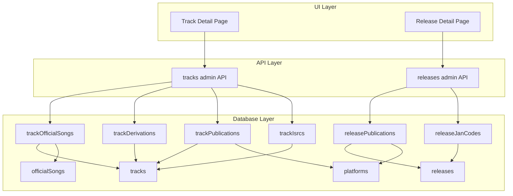
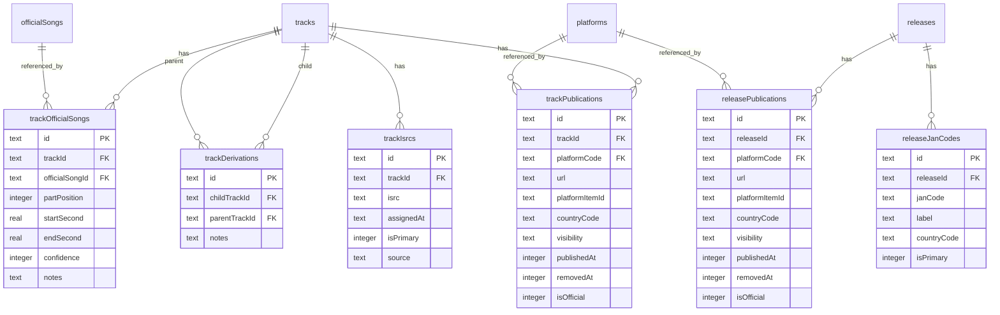

# Design Document: track-relations

## Overview

**Purpose**: 本機能は、トラックおよびリリースに紐づく各種メタデータ・関連情報の管理機能を提供する。

**Users**: 管理者がトラック詳細画面およびリリース詳細画面から、原曲紐付け・派生関係・公開リンク・識別コード（JAN/ISRC）を管理する。

**Impact**: 既存のトラック・リリースエンティティに6つの新規関連テーブルを追加し、詳細画面に新しい管理セクションを追加する。

### Goals

- トラックと公式楽曲（原曲）の関連を正確に記録・検索可能にする
- トラック間の派生関係（リミックス・アレンジ等）を管理可能にする
- リリース・トラック単位の公開リンク情報を一元管理する
- JAN/ISRC等の識別コードを記録・検索可能にする
- 既存のDrizzle ORM/Hono/TanStack Queryパターンに準拠する

### Non-Goals

- テンポ管理機能（将来の拡張として検討）
- 派生関係の循環検出（初期実装では自己参照チェックのみ）
- 公開リンクの自動検証（URL到達確認等）
- JANコードのチェックディジット検証

## Architecture

### Existing Architecture Analysis

- **現行パターン**: Drizzle ORM + SQLite（Turso）、Hono API、TanStack Router/Query
- **既存ドメイン境界**: tracks, releases, officialSongs, platforms（すべて既存）
- **維持する統合ポイント**:
  - `tracks.id` への外部キー参照
  - `releases.id` への外部キー参照
  - `officialSongs.id` への外部キー参照
  - `platforms.code` への外部キー参照（code主キー形式）

### Architecture Pattern & Boundary Map



**Architecture Integration**:
- **Selected pattern**: 既存のレイヤードアーキテクチャを踏襲（Schema → API → UI）
- **Domain boundaries**: トラック関連（4テーブル）とリリース関連（2テーブル）を明確に分離
- **Existing patterns preserved**: Drizzle ORM、Hono Router、TanStack Query
- **New components rationale**: 各テーブルは独立したCRUD責任を持つ
- **Steering compliance**: ID生成規則、タイムスタンプ形式、バリデーションパターンに準拠

### Technology Stack

| Layer | Choice / Version | Role in Feature | Notes |
|-------|------------------|-----------------|-------|
| Frontend | TanStack Router / Query | 詳細画面のセクション追加、データフェッチ | 既存パターン踏襲 |
| Backend | Hono | 新規CRUDエンドポイント | 既存AdminContextを使用 |
| Data | Drizzle ORM / SQLite | 6テーブル追加 | nanoid ID、integer timestamp |
| Validation | Zod | 入力バリデーション | drizzle-zodで生成 |

## Requirements Traceability

| Requirement | Summary | Components | Interfaces | Flows |
|-------------|---------|------------|------------|-------|
| 1.1-1.6 | 原曲紐付け管理 | trackOfficialSongs, TrackOfficialSongsSection | tracks API | CRUD |
| 2.1-2.6 | トラック派生関係 | trackDerivations, TrackDerivationsSection | tracks API | CRUD |
| 3.1-3.7 | リリース公開リンク | releasePublications, ReleasePublicationsSection | releases API | CRUD |
| 4.1-4.6 | トラック公開リンク | trackPublications, TrackPublicationsSection | tracks API | CRUD |
| 5.1-5.6 | JANコード管理 | releaseJanCodes, ReleaseJanCodesSection | releases API | CRUD |
| 6.1-6.6 | ISRC管理 | trackIsrcs, TrackIsrcsSection | tracks API | CRUD |
| 8.1-8.6 | SQLite変換 | 全スキーマ | - | - |

## Components and Interfaces

| Component | Domain/Layer | Intent | Req Coverage | Key Dependencies | Contracts |
|-----------|--------------|--------|--------------|-----------------|-----------|
| trackOfficialSongs | DB/Schema | 原曲紐付けテーブル | 1.1-1.6 | tracks (P0), officialSongs (P0) | - |
| trackDerivations | DB/Schema | 派生関係テーブル | 2.1-2.6 | tracks (P0) | - |
| releasePublications | DB/Schema | リリース公開リンク | 3.1-3.7 | releases (P0), platforms (P0) | - |
| trackPublications | DB/Schema | トラック公開リンク | 4.1-4.6 | tracks (P0), platforms (P0) | - |
| releaseJanCodes | DB/Schema | JANコードテーブル | 5.1-5.6 | releases (P0) | - |
| trackIsrcs | DB/Schema | ISRCテーブル | 6.1-6.6 | tracks (P0) | - |
| trackOfficialSongsApi | API | 原曲紐付けCRUD | 1.1-1.6 | trackOfficialSongs (P0) | API |
| trackDerivationsApi | API | 派生関係CRUD | 2.1-2.6 | trackDerivations (P0) | API |
| releasePublicationsApi | API | リリース公開リンクCRUD | 3.1-3.7 | releasePublications (P0) | API |
| trackPublicationsApi | API | トラック公開リンクCRUD | 4.1-4.6 | trackPublications (P0) | API |
| releaseJanCodesApi | API | JANコードCRUD | 5.1-5.6 | releaseJanCodes (P0) | API |
| trackIsrcsApi | API | ISRC CRUD | 6.1-6.6 | trackIsrcs (P0) | API |
| TrackOfficialSongsSection | UI | 原曲紐付けUI | 1.1-1.6 | trackOfficialSongsApi (P0) | State |
| TrackDerivationsSection | UI | 派生関係UI | 2.1-2.6 | trackDerivationsApi (P0) | State |

### Database Layer

#### trackOfficialSongs

| Field | Detail |
|-------|--------|
| Intent | トラックと公式楽曲（原曲）の関連を管理 |
| Requirements | 1.1, 1.2, 1.3, 1.4, 1.5, 1.6 |

**Responsibilities & Constraints**
- トラック × 公式楽曲 × 順序の一意性保証
- 開始秒・終了秒の整合性チェック（start <= end）
- confidence は 0-100 の範囲
- 公式楽曲削除時は RESTRICT

**Dependencies**
- Outbound: tracks — 親トラック参照 (P0)
- Outbound: officialSongs — 原曲参照 (P0)

#### trackDerivations

| Field | Detail |
|-------|--------|
| Intent | トラック間の派生関係を管理 |
| Requirements | 2.1, 2.2, 2.3, 2.4, 2.5, 2.6 |

**Responsibilities & Constraints**
- 自己参照禁止（child ≠ parent）
- 同一派生関係の重複禁止
- 親トラック削除時は RESTRICT、子トラック削除時は CASCADE

**Dependencies**
- Outbound: tracks (child) — 派生先トラック (P0)
- Outbound: tracks (parent) — 派生元トラック (P0)

#### releasePublications

| Field | Detail |
|-------|--------|
| Intent | リリース単位の公開・配信リンクを管理 |
| Requirements | 3.1, 3.2, 3.3, 3.4, 3.5, 3.6, 3.7 |

**Responsibilities & Constraints**
- リリース × プラットフォーム × プラットフォーム内ID の一意性
- 同一リリース内でのURL重複禁止
- 国コードは ISO 3166-1 alpha-2 形式

**Dependencies**
- Outbound: releases — 親リリース参照 (P0)
- Outbound: platforms — プラットフォーム参照 (P0)

#### trackPublications

| Field | Detail |
|-------|--------|
| Intent | トラック単位の公開・配信リンクを管理 |
| Requirements | 4.1, 4.2, 4.3, 4.4, 4.5, 4.6 |

**Responsibilities & Constraints**
- トラック × プラットフォーム × プラットフォーム内ID の一意性
- 同一トラック内でのURL重複禁止

**Dependencies**
- Outbound: tracks — 親トラック参照 (P0)
- Outbound: platforms — プラットフォーム参照 (P0)

#### releaseJanCodes

| Field | Detail |
|-------|--------|
| Intent | リリースのJANコード（バーコード）を管理 |
| Requirements | 5.1, 5.2, 5.3, 5.4, 5.5, 5.6 |

**Responsibilities & Constraints**
- JANコードはグローバル一意
- 8桁または13桁のみ許可
- 1リリースにつき is_primary は1件のみ

**Dependencies**
- Outbound: releases — 親リリース参照 (P0)

#### trackIsrcs

| Field | Detail |
|-------|--------|
| Intent | トラックのISRCを管理 |
| Requirements | 6.1, 6.2, 6.3, 6.4, 6.5, 6.6 |

**Responsibilities & Constraints**
- トラック × ISRC の一意性
- 12桁の形式チェック（CC-XXX-YY-NNNNN）
- 1トラックにつき is_primary は1件のみ

**Dependencies**
- Outbound: tracks — 親トラック参照 (P0)

### API Layer

#### Track Official Songs API

**Contracts**: API [x]

##### API Contract

| Method | Endpoint | Request | Response | Errors |
|--------|----------|---------|----------|--------|
| GET | /tracks/:trackId/official-songs | - | TrackOfficialSong[] | 404 |
| POST | /tracks/:trackId/official-songs | CreateTrackOfficialSongRequest | TrackOfficialSong | 400, 404, 409 |
| PUT | /tracks/:trackId/official-songs/:id | UpdateTrackOfficialSongRequest | TrackOfficialSong | 400, 404 |
| DELETE | /tracks/:trackId/official-songs/:id | - | { success: true } | 404 |

#### Track Derivations API

##### API Contract

| Method | Endpoint | Request | Response | Errors |
|--------|----------|---------|----------|--------|
| GET | /tracks/:trackId/derivations | - | TrackDerivation[] | 404 |
| POST | /tracks/:trackId/derivations | CreateTrackDerivationRequest | TrackDerivation | 400, 404, 409 |
| DELETE | /tracks/:trackId/derivations/:id | - | { success: true } | 404 |

#### Release Publications API

##### API Contract

| Method | Endpoint | Request | Response | Errors |
|--------|----------|---------|----------|--------|
| GET | /releases/:releaseId/publications | - | ReleasePublication[] | 404 |
| POST | /releases/:releaseId/publications | CreateReleasePublicationRequest | ReleasePublication | 400, 404, 409 |
| PUT | /releases/:releaseId/publications/:id | UpdateReleasePublicationRequest | ReleasePublication | 400, 404 |
| DELETE | /releases/:releaseId/publications/:id | - | { success: true } | 404 |

#### Track Publications API

##### API Contract

| Method | Endpoint | Request | Response | Errors |
|--------|----------|---------|----------|--------|
| GET | /tracks/:trackId/publications | - | TrackPublication[] | 404 |
| POST | /tracks/:trackId/publications | CreateTrackPublicationRequest | TrackPublication | 400, 404, 409 |
| PUT | /tracks/:trackId/publications/:id | UpdateTrackPublicationRequest | TrackPublication | 400, 404 |
| DELETE | /tracks/:trackId/publications/:id | - | { success: true } | 404 |

#### Release JAN Codes API

##### API Contract

| Method | Endpoint | Request | Response | Errors |
|--------|----------|---------|----------|--------|
| GET | /releases/:releaseId/jan-codes | - | ReleaseJanCode[] | 404 |
| POST | /releases/:releaseId/jan-codes | CreateReleaseJanCodeRequest | ReleaseJanCode | 400, 404, 409 |
| PUT | /releases/:releaseId/jan-codes/:id | UpdateReleaseJanCodeRequest | ReleaseJanCode | 400, 404 |
| DELETE | /releases/:releaseId/jan-codes/:id | - | { success: true } | 404 |

#### Track ISRCs API

##### API Contract

| Method | Endpoint | Request | Response | Errors |
|--------|----------|---------|----------|--------|
| GET | /tracks/:trackId/isrcs | - | TrackIsrc[] | 404 |
| POST | /tracks/:trackId/isrcs | CreateTrackIsrcRequest | TrackIsrc | 400, 404, 409 |
| PUT | /tracks/:trackId/isrcs/:id | UpdateTrackIsrcRequest | TrackIsrc | 400, 404 |
| DELETE | /tracks/:trackId/isrcs/:id | - | { success: true } | 404 |

## Data Models

### Logical Data Model



### Physical Data Model

#### Schema Files Structure

```
packages/db/src/schema/
├── track-relations.ts      # trackOfficialSongs, trackDerivations
├── track-relations.validation.ts
├── publication.ts          # releasePublications, trackPublications
├── publication.validation.ts
├── identifier.ts           # releaseJanCodes, trackIsrcs
├── identifier.validation.ts
```

#### ID Generation Prefixes

| Table | Prefix | Example |
|-------|--------|---------|
| trackOfficialSongs | `to_` | `to_aBcD1eFgH2iJkL3mNoPq4r` |
| trackDerivations | `td_` | `td_aBcD1eFgH2iJkL3mNoPq4r` |
| releasePublications | `rp_` | `rp_aBcD1eFgH2iJkL3mNoPq4r` |
| trackPublications | `tp_` | `tp_aBcD1eFgH2iJkL3mNoPq4r` |
| releaseJanCodes | `rj_` | `rj_aBcD1eFgH2iJkL3mNoPq4r` |
| trackIsrcs | `ti_` | `ti_aBcD1eFgH2iJkL3mNoPq4r` |

#### Table Definitions

##### trackOfficialSongs

```typescript
export const trackOfficialSongs = sqliteTable(
  "track_official_songs",
  {
    id: text("id").primaryKey(),
    trackId: text("track_id")
      .notNull()
      .references(() => tracks.id, { onDelete: "cascade" }),
    officialSongId: text("official_song_id")
      .notNull()
      .references(() => officialSongs.id, { onDelete: "restrict" }),
    partPosition: integer("part_position"),
    startSecond: real("start_second"),
    endSecond: real("end_second"),
    confidence: integer("confidence"),
    notes: text("notes"),
    createdAt: integer("created_at", { mode: "timestamp_ms" })
      .default(sql`(cast(unixepoch('subsecond') * 1000 as integer))`)
      .notNull(),
    updatedAt: integer("updated_at", { mode: "timestamp_ms" })
      .default(sql`(cast(unixepoch('subsecond') * 1000 as integer))`)
      .$onUpdate(() => new Date())
      .notNull(),
  },
  (table) => [
    index("idx_track_official_songs_track").on(table.trackId),
    index("idx_track_official_songs_song").on(table.officialSongId),
    uniqueIndex("uq_track_official_songs").on(
      table.trackId,
      table.officialSongId,
      table.partPosition
    ),
  ]
);
```

##### trackDerivations

```typescript
export const trackDerivations = sqliteTable(
  "track_derivations",
  {
    id: text("id").primaryKey(),
    childTrackId: text("child_track_id")
      .notNull()
      .references(() => tracks.id, { onDelete: "cascade" }),
    parentTrackId: text("parent_track_id")
      .notNull()
      .references(() => tracks.id, { onDelete: "restrict" }),
    notes: text("notes"),
    createdAt: integer("created_at", { mode: "timestamp_ms" })
      .default(sql`(cast(unixepoch('subsecond') * 1000 as integer))`)
      .notNull(),
    updatedAt: integer("updated_at", { mode: "timestamp_ms" })
      .default(sql`(cast(unixepoch('subsecond') * 1000 as integer))`)
      .$onUpdate(() => new Date())
      .notNull(),
  },
  (table) => [
    index("idx_track_derivations_child").on(table.childTrackId),
    index("idx_track_derivations_parent").on(table.parentTrackId),
    uniqueIndex("uq_track_derivations").on(
      table.childTrackId,
      table.parentTrackId
    ),
  ]
);
```

##### releasePublications

```typescript
export const releasePublications = sqliteTable(
  "release_publications",
  {
    id: text("id").primaryKey(),
    releaseId: text("release_id")
      .notNull()
      .references(() => releases.id, { onDelete: "cascade" }),
    platformCode: text("platform_code")
      .notNull()
      .references(() => platforms.code, { onDelete: "restrict" }),
    url: text("url").notNull(),
    platformItemId: text("platform_item_id"),
    countryCode: text("country_code"),
    visibility: text("visibility"),
    publishedAt: integer("published_at", { mode: "timestamp_ms" }),
    removedAt: integer("removed_at", { mode: "timestamp_ms" }),
    isOfficial: integer("is_official", { mode: "boolean" }).default(true).notNull(),
    createdAt: integer("created_at", { mode: "timestamp_ms" })
      .default(sql`(cast(unixepoch('subsecond') * 1000 as integer))`)
      .notNull(),
    updatedAt: integer("updated_at", { mode: "timestamp_ms" })
      .default(sql`(cast(unixepoch('subsecond') * 1000 as integer))`)
      .$onUpdate(() => new Date())
      .notNull(),
  },
  (table) => [
    index("idx_release_publications_release").on(table.releaseId),
    index("idx_release_publications_platform").on(table.platformCode),
    uniqueIndex("uq_release_publications_source").on(
      table.releaseId,
      table.platformCode,
      table.platformItemId
    ),
    uniqueIndex("uq_release_publications_url").on(table.releaseId, table.url),
  ]
);
```

##### trackPublications

```typescript
export const trackPublications = sqliteTable(
  "track_publications",
  {
    id: text("id").primaryKey(),
    trackId: text("track_id")
      .notNull()
      .references(() => tracks.id, { onDelete: "cascade" }),
    platformCode: text("platform_code")
      .notNull()
      .references(() => platforms.code, { onDelete: "restrict" }),
    url: text("url").notNull(),
    platformItemId: text("platform_item_id"),
    countryCode: text("country_code"),
    visibility: text("visibility"),
    publishedAt: integer("published_at", { mode: "timestamp_ms" }),
    removedAt: integer("removed_at", { mode: "timestamp_ms" }),
    isOfficial: integer("is_official", { mode: "boolean" }).default(true).notNull(),
    createdAt: integer("created_at", { mode: "timestamp_ms" })
      .default(sql`(cast(unixepoch('subsecond') * 1000 as integer))`)
      .notNull(),
    updatedAt: integer("updated_at", { mode: "timestamp_ms" })
      .default(sql`(cast(unixepoch('subsecond') * 1000 as integer))`)
      .$onUpdate(() => new Date())
      .notNull(),
  },
  (table) => [
    index("idx_track_publications_track").on(table.trackId),
    index("idx_track_publications_platform").on(table.platformCode),
    uniqueIndex("uq_track_publications_source").on(
      table.trackId,
      table.platformCode,
      table.platformItemId
    ),
    uniqueIndex("uq_track_publications_url").on(table.trackId, table.url),
  ]
);
```

##### releaseJanCodes

```typescript
export const releaseJanCodes = sqliteTable(
  "release_jan_codes",
  {
    id: text("id").primaryKey(),
    releaseId: text("release_id")
      .notNull()
      .references(() => releases.id, { onDelete: "cascade" }),
    janCode: text("jan_code").notNull(),
    label: text("label"),
    countryCode: text("country_code"),
    isPrimary: integer("is_primary", { mode: "boolean" }).default(false).notNull(),
    createdAt: integer("created_at", { mode: "timestamp_ms" })
      .default(sql`(cast(unixepoch('subsecond') * 1000 as integer))`)
      .notNull(),
    updatedAt: integer("updated_at", { mode: "timestamp_ms" })
      .default(sql`(cast(unixepoch('subsecond') * 1000 as integer))`)
      .$onUpdate(() => new Date())
      .notNull(),
  },
  (table) => [
    index("idx_release_jan_codes_release").on(table.releaseId),
    uniqueIndex("uq_release_jan_codes_jan").on(table.janCode),
    uniqueIndex("uq_release_jan_codes_primary")
      .on(table.releaseId)
      .where(sql`${table.isPrimary} = 1`),
  ]
);
```

##### trackIsrcs

```typescript
export const trackIsrcs = sqliteTable(
  "track_isrcs",
  {
    id: text("id").primaryKey(),
    trackId: text("track_id")
      .notNull()
      .references(() => tracks.id, { onDelete: "cascade" }),
    isrc: text("isrc").notNull(),
    assignedAt: text("assigned_at"),
    isPrimary: integer("is_primary", { mode: "boolean" }).default(true).notNull(),
    source: text("source"),
    createdAt: integer("created_at", { mode: "timestamp_ms" })
      .default(sql`(cast(unixepoch('subsecond') * 1000 as integer))`)
      .notNull(),
    updatedAt: integer("updated_at", { mode: "timestamp_ms" })
      .default(sql`(cast(unixepoch('subsecond') * 1000 as integer))`)
      .$onUpdate(() => new Date())
      .notNull(),
  },
  (table) => [
    index("idx_track_isrcs_track").on(table.trackId),
    uniqueIndex("uq_track_isrcs").on(table.trackId, table.isrc),
    uniqueIndex("uq_track_isrcs_primary")
      .on(table.trackId)
      .where(sql`${table.isPrimary} = 1`),
  ]
);
```

### Data Contracts & Integration

#### Validation Schemas

##### JAN Code Validation

```typescript
const janCodeRegex = /^[0-9]{8}$|^[0-9]{13}$/;

export const insertReleaseJanCodeSchema = createInsertSchema(releaseJanCodes, {
  janCode: z.string().regex(janCodeRegex, "8桁または13桁の数字を入力してください"),
  countryCode: z.string().regex(/^[A-Z]{2}$/, "ISO 3166-1 alpha-2形式で入力してください").optional().nullable(),
});
```

##### ISRC Validation

```typescript
const isrcRegex = /^[A-Z]{2}[A-Z0-9]{3}[0-9]{2}[0-9]{5}$/;

export const insertTrackIsrcSchema = createInsertSchema(trackIsrcs, {
  isrc: z.string().regex(isrcRegex, "ISRC形式（例: JPXX01234567）で入力してください"),
});
```

##### Country Code Validation

```typescript
const countryCodeRegex = /^[A-Z]{2}$/;

export const countryCodeSchema = z.string()
  .regex(countryCodeRegex, "ISO 3166-1 alpha-2形式で入力してください")
  .optional()
  .nullable();
```

## Error Handling

### Error Categories and Responses

**User Errors (4xx)**:
- 400: バリデーションエラー（形式不正、範囲外など）
- 404: 親リソースまたは対象リソースが存在しない
- 409: 一意性制約違反（重複登録）

**System Errors (5xx)**:
- 500: データベースエラー、内部エラー

### Validation Error Examples

| 場面 | エラー | メッセージ |
|------|--------|-----------|
| JAN形式不正 | 400 | "8桁または13桁の数字を入力してください" |
| ISRC形式不正 | 400 | "ISRC形式（例: JPXX01234567）で入力してください" |
| 自己参照 | 400 | "自身を派生元に指定することはできません" |
| URL重複 | 409 | "このURLは既に登録されています" |
| is_primary重複 | 409 | "主コードは1件のみ設定可能です" |

## Testing Strategy

### Unit Tests
- バリデーションスキーマ（JAN, ISRC, 国コード形式）
- ID生成関数（新規プレフィックス）
- 秒数整合性チェック（start <= end）

### Integration Tests
- 親リソース存在チェック（トラック・リリース）
- 一意性制約違反の検出
- CASCADE/RESTRICT動作確認
- is_primary制約の動作確認

### E2E/UI Tests
- トラック詳細画面での原曲追加フロー
- リリース詳細画面での公開リンク追加フロー
- JANコード・ISRC登録フロー
- 削除確認ダイアログの動作

