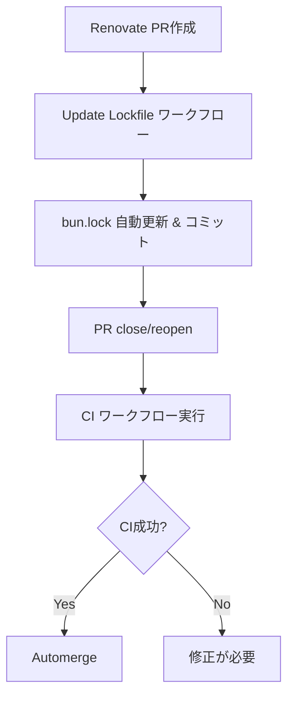

# thac（東方編曲録）

東方Projectの二次創作音楽（アレンジ曲）を管理・検索できるWebアプリケーション。

## 主な機能

- **原曲から探す** - 公式曲からアレンジ曲を検索
- **サークルから探す** - サークルのリリース・アレンジ曲を一覧
- **アーティストから探す** - ボーカル・編曲者など役割別に検索
- **イベントから探す** - 例大祭やコミケなどイベント別に新譜を追う
- **配信先を見つける** - Spotify、BOOTHなど配信リンクを集約
- **統計情報** - サークル・アーティスト・イベント別の統計

## 技術スタック

| カテゴリ | 技術 |
|---------|------|
| フロントエンド | React, TanStack Start, TanStack Router, TailwindCSS v4, daisyUI |
| バックエンド | Hono (Bun) |
| データベース | SQLite (Turso/libsql), Drizzle ORM |
| 認証 | Better-Auth |
| ビルド | Turborepo, Bun |
| コード品質 | Biome, Lefthook |

## プロジェクト構成

```
thac/
├── apps/
│   ├── web/         # フロントエンド（React + TanStack Start）
│   └── server/      # バックエンドAPI（Hono）
├── packages/
│   ├── auth/        # 認証設定
│   ├── db/          # データベーススキーマ
│   └── config/      # 共有設定（TypeScript）
```

## クイックスタート

### 前提条件

- [devbox](https://www.jetify.com/devbox)（推奨）
- または Docker / Docker Compose

### 開発環境の起動

#### devbox を使用する場合（推奨）

Docker不要で開発環境が構築できます。

```bash
# devboxをインストール（未インストールの場合）
curl -fsSL https://get.jetify.com/devbox | bash

# devbox shellに入る
devbox shell

# 依存関係をインストール
bun install

# 全サービスを起動（Meilisearch, server, web）
devbox services up
```

これで以下が起動します：
- **Web**: http://localhost:3000
- **API Server**: http://localhost:3001
- **Meilisearch**: http://localhost:7700

##### バックグラウンド起動

```bash
devbox services up -b    # バックグラウンドで起動
devbox services ls       # サービス一覧
devbox services stop     # 停止
```

##### direnv を使用する場合（オプション）

direnvと組み合わせると、ディレクトリ移動時に自動で環境が切り替わります。

```bash
# macOS
brew install direnv

# シェルにフックを追加（~/.zshrc）
eval "$(direnv hook zsh)"

# 環境を許可
direnv allow
```

#### Docker を使用する場合

```bash
# 開発環境を起動（Docker Compose）
make dev

# バックグラウンドで起動する場合
make up
```

- Web: http://localhost:3000
- API: http://localhost:3001

### 初回セットアップ

```bash
# 開発環境を起動後、DBセットアップ（スキーマ適用 + シードデータ投入）
make db-setup
```

## 利用可能なコマンド

`make help` で全コマンドを確認できます。

### 開発環境（Docker Compose）

| コマンド | 説明 |
|---------|------|
| `make dev` | 開発環境を起動（フォアグラウンド） |
| `make up` | 開発環境を起動（バックグラウンド） |
| `make down` | 開発環境を停止 |
| `make logs` | ログを表示（フォロー） |
| `make logs-server` | Serverのログを表示 |
| `make logs-web` | Webのログを表示 |
| `make ps` | コンテナの状態を表示 |
| `make restart` | コンテナを再起動 |

### データベース操作（Docker）

| コマンド | 説明 |
|---------|------|
| `make db-push` | スキーマをDBにプッシュ |
| `make db-generate` | マイグレーションを生成 |
| `make db-migrate` | マイグレーションを実行 |
| `make db-seed` | シードデータを投入 |
| `make db-setup` | DBセットアップ（push + seed） |
| `make db-studio` | Drizzle Studioを起動 |

### メンテナンス

| コマンド | 説明 |
|---------|------|
| `make rebuild` | イメージを再ビルドして起動 |
| `make clean` | コンテナ・ボリューム・イメージを削除 |
| `make shell-server` | Serverコンテナにシェル接続 |
| `make shell-web` | Webコンテナにシェル接続 |

### ユーティリティ（ローカル）

| コマンド | 説明 |
|---------|------|
| `make install` | 依存関係をインストール |
| `make check` | Lint・フォーマットチェック |
| `make check-types` | 型チェック |
| `make test` | テストを実行（Docker） |
| `make test-local` | テストを実行（ローカル） |

### ローカル開発用コマンド

Docker環境を使わずローカルで開発する場合は、`-local`サフィックス付きのコマンドを使用します：

```bash
make db-local        # ローカルSQLiteサーバーを起動
make db-push-local   # スキーマをDBにプッシュ
make db-setup-local  # DBセットアップ（push + seed）
```

## Git Hooks

このプロジェクトはlefthookを使用してpre-commitフックを設定しています。
`bun install`時に自動でhooksがインストールされます。

コミット前に以下が自動実行されます：

- **check-types**: 型チェック（`bun run check-types`）
- **biome**: Lintとフォーマット（`bun run check`）

エラーがある場合、コミットがブロックされます。

## CI/CD

### GitHub Actions

| ワークフロー | トリガー | 説明 |
|-------------|---------|------|
| CI | Push/PR to main | Lint、型チェック、テストを実行 |
| Update Lockfile | PR (package.json変更時) | Renovate PRの`bun.lock`を自動更新 |

### Renovate

依存関係の自動更新にRenovateを使用しています。



> **Note**: Renovate GitHub AppはBunのロックファイル更新をサポートしていないため、
> GitHub Actionsワークフローで自動更新しています。

### 依存関係の更新後

Renovate PRがマージされた後、ローカル環境を更新する手順：

```bash
# 1. 最新のコードを取得
git pull

# 2. ローカルの依存関係を更新
bun install

# 3. Dockerコンテナの依存関係を更新（ボリューム共有のため通常は不要）
docker compose exec web bun install
docker compose exec server bun install
```

> **Note**: Docker環境はホストの`node_modules`をボリュームマウントしているため、
> ローカルで`bun install`を実行すればコンテナにも反映されます。

## 開発ワークフロー（cc-sdd）

本プロジェクトはSpec-Driven Development（仕様駆動開発）を採用しています。
Claude Codeのスラッシュコマンドを使用して、仕様策定から実装まで一貫したワークフローで開発を行います。

### ワークフロー概要

```
Phase 0: Steering（プロジェクト設定）
    ↓
Phase 1: Specification（仕様策定）
    spec-init → spec-requirements → spec-design → spec-tasks
    ↓
Phase 2: Implementation（実装）
    spec-impl
```

### スラッシュコマンド一覧

#### Phase 0: プロジェクト設定（オプション）

| コマンド | 説明 |
|---------|------|
| `/kiro:steering` | ステアリングドキュメントの管理 |
| `/kiro:steering-custom` | カスタムステアリングの作成 |

#### Phase 1: 仕様策定

| コマンド | 説明 |
|---------|------|
| `/kiro:spec-init "機能の説明"` | 新規仕様の初期化 |
| `/kiro:spec-requirements {feature}` | 要件定義の生成 |
| `/kiro:spec-design {feature} [-y]` | 技術設計の作成 |
| `/kiro:spec-tasks {feature} [-y]` | 実装タスクの生成 |

#### Phase 2: 実装

| コマンド | 説明 |
|---------|------|
| `/kiro:spec-impl {feature} [task-numbers]` | TDD方式で実装 |

#### バリデーション（オプション）

| コマンド | 説明 |
|---------|------|
| `/kiro:validate-gap {feature}` | 既存コードベースとのギャップ分析 |
| `/kiro:validate-design {feature}` | 技術設計のレビュー |
| `/kiro:validate-impl {feature}` | 実装の検証 |

#### 進捗確認

| コマンド | 説明 |
|---------|------|
| `/kiro:spec-status {feature}` | 仕様のステータスと進捗を表示 |

### ディレクトリ構成

```
.kiro/
├── steering/           # プロジェクト共通の方針
│   ├── product.md      # プロダクト概要
│   ├── tech.md         # 技術スタック
│   └── structure.md    # プロジェクト構造
└── specs/              # 機能ごとの仕様書
    └── {feature}/
        ├── spec.json       # メタデータ
        ├── requirements.md # 要件定義
        ├── design.md       # 技術設計
        └── tasks.md        # 実装タスク
```

### 開発フローの例

新機能「ユーザープロフィール」を追加する場合：

```bash
# 1. 仕様の初期化
/kiro:spec-init "ユーザープロフィール機能"

# 2. 要件定義（レビュー後に承認）
/kiro:spec-requirements user-profile

# 3. 技術設計（-y で自動承認、または対話式でレビュー）
/kiro:spec-design user-profile

# 4. 実装タスクの生成
/kiro:spec-tasks user-profile

# 5. 実装（TDD方式）
/kiro:spec-impl user-profile

# 進捗確認（いつでも実行可能）
/kiro:spec-status user-profile
```

## アクセシビリティ

本プロジェクトはGitHub Primerのアクセシビリティガイドラインに準拠しています。

### 通知・フィードバック

- **トースト通知は使用しません**（WCAG準拠のため）
- 成功通知: UIの変化で成功を示す（ダイアログ閉じる、リスト更新等）
- エラー通知: Bannerコンポーネントまたはインライン表示

詳細は `.kiro/steering/admin.md` を参照。
