# ER図（Entity-Relationship Diagram）

本ドキュメントはデータベーススキーマの全テーブルとリレーションを示すER図です。

## 目次

1. [全体ER図](#全体er図)
2. [テーブル詳細](#テーブル詳細)
   - [認証系](#認証系authentication)
   - [イベント系](#イベント系events)
   - [マスタ](#マスタmaster-data)
   - [アーティスト・サークル系](#アーティストサークル系artists--circles)
   - [公式作品系](#公式作品系official-works)
   - [リリース系](#リリース系releases)
   - [トラック系](#トラック系tracks)
   - [トラック関連系](#トラック関連系track-relations)
   - [識別子系](#識別子系identifiers)
   - [出版・配信系](#出版配信系publications)
3. [リレーション概要](#リレーション概要)

---

## 全体ER図

```mermaid
erDiagram
    %% ============================================
    %% 認証系テーブル
    %% ============================================
    user {
        text id PK
        text name
        text email UK
        integer email_verified
        text image
        integer created_at
        integer updated_at
        text role
        integer banned
        text ban_reason
        integer ban_expires
    }

    session {
        text id PK
        integer expires_at
        text token UK
        integer created_at
        integer updated_at
        text ip_address
        text user_agent
        text user_id FK
        text impersonated_by
    }

    account {
        text id PK
        text account_id
        text provider_id
        text user_id FK
        text access_token
        text refresh_token
        text id_token
        integer access_token_expires_at
        integer refresh_token_expires_at
        text scope
        text password
        integer created_at
        integer updated_at
    }

    verification {
        text id PK
        text identifier
        text value
        integer expires_at
        integer created_at
        integer updated_at
    }

    user ||--o{ session : "has"
    user ||--o{ account : "has"

    %% ============================================
    %% イベント系テーブル
    %% ============================================
    event_series {
        text id PK
        text name UK
        integer sort_order
        integer created_at
        integer updated_at
    }

    events {
        text id PK
        text event_series_id FK
        text name
        integer edition
        integer total_days
        text venue
        text start_date
        text end_date
        integer created_at
        integer updated_at
    }

    event_days {
        text id PK
        text event_id FK
        integer day_number
        text date
        integer created_at
        integer updated_at
    }

    event_series ||--o{ events : "contains"
    events ||--o{ event_days : "has"

    %% ============================================
    %% マスタテーブル
    %% ============================================
    platforms {
        text code PK
        text name
        text category
        text url_pattern
        integer sort_order
        integer created_at
        integer updated_at
    }

    alias_types {
        text code PK
        text label
        text description
        integer sort_order
    }

    credit_roles {
        text code PK
        text label
        text description
        integer sort_order
    }

    official_work_categories {
        text code PK
        text name
        text description
        integer sort_order
    }

    %% ============================================
    %% アーティスト・サークル系テーブル
    %% ============================================
    artists {
        text id PK
        text name UK
        text name_ja
        text name_en
        text sort_name
        text name_initial
        text initial_script
        text notes
        integer created_at
        integer updated_at
    }

    artist_aliases {
        text id PK
        text artist_id FK
        text name
        text alias_type_code FK
        text name_initial
        text initial_script
        text period_from
        text period_to
        integer created_at
        integer updated_at
    }

    circles {
        text id PK
        text name UK
        text name_ja
        text name_en
        text sort_name
        text name_initial
        text initial_script
        text notes
        integer created_at
        integer updated_at
    }

    circle_links {
        text id PK
        text circle_id FK
        text platform_code FK
        text url
        text platform_id
        text handle
        integer is_official
        integer is_primary
        integer created_at
        integer updated_at
    }

    artists ||--o{ artist_aliases : "has"
    alias_types ||--o{ artist_aliases : "categorizes"
    circles ||--o{ circle_links : "has"
    platforms ||--o{ circle_links : "references"

    %% ============================================
    %% 公式作品系テーブル
    %% ============================================
    official_works {
        text id PK
        text category_code FK
        text name
        text name_ja
        text name_en
        text short_name_ja
        text short_name_en
        text series_code UK
        real number_in_series
        text release_date
        text official_organization
        integer position
        text notes
        integer created_at
        integer updated_at
    }

    official_songs {
        text id PK
        text official_work_id FK
        integer track_number
        text name
        text name_ja
        text name_en
        text composer_name
        text arranger_name
        integer is_original
        text source_song_id
        text notes
        integer created_at
        integer updated_at
    }

    official_work_links {
        text id PK
        text official_work_id FK
        text platform_code FK
        text url
        integer sort_order
        integer created_at
        integer updated_at
    }

    official_song_links {
        text id PK
        text official_song_id FK
        text platform_code FK
        text url
        integer sort_order
        integer created_at
        integer updated_at
    }

    official_work_categories ||--o{ official_works : "categorizes"
    official_works ||--o{ official_songs : "contains"
    official_works ||--o{ official_work_links : "has"
    official_songs ||--o{ official_song_links : "has"
    platforms ||--o{ official_work_links : "references"
    platforms ||--o{ official_song_links : "references"

    %% ============================================
    %% リリース系テーブル
    %% ============================================
    releases {
        text id PK
        text name
        text name_ja
        text name_en
        text catalog_number
        text release_date
        integer release_year
        integer release_month
        integer release_day
        text release_type
        text event_id FK
        text event_day_id FK
        text notes
        integer created_at
        integer updated_at
    }

    discs {
        text id PK
        text release_id FK
        integer disc_number
        text disc_name
        integer created_at
        integer updated_at
    }

    release_circles {
        text release_id PK_FK
        text circle_id PK_FK
        text participation_type PK
        integer position
    }

    events ||--o{ releases : "hosted_at"
    event_days ||--o{ releases : "released_at"
    releases ||--o{ discs : "contains"
    releases ||--o{ release_circles : "has"
    circles ||--o{ release_circles : "participates"

    %% ============================================
    %% トラック系テーブル
    %% ============================================
    tracks {
        text id PK
        text release_id FK
        text disc_id FK
        integer track_number
        text name
        text name_ja
        text name_en
        text release_date
        integer release_year
        integer release_month
        integer release_day
        text event_id FK
        text event_day_id FK
        integer created_at
        integer updated_at
    }

    track_credits {
        text id PK
        text track_id FK
        text artist_id FK
        text credit_name
        text alias_type_code FK
        integer credit_position
        text artist_alias_id FK
        integer created_at
        integer updated_at
    }

    track_credit_roles {
        text track_credit_id PK_FK
        text role_code PK_FK
        integer role_position PK
    }

    releases ||--o{ tracks : "contains"
    discs ||--o{ tracks : "contains"
    events ||--o{ tracks : "hosted_at"
    event_days ||--o{ tracks : "released_at"
    tracks ||--o{ track_credits : "has"
    artists ||--o{ track_credits : "credited"
    artist_aliases ||--o{ track_credits : "credited_as"
    alias_types ||--o{ track_credits : "categorizes"
    track_credits ||--o{ track_credit_roles : "has"
    credit_roles ||--o{ track_credit_roles : "defines"

    %% ============================================
    %% トラック関連テーブル
    %% ============================================
    track_official_songs {
        text id PK
        text track_id FK
        text official_song_id FK
        text custom_song_name
        integer part_position
        real start_second
        real end_second
        text notes
        integer created_at
        integer updated_at
    }

    track_derivations {
        text id PK
        text child_track_id FK
        text parent_track_id FK
        text notes
        integer created_at
        integer updated_at
    }

    tracks ||--o{ track_official_songs : "based_on"
    official_songs ||--o{ track_official_songs : "referenced_by"
    tracks ||--o{ track_derivations : "derives_from"

    %% ============================================
    %% 識別子テーブル
    %% ============================================
    release_jan_codes {
        text id PK
        text release_id FK
        text jan_code UK
        text label
        text country_code
        integer is_primary
        integer created_at
        integer updated_at
    }

    track_isrcs {
        text id PK
        text track_id FK
        text isrc
        integer is_primary
        integer created_at
        integer updated_at
    }

    releases ||--o{ release_jan_codes : "has"
    tracks ||--o{ track_isrcs : "has"

    %% ============================================
    %% 出版・配信テーブル
    %% ============================================
    release_publications {
        text id PK
        text release_id FK
        text platform_code FK
        text url
        integer created_at
        integer updated_at
    }

    track_publications {
        text id PK
        text track_id FK
        text platform_code FK
        text url
        integer created_at
        integer updated_at
    }

    releases ||--o{ release_publications : "published_on"
    platforms ||--o{ release_publications : "distributes"
    tracks ||--o{ track_publications : "published_on"
    platforms ||--o{ track_publications : "distributes"
```

---

## テーブル詳細

### 認証系（Authentication）

#### `user` - ユーザー

**カラム:**

| カラム名 | 型 | NULL | デフォルト | 説明 |
|---------|-----|------|-----------|------|
| `id` | TEXT | NO | - | 主キー |
| `name` | TEXT | NO | - | ユーザー名 |
| `email` | TEXT | NO | - | メールアドレス |
| `email_verified` | INTEGER | NO | false | メール認証済みフラグ |
| `image` | TEXT | YES | - | プロフィール画像URL |
| `created_at` | INTEGER | NO | 現在時刻 | 作成日時 |
| `updated_at` | INTEGER | NO | 現在時刻 | 更新日時 |
| `role` | TEXT | YES | 'user' | 権限ロール |
| `banned` | INTEGER | YES | false | BAN状態フラグ |
| `ban_reason` | TEXT | YES | - | BAN理由 |
| `ban_expires` | INTEGER | YES | - | BAN解除日時 |

**インデックス:**

| インデックス名 | 種別 | カラム | 条件 |
|---------------|------|--------|------|
| `PRIMARY KEY` | PRIMARY | `id` | - |
| `(email)` | UNIQUE | `email` | - |

---

#### `session` - セッション

**カラム:**

| カラム名 | 型 | NULL | デフォルト | 説明 |
|---------|-----|------|-----------|------|
| `id` | TEXT | NO | - | 主キー |
| `expires_at` | INTEGER | NO | - | 有効期限 |
| `token` | TEXT | NO | - | セッショントークン |
| `created_at` | INTEGER | NO | 現在時刻 | 作成日時 |
| `updated_at` | INTEGER | NO | 現在時刻 | 更新日時 |
| `ip_address` | TEXT | YES | - | IPアドレス |
| `user_agent` | TEXT | YES | - | ユーザーエージェント |
| `user_id` | TEXT | NO | - | ユーザーID |
| `impersonated_by` | TEXT | YES | - | 代理ログインユーザーID |

**インデックス:**

| インデックス名 | 種別 | カラム | 条件 |
|---------------|------|--------|------|
| `PRIMARY KEY` | PRIMARY | `id` | - |
| `(token)` | UNIQUE | `token` | - |
| `session_userId_idx` | INDEX | `user_id` | - |

**外部キー:**

| カラム | 参照先 | ON DELETE | 説明 |
|--------|--------|-----------|------|
| `user_id` | `user.id` | CASCADE | ユーザー削除時に連鎖削除 |

---

#### `account` - アカウント連携

**カラム:**

| カラム名 | 型 | NULL | デフォルト | 説明 |
|---------|-----|------|-----------|------|
| `id` | TEXT | NO | - | 主キー |
| `account_id` | TEXT | NO | - | 外部アカウントID |
| `provider_id` | TEXT | NO | - | プロバイダID |
| `user_id` | TEXT | NO | - | ユーザーID |
| `access_token` | TEXT | YES | - | アクセストークン |
| `refresh_token` | TEXT | YES | - | リフレッシュトークン |
| `id_token` | TEXT | YES | - | IDトークン |
| `access_token_expires_at` | INTEGER | YES | - | アクセストークン有効期限 |
| `refresh_token_expires_at` | INTEGER | YES | - | リフレッシュトークン有効期限 |
| `scope` | TEXT | YES | - | 認可スコープ |
| `password` | TEXT | YES | - | パスワードハッシュ |
| `created_at` | INTEGER | NO | 現在時刻 | 作成日時 |
| `updated_at` | INTEGER | NO | 現在時刻 | 更新日時 |

**インデックス:**

| インデックス名 | 種別 | カラム | 条件 |
|---------------|------|--------|------|
| `PRIMARY KEY` | PRIMARY | `id` | - |
| `account_userId_idx` | INDEX | `user_id` | - |

**外部キー:**

| カラム | 参照先 | ON DELETE | 説明 |
|--------|--------|-----------|------|
| `user_id` | `user.id` | CASCADE | ユーザー削除時に連鎖削除 |

---

#### `verification` - 認証トークン

**カラム:**

| カラム名 | 型 | NULL | デフォルト | 説明 |
|---------|-----|------|-----------|------|
| `id` | TEXT | NO | - | 主キー |
| `identifier` | TEXT | NO | - | 識別子 |
| `value` | TEXT | NO | - | 認証値 |
| `expires_at` | INTEGER | NO | - | 有効期限 |
| `created_at` | INTEGER | NO | 現在時刻 | 作成日時 |
| `updated_at` | INTEGER | NO | 現在時刻 | 更新日時 |

**インデックス:**

| インデックス名 | 種別 | カラム | 条件 |
|---------------|------|--------|------|
| `PRIMARY KEY` | PRIMARY | `id` | - |
| `verification_identifier_idx` | INDEX | `identifier` | - |

---

### イベント系（Events）

#### `event_series` - イベントシリーズ

**カラム:**

| カラム名 | 型 | NULL | デフォルト | 説明 |
|---------|-----|------|-----------|------|
| `id` | TEXT | NO | - | 主キー |
| `name` | TEXT | NO | - | シリーズ名 |
| `sort_order` | INTEGER | NO | 0 | 表示順 |
| `created_at` | INTEGER | NO | 現在時刻 | 作成日時 |
| `updated_at` | INTEGER | NO | 現在時刻 | 更新日時 |

**インデックス:**

| インデックス名 | 種別 | カラム | 条件 |
|---------------|------|--------|------|
| `PRIMARY KEY` | PRIMARY | `id` | - |
| `idx_event_series_name` | INDEX | `name` | - |
| `idx_event_series_sort_order` | INDEX | `sort_order` | - |
| `uq_event_series_name` | UNIQUE | `name` | - |

---

#### `events` - イベント

**カラム:**

| カラム名 | 型 | NULL | デフォルト | 説明 |
|---------|-----|------|-----------|------|
| `id` | TEXT | NO | - | 主キー |
| `event_series_id` | TEXT | YES | - | イベントシリーズID |
| `name` | TEXT | NO | - | イベント名 |
| `edition` | INTEGER | YES | - | 回数（例: 108） |
| `total_days` | INTEGER | YES | - | 開催日数 |
| `venue` | TEXT | YES | - | 開催場所 |
| `start_date` | TEXT | YES | - | 開始日 |
| `end_date` | TEXT | YES | - | 終了日 |
| `created_at` | INTEGER | NO | 現在時刻 | 作成日時 |
| `updated_at` | INTEGER | NO | 現在時刻 | 更新日時 |

**インデックス:**

| インデックス名 | 種別 | カラム | 条件 |
|---------------|------|--------|------|
| `PRIMARY KEY` | PRIMARY | `id` | - |
| `idx_events_event_series_id` | INDEX | `event_series_id` | - |
| `idx_events_edition` | INDEX | `edition` | - |
| `idx_events_start_date` | INDEX | `start_date` | - |
| `uq_events_series_edition` | UNIQUE | `event_series_id, edition` | - |

**外部キー:**

| カラム | 参照先 | ON DELETE | 説明 |
|--------|--------|-----------|------|
| `event_series_id` | `event_series.id` | RESTRICT | シリーズを参照中は削除不可 |

---

#### `event_days` - イベント開催日

**カラム:**

| カラム名 | 型 | NULL | デフォルト | 説明 |
|---------|-----|------|-----------|------|
| `id` | TEXT | NO | - | 主キー |
| `event_id` | TEXT | NO | - | イベントID |
| `day_number` | INTEGER | NO | - | 日目（1, 2, 3...） |
| `date` | TEXT | NO | - | 開催日（YYYY-MM-DD） |
| `created_at` | INTEGER | NO | 現在時刻 | 作成日時 |
| `updated_at` | INTEGER | NO | 現在時刻 | 更新日時 |

**インデックス:**

| インデックス名 | 種別 | カラム | 条件 |
|---------------|------|--------|------|
| `PRIMARY KEY` | PRIMARY | `id` | - |
| `idx_event_days_event_id` | INDEX | `event_id` | - |
| `idx_event_days_date` | INDEX | `date` | - |
| `uq_event_days_event_day_number` | UNIQUE | `event_id, day_number` | - |
| `uq_event_days_event_date` | UNIQUE | `event_id, date` | - |

**外部キー:**

| カラム | 参照先 | ON DELETE | 説明 |
|--------|--------|-----------|------|
| `event_id` | `events.id` | CASCADE | イベント削除時に連鎖削除 |

---

### マスタ（Master Data）

#### `platforms` - プラットフォーム

**カラム:**

| カラム名 | 型 | NULL | デフォルト | 説明 |
|---------|-----|------|-----------|------|
| `code` | TEXT | NO | - | プラットフォームコード（主キー） |
| `name` | TEXT | NO | - | 名称 |
| `category` | TEXT | YES | - | カテゴリ |
| `url_pattern` | TEXT | YES | - | URLパターン |
| `sort_order` | INTEGER | NO | 0 | 表示順 |
| `created_at` | INTEGER | NO | 現在時刻 | 作成日時 |
| `updated_at` | INTEGER | NO | 現在時刻 | 更新日時 |

**インデックス:**

| インデックス名 | 種別 | カラム | 条件 |
|---------------|------|--------|------|
| `PRIMARY KEY` | PRIMARY | `code` | - |
| `idx_platforms_category` | INDEX | `category` | - |
| `idx_platforms_sort_order` | INDEX | `sort_order` | - |

---

#### `alias_types` - 別名区分

**カラム:**

| カラム名 | 型 | NULL | デフォルト | 説明 |
|---------|-----|------|-----------|------|
| `code` | TEXT | NO | - | コード（主キー） |
| `label` | TEXT | NO | - | ラベル |
| `description` | TEXT | YES | - | 説明 |
| `sort_order` | INTEGER | NO | 0 | 表示順 |

**インデックス:**

| インデックス名 | 種別 | カラム | 条件 |
|---------------|------|--------|------|
| `PRIMARY KEY` | PRIMARY | `code` | - |
| `idx_alias_types_sort_order` | INDEX | `sort_order` | - |

---

#### `credit_roles` - クレジット役割

**カラム:**

| カラム名 | 型 | NULL | デフォルト | 説明 |
|---------|-----|------|-----------|------|
| `code` | TEXT | NO | - | コード（主キー） |
| `label` | TEXT | NO | - | ラベル |
| `description` | TEXT | YES | - | 説明 |
| `sort_order` | INTEGER | NO | 0 | 表示順 |

**インデックス:**

| インデックス名 | 種別 | カラム | 条件 |
|---------------|------|--------|------|
| `PRIMARY KEY` | PRIMARY | `code` | - |
| `idx_credit_roles_sort_order` | INDEX | `sort_order` | - |

---

#### `official_work_categories` - 公式作品カテゴリ

**カラム:**

| カラム名 | 型 | NULL | デフォルト | 説明 |
|---------|-----|------|-----------|------|
| `code` | TEXT | NO | - | コード（主キー） |
| `name` | TEXT | NO | - | カテゴリ名 |
| `description` | TEXT | YES | - | 説明 |
| `sort_order` | INTEGER | NO | 0 | 表示順 |

**インデックス:**

| インデックス名 | 種別 | カラム | 条件 |
|---------------|------|--------|------|
| `PRIMARY KEY` | PRIMARY | `code` | - |
| `idx_official_work_categories_sort_order` | INDEX | `sort_order` | - |

---

### アーティスト・サークル系（Artists & Circles）

#### `artists` - アーティスト

**カラム:**

| カラム名 | 型 | NULL | デフォルト | 説明 |
|---------|-----|------|-----------|------|
| `id` | TEXT | NO | - | 主キー |
| `name` | TEXT | NO | - | アーティスト名 |
| `name_ja` | TEXT | YES | - | 日本語名 |
| `name_en` | TEXT | YES | - | 英語名 |
| `sort_name` | TEXT | YES | - | ソート用名 |
| `name_initial` | TEXT | YES | - | 名前の頭文字 |
| `initial_script` | TEXT | NO | - | 頭文字の文字種 |
| `notes` | TEXT | YES | - | 備考 |
| `created_at` | INTEGER | NO | 現在時刻 | 作成日時 |
| `updated_at` | INTEGER | NO | 現在時刻 | 更新日時 |

**インデックス:**

| インデックス名 | 種別 | カラム | 条件 |
|---------------|------|--------|------|
| `PRIMARY KEY` | PRIMARY | `id` | - |
| `uq_artists_name` | UNIQUE | `name` | - |
| `idx_artists_sort` | INDEX | `sort_name` | - |
| `idx_artists_initial` | INDEX | `name_initial, initial_script` | - |

---

#### `artist_aliases` - アーティスト別名義

**カラム:**

| カラム名 | 型 | NULL | デフォルト | 説明 |
|---------|-----|------|-----------|------|
| `id` | TEXT | NO | - | 主キー |
| `artist_id` | TEXT | NO | - | アーティストID |
| `name` | TEXT | NO | - | 別名義名 |
| `alias_type_code` | TEXT | YES | - | 別名区分コード |
| `name_initial` | TEXT | YES | - | 名前の頭文字 |
| `initial_script` | TEXT | NO | - | 頭文字の文字種 |
| `period_from` | TEXT | YES | - | 使用開始期間 |
| `period_to` | TEXT | YES | - | 使用終了期間 |
| `created_at` | INTEGER | NO | 現在時刻 | 作成日時 |
| `updated_at` | INTEGER | NO | 現在時刻 | 更新日時 |

**インデックス:**

| インデックス名 | 種別 | カラム | 条件 |
|---------------|------|--------|------|
| `PRIMARY KEY` | PRIMARY | `id` | - |
| `idx_artist_aliases_artist_id` | INDEX | `artist_id` | - |
| `uq_artist_aliases_name` | UNIQUE | `artist_id, name` | - |

**外部キー:**

| カラム | 参照先 | ON DELETE | 説明 |
|--------|--------|-----------|------|
| `artist_id` | `artists.id` | CASCADE | アーティスト削除時に連鎖削除 |
| `alias_type_code` | `alias_types.code` | - | 制約なし |

---

#### `circles` - サークル

**カラム:**

| カラム名 | 型 | NULL | デフォルト | 説明 |
|---------|-----|------|-----------|------|
| `id` | TEXT | NO | - | 主キー |
| `name` | TEXT | NO | - | サークル名 |
| `name_ja` | TEXT | YES | - | 日本語名 |
| `name_en` | TEXT | YES | - | 英語名 |
| `sort_name` | TEXT | YES | - | ソート用名 |
| `name_initial` | TEXT | YES | - | 名前の頭文字 |
| `initial_script` | TEXT | NO | - | 頭文字の文字種 |
| `notes` | TEXT | YES | - | 備考 |
| `created_at` | INTEGER | NO | 現在時刻 | 作成日時 |
| `updated_at` | INTEGER | NO | 現在時刻 | 更新日時 |

**インデックス:**

| インデックス名 | 種別 | カラム | 条件 |
|---------------|------|--------|------|
| `PRIMARY KEY` | PRIMARY | `id` | - |
| `uq_circles_name` | UNIQUE | `name` | - |
| `idx_circles_initial` | INDEX | `name_initial, initial_script` | - |

---

#### `circle_links` - サークル外部リンク

**カラム:**

| カラム名 | 型 | NULL | デフォルト | 説明 |
|---------|-----|------|-----------|------|
| `id` | TEXT | NO | - | 主キー |
| `circle_id` | TEXT | NO | - | サークルID |
| `platform_code` | TEXT | NO | - | プラットフォームコード |
| `url` | TEXT | NO | - | URL |
| `platform_id` | TEXT | YES | - | プラットフォーム上のID |
| `handle` | TEXT | YES | - | ハンドル名 |
| `is_official` | INTEGER | NO | true | 公式フラグ |
| `is_primary` | INTEGER | NO | false | 主要リンクフラグ |
| `created_at` | INTEGER | NO | 現在時刻 | 作成日時 |
| `updated_at` | INTEGER | NO | 現在時刻 | 更新日時 |

**インデックス:**

| インデックス名 | 種別 | カラム | 条件 |
|---------------|------|--------|------|
| `PRIMARY KEY` | PRIMARY | `id` | - |
| `idx_circle_links_circle_id` | INDEX | `circle_id` | - |
| `uq_circle_links_circle_url` | UNIQUE | `circle_id, url` | - |

**外部キー:**

| カラム | 参照先 | ON DELETE | 説明 |
|--------|--------|-----------|------|
| `circle_id` | `circles.id` | CASCADE | サークル削除時に連鎖削除 |
| `platform_code` | `platforms.code` | RESTRICT | プラットフォームを参照中は削除不可 |

---

### 公式作品系（Official Works）

#### `official_works` - 公式作品

**カラム:**

| カラム名 | 型 | NULL | デフォルト | 説明 |
|---------|-----|------|-----------|------|
| `id` | TEXT | NO | - | 主キー |
| `category_code` | TEXT | NO | - | カテゴリコード |
| `name` | TEXT | NO | - | 名称 |
| `name_ja` | TEXT | NO | - | 日本語名 |
| `name_en` | TEXT | YES | - | 英語名 |
| `short_name_ja` | TEXT | YES | - | 日本語略称 |
| `short_name_en` | TEXT | YES | - | 英語略称 |
| `series_code` | TEXT | YES | - | シリーズコード |
| `number_in_series` | REAL | YES | - | シリーズ内番号 |
| `release_date` | TEXT | YES | - | 発売日 |
| `official_organization` | TEXT | YES | - | 公式組織 |
| `position` | INTEGER | YES | - | 表示位置 |
| `notes` | TEXT | YES | - | 備考 |
| `created_at` | INTEGER | NO | 現在時刻 | 作成日時 |
| `updated_at` | INTEGER | NO | 現在時刻 | 更新日時 |

**インデックス:**

| インデックス名 | 種別 | カラム | 条件 |
|---------------|------|--------|------|
| `PRIMARY KEY` | PRIMARY | `id` | - |
| `idx_official_works_category` | INDEX | `category_code` | - |
| `idx_official_works_release_date` | INDEX | `release_date` | - |
| `idx_official_works_position` | INDEX | `position` | - |
| `uq_official_works_series_code` | UNIQUE | `series_code` | - |

**外部キー:**

| カラム | 参照先 | ON DELETE | 説明 |
|--------|--------|-----------|------|
| `category_code` | `official_work_categories.code` | - | 制約なし |

---

#### `official_songs` - 公式楽曲

**カラム:**

| カラム名 | 型 | NULL | デフォルト | 説明 |
|---------|-----|------|-----------|------|
| `id` | TEXT | NO | - | 主キー |
| `official_work_id` | TEXT | YES | - | 公式作品ID |
| `track_number` | INTEGER | YES | - | トラック番号 |
| `name` | TEXT | NO | - | 曲名 |
| `name_ja` | TEXT | NO | - | 日本語曲名 |
| `name_en` | TEXT | YES | - | 英語曲名 |
| `composer_name` | TEXT | YES | - | 作曲者名 |
| `arranger_name` | TEXT | YES | - | 編曲者名 |
| `is_original` | INTEGER | NO | true | オリジナル曲フラグ |
| `source_song_id` | TEXT | YES | - | 原曲ID |
| `notes` | TEXT | YES | - | 備考 |
| `created_at` | INTEGER | NO | 現在時刻 | 作成日時 |
| `updated_at` | INTEGER | NO | 現在時刻 | 更新日時 |

**インデックス:**

| インデックス名 | 種別 | カラム | 条件 |
|---------------|------|--------|------|
| `PRIMARY KEY` | PRIMARY | `id` | - |
| `idx_official_songs_work` | INDEX | `official_work_id` | - |
| `idx_official_songs_source` | INDEX | `source_song_id` | - |

**外部キー:**

| カラム | 参照先 | ON DELETE | 説明 |
|--------|--------|-----------|------|
| `official_work_id` | `official_works.id` | CASCADE | 公式作品削除時に連鎖削除 |

---

#### `official_work_links` - 公式作品リンク

**カラム:**

| カラム名 | 型 | NULL | デフォルト | 説明 |
|---------|-----|------|-----------|------|
| `id` | TEXT | NO | - | 主キー |
| `official_work_id` | TEXT | NO | - | 公式作品ID |
| `platform_code` | TEXT | NO | - | プラットフォームコード |
| `url` | TEXT | NO | - | URL |
| `sort_order` | INTEGER | NO | 0 | 表示順 |
| `created_at` | INTEGER | NO | 現在時刻 | 作成日時 |
| `updated_at` | INTEGER | NO | 現在時刻 | 更新日時 |

**インデックス:**

| インデックス名 | 種別 | カラム | 条件 |
|---------------|------|--------|------|
| `PRIMARY KEY` | PRIMARY | `id` | - |
| `idx_official_work_links_work_id` | INDEX | `official_work_id` | - |
| `uq_official_work_links_work_url` | UNIQUE | `official_work_id, url` | - |

**外部キー:**

| カラム | 参照先 | ON DELETE | 説明 |
|--------|--------|-----------|------|
| `official_work_id` | `official_works.id` | CASCADE | 公式作品削除時に連鎖削除 |
| `platform_code` | `platforms.code` | RESTRICT | プラットフォームを参照中は削除不可 |

---

#### `official_song_links` - 公式楽曲リンク

**カラム:**

| カラム名 | 型 | NULL | デフォルト | 説明 |
|---------|-----|------|-----------|------|
| `id` | TEXT | NO | - | 主キー |
| `official_song_id` | TEXT | NO | - | 公式楽曲ID |
| `platform_code` | TEXT | NO | - | プラットフォームコード |
| `url` | TEXT | NO | - | URL |
| `sort_order` | INTEGER | NO | 0 | 表示順 |
| `created_at` | INTEGER | NO | 現在時刻 | 作成日時 |
| `updated_at` | INTEGER | NO | 現在時刻 | 更新日時 |

**インデックス:**

| インデックス名 | 種別 | カラム | 条件 |
|---------------|------|--------|------|
| `PRIMARY KEY` | PRIMARY | `id` | - |
| `idx_official_song_links_song_id` | INDEX | `official_song_id` | - |
| `uq_official_song_links_song_url` | UNIQUE | `official_song_id, url` | - |

**外部キー:**

| カラム | 参照先 | ON DELETE | 説明 |
|--------|--------|-----------|------|
| `official_song_id` | `official_songs.id` | CASCADE | 公式楽曲削除時に連鎖削除 |
| `platform_code` | `platforms.code` | RESTRICT | プラットフォームを参照中は削除不可 |

---

### リリース系（Releases）

#### `releases` - リリース

**カラム:**

| カラム名 | 型 | NULL | デフォルト | 説明 |
|---------|-----|------|-----------|------|
| `id` | TEXT | NO | - | 主キー |
| `name` | TEXT | NO | - | リリース名 |
| `name_ja` | TEXT | YES | - | 日本語名 |
| `name_en` | TEXT | YES | - | 英語名 |
| `catalog_number` | TEXT | YES | - | カタログ番号 |
| `release_date` | TEXT | YES | - | 発売日 |
| `release_year` | INTEGER | YES | - | 発売年 |
| `release_month` | INTEGER | YES | - | 発売月 |
| `release_day` | INTEGER | YES | - | 発売日（日） |
| `release_type` | TEXT | YES | - | 種別（album/single/ep/digital/video） |
| `event_id` | TEXT | YES | - | イベントID |
| `event_day_id` | TEXT | YES | - | イベント日ID |
| `notes` | TEXT | YES | - | 備考 |
| `created_at` | INTEGER | NO | 現在時刻 | 作成日時 |
| `updated_at` | INTEGER | NO | 現在時刻 | 更新日時 |

**インデックス:**

| インデックス名 | 種別 | カラム | 条件 |
|---------------|------|--------|------|
| `PRIMARY KEY` | PRIMARY | `id` | - |
| `idx_releases_date` | INDEX | `release_date` | - |
| `idx_releases_year` | INDEX | `release_year` | - |
| `idx_releases_year_month` | INDEX | `release_year, release_month` | - |
| `idx_releases_type` | INDEX | `release_type` | - |
| `idx_releases_event` | INDEX | `event_id` | - |
| `idx_releases_event_day` | INDEX | `event_day_id` | - |
| `idx_releases_catalog` | INDEX | `catalog_number` | - |

**外部キー:**

| カラム | 参照先 | ON DELETE | 説明 |
|--------|--------|-----------|------|
| `event_id` | `events.id` | SET NULL | イベント削除時はNULLに設定 |
| `event_day_id` | `event_days.id` | SET NULL | イベント日削除時はNULLに設定 |

---

#### `discs` - ディスク

**カラム:**

| カラム名 | 型 | NULL | デフォルト | 説明 |
|---------|-----|------|-----------|------|
| `id` | TEXT | NO | - | 主キー |
| `release_id` | TEXT | NO | - | リリースID |
| `disc_number` | INTEGER | NO | - | ディスク番号 |
| `disc_name` | TEXT | YES | - | ディスク名 |
| `created_at` | INTEGER | NO | 現在時刻 | 作成日時 |
| `updated_at` | INTEGER | NO | 現在時刻 | 更新日時 |

**インデックス:**

| インデックス名 | 種別 | カラム | 条件 |
|---------------|------|--------|------|
| `PRIMARY KEY` | PRIMARY | `id` | - |
| `idx_discs_release` | INDEX | `release_id` | - |
| `uq_discs_release_number` | UNIQUE | `release_id, disc_number` | - |

**外部キー:**

| カラム | 参照先 | ON DELETE | 説明 |
|--------|--------|-----------|------|
| `release_id` | `releases.id` | CASCADE | リリース削除時に連鎖削除 |

---

#### `release_circles` - リリース参加サークル

**カラム:**

| カラム名 | 型 | NULL | デフォルト | 説明 |
|---------|-----|------|-----------|------|
| `release_id` | TEXT | NO | - | リリースID（複合PK） |
| `circle_id` | TEXT | NO | - | サークルID（複合PK） |
| `participation_type` | TEXT | NO | - | 参加形態（複合PK） |
| `position` | INTEGER | YES | 1 | 表示順 |

**インデックス:**

| インデックス名 | 種別 | カラム | 条件 |
|---------------|------|--------|------|
| `PRIMARY KEY` | PRIMARY (複合) | `release_id, circle_id, participation_type` | - |
| `idx_release_circles_release` | INDEX | `release_id` | - |
| `idx_release_circles_circle` | INDEX | `circle_id` | - |

**外部キー:**

| カラム | 参照先 | ON DELETE | 説明 |
|--------|--------|-----------|------|
| `release_id` | `releases.id` | CASCADE | リリース削除時に連鎖削除 |
| `circle_id` | `circles.id` | RESTRICT | サークルを参照中は削除不可 |

---

### トラック系（Tracks）

#### `tracks` - トラック

**カラム:**

| カラム名 | 型 | NULL | デフォルト | 説明 |
|---------|-----|------|-----------|------|
| `id` | TEXT | NO | - | 主キー |
| `release_id` | TEXT | NO | - | リリースID |
| `disc_id` | TEXT | YES | - | ディスクID |
| `track_number` | INTEGER | NO | - | トラック番号 |
| `name` | TEXT | NO | - | トラック名 |
| `name_ja` | TEXT | YES | - | 日本語名 |
| `name_en` | TEXT | YES | - | 英語名 |
| `release_date` | TEXT | YES | - | 発売日 |
| `release_year` | INTEGER | YES | - | 発売年 |
| `release_month` | INTEGER | YES | - | 発売月 |
| `release_day` | INTEGER | YES | - | 発売日（日） |
| `event_id` | TEXT | YES | - | イベントID |
| `event_day_id` | TEXT | YES | - | イベント日ID |
| `created_at` | INTEGER | NO | 現在時刻 | 作成日時 |
| `updated_at` | INTEGER | NO | 現在時刻 | 更新日時 |

**インデックス:**

| インデックス名 | 種別 | カラム | 条件 |
|---------------|------|--------|------|
| `PRIMARY KEY` | PRIMARY | `id` | - |
| `idx_tracks_release` | INDEX | `release_id` | - |
| `idx_tracks_disc` | INDEX | `disc_id` | - |
| `idx_tracks_date` | INDEX | `release_date` | - |
| `idx_tracks_year` | INDEX | `release_year` | - |
| `idx_tracks_event` | INDEX | `event_id` | - |
| `idx_tracks_event_day` | INDEX | `event_day_id` | - |
| `idx_tracks_ordering` | INDEX | `release_id, disc_id, track_number` | - |
| `uq_tracks_release_tracknumber` | UNIQUE | `release_id, track_number` | `disc_id IS NULL` |
| `uq_tracks_disc_tracknumber` | UNIQUE | `disc_id, track_number` | `disc_id IS NOT NULL` |

**外部キー:**

| カラム | 参照先 | ON DELETE | 説明 |
|--------|--------|-----------|------|
| `release_id` | `releases.id` | CASCADE | リリース削除時に連鎖削除 |
| `disc_id` | `discs.id` | CASCADE | ディスク削除時に連鎖削除 |
| `event_id` | `events.id` | SET NULL | イベント削除時はNULLに設定 |
| `event_day_id` | `event_days.id` | SET NULL | イベント日削除時はNULLに設定 |

---

#### `track_credits` - トラッククレジット

**カラム:**

| カラム名 | 型 | NULL | デフォルト | 説明 |
|---------|-----|------|-----------|------|
| `id` | TEXT | NO | - | 主キー |
| `track_id` | TEXT | NO | - | トラックID |
| `artist_id` | TEXT | NO | - | アーティストID |
| `credit_name` | TEXT | NO | - | クレジット表記名 |
| `alias_type_code` | TEXT | YES | - | 別名区分コード |
| `credit_position` | INTEGER | YES | - | 表示順 |
| `artist_alias_id` | TEXT | YES | - | アーティスト別名義ID |
| `created_at` | INTEGER | NO | 現在時刻 | 作成日時 |
| `updated_at` | INTEGER | NO | 現在時刻 | 更新日時 |

**インデックス:**

| インデックス名 | 種別 | カラム | 条件 |
|---------------|------|--------|------|
| `PRIMARY KEY` | PRIMARY | `id` | - |
| `idx_track_credits_track` | INDEX | `track_id` | - |
| `idx_track_credits_artist` | INDEX | `artist_id` | - |
| `idx_track_credits_alias` | INDEX | `artist_alias_id` | - |
| `uq_track_credits_no_alias` | UNIQUE | `track_id, artist_id` | `artist_alias_id IS NULL` |
| `uq_track_credits_with_alias` | UNIQUE | `track_id, artist_id, artist_alias_id` | `artist_alias_id IS NOT NULL` |

**外部キー:**

| カラム | 参照先 | ON DELETE | 説明 |
|--------|--------|-----------|------|
| `track_id` | `tracks.id` | CASCADE | トラック削除時に連鎖削除 |
| `artist_id` | `artists.id` | RESTRICT | アーティストを参照中は削除不可 |
| `alias_type_code` | `alias_types.code` | - | 制約なし |
| `artist_alias_id` | `artist_aliases.id` | SET NULL | 別名義削除時はNULLに設定 |

---

#### `track_credit_roles` - クレジット役割

**カラム:**

| カラム名 | 型 | NULL | デフォルト | 説明 |
|---------|-----|------|-----------|------|
| `track_credit_id` | TEXT | NO | - | トラッククレジットID（複合PK） |
| `role_code` | TEXT | NO | - | 役割コード（複合PK） |
| `role_position` | INTEGER | NO | 1 | 役割内表示順（複合PK） |

**インデックス:**

| インデックス名 | 種別 | カラム | 条件 |
|---------------|------|--------|------|
| `PRIMARY KEY` | PRIMARY (複合) | `track_credit_id, role_code, role_position` | - |
| `idx_track_credit_roles_credit` | INDEX | `track_credit_id` | - |
| `idx_track_credit_roles_composite` | INDEX | `track_credit_id, role_code` | - |

**外部キー:**

| カラム | 参照先 | ON DELETE | 説明 |
|--------|--------|-----------|------|
| `track_credit_id` | `track_credits.id` | CASCADE | クレジット削除時に連鎖削除 |
| `role_code` | `credit_roles.code` | - | 制約なし |

---

### トラック関連系（Track Relations）

#### `track_official_songs` - トラック原曲関連

**カラム:**

| カラム名 | 型 | NULL | デフォルト | 説明 |
|---------|-----|------|-----------|------|
| `id` | TEXT | NO | - | 主キー |
| `track_id` | TEXT | NO | - | トラックID |
| `official_song_id` | TEXT | YES | - | 公式楽曲ID |
| `custom_song_name` | TEXT | YES | - | カスタム曲名 |
| `part_position` | INTEGER | YES | - | パート位置 |
| `start_second` | REAL | YES | - | 開始秒 |
| `end_second` | REAL | YES | - | 終了秒 |
| `notes` | TEXT | YES | - | 備考 |
| `created_at` | INTEGER | NO | 現在時刻 | 作成日時 |
| `updated_at` | INTEGER | NO | 現在時刻 | 更新日時 |

**インデックス:**

| インデックス名 | 種別 | カラム | 条件 |
|---------------|------|--------|------|
| `PRIMARY KEY` | PRIMARY | `id` | - |
| `idx_track_official_songs_track` | INDEX | `track_id` | - |
| `idx_track_official_songs_song` | INDEX | `official_song_id` | - |
| `uq_track_official_songs` | UNIQUE | `track_id, official_song_id, part_position` | - |

**外部キー:**

| カラム | 参照先 | ON DELETE | 説明 |
|--------|--------|-----------|------|
| `track_id` | `tracks.id` | CASCADE | トラック削除時に連鎖削除 |
| `official_song_id` | `official_songs.id` | RESTRICT | 公式楽曲を参照中は削除不可 |

---

#### `track_derivations` - トラック派生関係

**カラム:**

| カラム名 | 型 | NULL | デフォルト | 説明 |
|---------|-----|------|-----------|------|
| `id` | TEXT | NO | - | 主キー |
| `child_track_id` | TEXT | NO | - | 派生先トラックID |
| `parent_track_id` | TEXT | NO | - | 派生元トラックID |
| `notes` | TEXT | YES | - | 備考 |
| `created_at` | INTEGER | NO | 現在時刻 | 作成日時 |
| `updated_at` | INTEGER | NO | 現在時刻 | 更新日時 |

**インデックス:**

| インデックス名 | 種別 | カラム | 条件 |
|---------------|------|--------|------|
| `PRIMARY KEY` | PRIMARY | `id` | - |
| `idx_track_derivations_child` | INDEX | `child_track_id` | - |
| `idx_track_derivations_parent` | INDEX | `parent_track_id` | - |
| `uq_track_derivations` | UNIQUE | `child_track_id, parent_track_id` | - |

**外部キー:**

| カラム | 参照先 | ON DELETE | 説明 |
|--------|--------|-----------|------|
| `child_track_id` | `tracks.id` | CASCADE | 派生先トラック削除時に連鎖削除 |
| `parent_track_id` | `tracks.id` | RESTRICT | 派生元トラックを参照中は削除不可 |

---

### 識別子系（Identifiers）

#### `release_jan_codes` - リリースJANコード

**カラム:**

| カラム名 | 型 | NULL | デフォルト | 説明 |
|---------|-----|------|-----------|------|
| `id` | TEXT | NO | - | 主キー |
| `release_id` | TEXT | NO | - | リリースID |
| `jan_code` | TEXT | NO | - | JANコード |
| `label` | TEXT | YES | - | ラベル |
| `country_code` | TEXT | YES | - | 国コード |
| `is_primary` | INTEGER | NO | false | 主要コードフラグ |
| `created_at` | INTEGER | NO | 現在時刻 | 作成日時 |
| `updated_at` | INTEGER | NO | 現在時刻 | 更新日時 |

**インデックス:**

| インデックス名 | 種別 | カラム | 条件 |
|---------------|------|--------|------|
| `PRIMARY KEY` | PRIMARY | `id` | - |
| `idx_release_jan_codes_release` | INDEX | `release_id` | - |
| `uq_release_jan_codes_jan` | UNIQUE | `jan_code` | - |
| `uq_release_jan_codes_primary` | UNIQUE | `release_id` | `is_primary = 1` |

**外部キー:**

| カラム | 参照先 | ON DELETE | 説明 |
|--------|--------|-----------|------|
| `release_id` | `releases.id` | CASCADE | リリース削除時に連鎖削除 |

---

#### `track_isrcs` - トラックISRCコード

**カラム:**

| カラム名 | 型 | NULL | デフォルト | 説明 |
|---------|-----|------|-----------|------|
| `id` | TEXT | NO | - | 主キー |
| `track_id` | TEXT | NO | - | トラックID |
| `isrc` | TEXT | NO | - | ISRCコード |
| `is_primary` | INTEGER | NO | true | 主要コードフラグ |
| `created_at` | INTEGER | NO | 現在時刻 | 作成日時 |
| `updated_at` | INTEGER | NO | 現在時刻 | 更新日時 |

**インデックス:**

| インデックス名 | 種別 | カラム | 条件 |
|---------------|------|--------|------|
| `PRIMARY KEY` | PRIMARY | `id` | - |
| `idx_track_isrcs_track` | INDEX | `track_id` | - |
| `uq_track_isrcs` | UNIQUE | `track_id, isrc` | - |
| `uq_track_isrcs_primary` | UNIQUE | `track_id` | `is_primary = 1` |

**外部キー:**

| カラム | 参照先 | ON DELETE | 説明 |
|--------|--------|-----------|------|
| `track_id` | `tracks.id` | CASCADE | トラック削除時に連鎖削除 |

---

### 出版・配信系（Publications）

#### `release_publications` - リリース配信

**カラム:**

| カラム名 | 型 | NULL | デフォルト | 説明 |
|---------|-----|------|-----------|------|
| `id` | TEXT | NO | - | 主キー |
| `release_id` | TEXT | NO | - | リリースID |
| `platform_code` | TEXT | NO | - | プラットフォームコード |
| `url` | TEXT | NO | - | URL |
| `created_at` | INTEGER | NO | 現在時刻 | 作成日時 |
| `updated_at` | INTEGER | NO | 現在時刻 | 更新日時 |

**インデックス:**

| インデックス名 | 種別 | カラム | 条件 |
|---------------|------|--------|------|
| `PRIMARY KEY` | PRIMARY | `id` | - |
| `idx_release_publications_release` | INDEX | `release_id` | - |
| `idx_release_publications_platform` | INDEX | `platform_code` | - |
| `uq_release_publications_url` | UNIQUE | `release_id, url` | - |

**外部キー:**

| カラム | 参照先 | ON DELETE | 説明 |
|--------|--------|-----------|------|
| `release_id` | `releases.id` | CASCADE | リリース削除時に連鎖削除 |
| `platform_code` | `platforms.code` | RESTRICT | プラットフォームを参照中は削除不可 |

---

#### `track_publications` - トラック配信

**カラム:**

| カラム名 | 型 | NULL | デフォルト | 説明 |
|---------|-----|------|-----------|------|
| `id` | TEXT | NO | - | 主キー |
| `track_id` | TEXT | NO | - | トラックID |
| `platform_code` | TEXT | NO | - | プラットフォームコード |
| `url` | TEXT | NO | - | URL |
| `created_at` | INTEGER | NO | 現在時刻 | 作成日時 |
| `updated_at` | INTEGER | NO | 現在時刻 | 更新日時 |

**インデックス:**

| インデックス名 | 種別 | カラム | 条件 |
|---------------|------|--------|------|
| `PRIMARY KEY` | PRIMARY | `id` | - |
| `idx_track_publications_track` | INDEX | `track_id` | - |
| `idx_track_publications_platform` | INDEX | `platform_code` | - |
| `uq_track_publications_url` | UNIQUE | `track_id, url` | - |

**外部キー:**

| カラム | 参照先 | ON DELETE | 説明 |
|--------|--------|-----------|------|
| `track_id` | `tracks.id` | CASCADE | トラック削除時に連鎖削除 |
| `platform_code` | `platforms.code` | RESTRICT | プラットフォームを参照中は削除不可 |

---

## リレーション概要

### 認証系
- `user` → `session`: 1対多（ユーザーは複数のセッションを持つ）
- `user` → `account`: 1対多（ユーザーは複数のアカウント連携を持つ）

### イベント系
- `event_series` → `events`: 1対多（シリーズは複数のイベントを含む）
- `events` → `event_days`: 1対多（イベントは複数の開催日を持つ）

### アーティスト・サークル系
- `artists` → `artist_aliases`: 1対多（アーティストは複数の別名義を持つ）
- `alias_types` → `artist_aliases`: 1対多
- `circles` → `circle_links`: 1対多（サークルは複数のリンクを持つ）
- `platforms` → `circle_links`: 1対多

### 公式作品系
- `official_work_categories` → `official_works`: 1対多
- `official_works` → `official_songs`: 1対多（作品は複数の楽曲を含む）
- `official_works` → `official_work_links`: 1対多
- `official_songs` → `official_song_links`: 1対多
- `platforms` → `official_work_links`, `official_song_links`: 1対多

### リリース系
- `events` → `releases`: 1対多（イベントに複数のリリース）
- `event_days` → `releases`: 1対多（イベント日に複数のリリース）
- `releases` → `discs`: 1対多（リリースは複数のディスクを含む）
- `releases` ↔ `circles`: 多対多（`release_circles`経由、参加形態付き）

### トラック系
- `releases` → `tracks`: 1対多
- `discs` → `tracks`: 1対多
- `events` → `tracks`: 1対多（イベントに複数のトラック）
- `event_days` → `tracks`: 1対多（イベント日に複数のトラック）
- `tracks` → `track_credits`: 1対多
- `artists` → `track_credits`: 1対多
- `artist_aliases` → `track_credits`: 1対多
- `track_credits` → `track_credit_roles`: 1対多
- `credit_roles` → `track_credit_roles`: 1対多

### トラック関連系
- `tracks` → `track_official_songs`: 1対多
- `official_songs` → `track_official_songs`: 1対多
- `tracks` → `track_derivations`: 1対多（自己参照、派生元・派生先）

### 識別子系
- `releases` → `release_jan_codes`: 1対多
- `tracks` → `track_isrcs`: 1対多

### 出版・配信系
- `releases` → `release_publications`: 1対多
- `tracks` → `track_publications`: 1対多
- `platforms` → `release_publications`, `track_publications`: 1対多
