# Better-Auth 全機能調査レポート

Issue #245に基づくBetter-Auth拡張検討のための包括的調査結果

## 調査サマリー

| カテゴリ | プラグイン数 | 状態 |
|---------|------------|------|
| 認証拡張 | 10+ | 安定 |
| 権限・組織管理 | 3 | 安定 |
| セッション・トークン | 5 | 安定 |
| OAuth/SSO | 4 | 安定/開発中 |
| セキュリティ | 3 | 安定 |
| 決済統合 | 5 | 安定 |
| その他 | 5+ | 安定 |
| エンタープライズ | 18 | 開発中 |

---

## 1. 認証拡張プラグイン

| プラグイン | 機能概要 | DB変更 | 主要設定 |
|-----------|---------|--------|---------|
| **twoFactor** | TOTP/OTP + バックアップコード + 信頼デバイス | `twoFactor`テーブル, `user.twoFactorEnabled` | `issuer`, `otpOptions`, `backupCodeOptions` |
| **passkey** | WebAuthn/FIDO2パスキー認証 | `passkey`テーブル | `authenticatorAttachment` |
| **magicLink** | パスワードレス認証（メールリンク） | `magicLinkCode`テーブル | `sendMagicLink`, `expiresIn` |
| **emailOTP** | メールOTP認証 | `emailVerificationOTP`テーブル | `sendVerificationOTP`, `otpLength` |
| **phoneNumber** | 電話番号OTP認証 | `phoneNumberVerification`テーブル | `sendOTP`, `otpLength`, `expiresIn` |
| **anonymous** | PII不要の匿名ユーザー認証・段階的本登録 | `user.isAnonymous` | `emailDomainName`, `onLinkAccount` |
| **oneTap** | Google One Tap認証 | なし | Google設定 |
| **username** | ユーザー名ベース認証 | `user.username` | - |
| **deviceAuthorization** | IoT/CLI向けRFC 8628準拠 | `deviceCode`テーブル | `verificationURI`, `interval` |
| **siwe** | Sign in with Ethereum（Web3） | `account`テーブル | ENSルックアップ対応 |

### 2FA Plugin 詳細

```typescript
import { twoFactor } from "better-auth/plugins";

export const auth = betterAuth({
  plugins: [
    twoFactor({
      issuer: "thac",
      otpOptions: {
        period: 30,     // TOTP有効期間（秒）
        digits: 6,      // OTP桁数
      },
      backupCodeOptions: {
        count: 10,      // バックアップコード数
        length: 8,      // 各コードの長さ
      },
    }),
  ],
});
```

---

## 2. 権限・組織管理プラグイン

| プラグイン | 機能概要 | DB変更 | 主要設定 |
|-----------|---------|--------|---------|
| **organization** | 組織/メンバー/チーム/ロール管理 | `organization`, `member`, `invitation`, `organizationRole`, `team` | `allowUserToCreateOrganization`, `ac`, `roles`, `dynamicAccessControl` |
| **admin** | 管理者機能（ユーザー管理、BAN、なりすまし） | `user.role`, `user.banned`, `session.impersonatedBy` | `defaultRole`, `adminRoles`, `impersonationSessionDuration` |
| **access** | アクセス制御ユーティリティ | なし | `createAccessControl()`, `ac.newRole()` |

### アクセス制御の実装パターン

```typescript
import { createAccessControl } from "better-auth/plugins/access";

// 権限定義
const ac = createAccessControl({
  user: ["read", "update"],
  post: ["create", "read", "update", "delete"],
  admin: ["manage"],
});

// カスタムロール定義
const ownerRole = ac.newRole({
  user: ["read", "update"],
  post: ["create", "read", "update", "delete"],
  admin: ["manage"],
});

const editorRole = ac.newRole({
  post: ["create", "read", "update"],
});

const viewerRole = ac.newRole({
  post: ["read"],
});
```

### Organization Plugin 詳細

```typescript
import { organization } from "better-auth/plugins";

export const auth = betterAuth({
  plugins: [
    organization({
      allowUserToCreateOrganization: true,
      ac: ac,  // アクセス制御インスタンス
      roles: {
        owner: ownerRole,
        admin: adminRole,
        member: memberRole,
      },
      dynamicAccessControl: true,  // 動的ロール管理
    }),
  ],
});
```

---

## 3. セッション・トークン管理プラグイン

| プラグイン | 機能概要 | DB変更 | 主要設定 |
|-----------|---------|--------|---------|
| **bearer** | Bearerトークン認証（Cookie代替） | なし | `requireSignature` |
| **jwt** | JWTトークン生成 + JWKSエンドポイント | `jwks`テーブル | `keyPairConfig.alg` |
| **multiSession** | 複数セッション同時管理 | `session.deviceId` | `maximumSessions` (default: 5) |
| **oneTimeToken** | ワンタイムトークン（クロスドメイン認証） | `oneTimeToken`テーブル | `expiresIn`, `storeToken` |
| **apiKey** | APIキー生成・管理・レート制限 | `apiKey`テーブル | `rateLimit.enabled`, `rateLimit.maxRequests` |

### API Key Plugin 詳細

```typescript
import { apiKey } from "better-auth/plugins";

export const auth = betterAuth({
  plugins: [
    apiKey({
      rateLimit: {
        enabled: true,
        maxRequests: 100,
        window: 60,  // 60秒
      },
      // ストレージモード: database | redis | redis-fallback
      storageMode: "database",
    }),
  ],
});
```

---

## 4. OAuth/SSOプラグイン

### 4.1 標準ソーシャルプロバイダ

| プロバイダ | 設定キー | スコープ例 |
|-----------|---------|-----------|
| Google | `google` | `email profile openid` |
| GitHub | `github` | `user:email read:user` |
| Discord | `discord` | `identify email` |
| Apple | `apple` | `email name` |
| Microsoft | `microsoft` | `User.Read` |
| Facebook | `facebook` | `email public_profile` |
| Twitter/X | `twitter` | `tweet.read users.read` |
| LinkedIn | `linkedin` | `r_liteprofile r_emailaddress` |
| Spotify | `spotify` | `user-read-email` |
| Twitch | `twitch` | `user:read:email` |
| TikTok | `tiktok` | `user.info.basic` |
| GitLab | `gitlab` | `read_user` |
| Dropbox | `dropbox` | `account_info.read` |

### 4.2 Generic OAuthプリセット

| プロバイダ | 関数 | 必須パラメータ |
|-----------|------|---------------|
| Auth0 | `auth0()` | `domain` |
| Okta | `okta()` | `issuer` |
| Keycloak | `keycloak()` | `issuer` |
| Microsoft Entra ID | `microsoftEntraId()` | `tenantId` |
| LINE | `line()` | - |
| Slack | `slack()` | - |
| HubSpot | `hubspot()` | - |

### 4.3 SSO/エンタープライズ

| プラグイン | 機能 | 状態 |
|-----------|------|------|
| **oidcProvider** | Better-AuthをOIDCプロバイダ化 | 安定 |
| **sso** | 複数IdP統合（OIDC/SAML） | 安定 |
| **saml** | SAML 2.0 SSO（Okta, Azure AD, OneLogin） | 開発中 |
| **scim** | Microsoft Entra IDプロビジョニング | 安定 |

### OAuth設定例

```typescript
export const auth = betterAuth({
  socialProviders: {
    google: {
      clientId: process.env.GOOGLE_CLIENT_ID!,
      clientSecret: process.env.GOOGLE_CLIENT_SECRET!,
      scope: ["email", "profile", "openid"],
    },
    github: {
      clientId: process.env.GITHUB_CLIENT_ID!,
      clientSecret: process.env.GITHUB_CLIENT_SECRET!,
      scope: ["user:email", "read:user"],
    },
    discord: {
      clientId: process.env.DISCORD_CLIENT_ID!,
      clientSecret: process.env.DISCORD_CLIENT_SECRET!,
      scope: ["identify", "email"],
    },
  },
});
```

---

## 5. セキュリティプラグイン

| プラグイン | 機能概要 | 対応サービス |
|-----------|---------|-------------|
| **captcha** | ボット対策 | Cloudflare Turnstile, Google reCAPTCHA, hCaptcha, CaptchaFox |
| **haveIBeenPwned** | 流出パスワードチェック | Have I Been Pwned API |
| **backupCodes** | 2FA回復用コード | 最大10個、1回限り使用 |

### セキュリティ機能（コア）

| 機能 | 説明 |
|------|------|
| **CSRF保護** | Origin検証、SameSite Cookie |
| **レート制限** | IP検出ベース、エンドポイント別設定 |
| **パスワードハッシュ** | Scrypt（メモリ困難型） |
| **セッション鮮度チェック** | `freshAge`設定 |
| **Cookie Chunking** | 大サイズCookie分割（v1.4+） |

### CAPTCHA Plugin 詳細

```typescript
import { captcha } from "better-auth/plugins";

export const auth = betterAuth({
  plugins: [
    captcha({
      provider: "cloudflare-turnstile",
      secretKey: process.env.TURNSTILE_SECRET_KEY!,
      endpoints: ["signIn", "signUp"],  // 適用エンドポイント
    }),
  ],
});
```

---

## 6. 決済統合プラグイン

| プラグイン | 機能概要 | 特徴 |
|-----------|---------|------|
| **stripe** | 決済・サブスクリプション管理 | Webhook処理対応 |
| **polar** | 決済プラットフォーム | 25+ Webhookハンドラ |
| **creem** | ソフトウェア販売 | レベニュースプリット |
| **autumnBilling** | 料金プラン管理 | AI製品向け |
| **dodoPayments** | リアルタイム決済 | イベント処理 |

---

## 7. フレームワーク統合プラグイン

| プラグイン | フレームワーク | 用途 |
|-----------|--------------|------|
| **nextCookies** | Next.js | Cookie自動設定 |
| **tanstackStartCookies** | TanStack Start | Cookie自動設定 |
| **expo** | React Native/Expo | モバイル対応 |
| **openAPI** | 全般 | OpenAPI仕様生成 |

### TanStack Start 統合例

```typescript
// apps/web/app/routes/api.auth.$.ts
import { tanstackStartCookies } from "better-auth/plugins";
import { auth } from "@thac/auth";

export const Route = createAPIFileRoute("/api/auth/$")({
  GET: ({ request }) => {
    return auth.handler(request, {
      plugins: [tanstackStartCookies()],
    });
  },
  POST: ({ request }) => {
    return auth.handler(request, {
      plugins: [tanstackStartCookies()],
    });
  },
});
```

---

## 8. コミュニティプラグイン（推奨）

| プラグイン | 機能 | リポジトリ |
|-----------|------|-----------|
| better-auth-harmony | メール/電話正規化、55,000+一時メールドメイン検証 | GitHub |
| better-auth-cloudflare | Cloudflare Workers/D1/KV/R2統合 | GitHub |
| expo-better-auth-passkey | Expoパスキー認証 | GitHub |
| better-auth-opaque | OPAQUEプロトコル（ゼロ知識認証） | GitHub |
| better-auth-credentials-plugin | LDAP認証 | GitHub |
| better-auth-firebase-auth | Firebase Authentication統合 | GitHub |

---

## 9. 実験的・ベータ機能

| 機能 | 説明 | バージョン | 設定 |
|------|------|----------|------|
| **Joins** | クエリ性能2-3倍向上 | v1.4+（v1.5で標準化予定） | `experimental.joins: true` |
| **Stateless Auth** | DB不要セッション（JWE Cookie） | v1.4 | `session.type: "stateless"` |
| **Cookie Chunking** | 大サイズCookie分割 | v1.4 | `advanced.cookieChunking: true` |

### Joins 有効化

```typescript
export const auth = betterAuth({
  experimental: {
    joins: true,  // 2-3x パフォーマンス向上
  },
});
```

---

## 10. エンタープライズプラグイン（開発中）

kriasoft/better-authリポジトリで18プラグイン開発中：

| カテゴリ | プラグイン |
|---------|-----------|
| セキュリティ | Abuse Detection, Fraud Detection, Audit Log |
| 通知・連携 | Notifications, Webhooks, MCP |
| ユーザー管理 | Impersonation, Onboarding, Connect |
| データ | Analytics, Storage, Backup Codes |
| コンプライアンス | Compliance, Consent |
| 機能管理 | Feature Flags, Rate Limit |
| 課金 | Subscription |
| セッション | Session Management |

---

## 11. コアAPI一覧

### サーバー側API

```typescript
// セッション管理
auth.api.getSession({ headers })
auth.api.listSessions({ headers })
auth.api.revokeSession({ body: { id: sessionId }, headers })
auth.api.revokeOtherSessions({ headers })
auth.api.revokeSessions({ body: { userId }, headers })

// 認証
auth.api.signInEmail({ body: { email, password } })
auth.api.signUpEmail({ body: { email, password, name } })
auth.api.resetPassword({ body: { email } })
auth.api.changePassword({ body: { oldPassword, newPassword }, headers })
auth.api.verifyEmail({ query: { token } })

// ユーザー管理
auth.api.listUsers({ query: { limit, offset } })
auth.api.getUser({ query: { userId } })
auth.api.updateUser({ body: { name, ... }, headers })
auth.api.deleteUser({ headers })
```

### クライアント側API

```typescript
// 認証
authClient.signIn.email({ email, password })
authClient.signIn.social({ provider: "google" })
authClient.signUp.email({ email, password, name })
authClient.signOut()

// セッション
authClient.getSession()
authClient.useSession()  // リアクティブ（React Hook）
authClient.listSessions()
authClient.revokeSession(sessionId)
authClient.revokeOtherSessions()

// OAuth
authClient.signIn.oauth2({ providerId: "..." })
authClient.linkSocial({ provider: "..." })
authClient.getAccessToken({ providerId: "..." })
authClient.unlinkAccount({ providerId: "..." })
```

---

## 12. データベースアダプター

### 公式アダプター

| アダプター | DB | Join対応 |
|-----------|-----|---------|
| Drizzle ORM | PostgreSQL/MySQL/SQLite | ✅ v1.4+ |
| Prisma | PostgreSQL/MySQL/SQLite | ✅ v1.4+ |
| Kysely（組み込み） | PostgreSQL/MySQL/SQLite/MSSQL | ✅ |
| MongoDB | MongoDB | ✅ v1.4+ |

### Kysely方言（20+）

- PlanetScale, Cloudflare D1, Neon, Xata, libSQL
- AWS RDS Data API, Supabase, SurrealDB, PGLite等

### Drizzle Adapter 設定

```typescript
import { drizzleAdapter } from "better-auth/adapters/drizzle";
import { db } from "@thac/db";

export const auth = betterAuth({
  database: drizzleAdapter(db, {
    provider: "sqlite",  // または "pg", "mysql"
    // スキーマカスタマイズ
    usePlural: true,     // users, sessions テーブル名
  }),
});
```

---

## 13. ID生成戦略

| モード | 設定値 | 説明 |
|--------|-------|------|
| UUID | `"uuid"` | ランダムUUID生成（デフォルト） |
| Serial | `"serial"` | DB自動インクリメント |
| DB委任 | `false` | DBカラムデフォルト使用 |
| カスタム | `function` | 任意のID生成ロジック |

```typescript
export const auth = betterAuth({
  advanced: {
    database: {
      generateId: "uuid",  // または "serial", false, カスタム関数
    },
  },
});

// カスタムID生成
export const auth = betterAuth({
  advanced: {
    database: {
      generateId: ({ model }) => {
        if (model === "user") return undefined;  // DB委任
        return crypto.randomUUID();
      },
    },
  },
});
```

---

## 14. スキーマカスタマイズ

### テーブル名変更

```typescript
export const auth = betterAuth({
  user: {
    modelName: "users",  // user → users
  },
  session: {
    modelName: "sessions",
  },
});
```

### フィールドマッピング

```typescript
export const auth = betterAuth({
  user: {
    fields: {
      name: "full_name",      // user.name → full_name カラム
      email: "email_address", // user.email → email_address カラム
    },
  },
});
```

### 追加フィールド

```typescript
export const auth = betterAuth({
  user: {
    additionalFields: {
      phoneNumber: {
        type: "string",
        required: false,
      },
      companyId: {
        type: "string",
        required: false,
        references: {
          model: "company",
          field: "id",
        },
      },
    },
  },
});
```

---

## 15. Issue #245 要件との適合性

| 要件 | Better-Auth対応 | プラグイン/設定 |
|------|----------------|----------------|
| Google OAuth | ✅ | `socialProviders.google` |
| GitHub OAuth | ✅ | `socialProviders.github` |
| Discord OAuth | ✅ | `socialProviders.discord` |
| カスタムロール | ✅ | `organization` + `access` |
| 2FA/TOTP | ✅ | `twoFactor` |
| メール認証（管理者のみ） | ✅ 実装済み | `emailAndPassword` |
| コスト | ✅ 完全無料 | セルフホスト |

---

## 16. 推奨実装構成

```typescript
// packages/auth/src/auth.ts
import { betterAuth } from "better-auth";
import { drizzleAdapter } from "better-auth/adapters/drizzle";
import {
  admin,
  organization,
  twoFactor,
  bearer
} from "better-auth/plugins";
import { createAccessControl } from "better-auth/plugins/access";
import { db } from "@thac/db";

// アクセス制御定義
const ac = createAccessControl({
  track: ["read", "create", "update", "delete"],
  user: ["read", "update"],
  admin: ["manage"],
});

// ロール定義
const adminRole = ac.newRole({
  track: ["read", "create", "update", "delete"],
  user: ["read", "update"],
  admin: ["manage"],
});

const editorRole = ac.newRole({
  track: ["read", "create", "update"],
  user: ["read"],
});

const viewerRole = ac.newRole({
  track: ["read"],
});

export const auth = betterAuth({
  database: drizzleAdapter(db, { provider: "sqlite" }),

  // 既存設定維持
  emailAndPassword: { enabled: true },

  // OAuth追加
  socialProviders: {
    google: {
      clientId: process.env.GOOGLE_CLIENT_ID!,
      clientSecret: process.env.GOOGLE_CLIENT_SECRET!,
    },
    github: {
      clientId: process.env.GITHUB_CLIENT_ID!,
      clientSecret: process.env.GITHUB_CLIENT_SECRET!,
    },
    discord: {
      clientId: process.env.DISCORD_CLIENT_ID!,
      clientSecret: process.env.DISCORD_CLIENT_SECRET!,
    },
  },

  plugins: [
    admin(),           // 既存
    organization({     // カスタムロール
      ac,
      roles: {
        admin: adminRole,
        editor: editorRole,
        viewer: viewerRole,
      },
    }),
    twoFactor({        // 2FA
      issuer: "thac",
    }),
    bearer(),          // API認証用
  ],

  // 性能最適化
  experimental: {
    joins: true,
  },
});
```

---

## 17. ER図・DBスキーマ変更

Better-Authのデータベーススキーマを視覚化したER図と、各プラグインが追加するテーブル・フィールドの詳細を解説します。

### 17.1 コアスキーマ

#### 概要

Better-Authのデータモデルは4つの基本テーブルで構成されており、それぞれが認証システムの中核的な役割を担っています。

**user（ユーザー）**
- アプリケーションのユーザーアカウント情報を管理
- メールアドレス、名前、プロフィール画像などの基本情報を保持
- 全ての認証関連データの起点となる中心的なテーブル
- ※パスワードは`account`テーブルに保存される

**session（セッション）**
- ログイン中のユーザーセッションを追跡
- セッショントークン、有効期限、IPアドレスなどを記録
- 1ユーザーが複数デバイスでログイン可能（1対多の関係）

**account（アカウント）**
- OAuth/ソーシャルログインのプロバイダー連携情報を管理
- Google、GitHub等のプロバイダーIDとユーザーを紐付け
- 1ユーザーが複数のプロバイダーを連携可能（1対多の関係）

**verification（検証）**
- メール検証、パスワードリセットなどの一時的な検証トークンを管理
- identifier（メールアドレス等）とトークン、有効期限を保持
- 使用後は削除される一時的なデータ

#### 認証フロー

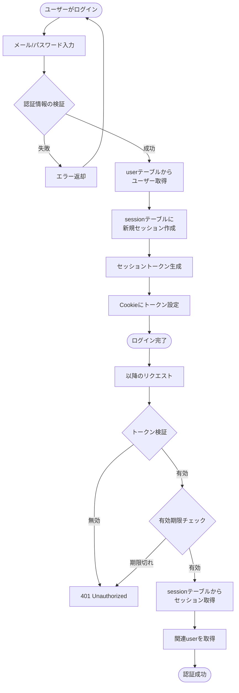
```mermaid
flowchart TD
    Start([ユーザーがログイン]) --> Input[メール/パスワード入力]
    Input --> Verify{認証情報の検証}

    Verify -->|失敗| Error[エラー返却]
    Error --> Start

    Verify -->|成功| FindUser[userテーブルから<br/>ユーザー取得]
    FindUser --> CreateSession[sessionテーブルに<br/>新規セッション作成]

    CreateSession --> GenToken[セッショントークン生成]
    GenToken --> SetCookie[Cookieにトークン設定]
    SetCookie --> Success([ログイン完了])

    Success --> Request[以降のリクエスト]
    Request --> ValidateToken{トークン検証}

    ValidateToken -->|無効| Unauthorized[401 Unauthorized]
    ValidateToken -->|有効| CheckExpiry{有効期限チェック}

    CheckExpiry -->|期限切れ| Unauthorized
    CheckExpiry -->|有効| FetchSession[sessionテーブルから<br/>セッション取得]

    FetchSession --> GetUser[関連userを取得]
    GetUser --> Authorized([認証成功])
```

#### ER図

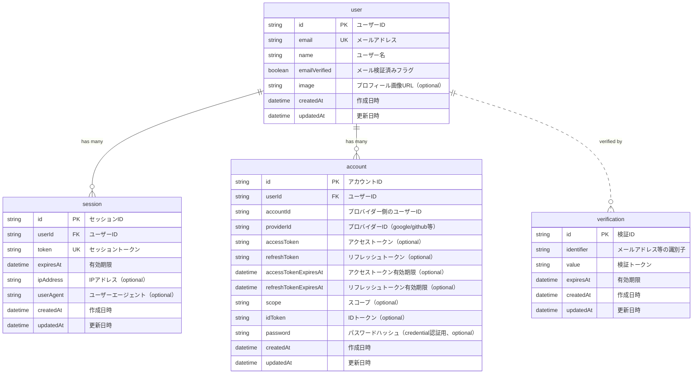
```mermaid
erDiagram
    user ||--o{ session : "has many"
    user ||--o{ account : "has many"
    user ||..o{ verification : "verified by"

    user {
        string id PK "ユーザーID"
        string email UK "メールアドレス"
        string name "ユーザー名"
        boolean emailVerified "メール検証済みフラグ"
        string image "プロフィール画像URL（optional）"
        datetime createdAt "作成日時"
        datetime updatedAt "更新日時"
    }

    session {
        string id PK "セッションID"
        string userId FK "ユーザーID"
        string token UK "セッショントークン"
        datetime expiresAt "有効期限"
        string ipAddress "IPアドレス（optional）"
        string userAgent "ユーザーエージェント（optional）"
        datetime createdAt "作成日時"
        datetime updatedAt "更新日時"
    }

    account {
        string id PK "アカウントID"
        string userId FK "ユーザーID"
        string accountId "プロバイダー側のユーザーID"
        string providerId "プロバイダーID（google/github等）"
        string accessToken "アクセストークン（optional）"
        string refreshToken "リフレッシュトークン（optional）"
        datetime accessTokenExpiresAt "アクセストークン有効期限（optional）"
        datetime refreshTokenExpiresAt "リフレッシュトークン有効期限（optional）"
        string scope "スコープ（optional）"
        string idToken "IDトークン（optional）"
        string password "パスワードハッシュ（credential認証用、optional）"
        datetime createdAt "作成日時"
        datetime updatedAt "更新日時"
    }

    verification {
        string id PK "検証ID"
        string identifier "メールアドレス等の識別子"
        string value "検証トークン"
        datetime expiresAt "有効期限"
        datetime createdAt "作成日時"
        datetime updatedAt "更新日時"
    }
```

#### テーブル間の関係性

- **user ↔ session**: 1対多 - 1ユーザーが複数デバイス・ブラウザで同時ログイン可能
- **user ↔ account**: 1対多 - 1ユーザーが複数のソーシャルログインを連携可能
- **user ↔ verification**: 点線 - 一時的な関連（メール検証時のみ使用、検証後は削除）

---

### 17.2 認証拡張プラグイン

#### twoFactor（2要素認証）

##### 概要

2要素認証（2FA）プラグインは、パスワード認証に加えて時間ベースのワンタイムパスワード（TOTP）を要求することで、アカウントのセキュリティを大幅に強化します。

**主な機能**:
- **TOTP（Time-based One-Time Password）**: Google AuthenticatorやAuthyなどの認証アプリと連携し、30秒ごとに更新される6桁のコードを生成
- **バックアップコード**: 認証アプリが使えない場合に備えた10個の使い捨てコード
- **段階的な有効化**: 既存ユーザーに対して2FAを任意または必須にできる柔軟な設計

**セキュリティ上のメリット**:
- パスワードが漏洩しても、TOTPコードがなければログインできない
- フィッシング攻撃に対する耐性が向上
- バックアップコードにより、デバイス紛失時のアカウントロックアウトを防止

##### 2FA認証フロー

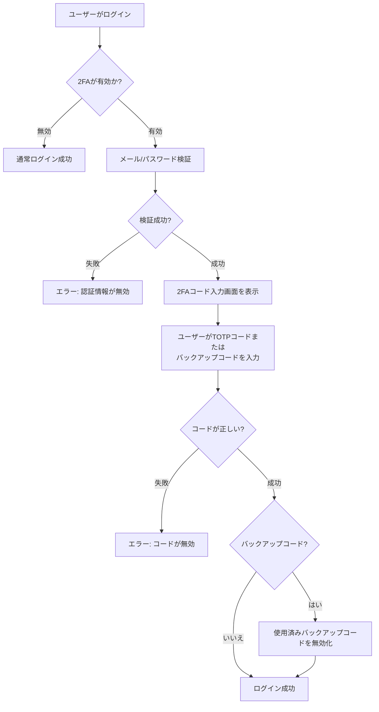
```mermaid
flowchart TD
    A[ユーザーがログイン] --> B{2FAが有効か?}
    B -->|無効| C[通常ログイン成功]
    B -->|有効| D[メール/パスワード検証]
    D --> E{検証成功?}
    E -->|失敗| F[エラー: 認証情報が無効]
    E -->|成功| G[2FAコード入力画面を表示]
    G --> H[ユーザーがTOTPコードまたは<br/>バックアップコードを入力]
    H --> I{コードが正しい?}
    I -->|失敗| J[エラー: コードが無効]
    I -->|成功| K{バックアップコード?}
    K -->|はい| L[使用済みバックアップコードを無効化]
    K -->|いいえ| M[ログイン成功]
    L --> M
```

##### ER図

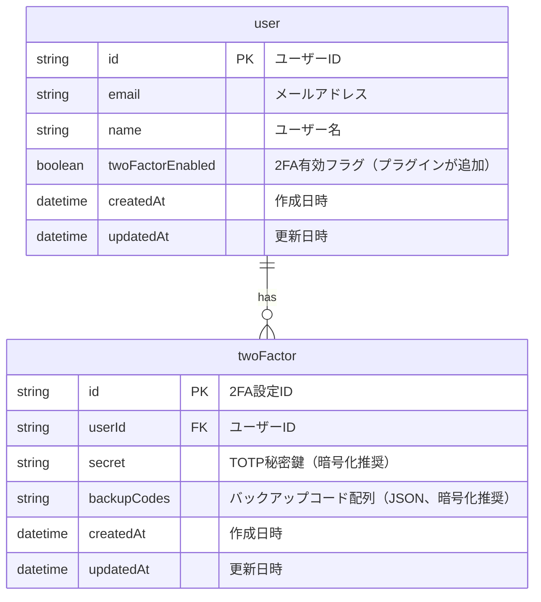
```mermaid
erDiagram
    user ||--o{ twoFactor : "has"
    user {
        string id PK "ユーザーID"
        string email "メールアドレス"
        string name "ユーザー名"
        boolean twoFactorEnabled "2FA有効フラグ（プラグインが追加）"
        datetime createdAt "作成日時"
        datetime updatedAt "更新日時"
    }
    twoFactor {
        string id PK "2FA設定ID"
        string userId FK "ユーザーID"
        string secret "TOTP秘密鍵（暗号化推奨）"
        string backupCodes "バックアップコード配列（JSON、暗号化推奨）"
        datetime createdAt "作成日時"
        datetime updatedAt "更新日時"
    }
```

---

#### passkey（パスキー認証）

##### 概要

Passkeyプラグインは、WebAuthn/FIDO2標準に基づくパスワードレス認証を実現します。生体認証（指紋、顔認証）やセキュリティキーを使用することで、パスワードを一切使わずに安全にログインできます。

**主な特徴**:
- **パスワード不要**: パスワードの記憶や管理が不要になり、フィッシング攻撃のリスクを根本的に排除
- **デバイス固有の認証**: 秘密鍵はデバイス内のセキュアな領域（TPM、Secure Enclave等）に保存され、サーバーには公開鍵のみが送信される
- **クロスプラットフォーム対応**: スマートフォン、PC、ハードウェアキーなど、WebAuthn対応デバイスで動作

**ユースケース**:
- 高セキュリティが求められる金融・医療系アプリケーション
- パスワード管理の負担を減らしたいコンシューマー向けサービス
- 複数デバイスで同じアカウントを使用するユーザー

##### Passkey登録・認証フロー


```mermaid
flowchart TD
    subgraph 登録フロー
        A[ユーザーがPasskey登録を開始] --> B[サーバーがチャレンジを生成]
        B --> C[ブラウザがWebAuthn APIを呼び出し]
        C --> D[デバイスが生体認証/PINを要求]
        D --> E{認証成功?}
        E -->|失敗| F[登録中止]
        E -->|成功| G[デバイスが秘密鍵/公開鍵ペアを生成]
        G --> H[公開鍵とcredentialIdをサーバーに送信]
        H --> I[サーバーがpasskeyテーブルに保存]
        I --> J[登録完了]
    end

    subgraph 認証フロー
        K[ユーザーがPasskeyログインを選択] --> L[サーバーがチャレンジを生成]
        L --> M[ブラウザがWebAuthn APIを呼び出し]
        M --> N[デバイスが生体認証/PINを要求]
        N --> O{認証成功?}
        O -->|失敗| P[ログイン失敗]
        O -->|成功| Q[デバイスが秘密鍵で署名を生成]
        Q --> R[署名とcredentialIdをサーバーに送信]
        R --> S[サーバーが公開鍵で署名を検証]
        S --> T{検証成功?}
        T -->|失敗| P
        T -->|成功| U[ログイン成功]
    end
```

##### ER図

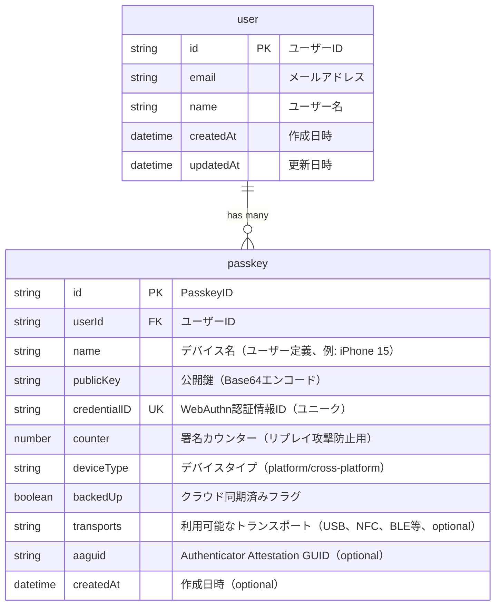
```mermaid
erDiagram
    user ||--o{ passkey : "has many"
    user {
        string id PK "ユーザーID"
        string email "メールアドレス"
        string name "ユーザー名"
        datetime createdAt "作成日時"
        datetime updatedAt "更新日時"
    }
    passkey {
        string id PK "PasskeyID"
        string userId FK "ユーザーID"
        string name "デバイス名（ユーザー定義、例: iPhone 15）"
        string publicKey "公開鍵（Base64エンコード）"
        string credentialID UK "WebAuthn認証情報ID（ユニーク）"
        number counter "署名カウンター（リプレイ攻撃防止用）"
        string deviceType "デバイスタイプ（platform/cross-platform）"
        boolean backedUp "クラウド同期済みフラグ"
        string transports "利用可能なトランスポート（USB、NFC、BLE等、optional）"
        string aaguid "Authenticator Attestation GUID（optional）"
        datetime createdAt "作成日時（optional）"
    }
```

---

#### username（ユーザー名認証）

##### 概要

Usernameプラグインは、メールアドレスの代わりにユーザー名（例: `@johndoe`）でログインできる機能を追加します。SNS型のアプリケーションやゲームプラットフォームなど、メールアドレスを公開したくないユースケースに最適です。

**主な機能**:
- **ユニークなユーザー名**: 他のユーザーと重複しない一意の識別子
- **正規化とバリデーション**: 検索・ログイン用に正規化されたユーザー名と、表示用の元のユーザー名を分離管理
- **柔軟な認証方式**: メールアドレスまたはユーザー名のどちらでもログイン可能
- **バリデーション**: 英数字、ハイフン、アンダースコアのみを許可（カスタマイズ可能）

##### ER図

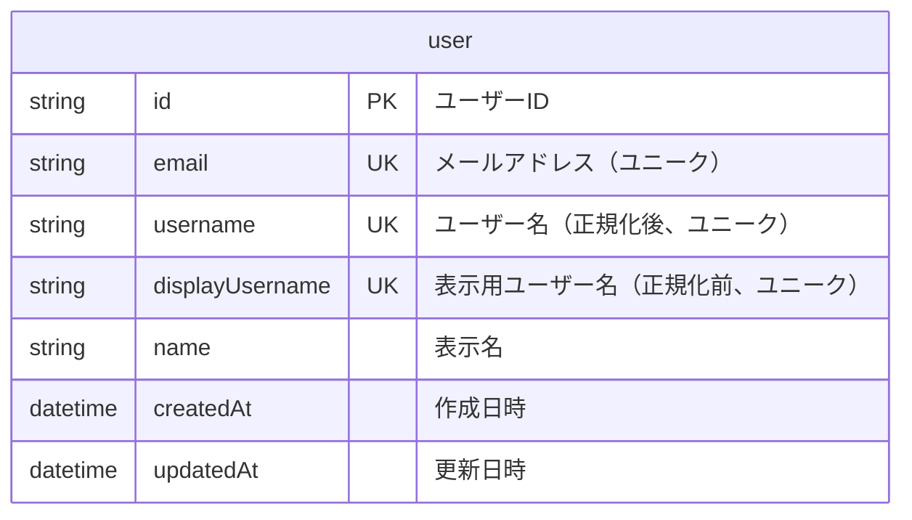
```mermaid
erDiagram
    user {
        string id PK "ユーザーID"
        string email UK "メールアドレス（ユニーク）"
        string username UK "ユーザー名（正規化後、ユニーク）"
        string displayUsername UK "表示用ユーザー名（正規化前、ユニーク）"
        string name "表示名"
        datetime createdAt "作成日時"
        datetime updatedAt "更新日時"
    }
```

**フィールドの説明**:
- **username**: 検索・ログイン用に正規化されたユーザー名（小文字変換等）。データベースのユニーク制約により重複を防止
- **displayUsername**: ユーザーが入力した元のユーザー名（大文字小文字を保持）。UI表示時にはこちらを使用

**注意**: パスワードは`account`テーブルに保存されます。

---

#### anonymous（匿名ユーザー認証）

##### 概要

Anonymousプラグインは、個人識別情報（PII）を一切要求せずに匿名ユーザーとして認証する機能を提供します。ユーザーは後からメール/パスワードやOAuthなどの認証方法をリンクして本登録できます。

**主な機能**:
- **PII不要の認証**: メールアドレス、パスワード、OAuthプロバイダーなしで認証可能
- **段階的な本登録**: 匿名ユーザーが後から正式アカウントにアップグレード
- **データ継承**: 本登録時に匿名ユーザーのアクティビティ（カート等）を自動継承

**ユースケース**:
- eコマース: 登録前にカートに商品を追加
- SaaS: 無料トライアルで匿名アクセス
- コンテンツプラットフォーム: ログインなしで機能を試用

##### 匿名→本登録フロー

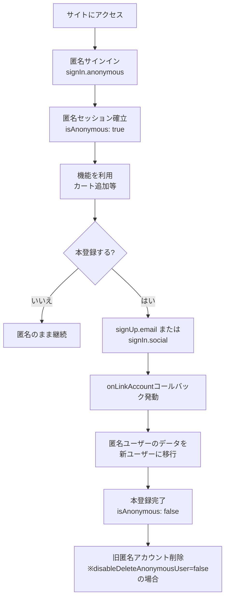
```mermaid
flowchart TD
    A[サイトにアクセス] --> B[匿名サインイン<br/>signIn.anonymous]
    B --> C[匿名セッション確立<br/>isAnonymous: true]
    C --> D[機能を利用<br/>カート追加等]
    D --> E{本登録する?}
    E -->|いいえ| F[匿名のまま継続]
    E -->|はい| G[signUp.email または<br/>signIn.social]
    G --> H[onLinkAccountコールバック発動]
    H --> I[匿名ユーザーのデータを<br/>新ユーザーに移行]
    I --> J[本登録完了<br/>isAnonymous: false]
    J --> K[旧匿名アカウント削除<br/>※disableDeleteAnonymousUser=falseの場合]
```

##### ER図

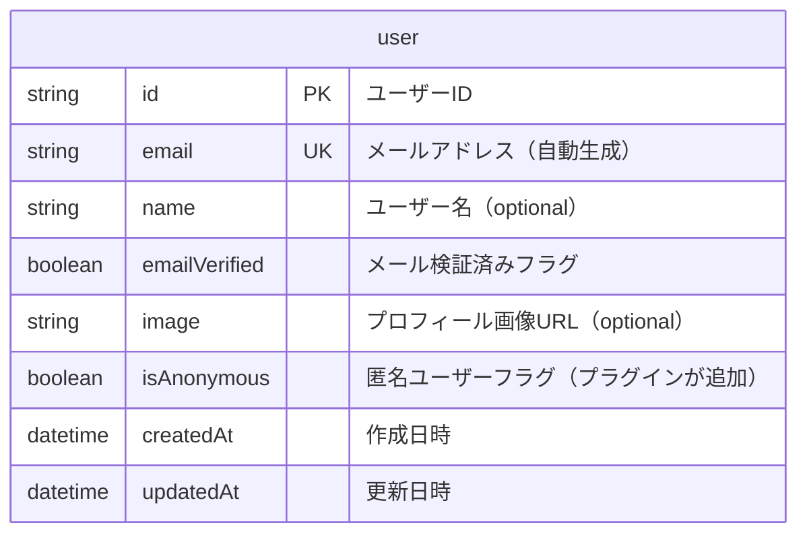
```mermaid
erDiagram
    user {
        string id PK "ユーザーID"
        string email UK "メールアドレス（自動生成）"
        string name "ユーザー名（optional）"
        boolean emailVerified "メール検証済みフラグ"
        string image "プロフィール画像URL（optional）"
        boolean isAnonymous "匿名ユーザーフラグ（プラグインが追加）"
        datetime createdAt "作成日時"
        datetime updatedAt "更新日時"
    }
```

**フィールドの説明**:
- **isAnonymous**: `true` の場合、匿名ユーザーとして認証中。本登録完了後は `false` に更新される
- **email**: 匿名ユーザーには自動生成されたメールアドレス（例: `temp-{id}@example.com`）が設定される

##### 設定オプション

| オプション | 型 | デフォルト | 説明 |
|---|---|---|---|
| `emailDomainName` | string | `temp@{id}.com` | 自動生成メールのドメイン |
| `generateRandomEmail` | function | - | カスタムメール生成関数 |
| `onLinkAccount` | async function | - | 匿名→本登録時のコールバック |
| `disableDeleteAnonymousUser` | boolean | false | true で匿名ユーザー削除を無効化 |
| `generateName` | function | - | 匿名ユーザーの名前生成関数 |

##### 設定例

```typescript
import { anonymous } from "better-auth/plugins";

export const auth = betterAuth({
  plugins: [
    anonymous({
      emailDomainName: "thac.example.com",
      onLinkAccount: async ({ anonymousUser, newUser }) => {
        // 匿名ユーザーのカートを新ユーザーに移行
        await moveCart(anonymousUser.id, newUser.id);
      },
    }),
  ],
});
```

##### クライアント側API

```typescript
import { anonymousClient } from "better-auth/client/plugins";

const authClient = createAuthClient({
  plugins: [anonymousClient()],
});

// 匿名サインイン
const user = await authClient.signIn.anonymous();

// セッション確認
const session = await authClient.getSession();
console.log(session?.user.isAnonymous); // true

// 匿名ユーザー削除
await authClient.deleteAnonymousUser({});
```

---

### 17.3 組織・権限管理プラグイン

#### organization（組織管理）

##### 概要

`organization`プラグインは、マルチテナント対応のSaaSアプリケーションに必要な組織・チーム・メンバー管理機能を提供します。

**主な機能:**
- **組織管理**: 複数の組織を作成し、それぞれ独立した権限スコープを持つ
- **チーム管理**: 組織内にチームを作成し、メンバーをグループ化
- **メンバー管理**: 組織・チームへのメンバー追加、ロール（役割）ベースのアクセス制御
- **招待システム**: メール招待によるメンバー追加、招待の承認・拒否・キャンセル
- **ロールベース権限**: カスタマイズ可能な役割（owner, admin, member等）による柔軟な権限設計

**ユースケース:**
- B2B SaaSで顧客企業ごとに組織を分離
- プロジェクト管理ツールでチームごとにアクセス権を制御
- エンタープライズアプリケーションで部門・グループを管理

##### 組織階層構造

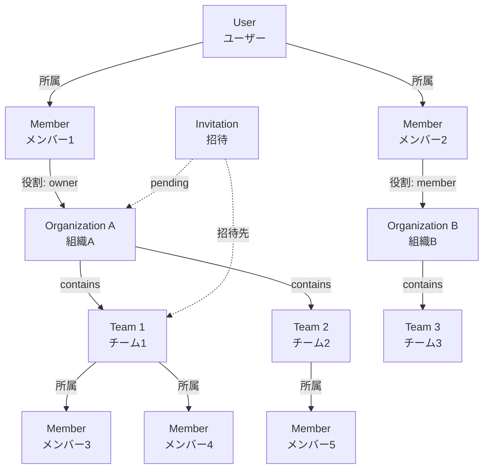
```mermaid
flowchart TB
    U[User<br/>ユーザー] -->|所属| M1[Member<br/>メンバー1]
    U -->|所属| M2[Member<br/>メンバー2]

    M1 -->|役割: owner| O1[Organization A<br/>組織A]
    M2 -->|役割: member| O2[Organization B<br/>組織B]

    O1 -->|contains| T1[Team 1<br/>チーム1]
    O1 -->|contains| T2[Team 2<br/>チーム2]
    O2 -->|contains| T3[Team 3<br/>チーム3]

    T1 -->|所属| M3[Member<br/>メンバー3]
    T1 -->|所属| M4[Member<br/>メンバー4]
    T2 -->|所属| M5[Member<br/>メンバー5]

    I[Invitation<br/>招待] -.->|pending| O1
    I -.->|招待先| T1
```

**階層の説明:**
- **User（ユーザー）**: 1人のユーザーが複数の組織に所属可能
- **Organization（組織）**: トップレベルのテナント単位、独立したデータスコープ
- **Team（チーム）**: 組織内のグループ、プロジェクトや部門に対応
- **Member（メンバー）**: ユーザーと組織の関連付け、ロール（役割）を持つ
- **Invitation（招待）**: 組織・チームへの招待、承認待ち状態を管理

##### ER図

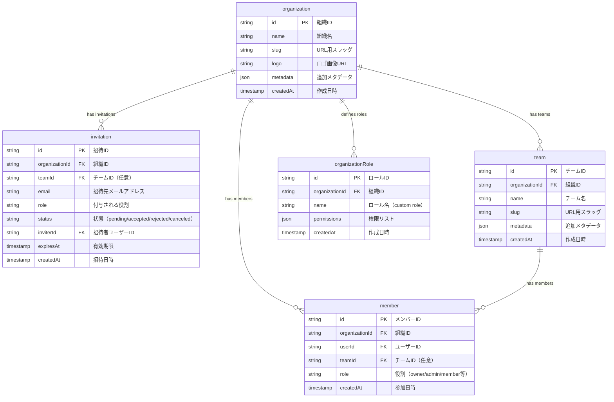
```mermaid
erDiagram
    organization ||--o{ member : "has members"
    organization ||--o{ invitation : "has invitations"
    organization ||--o{ team : "has teams"
    organization ||--o{ organizationRole : "defines roles"
    team ||--o{ member : "has members"

    organization {
        string id PK "組織ID"
        string name "組織名"
        string slug "URL用スラッグ"
        string logo "ロゴ画像URL"
        json metadata "追加メタデータ"
        timestamp createdAt "作成日時"
    }

    member {
        string id PK "メンバーID"
        string organizationId FK "組織ID"
        string userId FK "ユーザーID"
        string teamId FK "チームID（任意）"
        string role "役割（owner/admin/member等）"
        timestamp createdAt "参加日時"
    }

    invitation {
        string id PK "招待ID"
        string organizationId FK "組織ID"
        string teamId FK "チームID（任意）"
        string email "招待先メールアドレス"
        string role "付与される役割"
        string status "状態（pending/accepted/rejected/canceled）"
        string inviterId FK "招待者ユーザーID"
        timestamp expiresAt "有効期限"
        timestamp createdAt "招待日時"
    }

    organizationRole {
        string id PK "ロールID"
        string organizationId FK "組織ID"
        string name "ロール名（custom role）"
        json permissions "権限リスト"
        timestamp createdAt "作成日時"
    }

    team {
        string id PK "チームID"
        string organizationId FK "組織ID"
        string name "チーム名"
        string slug "URL用スラッグ"
        json metadata "追加メタデータ"
        timestamp createdAt "作成日時"
    }
```

**テーブルの役割:**
- **organization**: 組織マスタ、テナント分離の基本単位
- **member**: ユーザーと組織・チームの多対多関連、役割を保持
- **invitation**: メール招待の状態管理、有効期限・承認フロー
- **organizationRole**: カスタムロール定義（デフォルトのowner/admin/member以外）
- **team**: 組織内のサブグループ、柔軟なメンバー管理

---

#### admin（管理者機能）

##### 概要

`admin`プラグインは、システム管理者がユーザーアカウントを管理するための機能を提供します。

**主な機能:**
- **ユーザー管理**: 全ユーザーの一覧表示、検索、詳細確認
- **BAN機能**: 不正ユーザーのアカウント停止、期限付きBAN、理由記録
- **代理ログイン（Impersonation）**: 管理者が他ユーザーとしてログインし、問題調査・サポート対応
- **セッション管理**: アクティブセッションの確認・無効化

**セキュリティ上の注意:**
- 代理ログイン機能は監査ログと組み合わせて使用
- 管理者権限の厳格な制御（MFA必須推奨）
- BAN理由・期限は透明性のため記録必須

##### ER図

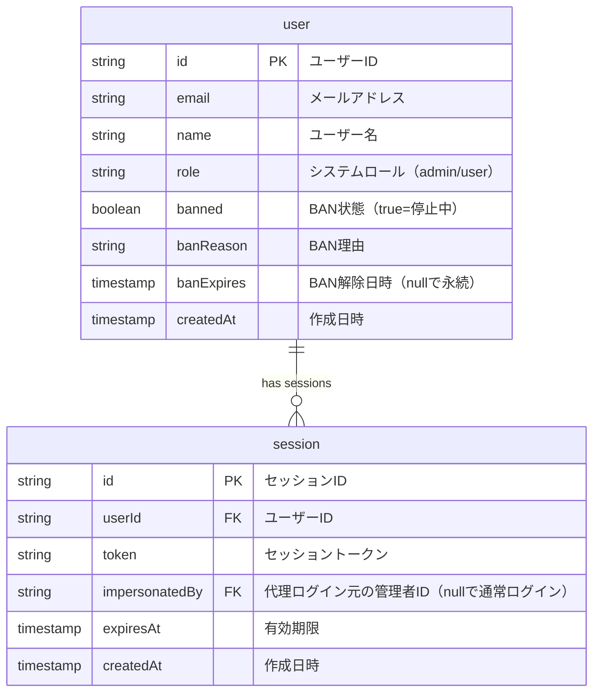
```mermaid
erDiagram
    user ||--o{ session : "has sessions"

    user {
        string id PK "ユーザーID"
        string email "メールアドレス"
        string name "ユーザー名"
        string role "システムロール（admin/user）"
        boolean banned "BAN状態（true=停止中）"
        string banReason "BAN理由"
        timestamp banExpires "BAN解除日時（nullで永続）"
        timestamp createdAt "作成日時"
    }

    session {
        string id PK "セッションID"
        string userId FK "ユーザーID"
        string token "セッショントークン"
        string impersonatedBy FK "代理ログイン元の管理者ID（nullで通常ログイン）"
        timestamp expiresAt "有効期限"
        timestamp createdAt "作成日時"
    }
```

**拡張フィールドの説明:**
- **user.role**: システム全体の権限（`admin`が管理者機能にアクセス可能）
- **user.banned**: `true`でログイン不可、APIアクセスも拒否
- **user.banReason**: 停止理由（例: "スパム行為", "規約違反"）を記録
- **user.banExpires**: 期限付きBANの場合の自動解除日時、`null`で永続BAN
- **session.impersonatedBy**: 代理ログイン時に元の管理者IDを記録、監査証跡として重要

---

### 17.4 セッション・トークン管理プラグイン

#### deviceAuthorization（デバイス認可）

##### 概要

RFC 8628 で定義されたデバイス認可フローは、IoT機器、CLIツール、スマートTVなど、ブラウザがない環境や入力が制限されたデバイスでのOAuth 2.0認証を可能にするプラグインです。

**主な用途:**
- スマートTV、セットトップボックス
- プリンタ、IoTデバイス
- CLIツール、ターミナルアプリケーション
- ゲーム機

**仕組み:**
デバイスはユーザーに短いコード（user_code）を表示し、ユーザーは別のデバイス（スマートフォンやPCのブラウザ）でそのコードを入力して認可を行います。デバイス側は定期的にサーバーをポーリングして、認可が完了したかどうかを確認し、完了後にアクセストークンを取得します。

##### デバイス認可フロー

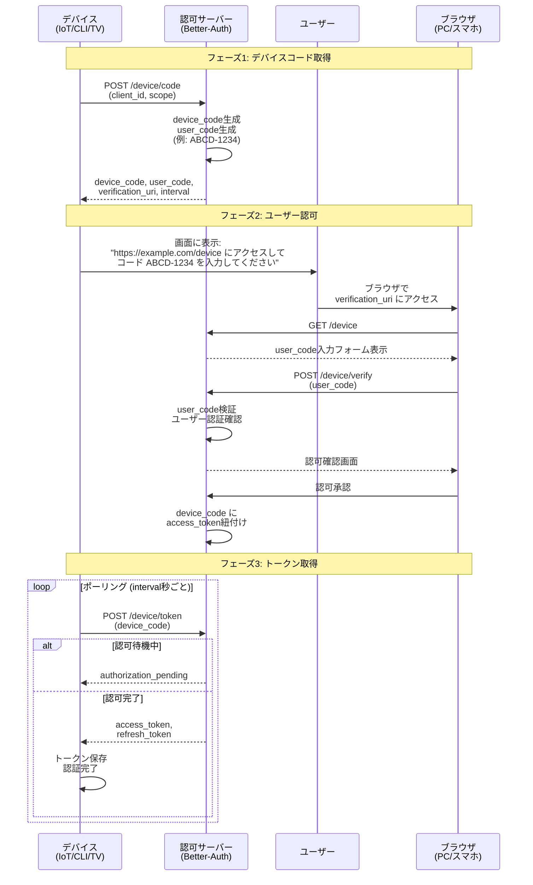
```mermaid
sequenceDiagram
    participant Device as デバイス<br/>(IoT/CLI/TV)
    participant Server as 認可サーバー<br/>(Better-Auth)
    participant User as ユーザー
    participant Browser as ブラウザ<br/>(PC/スマホ)

    Note over Device,Browser: フェーズ1: デバイスコード取得
    Device->>Server: POST /device/code<br/>(client_id, scope)
    Server->>Server: device_code生成<br/>user_code生成<br/>(例: ABCD-1234)
    Server-->>Device: device_code, user_code,<br/>verification_uri, interval

    Note over Device,Browser: フェーズ2: ユーザー認可
    Device->>User: 画面に表示:<br/>"https://example.com/device にアクセスして<br/>コード ABCD-1234 を入力してください"
    User->>Browser: ブラウザで<br/>verification_uri にアクセス
    Browser->>Server: GET /device
    Server-->>Browser: user_code入力フォーム表示
    Browser->>Server: POST /device/verify<br/>(user_code)
    Server->>Server: user_code検証<br/>ユーザー認証確認
    Server-->>Browser: 認可確認画面
    Browser->>Server: 認可承認
    Server->>Server: device_code に<br/>access_token紐付け

    Note over Device,Browser: フェーズ3: トークン取得
    loop ポーリング (interval秒ごと)
        Device->>Server: POST /device/token<br/>(device_code)
        alt 認可待機中
            Server-->>Device: authorization_pending
        else 認可完了
            Server-->>Device: access_token,<br/>refresh_token
            Device->>Device: トークン保存<br/>認証完了
        end
    end
```

##### ER図

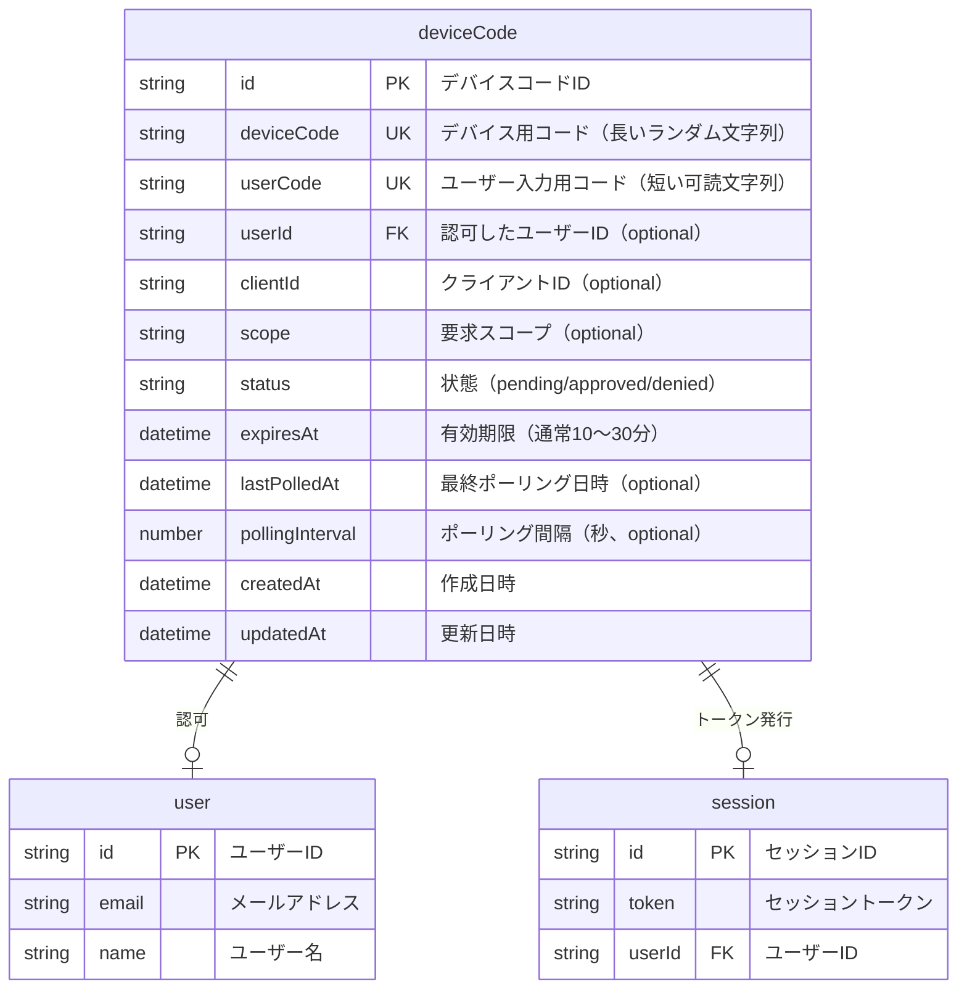
```mermaid
erDiagram
    deviceCode ||--o| user : "認可"
    deviceCode ||--o| session : "トークン発行"

    deviceCode {
        string id PK "デバイスコードID"
        string deviceCode UK "デバイス用コード（長いランダム文字列）"
        string userCode UK "ユーザー入力用コード（短い可読文字列）"
        string userId FK "認可したユーザーID（optional）"
        string clientId "クライアントID（optional）"
        string scope "要求スコープ（optional）"
        string status "状態（pending/approved/denied）"
        datetime expiresAt "有効期限（通常10〜30分）"
        datetime lastPolledAt "最終ポーリング日時（optional）"
        number pollingInterval "ポーリング間隔（秒、optional）"
        datetime createdAt "作成日時"
        datetime updatedAt "更新日時"
    }

    user {
        string id PK "ユーザーID"
        string email "メールアドレス"
        string name "ユーザー名"
    }

    session {
        string id PK "セッションID"
        string token "セッショントークン"
        string userId FK "ユーザーID"
    }
```

##### ユースケース

| デバイス | シナリオ |
|---------|---------|
| スマートTV | Netflixアプリで「コードを入力してログイン」 |
| CLIツール | GitHub CLIで `gh auth login` コマンド実行 |
| プリンタ | クラウドプリントサービスへのデバイス登録 |
| ゲーム機 | PlayStation/Xboxでのアカウント連携 |
| IoTデバイス | スマートホームデバイスのセットアップ |

---

### 17.5 OAuth/SSOプラグイン

#### sso（エンタープライズSSO）

##### 概要

エンタープライズ向けのシングルサインオン（SSO）機能を提供するプラグイン。複数のアイデンティティプロバイダー（IdP）との統合を可能にし、OIDCおよびSAMLプロトコルをサポートします。

**主な機能:**
- **マルチIdP対応**: Okta、Azure AD、Google Workspace、OneLogin等の主要IdPと統合
- **プロトコルサポート**: OIDC（OpenID Connect）とSAML 2.0の両方に対応
- **テナント管理**: 組織ごとに異なるIdP設定を管理
- **Just-In-Timeプロビジョニング**: SSO初回ログイン時に自動的にユーザーアカウントを作成
- **属性マッピング**: IdPから取得したユーザー属性をアプリケーション側の属性にマッピング

**ユースケース:**
- B2B SaaSアプリケーションで顧客企業ごとの認証基盤と統合
- エンタープライズ契約でのSSO要件への対応
- セキュリティコンプライアンス強化（中央集権的な認証管理）

##### SSOログインフロー

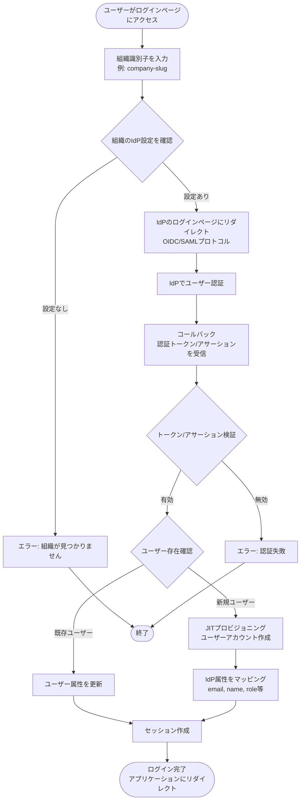
```mermaid
flowchart TB
    Start([ユーザーがログインページにアクセス])
    Start --> Input[組織識別子を入力<br/>例: company-slug]
    Input --> CheckOrg{組織のIdP設定を確認}

    CheckOrg -->|設定あり| RedirectIdP[IdPのログインページにリダイレクト<br/>OIDC/SAMLプロトコル]
    CheckOrg -->|設定なし| Error1[エラー: 組織が見つかりません]

    RedirectIdP --> IdPAuth[IdPでユーザー認証]
    IdPAuth --> IdPCallback[コールバック<br/>認証トークン/アサーションを受信]

    IdPCallback --> ValidateToken{トークン/アサーション検証}
    ValidateToken -->|無効| Error2[エラー: 認証失敗]
    ValidateToken -->|有効| CheckUser{ユーザー存在確認}

    CheckUser -->|既存ユーザー| UpdateAttrs[ユーザー属性を更新]
    CheckUser -->|新規ユーザー| JIT[JITプロビジョニング<br/>ユーザーアカウント作成]

    JIT --> MapAttrs[IdP属性をマッピング<br/>email, name, role等]
    UpdateAttrs --> CreateSession[セッション作成]
    MapAttrs --> CreateSession

    CreateSession --> Complete([ログイン完了<br/>アプリケーションにリダイレクト])

    Error1 --> End([終了])
    Error2 --> End
```

##### ER図

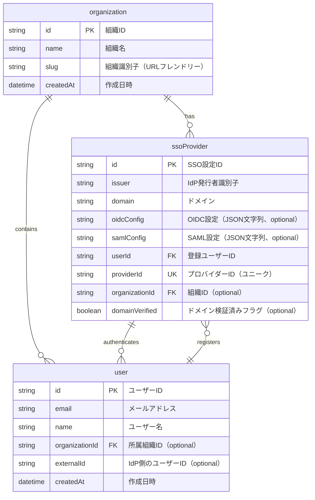
```mermaid
erDiagram
    organization ||--o{ ssoProvider : "has"
    organization ||--o{ user : "contains"
    ssoProvider ||--o{ user : "authenticates"
    user ||--o{ ssoProvider : "registers"

    ssoProvider {
        string id PK "SSO設定ID"
        string issuer "IdP発行者識別子"
        string domain "ドメイン"
        string oidcConfig "OIDC設定（JSON文字列、optional）"
        string samlConfig "SAML設定（JSON文字列、optional）"
        string userId FK "登録ユーザーID"
        string providerId UK "プロバイダーID（ユニーク）"
        string organizationId FK "組織ID（optional）"
        boolean domainVerified "ドメイン検証済みフラグ（optional）"
    }

    user {
        string id PK "ユーザーID"
        string email "メールアドレス"
        string name "ユーザー名"
        string organizationId FK "所属組織ID（optional）"
        string externalId "IdP側のユーザーID（optional）"
        datetime createdAt "作成日時"
    }

    organization {
        string id PK "組織ID"
        string name "組織名"
        string slug "組織識別子（URLフレンドリー）"
        datetime createdAt "作成日時"
    }
```

---

#### oidcProvider（OIDCプロバイダ）

##### 概要

Better-Auth自体をOAuth 2.0/OpenID Connectプロバイダとして動作させるプラグイン。他のアプリケーションに対して認証・認可サービスを提供し、セントラル認証基盤として機能します。

**主な機能:**
- **OAuth 2.0フロー**: Authorization Code Grant、Implicit Grant、Client Credentials Grant等をサポート
- **OIDCスコープ**: openid、profile、emailスコープによる標準的なクレーム提供
- **クライアント管理**: サードパーティアプリケーション（OAuthクライアント）の登録と管理
- **同意画面**: ユーザーが権限スコープを確認・承認するフロー
- **トークン発行**: アクセストークン、リフレッシュトークン、IDトークンの発行と管理

**ユースケース:**
- マイクロサービス間の認証・認可基盤
- モバイルアプリやSPAへのOAuth統合
- サードパーティアプリケーションへのAPI公開（OAuth 2.0で保護）
- 社内システム群の統合認証（セントラルIDプロバイダ）

**提供エンドポイント:**
- `/oauth/authorize`: 認可エンドポイント（ユーザー同意画面）
- `/oauth/token`: トークン発行エンドポイント
- `/oauth/userinfo`: ユーザー情報取得エンドポイント（OIDC）
- `/.well-known/openid-configuration`: ディスカバリードキュメント

##### ER図

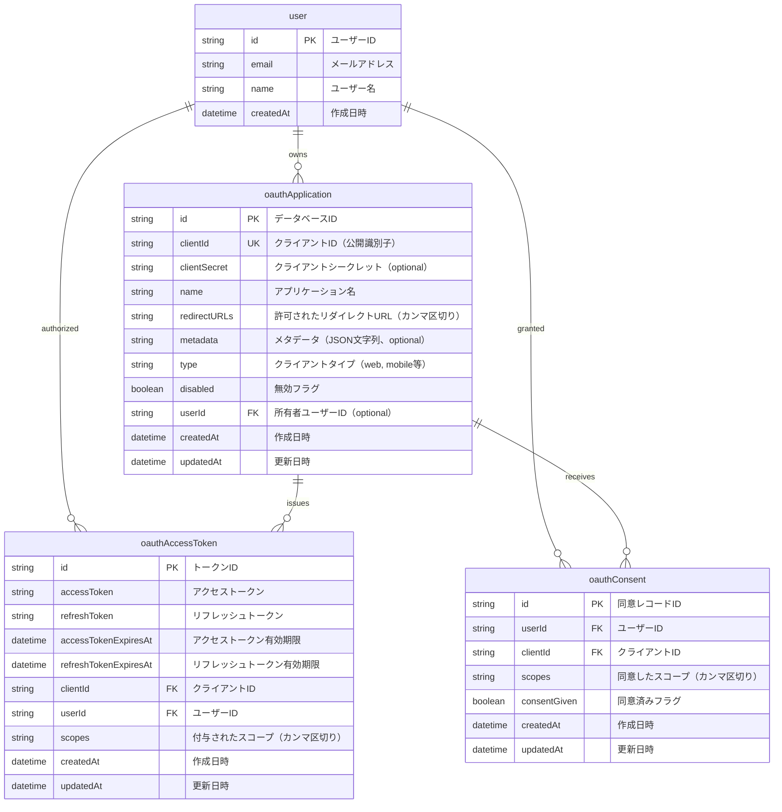
```mermaid
erDiagram
    user ||--o{ oauthApplication : "owns"
    user ||--o{ oauthAccessToken : "authorized"
    user ||--o{ oauthConsent : "granted"
    oauthApplication ||--o{ oauthAccessToken : "issues"
    oauthApplication ||--o{ oauthConsent : "receives"

    oauthApplication {
        string id PK "データベースID"
        string clientId UK "クライアントID（公開識別子）"
        string clientSecret "クライアントシークレット（optional）"
        string name "アプリケーション名"
        string redirectURLs "許可されたリダイレクトURL（カンマ区切り）"
        string metadata "メタデータ（JSON文字列、optional）"
        string type "クライアントタイプ（web, mobile等）"
        boolean disabled "無効フラグ"
        string userId FK "所有者ユーザーID（optional）"
        datetime createdAt "作成日時"
        datetime updatedAt "更新日時"
    }

    oauthAccessToken {
        string id PK "トークンID"
        string accessToken "アクセストークン"
        string refreshToken "リフレッシュトークン"
        datetime accessTokenExpiresAt "アクセストークン有効期限"
        datetime refreshTokenExpiresAt "リフレッシュトークン有効期限"
        string clientId FK "クライアントID"
        string userId FK "ユーザーID"
        string scopes "付与されたスコープ（カンマ区切り）"
        datetime createdAt "作成日時"
        datetime updatedAt "更新日時"
    }

    oauthConsent {
        string id PK "同意レコードID"
        string userId FK "ユーザーID"
        string clientId FK "クライアントID"
        string scopes "同意したスコープ（カンマ区切り）"
        boolean consentGiven "同意済みフラグ"
        datetime createdAt "作成日時"
        datetime updatedAt "更新日時"
    }

    user {
        string id PK "ユーザーID"
        string email "メールアドレス"
        string name "ユーザー名"
        datetime createdAt "作成日時"
    }
```

**テーブル詳細:**
- **oauthApplication**: OAuthクライアント（連携する外部アプリケーション）の登録情報。
  - `type`: クライアントタイプ（web, mobile, native等）。
  - `disabled`: trueの場合、クライアントは無効化される。
- **oauthAccessToken**: 発行済みのアクセストークンとリフレッシュトークンを管理。
- **oauthConsent**: ユーザーがクライアントに付与した権限の記録。

---

### 17.6 スキーマ一覧表

#### 追加テーブル

| プラグイン | テーブル | 主要カラム |
|-----------|---------|-----------|
| twoFactor | `twoFactor` | `id`, `userId`, `secret`, `backupCodes`, `createdAt`, `updatedAt` |
| passkey | `passkey` | `id`, `userId`, `name`, `publicKey`, `credentialID`, `counter`, `deviceType`, `backedUp`, `transports`, `aaguid`, `createdAt` |
| organization | `organization` | `id`, `name`, `slug`, `logo`, `metadata`, `createdAt` |
| organization | `member` | `id`, `organizationId`, `userId`, `teamId`, `role`, `createdAt` |
| organization | `invitation` | `id`, `organizationId`, `email`, `role`, `status`, `teamId`, `inviterId`, `expiresAt`, `createdAt` |
| organization | `organizationRole` | `id`, `organizationId`, `name`, `permissions`, `createdAt` |
| organization | `team` | `id`, `organizationId`, `name`, `slug`, `metadata`, `createdAt` |
| deviceAuthorization | `deviceCode` | `id`, `deviceCode`, `userCode`, `userId`, `clientId`, `scope`, `status`, `expiresAt`, `lastPolledAt`, `pollingInterval`, `createdAt`, `updatedAt` |
| sso | `ssoProvider` | `id`, `issuer`, `domain`, `providerId`, `userId`, `organizationId`, `oidcConfig`, `samlConfig`, `domainVerified` |
| oidcProvider | `oauthApplication` | `id`, `clientId`, `clientSecret`, `name`, `redirectURLs`, `metadata`, `type`, `disabled`, `userId`, `createdAt`, `updatedAt` |
| oidcProvider | `oauthAccessToken` | `id`, `accessToken`, `refreshToken`, `accessTokenExpiresAt`, `refreshTokenExpiresAt`, `clientId`, `userId`, `scopes`, `createdAt`, `updatedAt` |
| oidcProvider | `oauthConsent` | `id`, `userId`, `clientId`, `scopes`, `consentGiven`, `createdAt`, `updatedAt` |

#### 追加フィールド

**注意**: `account`テーブルの`providerId`, `accessToken`, `refreshToken`, `password`フィールドはコアスキーマの一部です（17.1参照）。

| テーブル | カラム | 型 | プラグイン |
|---------|-------|-----|-----------|
| user | `twoFactorEnabled` | boolean | twoFactor |
| user | `username` | string | username |
| user | `displayUsername` | string | username |
| user | `role` | string | admin |
| user | `banned` | boolean | admin |
| user | `banReason` | string | admin |
| user | `banExpires` | timestamp | admin |
| session | `impersonatedBy` | string | admin |
| user | `isAnonymous` | boolean | anonymous |

#### マイグレーション実行

```bash
# スキーマ生成
npx @better-auth/cli generate --config ./packages/auth/src/auth.ts

# Drizzle マイグレーション
make db-generate
make db-migrate
```

---

## 18. 実装タスク一覧

### Phase 1: OAuth設定

- [ ] Google OAuth プロバイダー設定
- [ ] GitHub OAuth プロバイダー設定
- [ ] Discord OAuth プロバイダー設定
- [ ] 環境変数追加（CLIENT_ID, CLIENT_SECRET）
- [ ] DBマイグレーション（accountテーブル拡張）
- [ ] ソーシャルログインボタンUI

### Phase 2: 2FA実装

- [ ] twoFactor plugin 追加
- [ ] DBスキーマ更新（twoFactorテーブル）
- [ ] 2FA 有効化/無効化 UI
- [ ] QRコード表示・TOTP検証UI
- [ ] バックアップコード管理UI

### Phase 3: カスタムロール実装

- [ ] organization plugin 追加
- [ ] access control 定義
- [ ] ロール定義（admin/editor/viewer等）
- [ ] DBスキーマ更新（organization関連テーブル）
- [ ] 権限チェックミドルウェア
- [ ] ロール管理画面UI

---

## 19. 参考リンク

### 公式ドキュメント

- [Better-Auth 公式](https://www.better-auth.com/)
- [プラグイン一覧](https://www.better-auth.com/docs/concepts/plugins)
- [OAuth設定](https://www.better-auth.com/docs/concepts/oauth)
- [2FA Plugin](https://www.better-auth.com/docs/plugins/2fa)
- [Organization Plugin](https://www.better-auth.com/docs/plugins/organization)
- [Admin Plugin](https://www.better-auth.com/docs/plugins/admin)
- [Access Control](https://www.better-auth.com/docs/plugins/access)
- [CLI ドキュメント](https://www.better-auth.com/docs/reference/cli)

### ソーシャルプロバイダ設定

- [Google Provider](https://www.better-auth.com/docs/authentication/google)
- [GitHub Provider](https://www.better-auth.com/docs/authentication/github)
- [Discord Provider](https://www.better-auth.com/docs/authentication/discord)

### バージョン情報

- 安定版: v1.4.17（2025年1月21日）
- ベータ版: v1.5.0-beta.9（2025年1月21日）
