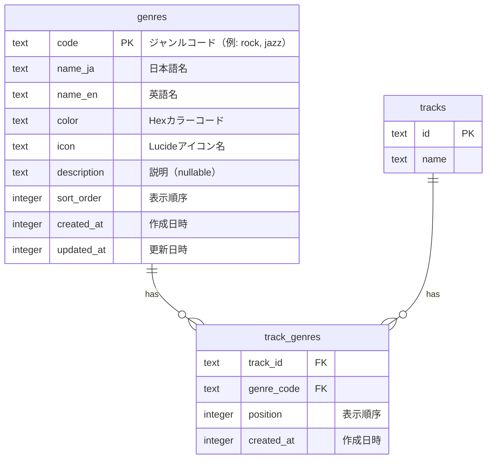
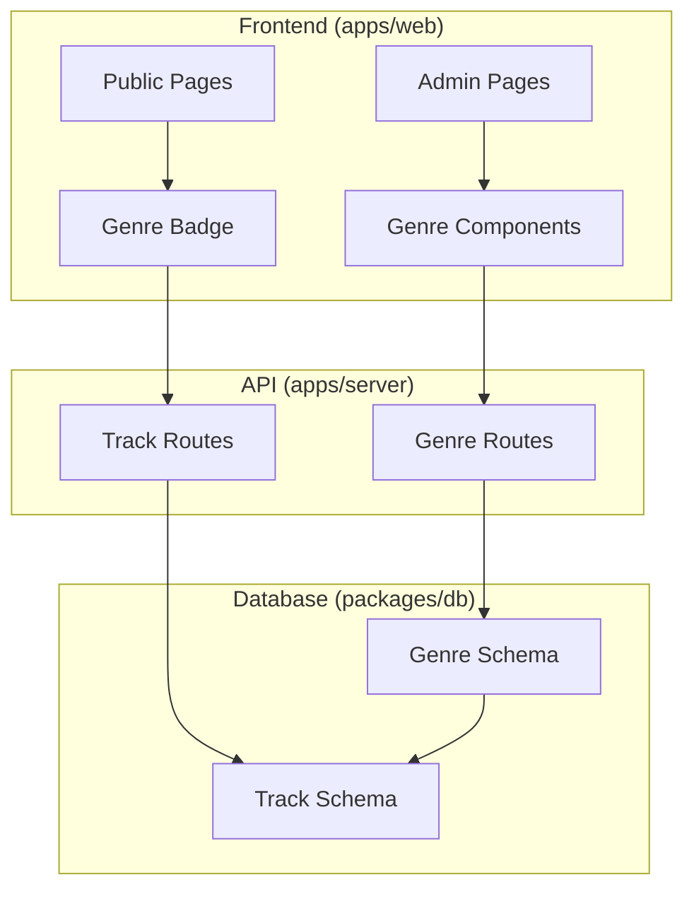
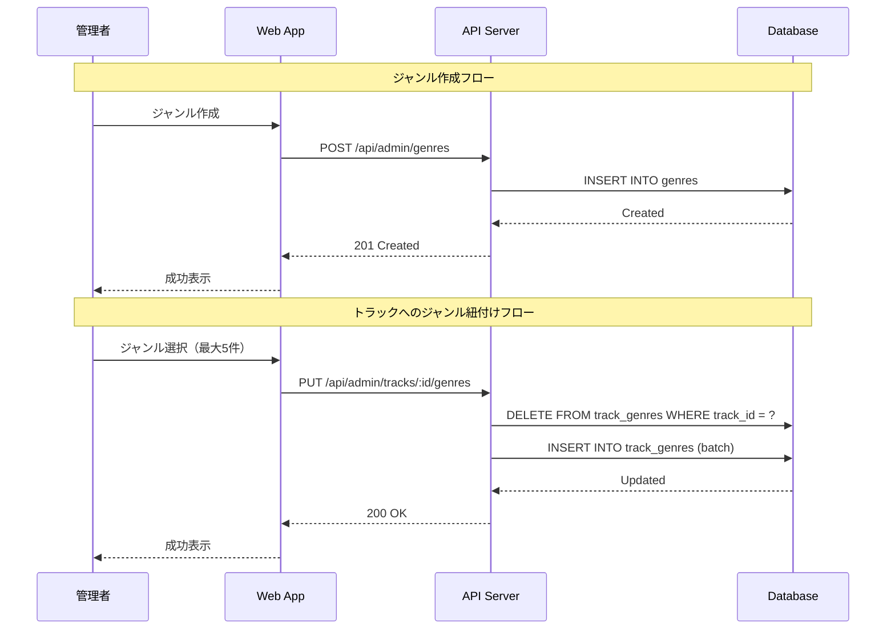
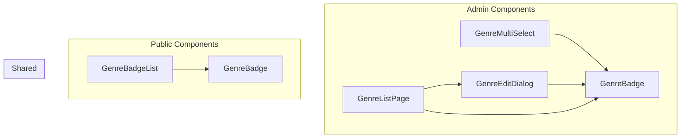
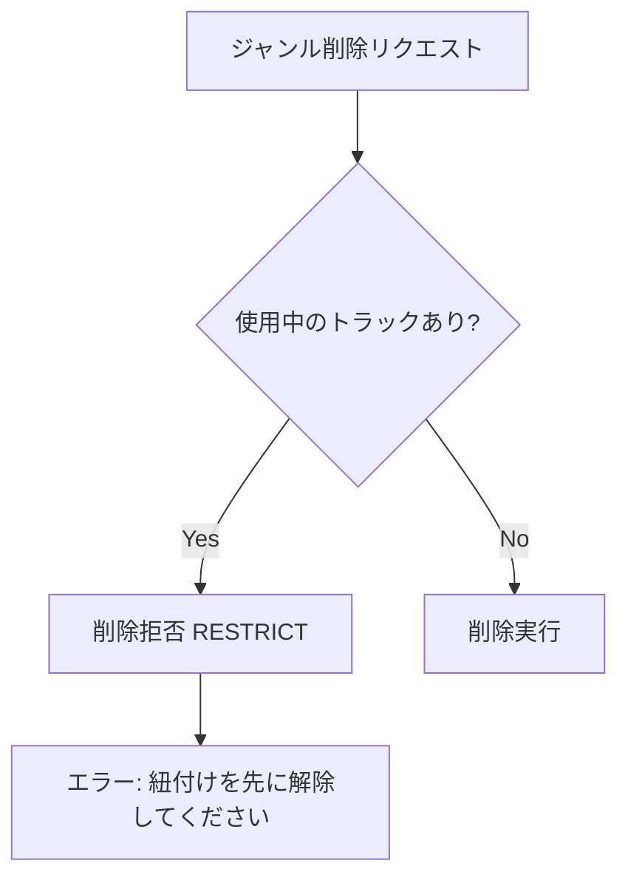

# ジャンル機能 仕様書

## 1. 概要

トラックに音楽ジャンル（Rock, Jazz, Electronic等）を紐付ける機能。
管理画面でジャンルマスターを管理し、トラックに紐付け、公開画面でバッジ表示する。

### 1.1 機能要件

| 項目 | 内容 |
|------|------|
| データ構造 | 名前（日英）+ 色 + アイコン + 説明 |
| 管理方法 | 管理画面でCRUD可能 |
| 階層構造 | フラット（親子関係なし） |
| 紐付け上限 | 1トラックあたり **最大5件** |
| 公開画面 | 表示のみ（絞り込み機能なし） |
| 表示方法 | 全件表示（省略なし） |

---

## 2. データベース設計

### 2.1 ER図



### 2.2 テーブル定義

#### genres（ジャンルマスター）

| カラム | 型 | 制約 | 説明 |
|--------|-----|------|------|
| code | TEXT | PK | 識別コード（英小文字+アンダースコア） |
| name_ja | TEXT | NOT NULL | 日本語名 |
| name_en | TEXT | NOT NULL | 英語名 |
| color | TEXT | NOT NULL | Hexカラーコード（#RRGGBB） |
| icon | TEXT | NOT NULL | Lucideアイコン名 |
| description | TEXT | - | 説明文 |
| sort_order | INTEGER | NOT NULL, DEFAULT 0 | 表示順序 |
| created_at | INTEGER | NOT NULL | 作成日時（ms） |
| updated_at | INTEGER | NOT NULL | 更新日時（ms） |

#### track_genres（トラック-ジャンル紐付け）

| カラム | 型 | 制約 | 説明 |
|--------|-----|------|------|
| track_id | TEXT | FK → tracks.id, ON DELETE CASCADE | トラックID |
| genre_code | TEXT | FK → genres.code, ON DELETE RESTRICT | ジャンルコード |
| position | INTEGER | NOT NULL, DEFAULT 1 | 表示順序（1〜5） |
| created_at | INTEGER | NOT NULL | 作成日時（ms） |

- **PK**: (track_id, genre_code)

### 2.3 インデックス

```sql
-- genres
CREATE INDEX idx_genres_sort_order ON genres(sort_order);

-- track_genres
CREATE INDEX idx_track_genres_track ON track_genres(track_id);
CREATE INDEX idx_track_genres_genre ON track_genres(genre_code);
```

---

## 3. システムアーキテクチャ

### 3.1 レイヤー構成



### 3.2 データフロー



---

## 4. API設計

### 4.1 エンドポイント一覧

| Method | Path | 説明 | 認証 |
|--------|------|------|------|
| GET | `/api/admin/genres` | ジャンル一覧取得 | Admin |
| POST | `/api/admin/genres` | ジャンル作成 | Admin |
| GET | `/api/admin/genres/:code` | ジャンル詳細取得 | Admin |
| PUT | `/api/admin/genres/:code` | ジャンル更新 | Admin |
| DELETE | `/api/admin/genres/:code` | ジャンル削除 | Admin |
| PATCH | `/api/admin/genres/reorder` | 順序一括更新 | Admin |
| PUT | `/api/admin/tracks/:id/genres` | トラックのジャンル更新 | Admin |

### 4.2 リクエスト/レスポンス例

#### POST /api/admin/genres

```json
// Request
{
  "code": "rock",
  "nameJa": "ロック",
  "nameEn": "Rock",
  "color": "#DC143C",
  "icon": "guitar",
  "description": "ギター・ドラム中心のエネルギッシュなサウンド"
}

// Response (201)
{
  "code": "rock",
  "nameJa": "ロック",
  "nameEn": "Rock",
  "color": "#DC143C",
  "icon": "guitar",
  "description": "ギター・ドラム中心のエネルギッシュなサウンド",
  "sortOrder": 0,
  "createdAt": "2024-01-01T00:00:00.000Z",
  "updatedAt": "2024-01-01T00:00:00.000Z"
}
```

#### PUT /api/admin/tracks/:id/genres

```json
// Request（最大5件）
{
  "genreCodes": ["rock", "electronic", "vocal"]
}

// Response (200)
{
  "trackId": "track_xxx",
  "genres": [
    { "genreCode": "rock", "position": 1 },
    { "genreCode": "electronic", "position": 2 },
    { "genreCode": "vocal", "position": 3 }
  ]
}

// Error Response (400) - 5件超過時
{
  "error": "ジャンルは最大5件まで設定できます"
}
```

---

## 5. UI設計

### 5.1 コンポーネント構成



### 5.2 GenreMultiSelect

タグ入力風のマルチセレクトコンポーネント（最大5件）。

```
┌─────────────────────────────────────────────────────────────┐
│ [Rock ×] [Jazz ×] [Electronic ×]  │ ジャンルを追加...     │
└─────────────────────────────────────────────────────────────┘
│ ▼ ドロップダウン                                            │
│ ┌─────────────────────────────────────────────────────────┐ │
│ │ 🔍 検索...                                              │ │
│ ├─────────────────────────────────────────────────────────┤ │
│ │ ● Pop ポップ                                            │ │
│ │ ● Metal メタル                                          │ │
│ │ ● Classical クラシック                                  │ │
│ └─────────────────────────────────────────────────────────┘ │
└─────────────────────────────────────────────────────────────┘

機能:
- 選択済みをカラーバッジで表示
- ×ボタンで個別削除
- 最大5件制限（残り件数表示: 「あと2件選択可能」）
- 日本語/英語で検索可能
- 5件選択時はドロップダウン無効化
```

### 5.3 GenreBadge

カラーバッジコンポーネント。

```
通常:     [● Rock]
削除可能: [● Rock ×]
```

### 5.4 公開画面での表示

**重要**: ジャンルは省略せず全件表示する（最大5件なので省略不要）。

| ページ | 表示位置 | 表示方法 |
|--------|----------|----------|
| トラック詳細 | EntityDetailHeader下 | 全件表示（flex-wrap） |
| トラックカード | カード内 | 全件表示（flex-wrap） |

```
┌─────────────────────────────────────────────────────────────┐
│ トラック詳細ページ                                          │
│ ┌─────────────────────────────────────────────────────────┐ │
│ │ [♪] トラック名                                          │ │
│ │                                                         │ │
│ │ ジャンル:                                               │ │
│ │ [Rock] [Electronic] [Vocal] [J-Pop] [Anime Song]       │ │
│ │ ← 最大5件なので全件表示                                 │ │
│ └─────────────────────────────────────────────────────────┘ │
└─────────────────────────────────────────────────────────────┘
```

---

## 6. セキュリティ考慮事項

### 6.1 入力バリデーション

| フィールド | バリデーション |
|------------|----------------|
| code | 英小文字+アンダースコアのみ、1-50文字 |
| nameJa/nameEn | 1-100文字、XSSサニタイズ |
| color | Hexカラーコード形式（#RRGGBB） |
| icon | 英小文字+ハイフンのみ |
| description | 最大500文字、XSSサニタイズ |
| genreCodes | 配列、最大5件、存在するコードのみ |

### 6.2 認可制御

- ジャンルCRUD: Admin権限必須
- トラックへの紐付け: Admin権限必須
- 公開画面での表示: 認証不要

### 6.3 SQLインジェクション対策

- Drizzle ORMのプリペアドステートメントを使用
- ユーザー入力は全てパラメータバインディング

---

## 7. パフォーマンス考慮事項

### 7.1 N+1問題の回避

```typescript
// ❌ NG: N+1クエリ
const tracks = await db.select().from(tracks);
for (const track of tracks) {
  const genres = await db.select().from(trackGenres)
    .where(eq(trackGenres.trackId, track.id));
}

// ✅ OK: JOINで一括取得
const tracksWithGenres = await db
  .select({
    track: tracks,
    genre: genres,
  })
  .from(tracks)
  .leftJoin(trackGenres, eq(tracks.id, trackGenres.trackId))
  .leftJoin(genres, eq(trackGenres.genreCode, genres.code))
  .orderBy(tracks.id, trackGenres.position);

// ✅ OK: サブクエリでJSON集約
const tracksWithGenres = await db
  .select({
    ...getTableColumns(tracks),
    genres: sql<string>`(
      SELECT json_group_array(json_object(
        'code', ${genres.code},
        'nameJa', ${genres.nameJa},
        'color', ${genres.color},
        'icon', ${genres.icon}
      ))
      FROM ${trackGenres}
      JOIN ${genres} ON ${trackGenres.genreCode} = ${genres.code}
      WHERE ${trackGenres.trackId} = ${tracks.id}
      ORDER BY ${trackGenres.position}
    )`.as('genres'),
  })
  .from(tracks);
```

### 7.2 キャッシュ戦略

| データ | キャッシュ時間 | 説明 |
|--------|---------------|------|
| ジャンルマスター | 5分 | 変更頻度が低い |
| トラックのジャンル | 1分 | 編集時に無効化 |

### 7.3 インデックス活用

- `track_genres(track_id)`: トラック詳細表示時
- `genres(sort_order)`: ジャンル一覧取得時

---

## 8. 運用ガイドライン

### 8.1 ジャンル管理のベストプラクティス

1. **コード命名規則**
   - 英小文字とアンダースコアのみ使用
   - 例: `j_pop`, `visual_kei`, `game_music`
   - 一度設定したコードは変更不可（参照整合性のため）

2. **色の選定**
   - WCAG AAレベルのコントラスト比を確保
   - 類似ジャンルは近い色相で統一感を持たせる
   - 背景色が明るい場合はテキストを暗く自動調整

3. **並び順の管理**
   - 使用頻度の高いジャンルを上位に配置
   - 定期的に利用統計を確認して最適化

4. **紐付け運用**
   - 最大5件の制限を活かし、最も特徴的なジャンルを選択
   - 「その他」のような曖昧なジャンルは避ける

### 8.2 ジャンル削除時の注意



- ジャンルが使用中の場合は削除不可（RESTRICT制約）
- 削除前に使用状況を確認するUIを提供

### 8.3 監視項目

| 項目 | 閾値 | アクション |
|------|------|------------|
| ジャンル未設定トラック率 | > 30% | 管理者へ通知 |
| 1トラックあたりジャンル数 | 平均 > 3 | 過剰設定の確認 |
| ジャンル削除失敗 | 発生時 | 使用状況レポート |

---

## 9. マイグレーション計画

### 9.1 新規導入手順

```bash
# 1. スキーマ反映
make db-push

# 2. シードデータ投入
make db-seed

# 3. 動作確認
make db-studio
```

### 9.2 ロールバック手順

```bash
# ジャンクションテーブルを先に削除
DROP TABLE IF EXISTS track_genres;

# マスターテーブルを削除
DROP TABLE IF EXISTS genres;
```

---

## 10. テスト観点

### 10.1 単体テスト

- [ ] ジャンルCRUD API
- [ ] バリデーション（code形式、color形式）
- [ ] 5件制限の動作
- [ ] RESTRICT制約の動作

### 10.2 統合テスト

- [ ] トラック詳細でのジャンル表示
- [ ] 管理画面でのマルチセレクト動作

### 10.3 E2Eテスト

- [ ] ジャンル作成→トラック紐付け→公開画面表示
- [ ] ジャンル編集→紐付け済みトラックへの反映
- [ ] ジャンル削除拒否（使用中の場合）
- [ ] 5件超過時のエラー表示

---

## 11. 参考資料

- [Lucide Icons](https://lucide.dev/icons/) - アイコン選択用
- [daisyUI Badge](https://daisyui.com/components/badge/) - バッジコンポーネント
- [WCAG Color Contrast](https://www.w3.org/WAI/WCAG21/Understanding/contrast-minimum.html) - 色のアクセシビリティ
- [Wikipedia - Music genre](https://en.wikipedia.org/wiki/Music_genre) - ジャンル分類参考
