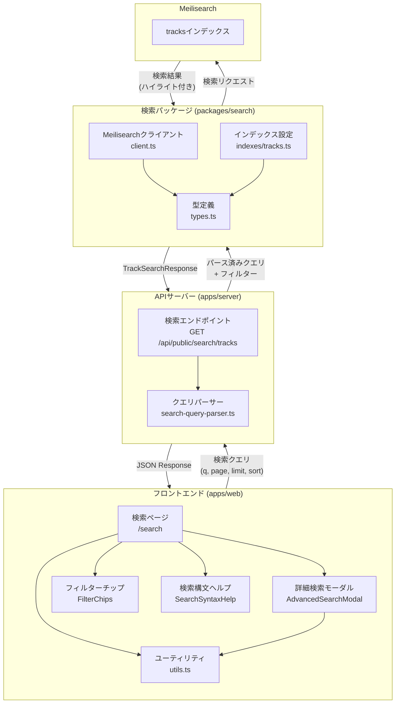
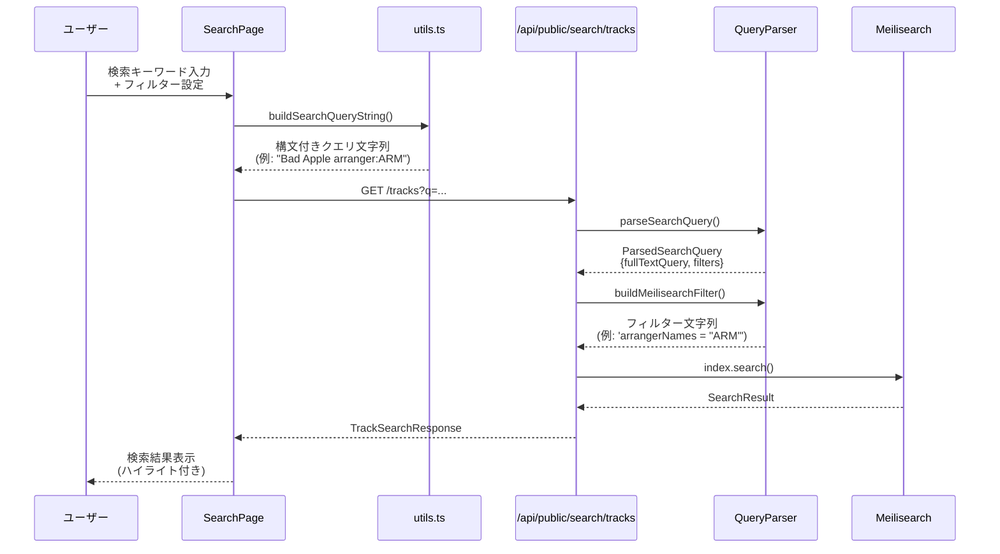

# Meilisearch検索機能

Meilisearchを使用したトラック検索機能の技術仕様書です。

## 概要

本機能は、東方アレンジ楽曲データベースにおいて、Meilisearchを活用した高速な全文検索を提供します。フロントエンドからの検索リクエストは、Hono APIサーバーを経由してMeilisearchに送信され、ハイライト付きの検索結果が返却されます。

### 主な特徴

- 日本語に最適化された全文検索
- 高度な検索構文（フィルター、比較演算子）のサポート
- 検索結果のハイライト表示
- URLによる検索状態の永続化・共有

## 全体アーキテクチャ



## 検索フロー詳細



## ドキュメント構成

| ファイル | 説明 |
|---------|------|
| `README.md` | 本ファイル。機能概要とアーキテクチャ |
| `api-specification.md` | APIエンドポイント仕様、リクエスト/レスポンス形式、エラーハンドリング |
| `search-syntax.md` | ユーザー向け検索構文リファレンス |
| `query-parser.md` | クエリパーサー実装仕様（開発者向け） |
| `index-schema.md` | Meilisearchインデックススキーマ定義 |

## 検索構文

### フィルター一覧

| 構文 | 説明 | 例 |
|------|------|-----|
| `arranger:` | 編曲者で検索 | `arranger:ARM` |
| `composer:` | 作曲者で検索 | `composer:ZUN` |
| `vocalist:` | ボーカルで検索 | `vocalist:miko` |
| `lyricist:` | 作詞者で検索 | `lyricist:夕野ヨシミ` |
| `circle:` | サークル名で検索 | `circle:IOSYS` |
| `originalsong:` | 原曲名で検索 | `originalsong:大吉キトゥン` |
| `event:` | イベント名で検索 | `event:例大祭` |
| `year:` | 頒布年で検索 | `year:2023`, `year:>=2020` |
| `period:` | 頒布日で期間検索 | `period:2025-01-01..2025-12-31` |
| `date:` | 頒布日で検索 | `date:>=2025-01-01` |
| `originalcount:` | 原曲数で検索 | `originalcount:2`, `originalcount:>=3` |
| `vocalistcount:` | ボーカル数で検索 | `vocalistcount:>=2` |
| `arrangercount:` | 編曲者数で検索 | `arrangercount:1` |
| `lyricistcount:` | 作詞者数で検索 | `lyricistcount:>=1` |
| `composercount:` | 作曲者数で検索 | `composercount:2` |
| `remixercount:` | リミキサー数での絞り込み | `remixercount:>=1` |

### 演算子

数値フィルターおよび日付フィルターでは以下の演算子が使用可能:

- `=` : 等しい（デフォルト）
- `>=` : 以上
- `<=` : 以下
- `>` : より大きい
- `<` : より小さい

### 使用例

```
# 複合検索
Bad Apple arranger:ARM year:2023

# クォート付き（スペースを含む値）
circle:"COOL&CREATE"

# 範囲指定
period:2020-01-01..2020-12-31

# 複数条件のAND検索
vocalist:miko arranger:ARM vocalistcount:>=2
```

## 関連ソースファイル

### サーバー側 (apps/server)

| ファイル | 説明 |
|---------|------|
| [`src/routes/public/search.ts`](../../../apps/server/src/routes/public/search.ts) | 検索APIエンドポイント。GET /tracksを提供 |
| [`src/utils/search-query-parser.ts`](../../../apps/server/src/utils/search-query-parser.ts) | 検索クエリパーサー。フィルター構文の解析 |

### フロントエンド側 (apps/web)

| ファイル | 説明 |
|---------|------|
| [`src/routes/_public/search.tsx`](../../../apps/web/src/routes/_public/search.tsx) | 検索ページコンポーネント |
| [`src/components/search/SearchSyntaxHelp.tsx`](../../../apps/web/src/components/search/SearchSyntaxHelp.tsx) | 検索構文ヘルプパネル |
| [`src/components/search/utils.ts`](../../../apps/web/src/components/search/utils.ts) | フィルター変換ユーティリティ |
| [`src/components/search/types.ts`](../../../apps/web/src/components/search/types.ts) | フロントエンド用型定義 |
| [`src/components/search/AdvancedSearchModal.tsx`](../../../apps/web/src/components/search/AdvancedSearchModal.tsx) | 詳細検索モーダル |
| [`src/components/search/FilterChips.tsx`](../../../apps/web/src/components/search/FilterChips.tsx) | フィルターチップ表示 |
| [`src/lib/public-api.ts`](../../../apps/web/src/lib/public-api.ts) | 公開API用クライアント |

### 検索パッケージ (packages/search)

| ファイル | 説明 |
|---------|------|
| [`src/types.ts`](../../../packages/search/src/types.ts) | 検索ドキュメント・レスポンス型定義 |
| [`src/client.ts`](../../../packages/search/src/client.ts) | Meilisearchクライアント |
| [`src/indexes/tracks.ts`](../../../packages/search/src/indexes/tracks.ts) | tracksインデックス設定 |

## Meilisearchインデックス設定

### 検索可能属性 (searchableAttributes)

- `name` - 楽曲名
- `releaseName` - リリース名
- `circleNames` - サークル名配列
- `vocalistNames` - ボーカリスト名配列
- `arrangerNames` - 編曲者名配列
- `lyricistNames` - 作詞者名配列
- `composerNames` - 作曲者名配列
- `remixerNames` - リミキサー名配列
- `originalSongNames` - 原曲名配列
- `originalWorkNames` - 原曲作品名配列
- `originalSongs.lvl0/lvl1/lvl2` - 階層検索用

### フィルター可能属性 (filterableAttributes)

- ID系: `releaseId`, `eventId`, `eventName`
- 日付系: `releaseYear`, `releaseDate`, `releaseType`
- 名前配列系: `circleNames`, `vocalistNames`, `arrangerNames`, `lyricistNames`, `composerNames`, `originalSongNames`, `originalWorkNames`
- フラグ: `isTouhouArrange`
- カウント: `vocalistCount`, `arrangerCount`, `lyricistCount`, `composerCount`, `remixerCount`, `circleCount`, `originalSongCount`

### ソート可能属性 (sortableAttributes)

- `releaseDate`, `releaseYear`, `trackNumber`, `name`, `createdAt`
- 各種カウント属性

### 日本語対応

- `locales: ["jpn"]` を設定し、日本語検索に最適化
- タイポ許容設定: 4文字以上で1文字、8文字以上で2文字のタイポを許容
