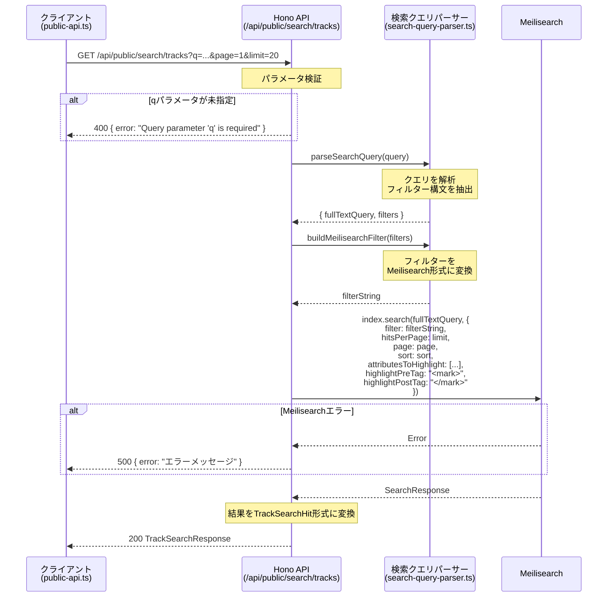

# Meilisearch トラック検索 API 仕様書

## 概要

Meilisearchを使用したトラック検索APIの仕様書です。公開APIとして認証不要でアクセスできます。

---

## 1. エンドポイント定義

### GET /api/public/search/tracks

Meilisearchを使用してトラック（楽曲）を検索します。

**ベースURL:**
- 開発環境: `http://localhost:3001`
- 本番環境: 環境変数 `VITE_SERVER_URL` または `SERVER_URL` で指定

---

## 2. リクエストパラメータ

| パラメータ | 型 | 必須 | デフォルト | 説明 |
|-----------|------|------|------------|------|
| `q` | string | **必須** | - | 検索クエリ。フルテキスト検索とフィルター構文をサポート |
| `page` | number | 任意 | 1 | ページ番号（1始まり） |
| `limit` | number | 任意 | 20 | 1ページあたりの件数（最大100） |
| `sort` | string | 任意 | - | ソートフィールドと方向（例: `releaseDate:desc`） |

> **Note:** 空文字列の `sort` パラメータは無視されます（ソートなしとして扱われます）。

### 検索クエリ構文

`q` パラメータは特殊なフィルター構文をサポートしています。

#### フィルターキーワード一覧

| キーワード | 対象フィールド | 例 |
|-----------|----------------|-----|
| `arranger:` | アレンジャー名 | `arranger:ARM` |
| `vocalist:` | ボーカル名 | `vocalist:あさな` |
| `lyricist:` | 作詞者名 | `lyricist:ZUN` |
| `circle:` | サークル名 | `circle:"COOL&CREATE"` |
| `composer:` | 作曲者名 | `composer:ZUN` |
| `originalsong:` | 原曲名 | `originalsong:BadApple` |
| `event:` | イベント名 | `event:"C102"` |
| `year:` | リリース年 | `year:2023`, `year:>=2020` |
| `period:` | リリース日範囲 | `period:2023-01-01..2023-12-31` |
| `date:` | リリース日 | `date:>=2023-01-01` |
| `originalcount:` | 原曲数 | `originalcount:>=2` |
| `vocalistcount:` | ボーカル数 | `vocalistcount:>=2` |
| `arrangercount:` | アレンジャー数 | `arrangercount:1` |
| `lyricistcount:` | 作詞者数 | `lyricistcount:>=1` |
| `composercount:` | 作曲者数 | `composercount:1` |
| `remixercount:` | リミキサー数 | `remixercount:>=1` |

#### 比較演算子

数値・日付フィルターでは以下の演算子が使用可能です:

| 演算子 | 意味 |
|--------|------|
| `=` | 等しい（デフォルト） |
| `>=` | 以上 |
| `<=` | 以下 |
| `>` | より大きい |
| `<` | より小さい |

#### 値のクォート

スペースや特殊文字を含む値はダブルクォートまたはシングルクォートで囲みます（単純な英数字のみの値にはクォートは不要です）:

```
circle:"COOL&CREATE"
vocalist:'ななひら'
```

---

## 3. レスポンス形式

### TypeScript型定義

```typescript
/** アーティスト参照 */
interface TrackArtistRef {
  id: string | null;
  name: string;
}

/** サークル参照 */
interface TrackCircleRef {
  id: string;
  name: string;
}

/** 原曲参照 */
interface TrackOriginalSongRef {
  id: string | null;
  officialSongId: string | null;
  name: string;
  workId: string | null;
  workName: string | null;
  categoryCode: string | null;
  lvl0: string | null;
  lvl1: string | null;
  lvl2: string | null;
}

/** 配信URL */
interface TrackPublication {
  platformCode: string;
  url: string;
}

/** トラック検索結果のヒット */
interface TrackSearchHit {
  id: string;
  name: string;
  releaseId: string | null;
  releaseName: string | null;
  releaseDate: string | null;
  releaseYear: number | null;
  releaseType: string | null;
  trackNumber: number;
  discNumber: number | null;
  discName: string | null;
  eventId: string | null;
  eventName: string | null;
  circles: TrackCircleRef[];
  vocalists: TrackArtistRef[];
  arrangers: TrackArtistRef[];
  lyricists: TrackArtistRef[];
  composers: TrackArtistRef[];
  remixers: TrackArtistRef[];
  originalSongs: TrackOriginalSongRef[];
  releasePublications: TrackPublication[];
  trackPublications: TrackPublication[];
  vocalistCount: number;
  arrangerCount: number;
  lyricistCount: number;
  composerCount: number;
  remixerCount: number;
  circleCount: number;
  originalSongCount: number;
  releasePublicationCount: number;
  trackPublicationCount: number;
  isTouhouArrange: boolean;
  tags: string[];
  genres: string[];
  circleNames: string[];
  vocalistNames: string[];
  arrangerNames: string[];
  lyricistNames: string[];
  composerNames: string[];
  remixerNames: string[];
  originalSongNames: string[];
  originalWorkNames: string[];
  createdAt: number;
  updatedAt: number;
  /** ハイライト付きフィールド */
  _formatted?: Partial<TrackSearchHit>;
}

/** トラック検索レスポンス */
interface TrackSearchResponse {
  hits: TrackSearchHit[];
  query: string;
  processingTimeMs: number;
  estimatedTotalHits: number;
  page: number;
  limit: number;
  totalPages: number;
}
```

### エラーレスポンス

```typescript
interface ErrorResponse {
  error: string;
}
```

---

## 4. シーケンス図



---

## 5. ハイライト設定

検索結果のハイライト（マッチ箇所の強調表示）には以下の設定が使用されます。

### 対象フィールド

```typescript
const HIGHLIGHT_ATTRIBUTES = [
  "name",           // トラック名
  "releaseName",    // リリース名
  "circleNames",    // サークル名
  "vocalistNames",  // ボーカル名
  "arrangerNames",  // アレンジャー名
  "lyricistNames",  // 作詞者名
  "composerNames",  // 作曲者名
  "remixerNames",   // リミキサー名
  "originalSongNames", // 原曲名
];
```

### ハイライトタグ

| 設定 | 値 |
|------|-----|
| 開始タグ | `<mark>` |
| 終了タグ | `</mark>` |

### ハイライト結果の取得

レスポンスの `hits[].\_formatted` フィールドにハイライト済みのテキストが含まれます。

```json
{
  "hits": [
    {
      "name": "Bad Apple!!",
      "_formatted": {
        "name": "<mark>Bad</mark> <mark>Apple</mark>!!"
      }
    }
  ]
}
```

---

## 6. エラーハンドリング

### HTTPステータスコード

| ステータス | 条件 | レスポンス例 |
|-----------|------|-------------|
| 200 | 正常完了 | `TrackSearchResponse` |
| 400 | `q` パラメータ未指定 | `{ "error": "Query parameter 'q' is required" }` |
| 500 | Meilisearch接続エラー等 | `{ "error": "Search failed" }` |

### エラー処理の詳細

- **`q` パラメータ未指定**: `null` または `undefined` の場合に400エラー。空文字列 `""` は許可（フィルターのみの検索をサポート）
- **ページネーションパラメータ**: 不正な値は自動補正（負数は1に、limitは1-100の範囲にクランプ）
- **Meilisearchエラー**: エラーメッセージを含む500レスポンスを返却

---

## 7. ページネーション仕様

### パラメータ

| パラメータ | 説明 | 制約 |
|-----------|------|------|
| `page` | ページ番号（1始まり） | 最小値: 1 |
| `limit` | 1ページあたりの件数 | 最小値: 1、最大値: 100、デフォルト: 20 |

### レスポンスフィールド

| フィールド | 型 | 説明 |
|-----------|------|------|
| `page` | number | 現在のページ番号 |
| `limit` | number | 1ページあたりの件数 |
| `totalPages` | number | 総ページ数 |
| `estimatedTotalHits` | number | 推定総件数 |

### ページネーションの計算

```
総ページ数 = ceil(推定総件数 / limit)
オフセット = (page - 1) * limit
```

---

## 8. cURLリクエスト例

### 基本的な検索

```bash
curl -X GET "http://localhost:3001/api/public/search/tracks?q=Bad%20Apple"
```

### フィルター付き検索

```bash
# アレンジャーでフィルター
curl -X GET "http://localhost:3001/api/public/search/tracks?q=arranger%3AARM"

# サークル名（スペース含む）でフィルター
curl -X GET "http://localhost:3001/api/public/search/tracks?q=circle%3A%22COOL%26CREATE%22"

# 複合検索（フルテキスト + フィルター）
curl -X GET "http://localhost:3001/api/public/search/tracks?q=Bad%20Apple%20year%3A2023"

# 年の範囲指定
curl -X GET "http://localhost:3001/api/public/search/tracks?q=year%3A%3E%3D2020"
```

### ページネーション付き検索

```bash
curl -X GET "http://localhost:3001/api/public/search/tracks?q=東方&page=2&limit=50"
```

### ソート付き検索

```bash
# リリース日の降順でソート
curl -X GET "http://localhost:3001/api/public/search/tracks?q=&sort=releaseDate%3Adesc"

# リリース年の昇順でソート
curl -X GET "http://localhost:3001/api/public/search/tracks?q=arranger%3AARM&sort=releaseYear%3Aasc"
```

### 日付範囲でフィルター

```bash
# 期間指定
curl -X GET "http://localhost:3001/api/public/search/tracks?q=period%3A2023-01-01..2023-12-31"

# 特定日以降
curl -X GET "http://localhost:3001/api/public/search/tracks?q=date%3A%3E%3D2023-01-01"
```

### 空クエリ（全件取得）

```bash
# フィルターのみ（フルテキスト検索なし）
curl -X GET "http://localhost:3001/api/public/search/tracks?q=circle%3AIOSYS"

# フィルターなし（全件）
curl -X GET "http://localhost:3001/api/public/search/tracks?q="
```

---

## 関連ファイル

- **API実装**: `apps/server/src/routes/public/search.ts`
- **クエリパーサー**: `apps/server/src/utils/search-query-parser.ts`
- **クライアント**: `apps/web/src/lib/public-api.ts`
- **検索型定義**: `packages/search/src/types.ts`
