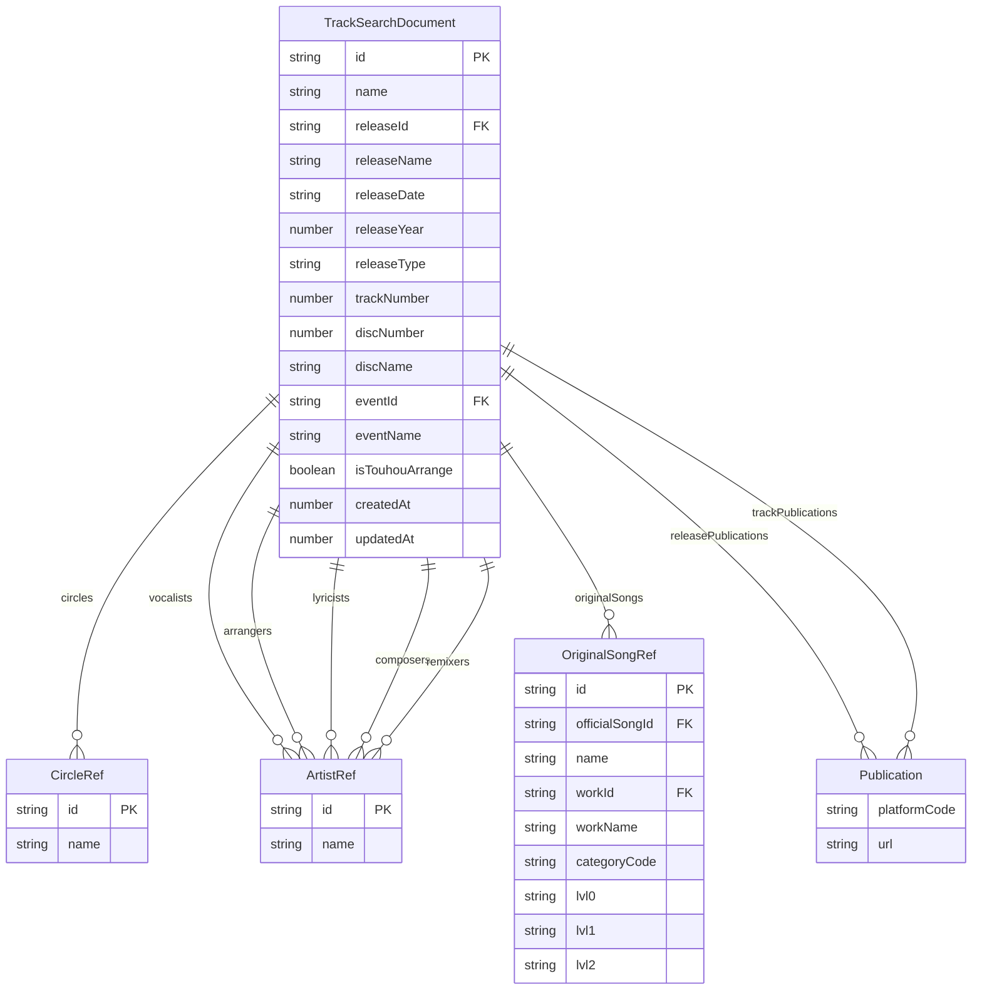
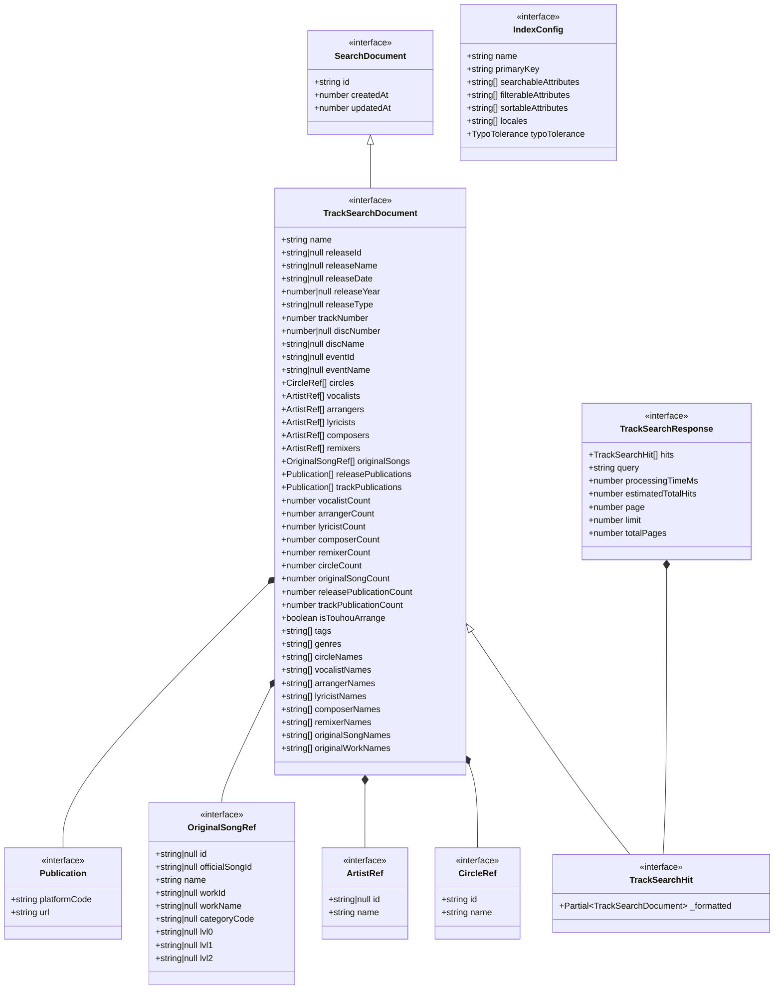

# Meilisearch インデックススキーマ

本ドキュメントは、楽曲検索機能で使用する Meilisearch インデックス `tracks` のスキーマ定義について説明します。

## 1. インデックス概要

| 項目 | 値 |
|------|-----|
| インデックス名 | `tracks` |
| 主キー | `id` |
| ロケール | `jpn`（日本語、大文字小文字を区別しない検索） |
| タイポ許容設定 | 1タイポ: 4文字以上、2タイポ: 8文字以上 |

### 用途

- 東方アレンジ楽曲の全文検索
- ファセット検索（サークル、アーティスト、原曲、イベントなど）
- 階層的な原曲フィルタリング（カテゴリ > 作品 > 曲）

## 2. TrackSearchDocument 構造

### TypeScript 型定義

```typescript
/** 基底インターフェース */
interface SearchDocument {
  id: string;
  createdAt: number;  // Unix timestamp (ms)
  updatedAt: number;  // Unix timestamp (ms)
}

/** 配信URL */
interface Publication {
  platformCode: string;  // "spotify", "apple_music", etc.
  url: string;
}

/** アーティスト参照 */
interface ArtistRef {
  id: string | null;  // trackCredits.artistAliasId
  name: string;       // trackCredits.creditName
}

/** サークル参照 */
interface CircleRef {
  id: string;   // circles.id
  name: string;
}

/** 原曲参照 */
interface OriginalSongRef {
  id: string | null;              // trackOfficialSongs.id
  officialSongId: string | null;  // officialSongs.id
  name: string;
  workId: string | null;          // officialWorks.id
  workName: string | null;
  categoryCode: string | null;
  // 階層検索用
  lvl0: string | null;  // カテゴリ表示名
  lvl1: string | null;  // 作品名
  lvl2: string | null;  // 曲名
}

/** 楽曲検索ドキュメント */
interface TrackSearchDocument extends SearchDocument {
  // 基本情報
  name: string;

  // リリース情報
  releaseId: string | null;
  releaseName: string | null;
  releaseDate: string | null;      // "YYYY-MM-DD"
  releaseYear: number | null;
  releaseType: string | null;
  trackNumber: number;
  discNumber: number | null;
  discName: string | null;

  // イベント情報
  eventId: string | null;
  eventName: string | null;

  // サークル（オブジェクト配列）
  circles: CircleRef[];

  // クレジット（オブジェクト配列）
  vocalists: ArtistRef[];
  arrangers: ArtistRef[];
  lyricists: ArtistRef[];
  composers: ArtistRef[];
  remixers: ArtistRef[];

  // 原曲（オブジェクト配列）
  originalSongs: OriginalSongRef[];

  // 配信URL
  releasePublications: Publication[];
  trackPublications: Publication[];

  // カウント
  vocalistCount: number;
  arrangerCount: number;
  lyricistCount: number;
  composerCount: number;
  remixerCount: number;
  circleCount: number;
  originalSongCount: number;
  releasePublicationCount: number;
  trackPublicationCount: number;

  // フラグ
  isTouhouArrange: boolean;

  // 未実装（型定義のみ）
  tags: string[];
  genres: string[];

  // 検索用名前配列
  circleNames: string[];
  vocalistNames: string[];
  arrangerNames: string[];
  lyricistNames: string[];
  composerNames: string[];
  remixerNames: string[];
  originalSongNames: string[];
  originalWorkNames: string[];
}
```

## 3. ER図（エンティティ関係）



## 4. 属性設定

### 4.1 検索可能属性（searchableAttributes）

検索クエリがマッチする対象フィールドです。順序は検索時の優先度を表します。

| 属性名 | 説明 | 優先度 |
|--------|------|--------|
| `name` | 楽曲名 | 1（最高） |
| `releaseName` | リリース名 | 2 |
| `circleNames` | サークル名の配列 | 3 |
| `vocalistNames` | ボーカリスト名の配列 | 4 |
| `arrangerNames` | 編曲者名の配列 | 5 |
| `lyricistNames` | 作詞者名の配列 | 6 |
| `composerNames` | 作曲者名の配列 | 7 |
| `remixerNames` | リミキサー名の配列 | 8 |
| `originalSongNames` | 原曲名の配列 | 9 |
| `originalWorkNames` | 原作作品名の配列 | 10 |
| `originalSongs.lvl0` | 階層検索: カテゴリ | 11 |
| `originalSongs.lvl1` | 階層検索: 作品 | 12 |
| `originalSongs.lvl2` | 階層検索: 曲 | 13（最低） |

### 4.2 フィルター可能属性（filterableAttributes）

ファセット検索やフィルタリングで使用できる属性です。

| 属性名 | 型 | 用途 |
|--------|-----|------|
| `releaseId` | string | リリースでのフィルタリング |
| `eventId` | string | イベントIDでのフィルタリング |
| `eventName` | string | イベント名でのフィルタリング |
| `releaseYear` | number | 年での絞り込み |
| `releaseDate` | string | 日付での絞り込み |
| `releaseType` | string | リリースタイプでの絞り込み |
| `circleNames` | string[] | サークル名でのファセット |
| `vocalistNames` | string[] | ボーカリストでのファセット |
| `arrangerNames` | string[] | 編曲者でのファセット |
| `lyricistNames` | string[] | 作詞者でのファセット |
| `composerNames` | string[] | 作曲者でのファセット |
| `originalSongNames` | string[] | 原曲でのファセット |
| `originalWorkNames` | string[] | 原作作品でのファセット |
| `originalSongs.lvl0` | string | 階層ファセット: カテゴリ |
| `originalSongs.lvl1` | string | 階層ファセット: 作品 |
| `originalSongs.lvl2` | string | 階層ファセット: 曲 |
| `isTouhouArrange` | boolean | 東方アレンジフラグ |
| `vocalistCount` | number | ボーカリスト数でのフィルタ |
| `arrangerCount` | number | 編曲者数でのフィルタ |
| `lyricistCount` | number | 作詞者数でのフィルタ |
| `composerCount` | number | 作曲者数でのフィルタ |
| `remixerCount` | number | リミキサー数でのフィルタ |
| `circleCount` | number | サークル数でのフィルタ |
| `originalSongCount` | number | 原曲数でのフィルタ |

### 4.3 ソート可能属性（sortableAttributes）

検索結果のソートに使用できる属性です。

| 属性名 | 型 | 説明 |
|--------|-----|------|
| `releaseDate` | string | リリース日順 |
| `releaseYear` | number | リリース年順 |
| `trackNumber` | number | トラック番号順 |
| `name` | string | 楽曲名順（アルファベット順） |
| `createdAt` | number | 作成日順 |
| `vocalistCount` | number | ボーカリスト数順 |
| `arrangerCount` | number | 編曲者数順 |
| `lyricistCount` | number | 作詞者数順 |
| `composerCount` | number | 作曲者数順 |
| `remixerCount` | number | リミキサー数順 |
| `circleCount` | number | サークル数順 |
| `originalSongCount` | number | 原曲数順 |

## 5. クラス図（型の関係）



## 6. インデックス設定例

### 6.1 完全な設定オブジェクト

```typescript
import type { IndexConfig } from "../types";

export const TRACKS_INDEX_NAME = "tracks";

export const tracksIndexConfig: IndexConfig = {
  name: TRACKS_INDEX_NAME,
  primaryKey: "id",
  searchableAttributes: [
    // 基本情報
    "name",
    // リリース情報
    "releaseName",
    // 検索用名前配列
    "circleNames",
    "vocalistNames",
    "arrangerNames",
    "lyricistNames",
    "composerNames",
    "remixerNames",
    "originalSongNames",
    "originalWorkNames",
    // 階層検索（originalSongs内）
    "originalSongs.lvl0",
    "originalSongs.lvl1",
    "originalSongs.lvl2",
  ],
  filterableAttributes: [
    // ID
    "releaseId",
    "eventId",
    "eventName",
    // 年・日付
    "releaseYear",
    "releaseDate",
    "releaseType",
    // 名前配列
    "circleNames",
    "vocalistNames",
    "arrangerNames",
    "lyricistNames",
    "composerNames",
    "originalSongNames",
    "originalWorkNames",
    // 階層検索（originalSongs内）
    "originalSongs.lvl0",
    "originalSongs.lvl1",
    "originalSongs.lvl2",
    // フラグ
    "isTouhouArrange",
    // カウント
    "vocalistCount",
    "arrangerCount",
    "lyricistCount",
    "composerCount",
    "remixerCount",
    "circleCount",
    "originalSongCount",
  ],
  sortableAttributes: [
    "releaseDate",
    "releaseYear",
    "trackNumber",
    "name",
    "createdAt",
    // カウント
    "vocalistCount",
    "arrangerCount",
    "lyricistCount",
    "composerCount",
    "remixerCount",
    "circleCount",
    "originalSongCount",
  ],
  // 日本語検索の精度向上のための設定
  // 大文字小文字を区別しない（case-insensitive）
  locales: ["jpn"],
  typoTolerance: {
    minWordSizeForTypos: {
      oneTypo: 4,   // 4文字以上で1タイポ許容
      twoTypos: 8,  // 8文字以上で2タイポ許容
    },
  },
};
```

### 6.2 階層検索（Hierarchical Facet）のフォーマット

原曲の階層検索は以下のフォーマットで構成されます。

| レベル | フォーマット | 例 |
|--------|-------------|-----|
| lvl0 | `{カテゴリ表示名}` | `02. Windows作品` |
| lvl1 | `{lvl0} > {番号}. {作品短縮名}` | `02. Windows作品 > 06.0. 紅魔郷` |
| lvl2 | `{lvl1} > {曲番号}. {曲名}` | `02. Windows作品 > 06.0. 紅魔郷 > 01. 赤より紅い夢` |

#### カテゴリコードと表示名の対応

| カテゴリコード | 表示名 |
|---------------|--------|
| `pc98` | 01. PC-98作品 |
| `windows` | 02. Windows作品 |
| `zuns_music_collection` | 03. ZUN's Music Collection |
| `akyus_untouched_score` | 04. 幺樂団の歴史 |
| `commercial_books` | 05. 商業書籍 |
| `tasofro` | 06. 黄昏フロンティア作品 |
| `other` | 07. その他 |

### 6.3 検索クエリ例

```typescript
// 基本検索
const results = await searchClient.search("tracks", {
  q: "bad apple",
  limit: 20,
  page: 1,
});

// ファセット検索（サークルでフィルタ）
const results = await searchClient.search("tracks", {
  q: "",
  filter: "circleNames = 'Alstroemeria Records'",
  limit: 20,
});

// 階層ファセット検索（Windows作品のみ）
const results = await searchClient.search("tracks", {
  q: "",
  filter: "originalSongs.lvl0 = '02. Windows作品'",
  facets: ["originalSongs.lvl0", "originalSongs.lvl1"],
  limit: 20,
});

// 複合フィルタ（東方アレンジ & 2020年以降）
const results = await searchClient.search("tracks", {
  q: "",
  filter: "isTouhouArrange = true AND releaseYear >= 2020",
  sort: ["releaseDate:desc"],
  limit: 20,
});
```

## 参照

- ソースファイル: `packages/search/src/types.ts`
- インデックス設定: `packages/search/src/indexes/tracks.ts`
- データ変換: `packages/search/src/transformers/track.ts`
