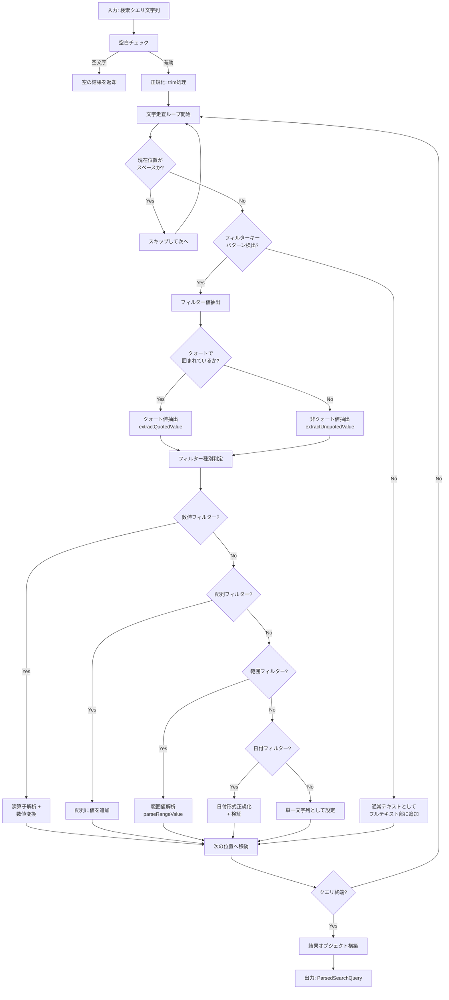
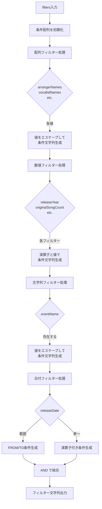
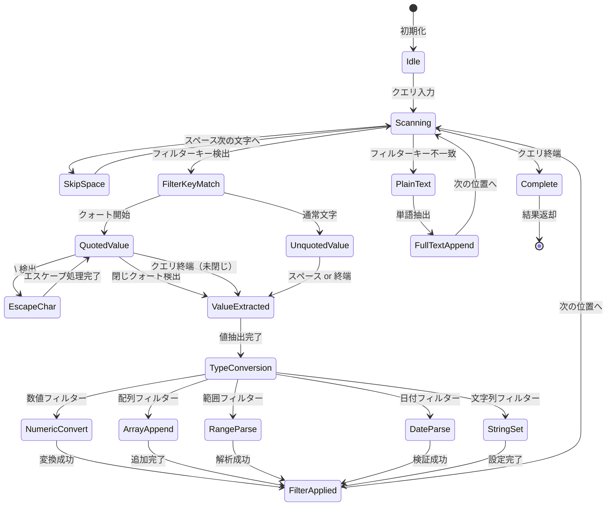

# 検索クエリパーサー仕様

## 1. パーサーの役割と責務

検索クエリパーサー（`search-query-parser.ts`）は、ユーザーが入力した検索クエリ文字列を解析し、Meilisearch向けの構造化されたデータに変換する役割を担う。

### 主な責務

| 責務 | 説明 |
|------|------|
| クエリ分離 | フィルター条件とフルテキスト検索クエリを分離する |
| フィルター抽出 | `key:value` 形式のフィルターを認識・抽出する |
| 値変換 | 文字列、数値、日付、範囲などの型に応じた変換を行う |
| クォート処理 | ダブルクォート・シングルクォートで囲まれた値を正しく処理する |
| 演算子解析 | `>=`, `<=`, `>`, `<`, `=` の比較演算子を解析する |
| フィルター生成 | Meilisearchフィルター文字列を構築する |

---

## 2. パース処理フロー



---

## 3. インターフェース定義

### ParsedSearchQuery

解析結果を表すメインのインターフェース。

```typescript
interface ParsedSearchQuery {
  /** フィルター抽出後の残りテキスト（フルテキスト検索用） */
  fullTextQuery: string;
  /** 抽出されたフィルター条件 */
  filters: {
    arrangerNames?: string[];
    vocalistNames?: string[];
    lyricistNames?: string[];
    circleNames?: string[];
    composerNames?: string[];
    originalSongNames?: string[];
    releaseYear?: FilterValue;
    originalSongCount?: FilterValue;
    vocalistCount?: FilterValue;
    arrangerCount?: FilterValue;
    lyricistCount?: FilterValue;
    composerCount?: FilterValue;
    remixerCount?: FilterValue;
    eventName?: string;
    releaseDate?: RangeFilterValue | FilterValue;
  };
}
```

### FilterValue

比較演算子付きのフィルター値を表す。

```typescript
interface FilterValue {
  op: "=" | ">=" | "<=" | ">" | "<";
  value: string | number;
}
```

### RangeFilterValue

日付範囲フィルター用の値を表す。

```typescript
interface RangeFilterValue {
  from: string; // 開始日（YYYY-MM-DD形式）
  to: string;   // 終了日（YYYY-MM-DD形式）
}
```

---

## 4. フィルターキーマッピング表

| フィルターキー | プロパティ名 | 型 | 数値 | 配列 | 範囲 | 日付 | フルテキスト追加 |
|---------------|-------------|-----|:----:|:----:|:----:|:----:|:---------------:|
| `arranger` | arrangerNames | string[] | - | Yes | - | - | - |
| `vocalist` | vocalistNames | string[] | - | Yes | - | - | - |
| `lyricist` | lyricistNames | string[] | - | Yes | - | - | - |
| `circle` | circleNames | string[] | - | Yes | - | - | - |
| `composer` | composerNames | string[] | - | Yes | - | - | - |
| `originalsong` | originalSongNames | string[] | - | Yes | - | - | No |
| `year` | releaseYear | FilterValue | Yes | - | - | - | - |
| `originalcount` | originalSongCount | FilterValue | Yes | - | - | - | - |
| `vocalistcount` | vocalistCount | FilterValue | Yes | - | - | - | - |
| `arrangercount` | arrangerCount | FilterValue | Yes | - | - | - | - |
| `lyricistcount` | lyricistCount | FilterValue | Yes | - | - | - | - |
| `composercount` | composerCount | FilterValue | Yes | - | - | - | - |
| `remixercount` | remixerCount | FilterValue | Yes | - | - | - | - |
| `event` | eventName | string | - | - | - | - | - |
| `period` | releaseDate | RangeFilterValue | - | - | Yes | - | - |
| `date` | releaseDate | FilterValue | - | - | - | Yes | - |

---

## 5. 値抽出ルール

### クォート処理

クォートで囲まれた値は、スペースを含む文字列として正しく抽出される。

```
入力: circle:"COOL&CREATE"
結果: circleNames = ["COOL&CREATE"]

入力: arranger:'ARM feat. 霧雨'
結果: arrangerNames = ["ARM feat. 霧雨"]
```

**エスケープ処理**: バックスラッシュ（`\`）でクォート文字をエスケープ可能。

```
入力: circle:"サークル\"名"
結果: circleNames = ['サークル"名']
```

**閉じクォートなし**: 閉じクォートが見つからない場合、残り全体を値とする。

### 演算子解析

数値・日付フィルターでは、以下の比較演算子をサポート。

| 演算子 | 意味 | 例 |
|--------|------|-----|
| `=` | 等しい（デフォルト） | `year:2023` |
| `>=` | 以上 | `year:>=2020` |
| `<=` | 以下 | `year:<=2023` |
| `>` | より大きい | `originalcount:>3` |
| `<` | より小さい | `vocalistcount:<5` |

### 範囲値解析

`period` フィルターでは `..` で区切った範囲指定をサポート。

```
入力: period:2020-01-01..2023-12-31
結果: releaseDate = { from: "2020-01-01", to: "2023-12-31" }
```

日付区切り文字は `/` から `-` に自動正規化される。

```
入力: period:2020/01/01..2023/12/31
結果: releaseDate = { from: "2020-01-01", to: "2023-12-31" }
```

---

## 6. Meilisearchフィルター生成ロジック

`buildMeilisearchFilter` 関数は、`ParsedSearchQuery.filters` をMeilisearchのフィルター文字列に変換する。

### 処理フロー



### 生成ルール

| フィルター種別 | 生成形式 | 例 |
|---------------|---------|-----|
| 配列フィルター | `key = "value"` | `circleNames = "IOSYS"` |
| 数値フィルター | `key op value` | `releaseYear >= 2020` |
| 文字列フィルター | `key = "value"` | `eventName = "C100"` |
| 日付範囲 | `key >= "from" AND key <= "to"` | `releaseDate >= "2020-01-01" AND releaseDate <= "2023-12-31"` |
| 日付単一 | `key op "value"` | `releaseDate >= "2020-01-01"` |

**複数条件**: すべての条件は `AND` で結合される。

```typescript
// 入力
{
  circleNames: ["IOSYS"],
  releaseYear: { op: "=", value: 2023 },
  arrangerNames: ["ARM"]
}

// 出力
'circleNames = "IOSYS" AND releaseYear = 2023 AND arrangerNames = "ARM"'
```

---

## 7. 状態遷移図

パーサーの内部状態遷移を示す。



### 状態説明

| 状態 | 説明 |
|------|------|
| Idle | 初期状態 |
| Scanning | クエリ文字列を走査中 |
| SkipSpace | スペースをスキップ |
| FilterKeyMatch | フィルターキー（`key:`）を検出 |
| QuotedValue | クォートされた値を抽出中 |
| EscapeChar | エスケープ文字を処理中 |
| UnquotedValue | 非クォート値を抽出中 |
| ValueExtracted | 値の抽出完了 |
| TypeConversion | 型に応じた変換処理 |
| NumericConvert | 数値変換 |
| ArrayAppend | 配列への追加 |
| RangeParse | 範囲値の解析 |
| DateParse | 日付の解析・検証 |
| StringSet | 文字列値の設定 |
| FilterApplied | フィルターを結果に適用 |
| PlainText | 通常テキストとして認識 |
| FullTextAppend | フルテキスト部分に追加 |
| Complete | 解析完了 |

---

## 8. エラーハンドリング

パーサーは「サイレント失敗（Silent Failure）」戦略を採用している。これは、無効な入力に対してエラーを投げるのではなく、その部分を無視して処理を続行するアプローチである。

### サイレント失敗の挙動

| 状況 | 挙動 | 例 |
|------|------|-----|
| 無効な数値 | フィルターに含めず無視 | `year:abc` → フィルターなし |
| 無効な日付形式 | フィルターに含めず無視 | `date:2023/13/45` → フィルターなし |
| 閉じクォートなし | 残りの文字列全体を値として使用 | `circle:"IOSYS` → `circleNames = ["IOSYS"]` |
| 無効な範囲形式 | `null` を返しフィルターに含めず | `period:invalid` → フィルターなし |

### 設計理由

1. **ユーザビリティ優先**: 検索は部分的な結果でも有用であり、厳密なエラーより寛容な処理が好まれる
2. **段階的な検索**: ユーザーが徐々にフィルターを追加・修正できる
3. **入力途中の状態**: クエリ入力中もリアルタイム検索が機能する

### 注意事項

- 無効なフィルターは結果のフィルター条件に含まれないため、意図しない広範な検索結果になる可能性がある
- ユーザーへのフィードバック（無効なフィルターの通知など）はUIレイヤーで実装を検討すること

---

## 9. コード例

### 基本的な使用例

```typescript
import { parseSearchQuery, buildMeilisearchFilter } from "./search-query-parser";

// 例1: シンプルなフィルター付き検索
const result1 = parseSearchQuery("Bad Apple arranger:ARM year:2023");
console.log(result1);
// {
//   fullTextQuery: "Bad Apple",
//   filters: {
//     arrangerNames: ["ARM"],
//     releaseYear: { op: "=", value: 2023 }
//   }
// }

const filter1 = buildMeilisearchFilter(result1.filters);
console.log(filter1);
// 'arrangerNames = "ARM" AND releaseYear = 2023'
```

### クォート付き値の例

```typescript
// 例2: スペースを含むサークル名
const result2 = parseSearchQuery('circle:"COOL&CREATE" vocalist:"めらみぽっぷ"');
console.log(result2);
// {
//   fullTextQuery: "",
//   filters: {
//     circleNames: ["COOL&CREATE"],
//     vocalistNames: ["めらみぽっぷ"]
//   }
// }

const filter2 = buildMeilisearchFilter(result2.filters);
console.log(filter2);
// 'circleNames = "COOL&CREATE" AND vocalistNames = "めらみぽっぷ"'
```

### 比較演算子の例

```typescript
// 例3: 範囲指定
const result3 = parseSearchQuery("year:>=2020 vocalistcount:>2");
console.log(result3);
// {
//   fullTextQuery: "",
//   filters: {
//     releaseYear: { op: ">=", value: 2020 },
//     vocalistCount: { op: ">", value: 2 }
//   }
// }

const filter3 = buildMeilisearchFilter(result3.filters);
console.log(filter3);
// 'releaseYear >= 2020 AND vocalistCount > 2'
```

### 日付範囲フィルターの例

```typescript
// 例4: 期間指定
const result4 = parseSearchQuery("period:2020-01-01..2023-12-31");
console.log(result4);
// {
//   fullTextQuery: "",
//   filters: {
//     releaseDate: { from: "2020-01-01", to: "2023-12-31" }
//   }
// }

const filter4 = buildMeilisearchFilter(result4.filters);
console.log(filter4);
// 'releaseDate >= "2020-01-01" AND releaseDate <= "2023-12-31"'
```

### 複合クエリの例

```typescript
// 例5: フルテキスト + 複数フィルター
const result5 = parseSearchQuery(
  'ナイト・オブ・ナイツ circle:IOSYS arranger:ARM year:>=2010 event:"C100"'
);
console.log(result5);
// {
//   fullTextQuery: "ナイト・オブ・ナイツ",
//   filters: {
//     circleNames: ["IOSYS"],
//     arrangerNames: ["ARM"],
//     releaseYear: { op: ">=", value: 2010 },
//     eventName: "C100"
//   }
// }

const filter5 = buildMeilisearchFilter(result5.filters);
console.log(filter5);
// 'circleNames = "IOSYS" AND arrangerNames = "ARM" AND releaseYear >= 2010 AND eventName = "C100"'
```

---

## 参照

- ソースファイル: `apps/server/src/utils/search-query-parser.ts`
- Meilisearch フィルター構文: https://www.meilisearch.com/docs/learn/filtering_and_sorting/filter_search_results
