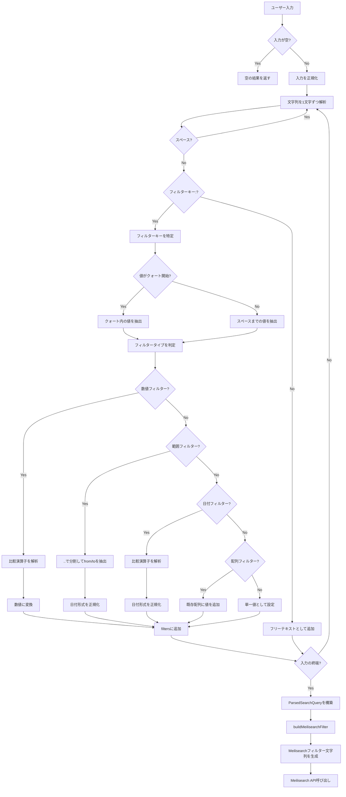

# Meilisearch 検索構文仕様

開発者向けのMeilisearch検索構文リファレンスです。

## 1. 検索構文の概要

本システムの検索機能は、フルテキスト検索とフィルター検索を組み合わせた高度な検索を提供します。

### 基本構造

```
[フリーテキスト] [フィルター:値] [フィルター:値] ...
```

- **フリーテキスト**: 通常の検索語句（曲名、アルバム名など）
- **フィルター**: `キーワード:値` 形式で特定フィールドを絞り込み
- 複数の条件はスペースで区切り、すべてAND条件として適用

### 例

```
Bad Apple arranger:ARM year:2023
```

この例では以下の条件で検索します：
- フリーテキスト「Bad Apple」を含む
- 編曲者が「ARM」である
- 頒布年が2023年である

---

## 2. 利用可能なフィルターキー一覧

### 人物検索フィルター

| キーワード | 説明 | 対応プロパティ | 配列 | 使用例 |
|-----------|------|---------------|------|--------|
| `arranger:` | 編曲者で検索 | `arrangerNames` | Yes | `arranger:ARM` |
| `vocalist:` | ボーカルで検索 | `vocalistNames` | Yes | `vocalist:miko` |
| `lyricist:` | 作詞者で検索 | `lyricistNames` | Yes | `lyricist:夕野ヨシミ` |
| `composer:` | 作曲者で検索 | `composerNames` | Yes | `composer:ZUN` |

### サークル検索フィルター

| キーワード | 説明 | 対応プロパティ | 配列 | 使用例 |
|-----------|------|---------------|------|--------|
| `circle:` | サークル名で検索 | `circleNames` | Yes | `circle:IOSYS` |

### コンテンツ検索フィルター

| キーワード | 説明 | 対応プロパティ | 配列 | 使用例 |
|-----------|------|---------------|------|--------|
| `originalsong:` | 原曲名で検索 | `originalSongNames` | Yes | `originalsong:大吉キトゥン` |
| `event:` | イベント名で検索 | `eventName` | No | `event:例大祭` |

### 期間検索フィルター

| キーワード | 説明 | 対応プロパティ | 形式 | 使用例 |
|-----------|------|---------------|------|--------|
| `period:` | 頒布日で期間検索 | `releaseDate` | 範囲 | `period:2025-01-01..2025-12-31` |
| `date:` | 頒布日で検索 | `releaseDate` | 日付 | `date:>=2025-01-01` |

### 数値フィルター

| キーワード | 説明 | 対応プロパティ | 比較演算子 | 使用例 |
|-----------|------|---------------|------------|--------|
| `year:` | 頒布年で検索 | `releaseYear` | 対応 | `year:2023` |
| `originalcount:` | 原曲数で検索 | `originalSongCount` | 対応 | `originalcount:>=2` |
| `vocalistcount:` | ボーカル数で検索 | `vocalistCount` | 対応 | `vocalistcount:>=2` |
| `arrangercount:` | 編曲者数で検索 | `arrangerCount` | 対応 | `arrangercount:1` |
| `lyricistcount:` | 作詞者数で検索 | `lyricistCount` | 対応 | `lyricistcount:>=1` |
| `composercount:` | 作曲者数で検索 | `composerCount` | 対応 | `composercount:2` |
| `remixercount:` | リミキサー数 | `remixerCount` | 対応 | `remixercount:>=1` |

---

## 3. 比較演算子

数値フィルターおよび日付フィルター（`date:`）では、以下の比較演算子を使用できます。

| 演算子 | 意味 | 例 |
|--------|------|-----|
| `=` | 等しい（省略可能） | `year:2023` または `year:=2023` |
| `>=` | 以上 | `year:>=2020` |
| `<=` | 以下 | `year:<=2025` |
| `>` | より大きい | `vocalistcount:>1` |
| `<` | より小さい | `originalcount:<5` |

### 日付フィルターでの使用例

```
date:2025-01-01      # 2025年1月1日に頒布されたもの
date:>=2025-01-01    # 2025年1月1日以降に頒布されたもの
date:<2025-01-01     # 2025年1月1日より前に頒布されたもの
date:<=2024-12-31    # 2024年12月31日以前に頒布されたもの
```

---

## 4. 複合検索の記法（AND条件）

複数のフィルターをスペースで区切ると、すべての条件を満たす結果のみが返されます（AND条件）。

### 構文

```
条件1 条件2 条件3 ...
```

### 複合検索の例

```bash
# 編曲者がARMで、2023年以降のもの
arranger:ARM year:>=2023

# サークルIOSYSの、ボーカルが2人以上のもの
circle:IOSYS vocalistcount:>=2

# 作曲者ZUNで、例大祭で頒布されたもの
composer:ZUN event:例大祭

# フリーテキスト「恋色」を含み、編曲者ARMで2020年〜2025年の範囲
恋色 arranger:ARM period:2020-01-01..2025-12-31

# 複数人物条件：編曲者ARM、ボーカルmiko
arranger:ARM vocalist:miko
```

### 同一キーの複数指定

同じフィルターキーを複数回指定した場合、それぞれがAND条件として適用されます。

```bash
# 編曲者がARMかつ編曲者がTaQのもの（共同編曲）
arranger:ARM arranger:TaQ
```

---

## 5. クォート処理

スペースや特殊文字を含む値を検索する場合は、ダブルクォート（`"`）またはシングルクォート（`'`）で囲みます。

### 使用が必要なケース

- 値にスペースが含まれる場合
- 値に特殊文字（`&`, `!`, `:` など）が含まれる場合
- 値にクォート自体が含まれる場合（エスケープが必要）

### クォート記法の例

```bash
# スペースを含むサークル名
circle:"SOUND HOLIC"

# 特殊文字を含むサークル名
circle:"COOL&CREATE"

# シングルクォートも使用可能
circle:'COOL&CREATE'

# エスケープ（ダブルクォート内にダブルクォートを含める場合）
circle:"Say \"Hello\""
```

### クォート処理の内部動作

1. パーサーがフィルター値の先頭文字を確認
2. `"` または `'` の場合、対応する閉じクォートまでを値として抽出
3. 閉じクォートが見つからない場合、文字列末尾までを値として使用
4. エスケープ文字（`\`）は次の文字をリテラルとして扱う

---

## 6. 検索構文のフロー図

ユーザー入力からMeilisearchフィルター適用までの処理フローを示します。



### データ構造の変換

```mermaid
flowchart LR
    subgraph Input
        A["'Bad Apple arranger:ARM year:>=2023'"]
    end

    subgraph ParsedSearchQuery
        B["fullTextQuery: 'Bad Apple'"]
        C["filters.arrangerNames: ['ARM']"]
        D["filters.releaseYear: {op: '>=', value: 2023}"]
    end

    subgraph MeilisearchFilter
        E["arrangerNames = \"ARM\" AND releaseYear >= 2023"]
    end

    A --> B
    A --> C
    A --> D
    B --> F[Meilisearch q パラメータ]
    C --> E
    D --> E
    E --> G[Meilisearch filter パラメータ]
```

---

## 7. 使用例

### 基本的な検索

```bash
# フリーテキスト検索のみ
Bad Apple

# 単一フィルター
arranger:ARM

# 複数フィルター
arranger:ARM vocalist:miko
```

### 人物・サークル検索

```bash
# 特定の編曲者の楽曲
arranger:ARM

# 特定のボーカリストが参加した楽曲
vocalist:miko

# 特定のサークルの楽曲
circle:IOSYS

# 複数人物の組み合わせ（AND条件）
arranger:ARM vocalist:miko lyricist:夕野ヨシミ

# 特殊文字を含むサークル名
circle:"COOL&CREATE"
circle:"SOUND HOLIC"
```

### 原曲・イベント検索

```bash
# 特定の原曲をアレンジした楽曲
originalsong:大吉キトゥン

# 特定のイベントで頒布された楽曲
event:例大祭

# 原曲とイベントの組み合わせ
originalsong:大吉キトゥン event:例大祭
```

### 年・日付による検索

```bash
# 特定年の楽曲
year:2023

# 2020年以降の楽曲
year:>=2020

# 2015年より前の楽曲
year:<2015

# 特定の日付範囲（期間検索）
period:2020-01-01..2025-12-31

# 特定日以降
date:>=2025-01-01

# 特定日より前
date:<2024-01-01
```

### 数値カウントによる検索

```bash
# 原曲が2曲以上使用されているメドレー
originalcount:>=2

# ソロボーカル楽曲
vocalistcount:1

# 複数ボーカル楽曲
vocalistcount:>=2

# 複数編曲者による楽曲
arrangercount:>=2

# 作詞者がいる楽曲（インスト除外）
lyricistcount:>=1

# リミキサーが参加している楽曲
remixercount:>=1
```

### 複合検索（実践例）

```bash
# ARMが編曲した2023年のIOSYS楽曲
arranger:ARM circle:IOSYS year:2023

# mikoボーカルの例大祭頒布楽曲（2020年以降）
vocalist:miko event:例大祭 year:>=2020

# 「恋色」を含むソロボーカル楽曲
恋色 vocalistcount:1

# ZUN作曲原曲の2人以上ボーカル楽曲
composer:ZUN vocalistcount:>=2

# SOUND HOLICの2020年〜2023年の楽曲
circle:"SOUND HOLIC" period:2020-01-01..2023-12-31

# 原曲3曲以上のメドレーで、例大祭頒布のもの
originalcount:>=3 event:例大祭
```

---

## 関連ファイル

- パーサー実装: `apps/server/src/utils/search-query-parser.ts`
- UI ヘルプコンポーネント: `apps/web/src/components/search/SearchSyntaxHelp.tsx`
