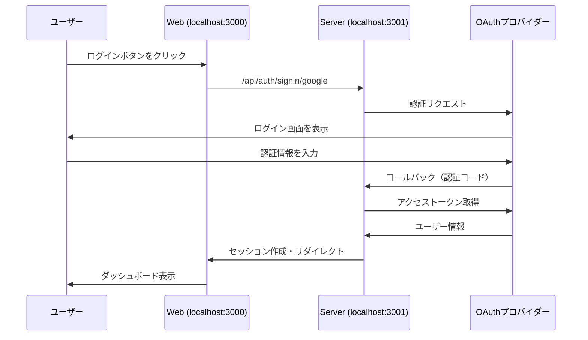
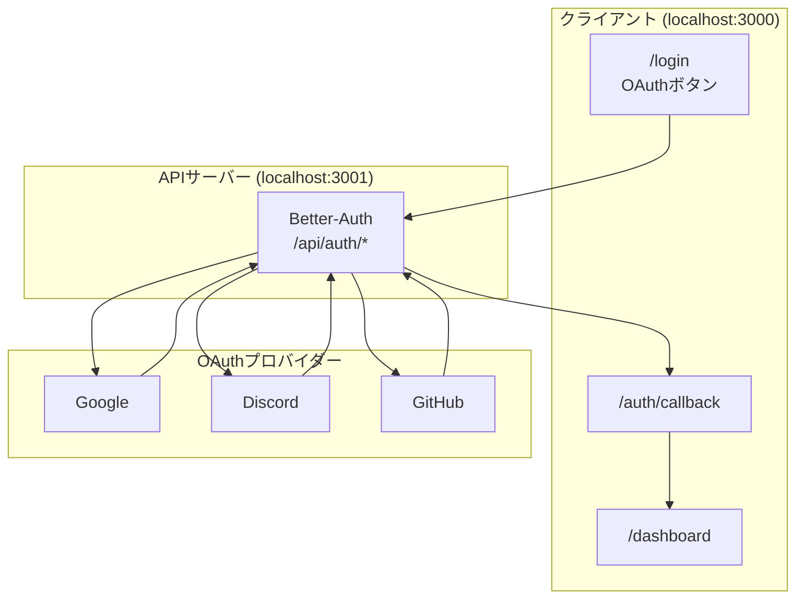

# OAuth認証 設定ガイド

## 概要

本プロジェクトでは、一般ユーザーの認証にOAuth（Google、Discord、GitHub）を使用します。
このドキュメントでは、各OAuthプロバイダーの設定方法を説明します。

## 認証フロー

### OAuth認証シーケンス



### システム構成図



## クイックスタート

### 1. 環境変数ファイルの作成

```bash
cp apps/server/.env.example apps/server/.env
```

### 2. OAuthプロバイダーでアプリを作成

各プロバイダーの設定手順（後述）に従ってアプリを作成し、クライアントIDとシークレットを取得します。

### 3. 環境変数を設定

`apps/server/.env` に取得した値を設定:

```bash
GOOGLE_CLIENT_ID=取得したクライアントID
GOOGLE_CLIENT_SECRET=取得したシークレット
# Discord, GitHubも同様
```

### 4. サーバーを起動

```bash
bun run dev
```

### 5. 動作確認

http://localhost:3000/login にアクセスし、OAuthログインをテスト。

## 前提条件

- 各プロバイダーのアカウント
- 開発環境: `http://localhost:3001`（APIサーバー）

## 1. Google OAuth

### 設定手順

1. [Google Cloud Console](https://console.cloud.google.com/) にアクセス
2. プロジェクトを選択または新規作成
3. 「APIとサービス」→「認証情報」に移動
4. 「認証情報を作成」→「OAuthクライアントID」をクリック
5. アプリケーションの種類: 「ウェブアプリケーション」を選択
6. 承認済みリダイレクトURIを追加:
   - 開発環境: `http://localhost:3001/api/auth/callback/google`
   - 本番環境: `https://your-domain.com/api/auth/callback/google`
7. 「作成」をクリック
8. クライアントIDとクライアントシークレットをコピー

### 必要なスコープ

- `openid`
- `email`
- `profile`

## 2. Discord OAuth

### 設定手順

1. [Discord Developer Portal](https://discord.com/developers/applications) にアクセス
2. 「New Application」をクリックしてアプリを作成
3. 左メニューの「OAuth2」→「General」に移動
4. 「Redirects」にリダイレクトURIを追加:
   - 開発環境: `http://localhost:3001/api/auth/callback/discord`
   - 本番環境: `https://your-domain.com/api/auth/callback/discord`
5. 「Save Changes」をクリック
6. 「Client ID」をコピー
7. 「Client Secret」の「Reset Secret」でシークレットを生成してコピー

### 必要なスコープ

- `identify`
- `email`

## 3. GitHub OAuth

### 設定手順

1. [GitHub Developer Settings](https://github.com/settings/developers) にアクセス
2. 「OAuth Apps」→「New OAuth App」をクリック
3. 以下を入力:
   - Application name: アプリ名
   - Homepage URL: `http://localhost:3000`（開発環境）
   - Authorization callback URL:
     - 開発環境: `http://localhost:3001/api/auth/callback/github`
     - 本番環境: `https://your-domain.com/api/auth/callback/github`
4. 「Register application」をクリック
5. 「Client ID」をコピー
6. 「Generate a new client secret」でシークレットを生成してコピー

### 必要なスコープ

- `read:user`
- `user:email`

## 環境変数の設定

### 開発環境

`apps/server/.env` に以下を追加:

```bash
# OAuth Providers
GOOGLE_CLIENT_ID=your_google_client_id
GOOGLE_CLIENT_SECRET=your_google_client_secret
DISCORD_CLIENT_ID=your_discord_client_id
DISCORD_CLIENT_SECRET=your_discord_client_secret
GITHUB_CLIENT_ID=your_github_client_id
GITHUB_CLIENT_SECRET=your_github_client_secret
```

### 本番環境

本番環境では、環境変数を安全に管理してください（例: Vercel、Railway、Fly.ioなどのシークレット管理機能を使用）。

## リダイレクトURIの一覧

| プロバイダー | 開発環境 | 本番環境 |
|-------------|---------|---------|
| Google | `http://localhost:3001/api/auth/callback/google` | `https://your-domain.com/api/auth/callback/google` |
| Discord | `http://localhost:3001/api/auth/callback/discord` | `https://your-domain.com/api/auth/callback/discord` |
| GitHub | `http://localhost:3001/api/auth/callback/github` | `https://your-domain.com/api/auth/callback/github` |

## トラブルシューティング

### 「redirect_uri_mismatch」エラー

- プロバイダーに登録したリダイレクトURIと、実際のコールバックURLが一致しているか確認
- 末尾のスラッシュの有無に注意
- HTTPとHTTPSの違いに注意

### 「invalid_client」エラー

- クライアントIDとシークレットが正しいか確認
- 環境変数が正しく読み込まれているか確認

### 認証後にリダイレクトされない

- `CORS_ORIGIN` が正しく設定されているか確認
- Cookieの設定（SameSite、Secure）を確認

## 実装機能

### 認証機能
- Google、Discord、GitHub によるOAuth認証
- セッション管理とCookie設定
- ログイン/ログアウト処理

### ユーザー情報の自動取得
- メールアドレス
- 表示名（displayName）
- **アバター画像** - OAuthプロバイダのプロフィール画像を自動取得

## アバター画像

ユーザーのアバター画像は以下の優先順位で表示されます：

1. **OAuthプロバイダのアバター** - Google、Discord、GitHubのプロフィール画像を自動取得
2. **UI Avatars** - プロバイダにアバターがない場合、ユーザー名のイニシャルから自動生成

※ セキュリティ上の理由から、任意の画像URL入力はサポートしていません。

## 関連ファイル

- `packages/auth/src/index.ts` - Better-Auth設定
- `apps/server/.env.example` - 環境変数テンプレート
- `apps/web/src/routes/login.tsx` - ログイン画面
