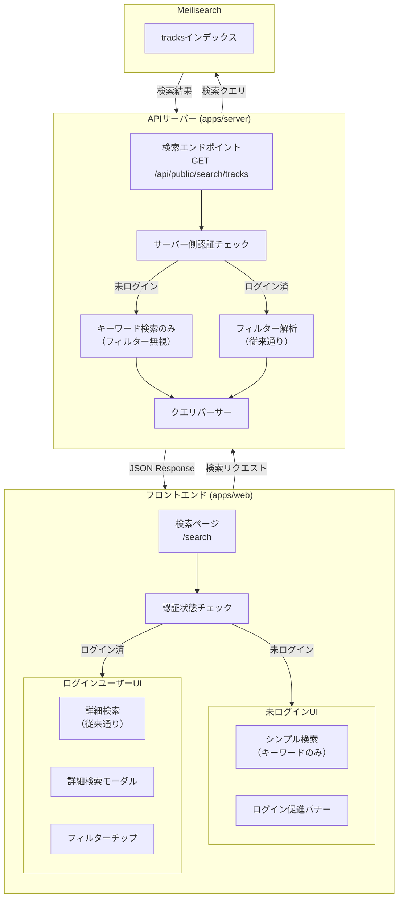
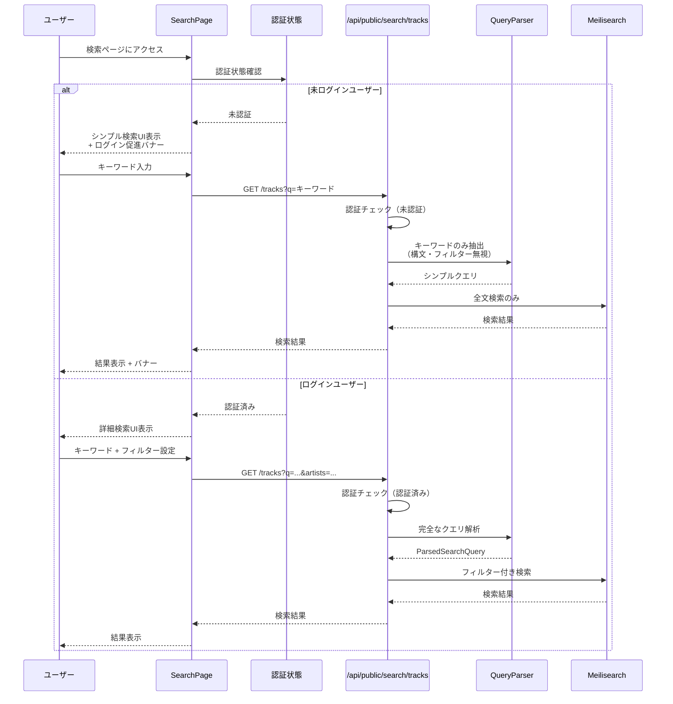
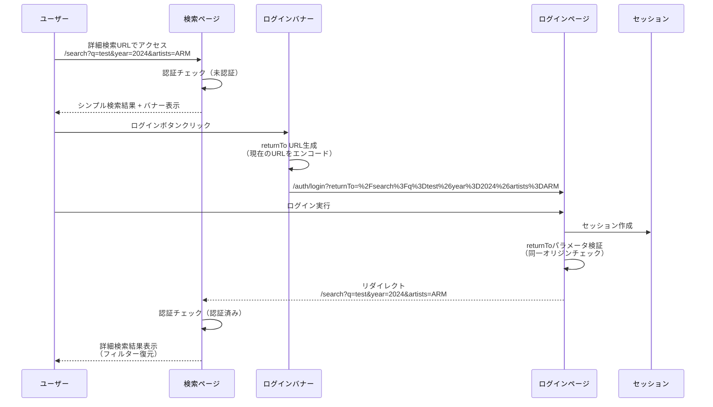

# 検索機能の認証制限

未ログインユーザーに対する検索機能の制限仕様書です。

## 概要

未ログインユーザーに対して検索機能を制限し、シンプルなキーワード検索のみを提供します。ログインユーザーは従来通り詳細検索（フィルター、検索構文）を利用可能です。

### 目的

- 無料ユーザーへの基本的な検索体験の提供
- ログインユーザーへの付加価値（詳細検索機能）の提供
- 新規ユーザー登録の促進

## ユーザー種別ごとの仕様

### 未ログインユーザー

| 項目 | 仕様 |
|------|------|
| 検索ボタン | 入力欄の右側に「検索」ボタンを配置（詳細検索アイコンは非表示） |
| 検索構文 | `year:2024` 等の構文は無視し、キーワードとして扱う（エラーなし） |
| URLフィルター | `artists`, `circles` 等のパラメータは無視、`q` のみで検索 |
| バナー | 検索結果上部にログイン促進バナー表示（閉じるボタンあり） |
| ログイン後 | 元の詳細検索URLに戻る（フィルター復元） |

### ログインユーザー

| 項目 | 仕様 |
|------|------|
| 検索機能 | 現状通り詳細検索可能（変更なし） |
| 検索構文 | フィルター構文（`year:`, `arranger:` 等）使用可能 |
| URLフィルター | すべてのフィルターパラメータが有効 |
| 詳細検索モーダル | 従来通り利用可能 |

## 全体アーキテクチャ



## 認証分岐フロー



## ログイン後のURL復元フロー



## UI/UXデザイン

### 未ログインユーザーの検索バー

```
┌─────────────────────────────────────────────────────────┐
│  🔍 キーワードで検索                        [ 検索 ]    │
└─────────────────────────────────────────────────────────┘
```

- 詳細検索アイコン（フィルターアイコン）は非表示
- 検索ボタンは入力欄の右側に配置

### ログインユーザーの検索バー（従来通り）

```
┌─────────────────────────────────────────────────────────┐
│  🔍 キーワードで検索                        [ ≡ ] 🔍   │
└─────────────────────────────────────────────────────────┘
                                                ↑
                                          詳細検索アイコン
```

### ログイン促進バナー

```
┌─────────────────────────────────────────────────────────┐
│ ℹ️ ログインすると詳細検索（年代、アーティスト、サークル │
│   等のフィルター）が利用できます                        │
│                                                         │
│           [ ログインする ]  [ 新規登録 ]         [ × ] │
└─────────────────────────────────────────────────────────┘
```

- 検索結果の上部に表示
- 閉じるボタン（×）あり
- セッション中は閉じた状態を保持

## セキュリティ考慮事項

### returnToパラメータの検証

オープンリダイレクト脆弱性を防ぐため、returnToパラメータには以下の検証を行う。

```typescript
// 許可するパターン
const isValidReturnTo = (url: string): boolean => {
  // 相対パスのみ許可（/で始まる）
  if (url.startsWith("/")) {
    // プロトコル相対URL（//example.com）は拒否
    if (url.startsWith("//")) {
      return false;
    }
    return true;
  }

  // 絶対URLの場合は同一オリジンのみ許可
  try {
    const parsed = new URL(url);
    const currentOrigin = new URL(window.location.href).origin;
    return parsed.origin === currentOrigin;
  } catch {
    return false;
  }
};
```

### サーバー側認証チェック

クライアント側のみの制限はJavaScript無効化やAPI直接アクセスでバイパス可能なため、サーバー側でも必ず認証状態をチェックする。

```typescript
// apps/server/src/routes/public/search.ts
app.get("/tracks", async (c) => {
  const session = c.get("session");
  const isAuthenticated = !!session?.user;

  const query = c.req.query("q") || "";

  if (!isAuthenticated) {
    // 未認証: キーワード検索のみ（フィルター無視）
    const searchResult = await searchTracks({
      query: extractKeywordsOnly(query),
      // フィルターパラメータは無視
    });
    return c.json(searchResult);
  }

  // 認証済み: フィルター込みの完全な検索
  const parsedQuery = parseSearchQuery(query);
  const searchResult = await searchTracks({
    query: parsedQuery.fullTextQuery,
    filter: buildMeilisearchFilter(parsedQuery),
  });
  return c.json(searchResult);
});
```

### セキュリティチェックリスト

| 項目 | 対策 |
|------|------|
| オープンリダイレクト | returnToパラメータは同一オリジンのみ許可 |
| 認証バイパス | サーバー側でも認証チェックを実施 |
| 検索構文インジェクション | 未認証時は構文解析をスキップ、キーワードのみ抽出 |
| フィルターパラメータ改ざん | サーバー側で認証状態に基づきパラメータを無視 |

## 変更対象ファイル一覧

### フロントエンド (apps/web)

| ファイル | 操作 | 概要 |
|---------|------|------|
| `src/routes/_public/search.tsx` | 修正 | 認証状態による検索UI分岐 |
| `src/components/search/SearchBar.tsx` | 新規 | 認証状態対応の検索バーコンポーネント |
| `src/components/search/LoginPromptBanner.tsx` | 新規 | ログイン促進バナーコンポーネント |
| `src/components/search/AdvancedSearchModal.tsx` | 修正 | 認証状態チェックを追加 |
| `src/components/search/utils.ts` | 修正 | returnTo URL生成ユーティリティ追加 |
| `src/components/search/index.ts` | 修正 | 新規コンポーネントのエクスポート |

### バックエンド (apps/server)

| ファイル | 操作 | 概要 |
|---------|------|------|
| `src/routes/public/search.ts` | 修正 | 認証状態チェックとクエリ処理分岐 |
| `src/utils/search-query-parser.ts` | 修正 | キーワード抽出関数追加 |
| `src/utils/auth-helpers.ts` | 新規 | returnTo検証ユーティリティ |

### 認証パッケージ (packages/auth)

| ファイル | 操作 | 概要 |
|---------|------|------|
| `src/client.ts` | 修正 | returnToパラメータ対応 |

## 関連ドキュメント

| ドキュメント | 説明 |
|-------------|------|
| [`docs/specs/meilisearch-search/README.md`](../meilisearch-search/README.md) | Meilisearch検索機能の技術仕様 |
| [`docs/specs/meilisearch-search/api-specification.md`](../meilisearch-search/api-specification.md) | 検索APIの詳細仕様 |
| [`docs/specs/better-auth/README.md`](../better-auth/README.md) | Better-Auth認証機能の仕様 |

## 実装時の注意点

1. **段階的リリース**: フロントエンドとバックエンドの変更は同時にデプロイする
2. **後方互換性**: 既存のログインユーザーの検索体験に影響を与えない
3. **テスト**: 認証状態の切り替え時の動作を重点的にテスト
4. **アクセシビリティ**: バナーはスクリーンリーダー対応とする
