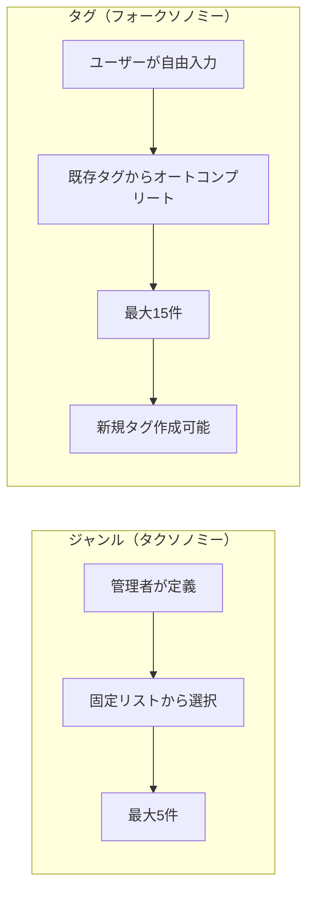
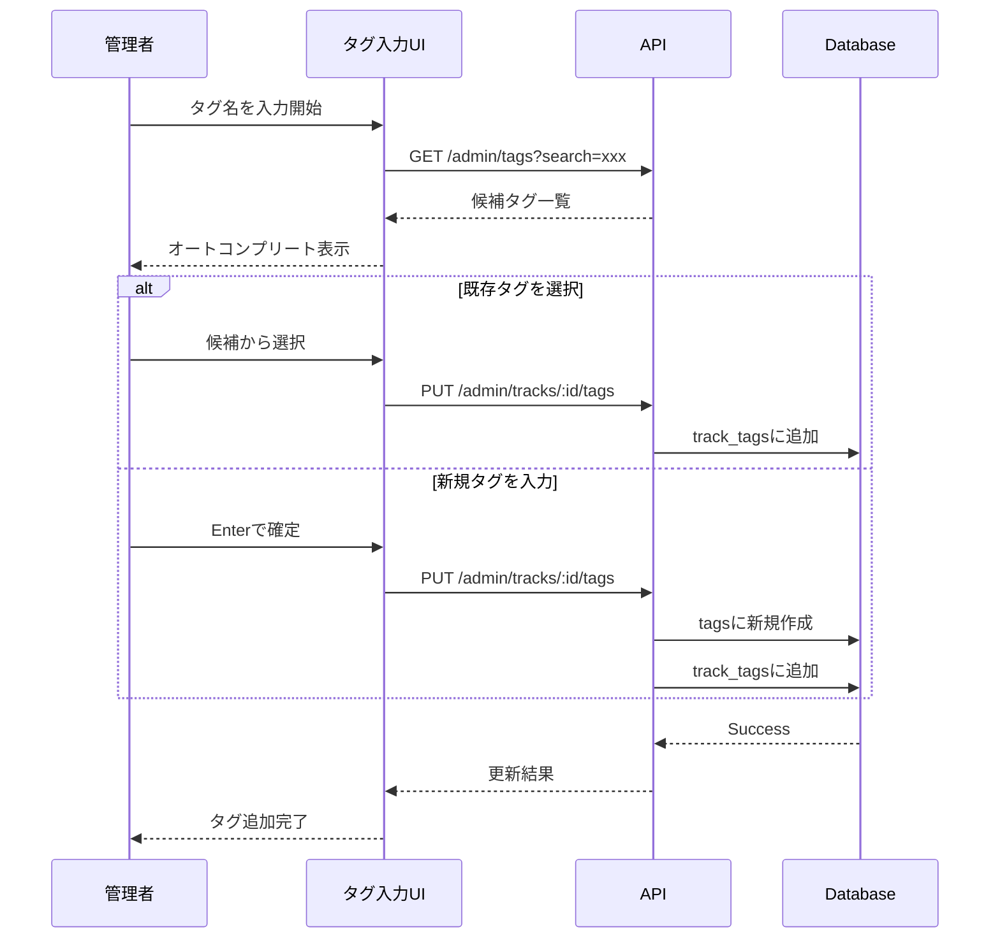
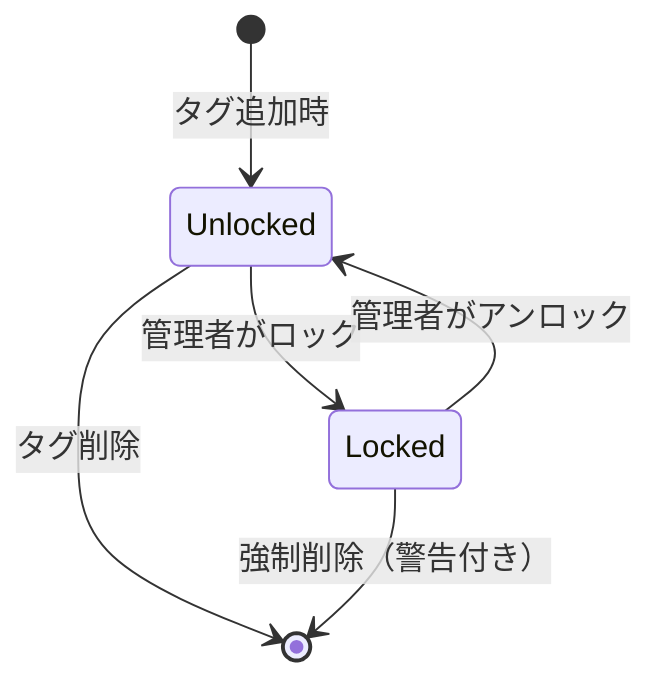
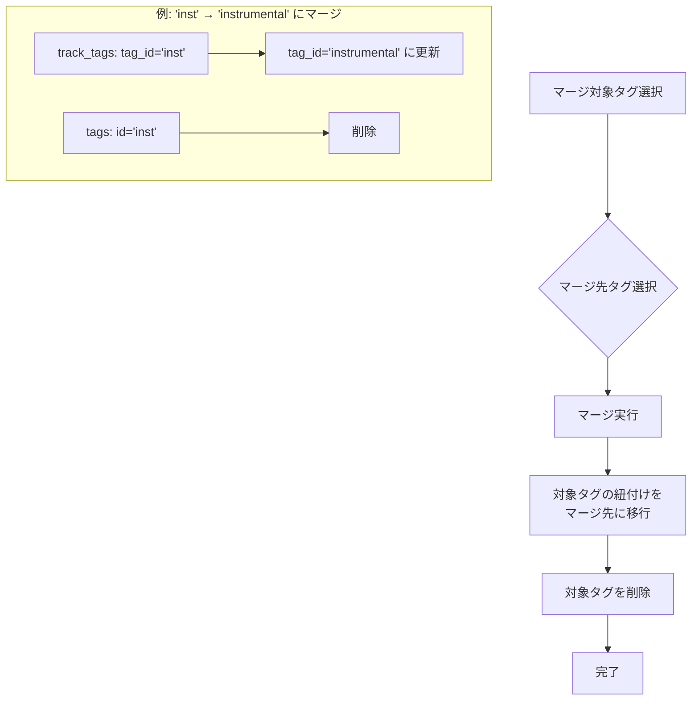
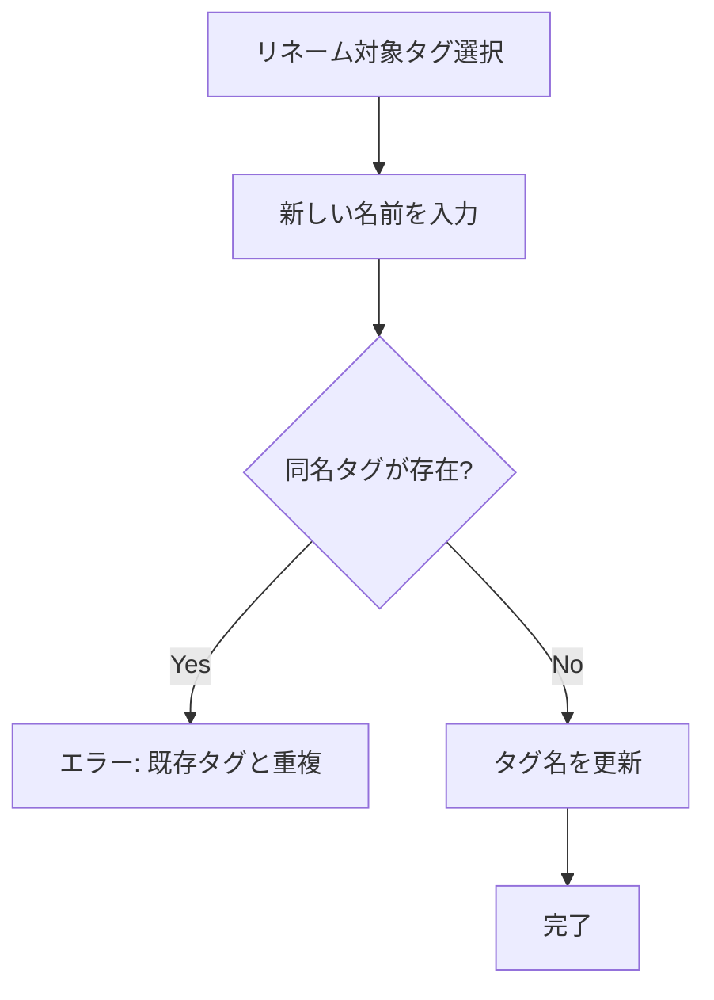
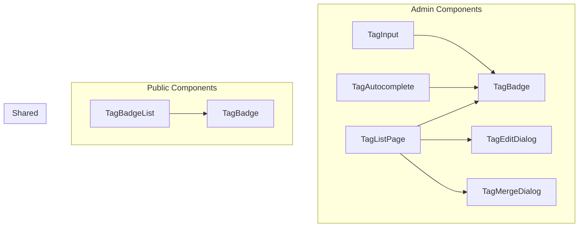

# タグ機能 仕様書

## 1. 概要

トラック（楽曲）にユーザー定義タグを紐付ける機能。
フォークソノミー形式を採用し、ユーザーが自由にタグを入力・選択できる。

### 1.1 機能要件

| 項目 | 内容 |
|------|------|
| データ構造 | タグ名 + 属性（JSON） |
| 管理方法 | 管理画面でCRUD + マージ/リネーム可能 |
| 入力方式 | フォークソノミー（自由入力 + オートコンプリート） |
| 紐付け上限 | 1トラックあたり **最大15件** |
| 表示方法 | ハッシュタグ風UI |
| ロック機能 | 管理者がタグをロック/アンロック可能 |
| 表記ゆれ対策 | マージ/リネーム機能で統合 |

---

## 2. フォークソノミーとは

フォークソノミー（Folksonomy）は、「Folk（民衆）」と「Taxonomy（分類学）」を組み合わせた造語で、ユーザーが自由にタグ付けを行う分類システムです。

### 2.1 ジャンル機能との違い



| 項目 | ジャンル | タグ |
|------|----------|------|
| 定義者 | 管理者のみ | 管理者（ユーザー入力から生成） |
| 入力方法 | プルダウン選択 | 自由入力 + オートコンプリート |
| 上限 | 5件 | 15件 |
| 表記ゆれ | なし（固定リスト） | マージ/リネームで対応 |
| 用途 | 音楽ジャンル分類 | 自由な特徴付け |

### 2.2 入力フロー



---

## 3. タグロック機能

### 3.1 概要

特定のトラックに付けられたタグを「ロック」することで、誤って変更・削除されることを防ぐ機能。

### 3.2 ロック状態の管理



| 状態 | 説明 | 編集可否 |
|------|------|----------|
| Unlocked (0) | 通常状態 | 変更・削除可能 |
| Locked (1) | ロック状態 | 変更・削除不可（警告表示） |

### 3.3 ロックの影響範囲

- **ロックはトラックとタグの紐付けに対して適用**される
- 同じタグでも、トラックAではロック済み、トラックBではアンロック状態が可能
- タグ自体のリネーム/マージはロック状態に関係なく実行可能

---

## 4. 表記ゆれ対策

### 4.1 問題と解決策

フォークソノミーでは、同じ意味のタグが異なる表記で作成される問題がある。

| 表記ゆれの例 | 解決方法 |
|-------------|----------|
| `vocal`, `Vocal`, `VOCAL` | リネームで統一 |
| `inst`, `instrumental`, `インスト` | マージで統合 |
| `エレクトロ`, `electronica` | マージで統合 |

### 4.2 マージ機能



### 4.3 リネーム機能



---

## 5. タグ名の制約

### 5.1 文字数制限

| 項目 | 値 |
|------|-----|
| 計算方法 | 全角1文字、半角0.5文字として換算 |
| 最大文字数 | 20（換算値） |
| 絵文字 | 禁止 |

**計算例:**
- `instrumental` → 12文字 × 0.5 = 6 (OK)
- `インストゥルメンタル` → 10文字 × 1 = 10 (OK)
- `インストinst` → 4×1 + 4×0.5 = 6 (OK)
- `長いタグ名長いタグ名長いタグ名長いタグ` → 18×1 = 18 (OK)
- `長いタグ名長いタグ名長いタグ名長いタグ長` → 19×1 = 19 (OK)
- `長いタグ名長いタグ名長いタグ名長いタグ長い` → 20×1 = 20 (OK)
- `長いタグ名長いタグ名長いタグ名長いタグ長いX` → 21 (NG)

### 5.2 使用可能文字

- ひらがな、カタカナ、漢字
- 英数字（大文字・小文字）
- 一部記号（`-`, `_`, `&`, `'`, ` `）
- **禁止**: 絵文字、制御文字

---

## 6. UI設計

### 6.1 コンポーネント構成



### 6.2 TagInput（管理画面）

ハッシュタグ風の入力コンポーネント。

```
┌─────────────────────────────────────────────────────────────────────┐
│ [#vocal ×] [#rock ×] [#東方アレンジ ×]  │ タグを追加... (残り12件)  │
└─────────────────────────────────────────────────────────────────────┘
│ ▼ オートコンプリート                                                  │
│ ┌─────────────────────────────────────────────────────────────────┐ │
│ │ #vocalists (42件)                                               │ │
│ │ #vocaloid (28件)                                                │ │
│ │ #vocalist2人 (15件)                                             │ │
│ └─────────────────────────────────────────────────────────────────┘ │
└─────────────────────────────────────────────────────────────────────┘

機能:
- ハッシュタグ風バッジで表示
- ×ボタンで個別削除（ロック中は警告）
- 最大15件制限
- 部分一致でオートコンプリート
- Enterで新規タグ作成
- 使用件数を表示
```

### 6.3 TagBadge

```
通常:      [#vocal]
削除可能:  [#vocal ×]
ロック中:  [#vocal 🔒]
```

### 6.4 公開画面での表示

```
┌─────────────────────────────────────────────────────────────────────┐
│ トラック詳細ページ                                                    │
│ ┌─────────────────────────────────────────────────────────────────┐ │
│ │ [♪] トラック名                                                    │ │
│ │                                                                   │ │
│ │ タグ:                                                             │ │
│ │ [#vocal] [#rock] [#東方アレンジ] [#高速] [#激しい] ...           │ │
│ │ ← 最大15件表示（省略なし）                                        │ │
│ └─────────────────────────────────────────────────────────────────┘ │
└─────────────────────────────────────────────────────────────────────┘
```

---

## 7. セキュリティ考慮事項

### 7.1 入力バリデーション

| フィールド | バリデーション |
|------------|----------------|
| name | 文字数制限（換算値20まで）、絵文字禁止、XSSサニタイズ |
| attributes | JSON形式、最大1000文字 |
| tagIds | 配列、最大15件、存在するIDのみ |

### 7.2 認可制御

- タグCRUD: Admin権限必須
- トラックへの紐付け: Admin権限必須
- タグロック/アンロック: Admin権限必須
- マージ/リネーム: Admin権限必須
- 公開画面での表示: 認証不要

---

## 8. パフォーマンス考慮事項

### 8.1 インデックス活用

```sql
-- tags
CREATE UNIQUE INDEX idx_tags_name ON tags(name);

-- track_tags
CREATE INDEX idx_track_tags_track ON track_tags(track_id);
CREATE INDEX idx_track_tags_tag ON track_tags(tag_id);
```

### 8.2 オートコンプリート

- 入力文字数3文字以上でAPIリクエスト発火
- デバウンス: 300ms
- 最大候補数: 10件
- 使用頻度順でソート

---

## 9. テスト観点

### 9.1 単体テスト

- [ ] タグCRUD API
- [ ] 文字数バリデーション（全角/半角換算）
- [ ] 15件制限の動作
- [ ] マージ機能
- [ ] リネーム機能（重複チェック）
- [ ] ロック機能

### 9.2 統合テスト

- [ ] オートコンプリート動作
- [ ] トラック詳細でのタグ表示
- [ ] タグクラウド表示

### 9.3 E2Eテスト

- [ ] タグ作成→トラック紐付け→公開画面表示
- [ ] タグマージ→紐付け済みトラックへの反映
- [ ] ロック中タグの削除拒否
- [ ] 15件超過時のエラー表示

---

## 10. 関連ドキュメント

| ファイル | 説明 |
|----------|------|
| `README.md` | 本ファイル。機能概要とアーキテクチャ |
| `database-schema.md` | データベーススキーマ定義（ER図含む） |
| `api-specification.md` | APIエンドポイント仕様 |
