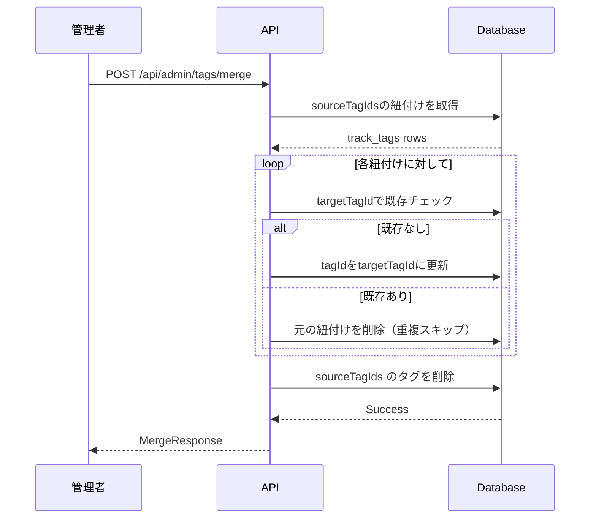
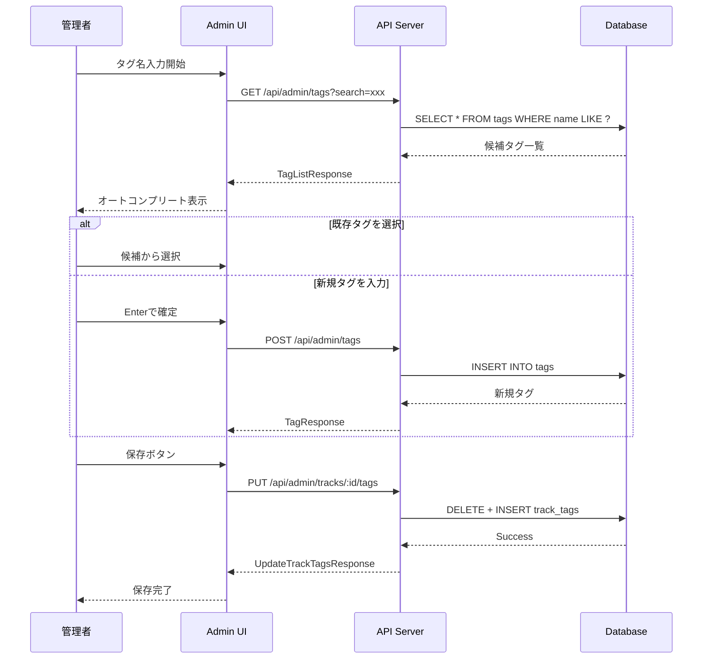
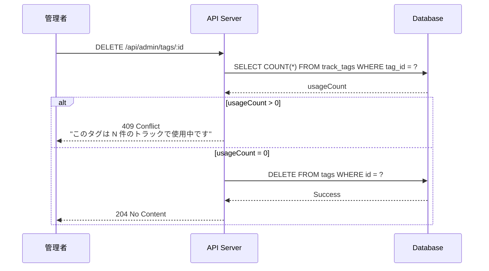

# タグ機能 API仕様書

## 1. 概要

タグ機能に関するAPIエンドポイントの仕様書です。

### ベースURL

- 開発環境: `http://localhost:3001`
- 本番環境: 環境変数 `VITE_SERVER_URL` または `SERVER_URL` で指定

---

## 2. Admin API

管理者向けのAPIエンドポイント。Admin権限が必要。

### 2.1 タグ一覧取得

#### `GET /api/admin/tags`

すべてのタグを取得します。

**クエリパラメータ:**

| パラメータ | 型 | 必須 | デフォルト | 説明 |
|-----------|-----|------|------------|------|
| search | string | - | - | タグ名での部分一致検索 |
| page | number | - | 1 | ページ番号（1始まり） |
| limit | number | - | 50 | 1ページあたりの件数（最大100） |
| sort | string | - | name:asc | ソート（name/usageCount/createdAt） |

**レスポンス:**

```typescript
interface TagListResponse {
  tags: {
    id: string;          // tag_xxx
    name: string;        // タグ名
    attributes: object | null;
    usageCount: number;  // 使用トラック数
    createdAt: string;   // ISO 8601
    updatedAt: string;   // ISO 8601
  }[];
  pagination: {
    page: number;
    limit: number;
    totalCount: number;
    totalPages: number;
  };
}
```

**リクエスト例:**

```bash
# 全タグ取得
curl -X GET "http://localhost:3001/api/admin/tags" \
  -H "Authorization: Bearer <token>"

# 検索付き
curl -X GET "http://localhost:3001/api/admin/tags?search=vocal&limit=10" \
  -H "Authorization: Bearer <token>"
```

---

### 2.2 タグ作成

#### `POST /api/admin/tags`

新しいタグを作成します。

**リクエストボディ:**

```typescript
interface CreateTagRequest {
  name: string;              // タグ名（必須）
  attributes?: object;       // 属性（任意）
}
```

**バリデーション:**

| フィールド | ルール |
|-----------|--------|
| name | 必須、換算値20文字以内、絵文字禁止、重複不可 |
| attributes | JSON形式、最大1000文字 |

**レスポンス:**

```typescript
// 201 Created
interface TagResponse {
  id: string;
  name: string;
  attributes: object | null;
  createdAt: string;
  updatedAt: string;
}

// 400 Bad Request
interface ErrorResponse {
  error: string;
  details?: { field: string; message: string }[];
}

// 409 Conflict（重複時）
interface ConflictResponse {
  error: string;
  existingTag: {
    id: string;
    name: string;
  };
}
```

**リクエスト例:**

```bash
curl -X POST "http://localhost:3001/api/admin/tags" \
  -H "Authorization: Bearer <token>" \
  -H "Content-Type: application/json" \
  -d '{
    "name": "vocal",
    "attributes": {
      "description": "ボーカル楽曲"
    }
  }'
```

---

### 2.3 タグ詳細取得

#### `GET /api/admin/tags/:id`

指定したタグの詳細を取得します。

**パスパラメータ:**

| パラメータ | 型 | 説明 |
|-----------|-----|------|
| id | string | タグID（tag_xxx） |

**レスポンス:**

```typescript
// 200 OK
interface TagDetailResponse {
  id: string;
  name: string;
  attributes: object | null;
  usageCount: number;
  lockedCount: number;      // ロック中の紐付け数
  createdAt: string;
  updatedAt: string;
}

// 404 Not Found
interface NotFoundResponse {
  error: string;
}
```

---

### 2.4 タグに紐づくトラック一覧

#### `GET /api/admin/tags/:id/tracks`

指定したタグが付けられているトラック一覧を取得します。

**パスパラメータ:**

| パラメータ | 型 | 説明 |
|-----------|-----|------|
| id | string | タグID（tag_xxx） |

**クエリパラメータ:**

| パラメータ | 型 | 必須 | デフォルト | 説明 |
|-----------|-----|------|------------|------|
| page | number | - | 1 | ページ番号 |
| limit | number | - | 20 | 1ページあたりの件数 |

**レスポンス:**

```typescript
interface TagTracksResponse {
  tag: {
    id: string;
    name: string;
  };
  tracks: {
    id: string;
    name: string;
    releaseId: string | null;
    releaseName: string | null;
    position: number;
    isLocked: boolean;
    createdAt: string;      // 紐付け作成日時
  }[];
  pagination: {
    page: number;
    limit: number;
    totalCount: number;
    totalPages: number;
  };
}
```

---

### 2.5 タグリネーム

#### `PUT /api/admin/tags/:id`

タグ名を変更します。

**パスパラメータ:**

| パラメータ | 型 | 説明 |
|-----------|-----|------|
| id | string | タグID（tag_xxx） |

**リクエストボディ:**

```typescript
interface RenameTagRequest {
  name: string;              // 新しいタグ名
  attributes?: object;       // 属性（任意）
}
```

**レスポンス:**

```typescript
// 200 OK
interface TagResponse {
  id: string;
  name: string;
  attributes: object | null;
  createdAt: string;
  updatedAt: string;
}

// 400 Bad Request
interface ErrorResponse {
  error: string;
}

// 409 Conflict（同名タグが存在）
interface ConflictResponse {
  error: string;
  existingTag: {
    id: string;
    name: string;
  };
}
```

**リクエスト例:**

```bash
curl -X PUT "http://localhost:3001/api/admin/tags/tag_abc123" \
  -H "Authorization: Bearer <token>" \
  -H "Content-Type: application/json" \
  -d '{
    "name": "vocals"
  }'
```

---

### 2.6 タグ削除

#### `DELETE /api/admin/tags/:id`

タグを削除します。使用中のタグは削除できません。

**パスパラメータ:**

| パラメータ | 型 | 説明 |
|-----------|-----|------|
| id | string | タグID（tag_xxx） |

**クエリパラメータ:**

| パラメータ | 型 | 必須 | 説明 |
|-----------|-----|------|------|
| force | boolean | - | trueの場合、紐付けを解除してから削除 |

**レスポンス:**

```typescript
// 204 No Content（成功）

// 409 Conflict（使用中）
interface ConflictResponse {
  error: string;
  usageCount: number;
  message: string;  // "このタグは N 件のトラックで使用中です"
}
```

**リクエスト例:**

```bash
# 通常削除（使用中は拒否）
curl -X DELETE "http://localhost:3001/api/admin/tags/tag_abc123" \
  -H "Authorization: Bearer <token>"

# 強制削除（紐付けも削除）
curl -X DELETE "http://localhost:3001/api/admin/tags/tag_abc123?force=true" \
  -H "Authorization: Bearer <token>"
```

---

### 2.7 タグマージ

#### `POST /api/admin/tags/merge`

複数のタグを1つにマージします。

**リクエストボディ:**

```typescript
interface MergeTagsRequest {
  sourceTagIds: string[];    // マージ元タグID（削除される）
  targetTagId: string;       // マージ先タグID（残る）
}
```

**処理内容:**

1. sourceTagIds の紐付けを targetTagId に移行
2. 重複する紐付け（同じトラック）は維持（targetTagId側を優先）
3. sourceTagIds のタグを削除

**レスポンス:**

```typescript
// 200 OK
interface MergeResponse {
  targetTag: {
    id: string;
    name: string;
    usageCount: number;    // マージ後の使用数
  };
  mergedCount: number;      // マージされた紐付け数
  deletedTags: string[];    // 削除されたタグID
}

// 400 Bad Request
interface ErrorResponse {
  error: string;
}

// 404 Not Found
interface NotFoundResponse {
  error: string;
  notFoundIds: string[];
}
```

**リクエスト例:**

```bash
curl -X POST "http://localhost:3001/api/admin/tags/merge" \
  -H "Authorization: Bearer <token>" \
  -H "Content-Type: application/json" \
  -d '{
    "sourceTagIds": ["tag_inst", "tag_instrument"],
    "targetTagId": "tag_instrumental"
  }'
```

**シーケンス図:**



---

### 2.8 トラックへのタグ割り当て

#### `PUT /api/admin/tracks/:id/tags`

トラックに紐づくタグを更新します。

**パスパラメータ:**

| パラメータ | 型 | 説明 |
|-----------|-----|------|
| id | string | トラックID（tr_xxx） |

**リクエストボディ:**

```typescript
interface UpdateTrackTagsRequest {
  tagIds: string[];          // タグIDの配列（順序が position になる）
}
```

**バリデーション:**

| ルール | 説明 |
|--------|------|
| 最大15件 | tagIds.length <= 15 |
| 存在チェック | すべてのtagIdが存在すること |
| ロック保護 | ロック中のタグは削除されない |

**処理内容:**

1. ロック中のタグ情報を保持
2. アンロック状態のタグをすべて削除
3. 新しいタグを追加（ロック中のタグは維持）
4. position を再計算

**レスポンス:**

```typescript
// 200 OK
interface UpdateTrackTagsResponse {
  trackId: string;
  tags: {
    tagId: string;
    tagName: string;
    position: number;
    isLocked: boolean;
  }[];
}

// 400 Bad Request（15件超過）
interface ErrorResponse {
  error: string;
  message: string;  // "タグは最大15件まで設定できます"
}

// 404 Not Found
interface NotFoundResponse {
  error: string;
  notFoundIds?: string[];
}
```

**リクエスト例:**

```bash
curl -X PUT "http://localhost:3001/api/admin/tracks/tr_abc123/tags" \
  -H "Authorization: Bearer <token>" \
  -H "Content-Type: application/json" \
  -d '{
    "tagIds": ["tag_vocal", "tag_rock", "tag_touhou"]
  }'
```

---

### 2.9 タグをロック

#### `PUT /api/admin/tracks/:id/tags/:tagId/lock`

トラックに付けられたタグをロックします。

**パスパラメータ:**

| パラメータ | 型 | 説明 |
|-----------|-----|------|
| id | string | トラックID（tr_xxx） |
| tagId | string | タグID（tag_xxx） |

**レスポンス:**

```typescript
// 200 OK
interface LockResponse {
  trackId: string;
  tagId: string;
  tagName: string;
  isLocked: true;
}

// 404 Not Found（紐付けが存在しない）
interface NotFoundResponse {
  error: string;
}
```

**リクエスト例:**

```bash
curl -X PUT "http://localhost:3001/api/admin/tracks/tr_abc123/tags/tag_vocal/lock" \
  -H "Authorization: Bearer <token>"
```

---

### 2.10 ロック解除

#### `DELETE /api/admin/tracks/:id/tags/:tagId/lock`

トラックに付けられたタグのロックを解除します。

**パスパラメータ:**

| パラメータ | 型 | 説明 |
|-----------|-----|------|
| id | string | トラックID（tr_xxx） |
| tagId | string | タグID（tag_xxx） |

**レスポンス:**

```typescript
// 200 OK
interface UnlockResponse {
  trackId: string;
  tagId: string;
  tagName: string;
  isLocked: false;
}

// 404 Not Found
interface NotFoundResponse {
  error: string;
}
```

---

## 3. Public API

公開APIエンドポイント。認証不要。

### 3.1 全タグ一覧

#### `GET /api/public/tags`

すべてのタグを取得します。

**クエリパラメータ:**

| パラメータ | 型 | 必須 | デフォルト | 説明 |
|-----------|-----|------|------------|------|
| search | string | - | - | タグ名での部分一致検索 |
| limit | number | - | 100 | 最大件数 |

**レスポンス:**

```typescript
interface PublicTagListResponse {
  tags: {
    id: string;
    name: string;
    usageCount: number;
  }[];
}
```

**リクエスト例:**

```bash
curl -X GET "http://localhost:3001/api/public/tags"

# 検索付き
curl -X GET "http://localhost:3001/api/public/tags?search=vocal&limit=10"
```

---

### 3.2 タグクラウド用データ

#### `GET /api/public/tags/cloud`

タグクラウド表示用のデータを取得します。使用頻度に基づいた重み付けデータを返します。

**クエリパラメータ:**

| パラメータ | 型 | 必須 | デフォルト | 説明 |
|-----------|-----|------|------------|------|
| limit | number | - | 50 | 最大件数 |
| minCount | number | - | 1 | 最小使用数（これ未満は除外） |

**レスポンス:**

```typescript
interface TagCloudResponse {
  tags: {
    id: string;
    name: string;
    count: number;           // 使用トラック数
    weight: number;          // 重み（1-5、表示サイズ用）
  }[];
  meta: {
    totalTags: number;       // 全タグ数
    maxCount: number;        // 最大使用数
    minCount: number;        // 最小使用数
  };
}
```

**重み計算:**

```typescript
// 対数スケールで1-5の重みを計算
function calculateWeight(count: number, maxCount: number, minCount: number): number {
  if (maxCount === minCount) return 3;
  const logMin = Math.log(minCount || 1);
  const logMax = Math.log(maxCount);
  const logCount = Math.log(count);
  const normalized = (logCount - logMin) / (logMax - logMin);
  return Math.round(normalized * 4) + 1; // 1-5
}
```

**リクエスト例:**

```bash
curl -X GET "http://localhost:3001/api/public/tags/cloud?limit=30&minCount=5"
```

**レスポンス例:**

```json
{
  "tags": [
    { "id": "tag_vocal", "name": "vocal", "count": 1523, "weight": 5 },
    { "id": "tag_rock", "name": "rock", "count": 842, "weight": 4 },
    { "id": "tag_inst", "name": "instrumental", "count": 156, "weight": 2 },
    { "id": "tag_chill", "name": "chill", "count": 23, "weight": 1 }
  ],
  "meta": {
    "totalTags": 234,
    "maxCount": 1523,
    "minCount": 5
  }
}
```

---

## 4. エラーハンドリング

### 4.1 共通エラーレスポンス

```typescript
interface ErrorResponse {
  error: string;           // エラー概要
  message?: string;        // 詳細メッセージ
  details?: {              // フィールドごとのエラー
    field: string;
    message: string;
  }[];
  code?: string;           // エラーコード（任意）
}
```

### 4.2 HTTPステータスコード

| ステータス | 説明 | 例 |
|-----------|------|-----|
| 200 | 正常完了 | GET, PUT成功 |
| 201 | 作成成功 | POST成功 |
| 204 | 削除成功 | DELETE成功 |
| 400 | リクエスト不正 | バリデーションエラー |
| 401 | 認証エラー | トークン無効 |
| 403 | 権限エラー | Admin権限なし |
| 404 | リソース不存在 | タグ/トラック不存在 |
| 409 | 競合エラー | 重複、使用中削除 |
| 500 | サーバーエラー | 内部エラー |

---

## 5. シーケンス図

### 5.1 タグ追加フロー



### 5.2 タグ削除時の制約チェック



---

## 6. 関連ファイル

### サーバー側 (apps/server)

| ファイル | 説明 |
|----------|------|
| `src/routes/admin/tags.ts` | タグ管理API |
| `src/routes/admin/tracks.ts` | トラックタグ紐付けAPI |
| `src/routes/public/tags.ts` | 公開タグAPI |

### データベース (packages/db)

| ファイル | 説明 |
|----------|------|
| `src/schema/tags.ts` | タグスキーマ定義 |
| `src/schema/trackTags.ts` | 紐付けスキーマ定義 |
