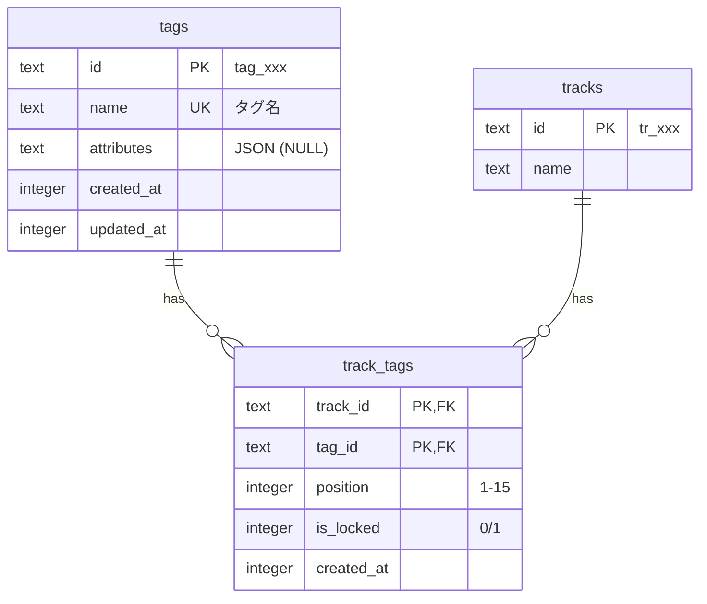

# タグ機能 データベーススキーマ設計

## 1. ER図



---

## 2. テーブル定義

### 2.1 tags（タグマスター）

タグの基本情報を管理するマスターテーブル。

| カラム | 型 | 制約 | 説明 |
|--------|-----|------|------|
| id | TEXT | PK | TypeID形式 `tag_xxx`（プレフィックス + 26文字のbase32エンコード） |
| name | TEXT | UNIQUE, NOT NULL | タグ名（文字数制限あり） |
| attributes | TEXT | NULL | JSON形式の属性データ |
| created_at | INTEGER | NOT NULL | 作成日時（ms） |
| updated_at | INTEGER | NOT NULL | 更新日時（ms） |

#### ID形式

```
tag_[26文字のbase32エンコード]
例: tag_01h455vb4pex5vsknk084sn02q
```

TypeIDはUUIDv7ベースで時系列ソート可能。

#### 文字数制限

タグ名は以下のルールで文字数を計算:

| 文字種 | 換算値 |
|--------|--------|
| 全角文字（ひらがな、カタカナ、漢字等） | 1 |
| 半角文字（英数字、記号） | 0.5 |

**最大換算値: 20**

```typescript
// 文字数換算ロジック
function calculateTagNameLength(name: string): number {
  let length = 0;
  for (const char of name) {
    // 半角英数字・記号は0.5、それ以外（全角）は1
    length += /[\x00-\x7F]/.test(char) ? 0.5 : 1;
  }
  return length;
}
```

#### 禁止文字

- 絵文字（Unicode絵文字全般）
- 制御文字

```typescript
// 絵文字チェック
const emojiRegex = /[\u{1F300}-\u{1F9FF}]|[\u{2600}-\u{26FF}]|[\u{2700}-\u{27BF}]/u;
function hasEmoji(text: string): boolean {
  return emojiRegex.test(text);
}
```

#### attributes フィールド

将来の拡張用にJSON形式で属性を保存できる。

```json
{
  "color": "#FF5733",
  "description": "ボーカル楽曲のタグ",
  "aliases": ["vocals", "歌"]
}
```

---

### 2.2 track_tags（トラック-タグ紐付け）

トラックとタグの多対多関係を管理する中間テーブル。

| カラム | 型 | 制約 | 説明 |
|--------|-----|------|------|
| track_id | TEXT | PK, FK → tracks.id (CASCADE) | トラックID |
| tag_id | TEXT | PK, FK → tags.id (RESTRICT) | タグID |
| position | INTEGER | NOT NULL, 1-15 | 表示順序 |
| is_locked | INTEGER | NOT NULL, DEFAULT 0 | ロック状態（0/1） |
| created_at | INTEGER | NOT NULL | 作成日時（ms） |

#### 複合主キー

```sql
PRIMARY KEY (track_id, tag_id)
```

#### 外部キー制約

| 参照元 | 参照先 | ON DELETE |
|--------|--------|-----------|
| track_id | tracks.id | CASCADE（トラック削除時に紐付けも削除） |
| tag_id | tags.id | RESTRICT（使用中タグは削除不可） |

#### position フィールド

- 1〜15の範囲
- トラックごとにユニークである必要はない（同じ位置を持つタグは許可）
- 表示順序の制御に使用

#### is_locked フィールド

| 値 | 意味 |
|----|------|
| 0 | アンロック状態（編集可能） |
| 1 | ロック状態（編集不可） |

---

## 3. インデックス

### 3.1 tags テーブル

```sql
-- タグ名の一意性保証（すでにUNIQUE制約で作成される）
CREATE UNIQUE INDEX idx_tags_name ON tags(name);
```

### 3.2 track_tags テーブル

```sql
-- トラックIDでの検索用（トラック詳細表示時）
CREATE INDEX idx_track_tags_track ON track_tags(track_id);

-- タグIDでの検索用（タグ使用状況確認時）
CREATE INDEX idx_track_tags_tag ON track_tags(tag_id);
```

---

## 4. Drizzle ORMスキーマ定義

```typescript
import { integer, sqliteTable, text, primaryKey, index, uniqueIndex } from "drizzle-orm/sqlite-core";
import { tracks } from "./tracks";

// タグマスターテーブル
export const tags = sqliteTable("tags", {
  id: text("id").primaryKey(), // tag_xxx
  name: text("name").notNull().unique(),
  attributes: text("attributes"), // JSON
  createdAt: integer("created_at", { mode: "timestamp_ms" }).notNull(),
  updatedAt: integer("updated_at", { mode: "timestamp_ms" }).notNull(),
}, (table) => [
  uniqueIndex("idx_tags_name").on(table.name),
]);

// トラック-タグ紐付けテーブル
export const trackTags = sqliteTable("track_tags", {
  trackId: text("track_id")
    .notNull()
    .references(() => tracks.id, { onDelete: "cascade" }),
  tagId: text("tag_id")
    .notNull()
    .references(() => tags.id, { onDelete: "restrict" }),
  position: integer("position").notNull(), // 1-15
  isLocked: integer("is_locked", { mode: "boolean" }).notNull().default(false),
  createdAt: integer("created_at", { mode: "timestamp_ms" }).notNull(),
}, (table) => [
  primaryKey({ columns: [table.trackId, table.tagId] }),
  index("idx_track_tags_track").on(table.trackId),
  index("idx_track_tags_tag").on(table.tagId),
]);
```

---

## 5. データ操作例

### 5.1 タグ作成

```typescript
const newTag = await db.insert(tags).values({
  id: createId.tag(), // TypeID形式: tag_01h455vb4pex5vsknk084sn02q
  name: "vocal",
  attributes: null,
  createdAt: Date.now(),
  updatedAt: Date.now(),
}).returning();
```

### 5.2 トラックへのタグ追加

```typescript
// 既存の紐付けを削除して再作成（position維持のため）
await db.transaction(async (tx) => {
  // 既存のアンロックタグを削除
  await tx.delete(trackTags)
    .where(and(
      eq(trackTags.trackId, trackId),
      eq(trackTags.isLocked, false)
    ));

  // 新しいタグを追加
  const insertValues = tagIds.map((tagId, index) => ({
    trackId,
    tagId,
    position: index + 1,
    isLocked: false,
    createdAt: Date.now(),
  }));

  await tx.insert(trackTags).values(insertValues);
});
```

### 5.3 タグのマージ

```typescript
// sourceTagId のタグを targetTagId にマージ
await db.transaction(async (tx) => {
  // 1. 紐付けを移行（重複を避けるためUPSERT）
  const sourceBindings = await tx.select()
    .from(trackTags)
    .where(eq(trackTags.tagId, sourceTagId));

  for (const binding of sourceBindings) {
    // 既存の紐付けをチェック
    const existing = await tx.select()
      .from(trackTags)
      .where(and(
        eq(trackTags.trackId, binding.trackId),
        eq(trackTags.tagId, targetTagId)
      ));

    if (existing.length === 0) {
      // 存在しない場合は移行
      await tx.insert(trackTags).values({
        ...binding,
        tagId: targetTagId,
      });
    }
    // 既存がある場合は元の紐付けを削除するだけ
  }

  // 2. 元の紐付けを削除
  await tx.delete(trackTags)
    .where(eq(trackTags.tagId, sourceTagId));

  // 3. 元のタグを削除
  await tx.delete(tags)
    .where(eq(tags.id, sourceTagId));
});
```

### 5.4 タグのロック

```typescript
await db.update(trackTags)
  .set({ isLocked: true })
  .where(and(
    eq(trackTags.trackId, trackId),
    eq(trackTags.tagId, tagId)
  ));
```

### 5.5 タグ使用状況の取得

```typescript
// タグごとの使用件数を取得
const tagUsage = await db
  .select({
    tagId: trackTags.tagId,
    tagName: tags.name,
    count: sql<number>`count(*)`.as("count"),
  })
  .from(trackTags)
  .innerJoin(tags, eq(trackTags.tagId, tags.id))
  .groupBy(trackTags.tagId)
  .orderBy(desc(sql`count`));
```

---

## 6. 制約とバリデーション

### 6.1 15件制限の実装

```typescript
// トラックに紐づくタグ数をチェック
async function validateTagLimit(trackId: string, newTagCount: number): Promise<boolean> {
  const currentCount = await db.select({ count: sql<number>`count(*)` })
    .from(trackTags)
    .where(eq(trackTags.trackId, trackId));

  return (currentCount[0]?.count ?? 0) + newTagCount <= 15;
}
```

### 6.2 タグ名バリデーション

```typescript
function validateTagName(name: string): { valid: boolean; error?: string } {
  // 空文字チェック
  if (!name || name.trim().length === 0) {
    return { valid: false, error: "タグ名は必須です" };
  }

  // 絵文字チェック
  const emojiRegex = /[\u{1F300}-\u{1F9FF}]|[\u{2600}-\u{26FF}]|[\u{2700}-\u{27BF}]/u;
  if (emojiRegex.test(name)) {
    return { valid: false, error: "絵文字は使用できません" };
  }

  // 文字数チェック
  let length = 0;
  for (const char of name) {
    length += /[\x00-\x7F]/.test(char) ? 0.5 : 1;
  }
  if (length > 20) {
    return { valid: false, error: "タグ名は全角20文字（半角40文字）以内です" };
  }

  return { valid: true };
}
```

---

## 7. マイグレーション

### 7.1 新規導入

```bash
# スキーマをDBに反映
make db-push

# 動作確認
make db-studio
```

### 7.2 ロールバック

```sql
-- 紐付けテーブルを先に削除
DROP TABLE IF EXISTS track_tags;

-- マスターテーブルを削除
DROP TABLE IF EXISTS tags;
```
